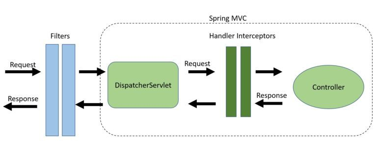

- [인증과 인가](#인증과-인가)
  - [인증](#인증)
  - [인가](#인가)
- [HTTP Stateless](#http-stateless)
- [Cookie vs Session storage vs localStorage](#cookie-vs-session-storage-vs-localstorage)
  - [Cookie](#cookie)
  - [Session storage](#session-storage)
  - [Local Storage](#local-storage)
- [Interceptor vs Filter in Spring](#interceptor-vs-filter-in-spring)
  - [Filter](#filter)
  - [Interceptor](#interceptor)
- [checksum(검사합)](#checksum검사합)
- [암호화와 복호화](#암호화와-복호화)
  - [단방향 암호화](#단방향-암호화)
  - [Hashing algorithm](#hashing-algorithm)
  - [Salt가 필요한 이유](#salt가-필요한-이유)


# 인증과 인가
## 인증
사용자가 누구인지 확인하는 것

## 인가
해당 리소스에 대한 접근 허가의 문제

서버에서 모든 요청과 인증에 대해 인증과 인가 작업을 수행해야 하는데 Spring Web MVC로 개발할 때는 Controller로 요청이 전달되기 전에 HandlerInterceptor로 우리가 원하는 코드를 먼저 실행할 수 있고 Spring Security를 사용하면 SecurityFilterChain을 통해 우리가 원하는 코드를 먼저 실행할 수 있다.

# HTTP Stateless
* stateless: 서버가 클라이언트의 상태를 보존하지 않는 것으로 여러 서버를 운영해도 항상 같은 응답을 받을 수 있다.
  * 장점: 서버 확장성이 좋다.
  * 단점: 클라이언트가 매 요청마다 추가 데이터를 전송해야 한다.
* stateful: 서버가 클라이언트의 상태를 보존하는 것으로 sticky session같이 항상 동일한 서버로 보내주는 로드밸런서가 필요하다.
  * 장-단점: stateless와 반대된다.

# Cookie vs Session storage vs localStorage

## Cookie
가장 오래되고 잘 알려진 것으로 간단하고 브라우저에 의해 잘 지원된다. 하지만, 4kb의 데이터 제한이 있고 민감하지 않은 사용자의 선호 통계등의 저장에 쓰인다.

```javascript
document.cookie = "name=tutorialsPoint";
let user = document.cookie.getItem("name");
```
이렇게 사용 가능하다.

## Session storage
쿠키와 비슷하지만 현재 세션에만 저장된다. 유저가 브라우저를 종료하면 함께 삭제된다는 의미로 로그인 인증 같은 민감한 정보의 저장에 쓰인다.

웹 어플리케이션에게 사용자의 브라우저에 데이터 저장을 할 수 있게 해주는 웹 스토리지로 세션 스토리지에 저장된 정보는 해당 사이트에 특정되서 다른 사이트와 공유되지 않는다. HTML5에 새로 소개된 기능이다.

로컬 스토리지와도 비슷하지만
- Session Storage는 오직 만들어진 사이트에서만 사용 가능하다.
- 다른 사이트와 공유되지 않는다.
- 영속적이지 않다.
- 해당 탭에서만 유효하다.

```javascript
sessionStorage.setItem("name", "tutorialsPoint");
var name = sessionStorage.getItem("name");
```

## Local Storage
비교적 가장 최근의 개념으로 더 많은 정보의 저장이 가능하고 브라우저를 종료해도 데이터가 삭제되지 않는다. 오프라인 데이터 같은 사용자가 나중에 엑세스 해야 하는 데이터를 저장하는데 유용하다.

username, 주소, preference setting 같은 인풋을 서버에 보내 저장할 수도 있지만 사용자의 컴퓨터에 저장하는 방법이 local storage다. 

기본 데이터 저장은 key/value 쌍으로 이루어지며 

```javascript
localStorage.setItem('key', 'value');
localStorage.getItem('key');
localStorage.removeItem('key');
```
이렇게 사용 가능하다.


# Interceptor vs Filter in Spring


## Filter
Filter는 웹 서버의 일부분으로 스프링 프레임워크가 아니다. 서블릿에 도달하려는 requests에 대해 필터를 통해 조작하거나 제어할 수 있다. 또는, clients에 도달하려는 response를 제어할 수도 있다.

Spring Security가 Filter를 사용하는 좋은 예로 Spring Security 세팅을 위해선 DelegateFilterProxy만 추가해주면 되는데 그렇게 하면 모든 오가는 요청을 intercept한다.
Spring Security가 Filter를 사용하기 때문에 Spring MVC와 분리되어 사용될 수 있다.

주로
- 인증
- 로깅 및 검사
- 이미지 및 데이터 압축
- Spring MVC에서 분리하려는 모든 기능

등에 사용할 수 있다. 

Filter를 사용하기 위해서는 Filter를 implements하고 ServletRequest, ServletResponse, FilterChain을 조작할 수 있는 doFilter를 Override 해주고 컴포넌트 스캔을 위한 @Component를 붙여주면 끝난다

```java
@Component
public class LogFilter implements Filter {
    private Logger logger = LoggerFactory.getLogger(LogFilter.class);

    @Override
    public void doFilter(ServletRequest request, ServletResponse response, FilterChain chain) 
      throws IOException, ServletException {
        logger.info("Hello from: " + request.getLocalAddr());
        chain.doFilter(request, response);
    }
}
```

## Interceptor
HandlerInterceptors는 Spring MVC의 일부분으로 DispatcherServlet과 Controllers 사이에 위치한다. 우리는 requests가 controller에 도달하기 전과 view의 렌더 전후를 intercept 할 수 있다.

주로
- 애플리케이션 로깅과 같은 크로스 컷팅 문제 처리
- 세부적인 권한 검사
- Spring context 또는 모델 조작

Handlerinterceptor interface를 implements하면 사용할 수 있고 preHandle() ,postHandle(), afterCompletion()를 Override 하면 된다.

```java
public class LogInterceptor implements HandlerInterceptor {

    private Logger logger = LoggerFactory.getLogger(LogInterceptor.class);

    @Override
    public boolean preHandle(HttpServletRequest request, HttpServletResponse response, Object handler) 
      throws Exception {
        logger.info("preHandle");
        return true;
    }

    @Override
    public void postHandle(HttpServletRequest request, HttpServletResponse response, Object handler, ModelAndView modelAndView) 
      throws Exception {
        logger.info("postHandle");
    }
    
    @Override
    public void afterCompletion(HttpServletRequest request, HttpServletResponse response, Object handler, Exception ex) 
      throws Exception {
        logger.info("afterCompletion");
    }
}
```

# checksum(검사합)
데이터의 오류 확인 방법으로 널리 사용되며 일정 자릿수를 정하고 범위를 넘는 자리 올림은 버려서 자릿수를 유지한다.

# 암호화와 복호화
암호화는 평문을 알기 어렵도록 변환해서 암호문을 만드는 작업으로 암호문을 다시 평문으로 변환하는 작업을 복호화라고 한다.
일반적으로는 암호문을 평문으로 되돌릴 수 있지만 평문으로 되돌릴 수 없는 암호화도 있다.

예를 들어 사용자의 패스워드를 평문으로 저장하거나 복호화 가능한 형태로 암호화해서 저장하지 않고 평문으로 되돌릴 수 없는 형태로 암호화해서 저장해서 패스워드가 유출됐을 때 사용자의 패스워드가 직접적으로 드러나지 않게 한다.


## 단방향 암호화
주어진 평문을 통해 원래 값을 추정할 수 없다면 단방향 암호화라고 불린다.

단방향 암호화를 위해 암호학적 해시 알고리즘을 사용하며 해시 알고리즘은 다음의 성질을 갖는다.
1. 역상 저항성: 해시 값에서 원래 값을 찾을 수 없어야 한다.
2. 제2 역상 저항성: 원래 값과 다르지만 동일한 해시 값으로 변환되는 다른 값을 찾을 수 없어야 한다.
3. 충돌 저항성: 동일한 해시 값으로 변환되는 두 개의 값을 찾을 수 없어야 한다.

세 가지를 모두 만족해야 암호학적 해시 알고리즘이라고 할 수 있다.

## Hashing algorithm
해시란 임의의 길이의 데이터를 고정된 길이의 데이터로 매싱하는 알고리즘으로 해시 함수는 암호학적 해시 알고리즘과 비암호학적 해시 함수로 구분될 수 있다.
암호학적 해시 알고리즘에는
MD-5(패스워드 단방향 암호화에는 사용해서는 안된다)
SHA-1, 128, 256, 512
Argon2, Balloon
등을 사용한다.

Hash는
- 무결성 확보
  - 인증서 검증
  - 디지털 포렌식
  - 디지털 서명(Hash + PKI)
- 패스워드 단방향 암호화
- 블록체인

등에 쓰인다. 

## Salt가 필요한 이유
Hashing을 하기 전에 사용자가 입력한 pw에 내부 개발자가 알고 있는 Salt값을 앞 뒤에 추가로 넣음으로써 브루트포스 어택에 더 강력하게 대응할 수 있다.
암호에 간을 친다고 해서 salt라고 부른다.


출처:  
[Cookie... -> tutorialspoint](https://www.tutorialspoint.com/difference-between-local-storage-session-storage-and-cookies-in-javascript#)  
[Filter, Interceptor -> Bealdung](https://www.baeldung.com/spring-mvc-handlerinterceptor-vs-filter)