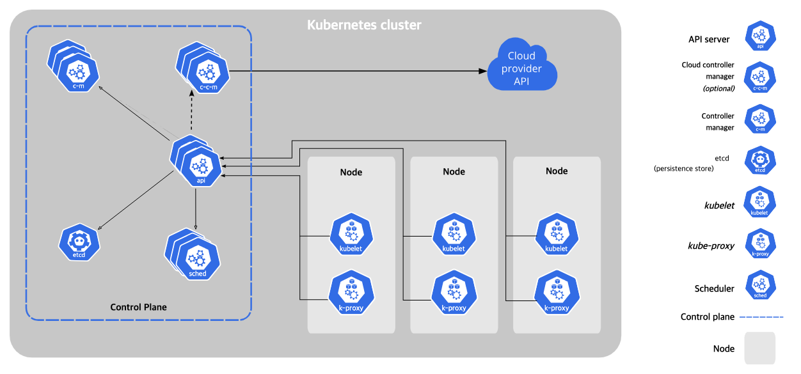
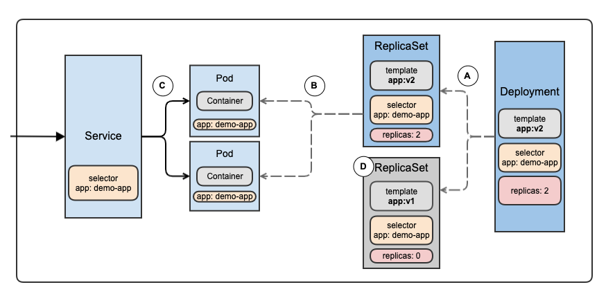
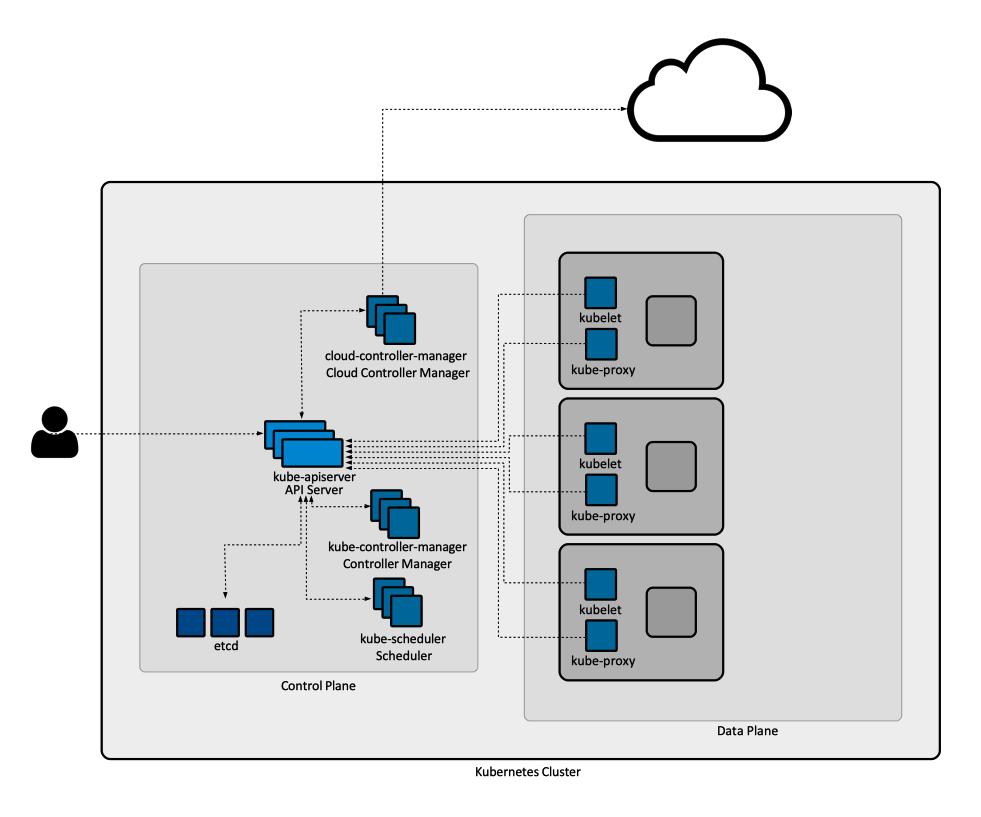
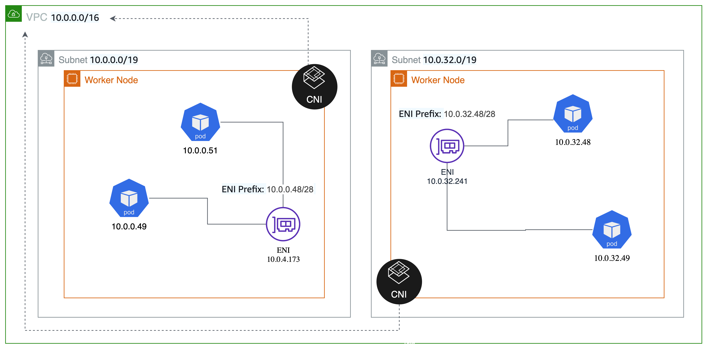

- [1.컨테이너 기술 보급과 쿠버네티스](#1컨테이너-기술-보급과-쿠버네티스)
  - [1.1 컨테이너](#11-컨테이너)
  - [1.2 도커](#12-도커)
    - [1.2.2 도커를 통한 조직의 문제 해결](#122-도커를-통한-조직의-문제-해결)
    - [1.2.3 도커의 과제와 오케스트레이션 도구의 필요성](#123-도커의-과제와-오케스트레이션-도구의-필요성)
  - [1.3 쿠버네티스](#13-쿠버네티스)
  - [1.4 EKS](#14-eks)
    - [1.4.1 EKS의 역할](#141-eks의-역할)
    - [1.4.2 EKS의 특징](#142-eks의-특징)
      - [VPC와 통합](#vpc와-통합)
      - [IAM을 통한 인증과 인가](#iam을-통한-인증과-인가)
      - [ELB와의 연계](#elb와의-연계)
      - [데이터 플레인 선택](#데이터-플레인-선택)
- [2. 쿠버네티스 환경 구축과 애플리케이션 배포](#2-쿠버네티스-환경-구축과-애플리케이션-배포)
    - [2.1.2 예제 애플리케이션의 개요](#212-예제-애플리케이션의-개요)
    - [2.1.3 관련 서비스 및 용어](#213-관련-서비스-및-용어)
      - [S3](#s3)
      - [CloudFront](#cloudfront)
      - [RDS](#rds)
      - [ECR](#ecr)
      - [EC2](#ec2)
      - [ELB](#elb)
      - [IAM](#iam)
    - [2.1.4 EKS 구축에 사용하는 도구](#214-eks-구축에-사용하는-도구)
      - [eksctl](#eksctl)

# 1.컨테이너 기술 보급과 쿠버네티스

## 1.1 컨테이너
컨테이너 런타임에 프로세스로서컨테이너를 동작시켜 호스트OS의 커널을 공유하면서 분리된 프로세스를 실행해 가상머신이 실행되고 있는 것처럼 보이게 하는 기술

## 1.2 도커
기존의 컨테이너에서 두 가지 특장점이 있는 컨테이너 엔진

1. 컨테이너 관리 방식: Dockerfile이라는 정의 파일을 통해 다수 환경에 동일한 컨테이너 이미지를 만들 수 있어 IaC 구현에 적합한 소프트웨어다.
2. 컨테이너 이미지를 저장, 공유하기 위한 에코시스템(도커허브)
가 초기부터 준비되어 있었다.

### 1.2.2 도커를 통한 조직의 문제 해결
시스템 구축 과정에서 

|분업|
|----|
|애플리케이션|
|미들웨어(톰캣 등)|
|실행 런타임(자바 등)|
|OS(커널 이외)|
|OS(커널)|

다음과 같이 레이어가 있다고 했을 때 기존의 분업에선 애플리케이션까지만 개발팀이 담당, 미들웨어단부터 인프라가 담당했지만  
인프라의 운영 부하가 높아 개발팀 요구사항에 대한 리드타임이 길어지게 된다.  
이때, Dockerfile로 미들웨어를 포함한 설정을 관리하면 필요에 따라 설정을 변경할 수 있다.

|분업|
|----|
|애플리케이션|
|미들웨어(톰캣 등)|
|실행 런타임(자바 등)|
|OS(커널 이외)|
|컨테이너 런타임|
|OS(커널)|

그럼 개발팀의 영역이 OS(커널 이외)까지가 되고, 인프라팀은 그 아래 부분을 담당해 리드타임과 인프라팀의 부하가 줄어들게 된다.

### 1.2.3 도커의 과제와 오케스트레이션 도구의 필요성
단일 컨테이너가 아닌 컨테이너 여러 개를 실행할 때 발생하는 문제점을 해결해야 하는데, 시스템 구성이 커지면 컨테이너 여러 개를 연결해 서비스 서비스 하나를 만들게 된다. 이 때, 문제되는 것이 컨테이너 사이의 통신과 가용성 확보다.

서비스 환경에서 시스템을 동작시키기 위해 컴포넌트 각각을 다중화하는 것은 기본으로 이 과제를 해결하기 위해 등장한 것이 쿠버네티스 같은 컨테이너 오케스트레이션 도구들이다.

## 1.3 쿠버네티스
데이터플레인이라고 불리는 서버(서비스 사이의 네트워크 트레픽을 관리하는 서비스 메시)를 여러 대 실행시켜 그 위에 가상 오케스트레이션 계층을 구축하고 컨테이너가 동작한다.

사용자 입장에서는 컨테이너 그룹을 하나의 큰 머신 리소스로 볼 수 있어 인프라를 추상화할 수 있고, 여러 대의 서버로 구성이 가능해 단일 장애점을 배제할 수 있다.

또한 쿠버네티스가 어떤 가상 머신에서 어느 정도의 컨테이너를 동작시킬지 관리하고, 새로운 컨테이너 배포시 어떤 가상 머신에 배포하면 좋을지 등을 자동으로 판단한다.

- 파드: 쿠버네티스의 최소 단위로 하나 이상의 컨테이너를 동작시킨다.
- 레플리카셋: 파드를 얼마나 동작시킬지 관리하는 오브젝트로 레플리카셋에서 파드의 수를 설정하면 그만큼의 파드 동작을 보장한다.
- 디플로이먼트: 배포 이력을 관리하며 릴리스 후 문제가 발생하면 이전 버전으로 쉽게 롤백 가능하다, 서비스 운영에서 대부분 파드를 동작시킬 때 디플로이먼트 단위로 관리한다.
- 서비스: 배포한 파드를 쿠버네티스 클러스터 외부에 공개하기 위한 구조를 제공 ex) 로드밸런서

다음과 같은 구조를 가진다.  
디플로이먼트가 레플리카셋을 생성, 레플리카셋이 pod를 실행, 서비스 셀렉터와 일치하는 pod들이 연결된다.

## 1.4 EKS
쿠버네티스를 제어하는 컨트롤 플레인을 제공하는 관리형 서비스

### 1.4.1 EKS의 역할
쿠버네티스는 여러 컴포넌트들이 서로 독립적이고 비동기로 동작하며 전체를 구성해 각각의 구성요소를 정상적으로 동작시키기 위한 설정이나 유지, 운영 장애가 발생했을 때의 복구 등을 유지 및 운영해줘야 하는데 해당 부분(컨트롤 플레인)을 AWS에서 대신 관리해준다.

쿠버네티스와 완전한 호환성을 가지고 있어 이미 구축된 쿠버네티스 클러스터에서 동작하는 애플리케이션을 수정하지 않고 동작시킬 수 있다.

### 1.4.2 EKS의 특징

#### VPC와 통합
쿠버네티스 클러스터에서는 파드 네트워크로 데이터 플레인의 네트워크와는 다른 자체 네트워크 체계를 배치하기 때문에 클러스터 외부에서 파드에 명시적으로 엔드포인트를 생성하지 않으면 통신이 불가능한데, EKS에서 VPC 통합 네트워킹을 지원하고 있어 파드에서 VPC 내부의 IP 주소 대역을 사용할 수 있어 클러스터 외부와의 통신을 쉽게 할 있다.

만약 직접 쿠버네티스 클러스터를 구성하게 된다면 클러스터를 특정 VPC 안에 묶고 엔드포인트를 추가해서 통신해야 하지만 EKS클러스터는 VPC와 통합되어있기 때문에 VPC 자체로 통신이 가능하다.

오버레이 네트워크: 네트워크 가상화 기술을 사용해 Tunnel을 구성하는 네트워크  
기존 쿠버네티스 오픈소스CNI들은 오버레이 네트워크들을 만들기 때문에 pod나 container자체는 별도의 IP를 사용하게 된다. 그럼 pod에서 VPC 네트워크를 활용할 수 없기 때문에 VPC CNI를 사용한다

VPC CNI(Container Network Interface)
서브넷 대역과 실제 pod가 동일한 IP 대역을 가지게 된다. 또한, VPC flowlog, 라우팅, security group 등을 적용할 수 있게 해준다.

다만 VPC network를 그대로 사용하기 때문에 서브넷 대역을 넘는 IP를 사용할 없고, EC2 인스턴스 종류에 따라 다르게 할당되는 Max ENI 갯수에 따라 [pod 개수](https://aws.amazon.com/ko/blogs/containers/amazon-vpc-cni-increases-pods-per-node-limits/)가 제한된다.

#### IAM을 통한 인증과 인가
쿠버네티스 클러스터는 kubectl을 이용해 조작되는데 이를 위한 인증, 인가 작업이 필요하다. IAM을 통한 인증, 인가 처리가 가능한데 이는 4장에서 다룬다.

#### ELB와의 연계
쿠버네티스 클러스터 외부에서 접속할 때는 서비스를 사용해 엔드포인트를 생성해야 하는데 EKS에서는 쿠버네티스의 서비스 타입 중 하나인 LoadBalacer를 설정하면 자동으로 ELB가 생성된다.

#### 데이터 플레인 선택
초기 EKS 서비스는 EC2를 별도로 관리해야 했지만 현재는 EKS 클러스터의 유지 관리나 버전을 업그레이드할 때 필요한 가상 머신 설정을 쉽게 해주는 관리형 노드 그룹 구조와 가상머신을 의식하지 않아도 되는 파게이트 서비스가 존재한다.

# 2. 쿠버네티스 환경 구축과 애플리케이션 배포

### 2.1.2 예제 애플리케이션의 개요

장소 등록 서비스로 정보를 DB에 등록하는 배치 애플리케이션을 구성한다.

### 2.1.3 관련 서비스 및 용어

#### S3
[설명](../../lecture/aws/Architecting_on_AWS/readme.md#s3)

이 책에서는 FE 콘텐츠 배포 장소, 배치 애플리케이션에서 파일을 읽어오는 장소로 사용한다.

#### CloudFront
AWS가 제공하는 CDN으로 전 세계에 에지 로케이션을 가지고 있어 사용자가 접속한 가장 가까운 장소에서 콘텐츠를 제공할 수 있다.

#### RDS
[설명](../../lecture/aws/Architecting_on_AWS/readme.md#rds)

#### ECR
AWS가 제공하는 컨테이너 레지스트리 관리형 서비스로 DOCKER HUB와 비슷한 개념이다.

#### EC2
EC2의 컴퓨팅 서비스로

- 온디맨드
- EC2 Instance Savings Plans
  - 패밀리, 크기, AZ, 리전, OS, 테넌시와 상관없이 변경할 수 있는 절감모델
- Compute Savings Plans
  - 해당 리전의 패밀리 내에서 인스턴스간의 사용량을 변경할 수 있는 유연성을 제공, 최대 77%
- 스팟 인스턴스

등의 옵션으로 구매 가능하다.

#### ELB
AWS가 제공하는 로드밸런서로

ALB, NLB, GLB, CLB등이 제공됐지만 현재 CLB는 신규로 만들 수 없다.

- ALB
  - L7 로드밸런서로 경로 기반 라우팅(URL), 호스트 기반 라우팅(HTTP Header) 등의 HTTP 고유 처리가 가능하며 CLB와 구분된다
- NLB
  - L4 로드밸런서로 HTTP/HTTPS 프로토콜 외에도 사용 가능하다.
- GWLB
  - L3 로드밸런서로 다른 회사의 가상 네트워킹 어플라이언스 배포, 확장, 실행을 돕고, 여러 회사의 어플라이언스에 대한 로드밸런싱 및 자동 조정 기능을 제공한다.
  - 

#### IAM
AWS 리소스에 접속하는 사용자나 권한을 관리하는 서비스

IAM에서 IAM 역할을 생성해 리소스에 설정함으로써 해당 리소스에 다른 리소스에 대한 접근 권한을 부여할  수있다.

### 2.1.4 EKS 구축에 사용하는 도구
EKS 클러스터 구축에는 두 가지 방법이 있다.
- EKS 클러스터 구축 도구 eksctl을 이용하는 방법
- AWS 콘솔 혹은 AWS CLI를 이용하는 방법들

#### eksctl
EKS 클러스터 구축 및 관리를 하기 위한 오픈소스 CLI 도구로

VPC, subnet, security group 등 EKS 클러스터를 구축하는데 필요한 리소스를 한 번에 구성할 수 있다.