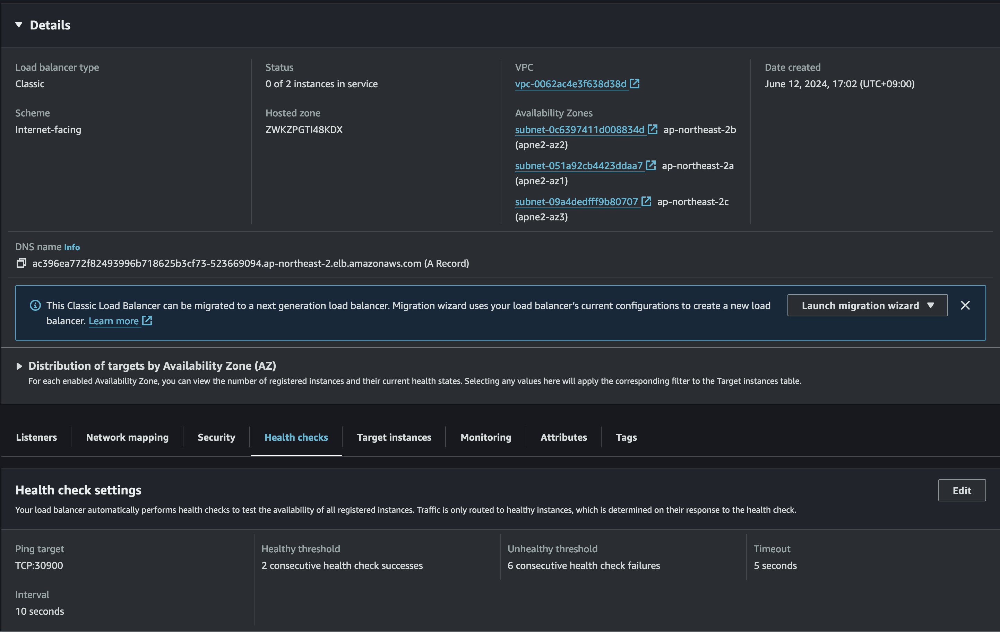
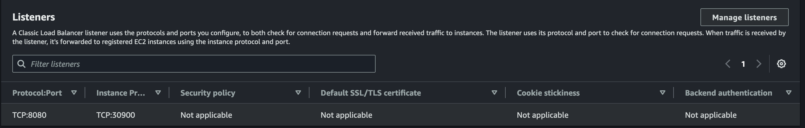

# 3.1 목적과 내용
해당 장의 전반부에서는 쿠버네티스에서 애플리케이션을 동작시키는 구조를 2장 예제 애플리케이션과 비교하면서 설명한다.  
후반부에서는 파드를 안정적으로 동작시키기 위한 필수 요소로 파드 라이프사이클과 리소스 관리에 대해 설명한다.


# 3.2 컨테이너를 동작시키기 위한 리소스

쿠버네티스의 장점은 **프로그램을 동작시키는 구조를 추상화된 오브젝트로 표현**  
**프로그램 추가, 삭제나 버전 업데이트 같은 작업을 오브젝트에 대한 설정으로 표현**  
한다는 것이다.

따라서, 기존의 인프라 구축이나 애플리케이션 배포와 달리 작업이 아닌 오브젝트 상태 선언이라는 형태로 환경을 정의할 수 있다.


## 3.2.2 쿠버네티스에서 프로그램을 동작시키는 기본 단위 '파드'
쿠버네티스에서 프로그램을 동작시킬 때 생성되는 오브젝트의 최소 단위는 컨테이너가 아니라 파드다.

2장에서 EKS 클러스터 구축 후 nginx를 배포하는 실습을 진행했는데 nginx컨테이너 하나만 있는 파드를 정의해 EKS 클러스터에 배포했다.

nginx 동작을 위해 아래 파일을 해당 명령어로 실행했다.

```bash
kubectl apply -f 02_nginx_k8s.yaml

apiVersion: v1 # 매니페스트 파일에서 정의된 오브젝트가 준수해야 하는 사양의 버전
kind: Pod # 매니페스트 파일이 파드라는 종류의 오브젝트라는 것을 의미
metadata:
  name: nginx-pod # 이름 설정
  labels:
    app: nginx-app # 해당 파드에 레이블을 key-value 형식으로, app이라는 키에 대해 nginx-app라는 값을 설정
spec:
  containers: # 파드에 생성할 컨테이너를 정의, 여러 개를 설정할 수 있으며 그 경우 배열로 설정, -로 시작하면 배열을 의미한다
  - name: nginx-container # 컨테이너 이름
    image: nginx # 어떤 컨테이너 이미지를 사용할지 설정, 여기서는 태그 없이 설정
    ports:
    - containerPort: 80 # 이 컨테이너를 공개할 포트를 설정
```

kubectl 명령어로 YAML 형식으로 작성된 메니페스트를 클러스터에 적용하는 명령어로 이 때 매니페스트 파일에 파드가 정의된 것이다.


### 쿠버네티스의 레이블
위의 매니페스트에서는 파드에 app: nginx-app 레이블을 설정했다. 실제로 쿠버네티스는 디플로이먼트나 서비스 같은 다양한 리소스를 식별하기 위해 레이블을 사용한다.

매니페스트 항목 중에는 파드를 동작시키는 노드를 설정하기 위한 노드셀렉터가 있는데 여기에 대상 노드에 설정된 레이블을 함께 설정할 수도 있다.


### 컨테이너 여러 개를 포함한 파드
이 책의 예제에서는 여러 개 컨테이너를 포함하는 파드를 이용하지 않아서 이외의 예제를 통해 설명한다.

파드 하나에 포함되는 컨테이너에는 다음과 같은 특징이 있다.
- 로컬호스트로 서로 통신 가능
- 스토리지(볼륨) 공유 가능
- 함께 동작 및 정지

다시 말해 어떤 컨테이너가 다른 컨테이너와 네트워크나 스토리지를 공유해 밀접하게 처리해야 하고, 1대 1로 대응해야 한다면 컨테이너들이 파드 하나에 포함되어야 한다.

- 메인 처리를 실행하는 컨테이너가 출력한 로그를 다른 컨테이너가 읽어 들여 로그 수집 서버나 메트릭 수집 서버에 전송(사이드카 패턴)
- 메인 처리를 실행하는 컨테이너가 외부 시스템에 접속할 경우, 또 다른 컨테이너가 프록시로 되어 목적지를 할당하거나 요청이 제대로 처리되지 않았을 때 재시도 수행(앰버서더 패턴)

### 파드 초기화 컨테이너
파드의 메인 컨테이너를 생성하기 전에 초기화 컨테이너를 실행하도록 설정할 수도 있다. 초기화 컨테이너를 분리해 처리하면 다음과 같은 장점을 얻을 수 있다.

- 애플리케이션 자체에 필요 없는 도구를 사용하여 초기화 처리 가능
- 메인 컨테이너의 보안성을 낮추는 도구를 초기화 컨테이너에 분리시키면 안전하게 초기화 처리 가능
- 초기화 처리와 애플리케이션을 서로 독립시켜 빌드, 배포 가능
- 초기화 컨테이너에서는 참조할 수 있지만 메인 컨테이너에서는 참조할 수 없는 시크릿을 설정하면 초기화 처리에만 필요하고 애플리케이션 처리에는 필요 없는 비밀 정보를 메인 컨테이너에서 제외 가능
- 초기화 컨테이너가 모두 종료될 때까지 메인 컨테이너가 시작되지 않으므로, 메인 컨테이너를 생성시키는 어떤 조건을 설정하고 그 조건이 성립될 때까지 메인 컨테이너 생성 차단 가능

## 3.2.3 파드의 다중화, 버전 업데이트, 롤백을 구현하는 디플로이먼트
웹 애플리케이션등을 동작시키는 경우 파드를 직접 배포하지 않고 디플로이먼트라는 오브젝트를 만들어 간접적으로 파드를 배포했다.

쿠버네티스 클러스터에서 애플리케이션을 동작시킬 경우 요청량과 처리 부하에 따라 파드 수를 유동적으로 조절하며 대응하는데 디플로이먼트를 통해 애플리케이션을 배포하면 이런 처리를 쿠버네티스가 자동으로 해준다.

### 디플로이먼트 정의
[2.4.5](2장.md#245-eks-클러스터에-api-애플리케이션-배포) 에서 다음 명령으로 API 애플리케이션을 배포했다.
```bash
ECR_HOST=566620743708.dkr.ecr.ap-northeast-2.amazonaws.com envsubst < 22_deployment_backend-app_k8s.yaml.template | kubectl apply -f -
deployment.apps/backend-app created
```

ECR 주소를 envsubst 명령어로 치환하는 것을 빼면 Nginx와 같이 YAML 매니페스트 파일을 kubectl apply 명령어로 쿠버네티스 클러스터에 적용하고 있다.

```bash
apiVersion: apps/v1
kind: Deployment # Deployment라는 오브젝트를 apps/v1 버전 정의에 따라 선언
metadata:
  name: backend-app # metadata 이름
  labels:
    app: backend-app # label 정의
spec:
  replicas: 2 # 클러스터 내부에 배포된 파드 수를 설정, 클러스터 전체에 파드 2개 생성
  selector:
    matchLabels:
      app: backend-app # 디플로이먼트를 구성하는 파드 레이블 정의와 일치하는 내용을 설정
  template: # teamplate 정의로 디플로이먼트를 통해 배포할 파드의 정의를 설정하는 부분으로 '파드템플릿'이라고 한다.
    metadata:
      labels:
        app: backend-app # 레이블
    spec:
      containers:
      - name: backend-app # 컨테이너 이름
        image: 566620743708.dkr.ecr.ap-northeast-2.amazonaws.com/k8sbook/backend-app:1.0.0 # 컨테이너 이미지 이름
        imagePullPolicy: Always
        ports:
        - containerPort: 8080
        env: # 파드에서 사용할 환경 변수를 시크릿이라는 오브젝트로 설정하기 위한 부분
        - name: DB_URL
          valueFrom:
            secretKeyRef:
              key: db-url
              name: db-config
        - name: DB_USERNAME
          valueFrom:
            secretKeyRef:
              key: db-username
              name: db-config
        - name: DB_PASSWORD
          valueFrom:
            secretKeyRef:
              key: db-password
              name: db-config
        readinessProbe: # 컨테이너가 동작했는지 확인
          httpGet:
            port: 8080
            path: /health
          initialDelaySeconds: 15
          periodSeconds: 30
        livenessProbe: # 정상 동작하는지 확인
          httpGet:
            port: 8080
            path: /health
          initialDelaySeconds: 30
          periodSeconds: 30
        resources: # 파드가 사용할 메모리나 CPU 리소스에 대한 정의
          requests:
            cpu: 100m
            memory: 512Mi
          limits:
            cpu: 250m
            memory: 768Mi
        lifecycle:
          preStop:
            exec:
              command: ["/bin/sh", "-c", "sleep 2"]%
```

### 디플로이먼트 목록 표시

쿠버네티스의 리소스 전체 확인은

```bash
kubectl get all
```

특정 종류의 리소스 정보만 출력

```bash
kubectl get 'resource'
```

```bash
kubctl get deployment

NAME                          READY   UP-TO-DATE   AVAILABLE   AGE
deployment.apps/backend-app   2/2     2            2           7h9m
```

- NAME은 디플로이먼트 이름으로 metadata - name에 설정한 값이 표시되며  
- READY는 이 디플로이먼트에서 설정한 파드 수와 실제 동작하고 있는 파드 수가 표시된다.  
- UP-TO-DATE에는 디플로이먼트에서 정의된 상태를 만족하는 파드 수,  
- AVAILABLE에는 실제 사용 가능한 파드 수  
- AGE에는 디플로이먼트가 생성된 이후의 경과 시간

## 3.2.4 디플로이먼트 하위에서 생성되는 레플리카셋
배포는 디플로이먼트가 중간에 레플리카셋이라는 다른 오브젝트를 생성해 배포한다. 파드 수 증감과 파드 장애시 재시작을 실질적으로 담당하는 것은 레플리카셋이다.

```bash
kubectl get replicaset

NAME                                     DESIRED   CURRENT   READY   AGE
replicaset.apps/backend-app-59b66ccd45   2         2         2       7h10m
```

레플리카셋의 이름은 디플로이먼트 이름 뒤에 랜덤으로 생성된 문자열이 부여되어 있다.
- DISIRED는 레플리카셋에서 설정한 파드 수
- CURRENT는 현재 동작하고 있는 파드 수
- READY는 준비 완료 상태인 파드 수
- AGE는 레플리카셋이 생성된 이후 경과시간

디플로이먼트 하나에 레플리카셋 여러 개가 생성될 수 있다.  
컨테이너 이미지 버전과 리소스 제약 등 디플로이먼트 정의를 변경하면 내부적으로 새로운 디플로이먼트 정의에 맞는 레플리카셋이 생성되고 이전 레플리카셋의 파드를 정지시키는 동작을 한다.

### 레플리카셋으로 생성된 파드

```bash
kubectl get pod

NAME                               READY   STATUS             RESTARTS      AGE
pod/backend-app-59b66ccd45-fmz8k   1/1     Running            0             7h10m
pod/backend-app-59b66ccd45-q8pxk   1/1     Running            0             7h10m
pod/batch-app-28626500-lmcdm       0/1     CrashLoopBackOff   1 (14s ago)   30s
```

파드 이름은 레플리카셋 이름에 랜덤 문자열을 추가한 형태라는 것을 알 수 있고, 이를 통해 디플로이먼트 - 레플리카셋 - 파드 생성 흐름이 있다는 것을 알 수 있다.

## 3.2.5 kubectl describe 명령으로 상세 정보 수집

쿠버네티스 클러스터에서 애플리케이션을 동작시키면 더 상세한 정보를 확인해야 하는 상황이 많아진다. 이 경우 kubectl descrive 명령어가 있다.

```bash
kubectl describe <리소스 종류> <오브젝트 이름>
```

```bash
Name:          backend-app-75f87c96fb-rvx6h # 파드 이름
Namespace:     eks-work # 파드가 생성된 네임스페이스 이름
Priority:      0
Node:          ip-192-168-2-155.ap-northeast-2.compute.internal/192.168.2.155 # 파드가 배치되어 동작하는 노드 이름
Start Time:    Sat, 17 Oct 2020 13:16:12 +0900 # 파드 생성 일시
Labels:        app=backend-app # 파드에 설정된 레이블
               pod-template-hash=75f87c96fb # 쿠버네티스 내부에 설정된 레이블
Annotations:   kubernetes.io/psp: eks.privileged
Status:        Running # 파드 상태
IP:            192.168.2.124 # 파드에 할당된 IP 주소
IPs:  
  IP:          192.168.2.124
Controlled By: ReplicaSet/backend-app-75f87c96fb # 파드를 제어하는 상위 오브젝트
Containers: # 컨테이너 단위의 상태들
  backend-app: # 컨테이너 이미지 이름
    Container ID: docker://dcc5d66d56094f2eef41f3b6148e4eac0c3eea4a7380cef6faf7
                  2a639b844b2f
    Image:        588305784594.dkr.ecr.ap-northeast-2.amazonaws.com/
                  k8sbook/backend-app: 1.0.0
    Image ID:     docker-pullable://588305784594.dkr.ecr.ap-northeast-2.
                  amazonaws.com/k8sbook/backend-app@sha256:6db6ee8807c2a66e9885
                  e0f2b5face65ae0649fea4dbfd2b32f5b725631ad09
Port:             8080/TCP # 컨테이너가 사용하는 프로토콜과 포트번호
Host Port:        0/TCP
State:            Running
Started:          Sat, 17 Oct 2020 13:16:27 +0900
Ready:            True
Restart Count:    0
Limits: # 리소스 제한에 대한 limits와 requests값
  срu:            250m
  memory:         768Mi
Requests: 
  cpu:            100m
  memory:         512Mi
  # 파드의 헬스체크
  Liveness:       http-get http://:8080/health delay=30s timeout=1s period=30s
                  #success=1 #failure=3
  Readiness:      http-get http://:8080/health delay=15s timeout=1s period=30s
                  #success=1 #failure=3
  Environments: # 쿠버네티스가 이 파드에 설정하는 환경변수
    DB_URL:      <set to the key 'db-url' in secret 'db-config">
                 Optional: false
    DB_USERNAME: <set to the key 'db-username' in secret 'db-config'>
                 Optional: false
    DB_PASSWORD: <set to the key 'db-password' in secret 'db-config'>
                 Optional: false
  Mounts: # 파드 레벨의 항목으로 마운트되어있는 볼륨 정보
    /var/run/secrets/kubernetes.io/serviceaccount from default-token-z9vb2 (ro)
Conditions:
  Туре            Status
  Initialized     True
  Ready           True
  ContainersReady True
  PodScheduled    True
Volumes:
  default-token-z9v02:
    Type:         Secret (a volume populated by a Secret)
    Secretlame:   default-token-z9vb2
    Optional:     false
Qos Class:        Burstable
Node-Selectors:   <none>
Tolerations:      node.kubernetes.io/not-ready:NoExecute for 300s 
                  node.kubernetes.io/unreachable: NoExecute for 300s
```


## 3.2.6 크론잡으로 스케줄 동작
크론잡은 리눅스의 크론과 같은 개념으로 크론잡이 동작시키는 대상은 컨테이너다.

### 크론잡의 정의

크론잡을 생성할 때 실행한 명령은 다음과 같다.

```bash
ECR_HOST=566620743708.dkr.ecr.ap-northeast-2.amazonaws.com envsubst < 43_cronjob_k8s.yaml.template | kubectl apply -f -

cronjob.batch/batch-app created
```

43_cronjob_k8s.yaml.template 파일
```bash
apiVersion: batch/v1 # 크론잡에 대한 API 버전
kind: CronJob # 크론잡이라는 리소스 타입
metadata:
  name: batch-app # 크론잡의 이름
spec:
  schedule: "*/5 * * * *" # min hour day-of-month month day-of-week
  jobTemplate: # 매번 실행되는 잡
    spec:
      template:
        spec:
          containers: # 컨테이너에 대한 정의
          - name: batch-app
            image: 566620743708.dkr.ecr.ap-northeast-2.amazonaws.com/k8sbook/batch-app:1.0.0
            imagePullPolicy: Always
            env:
            - name: DB_URL
              valueFrom:
                secretKeyRef:
                  key: db-url
                  name: db-config
            - name: DB_USERNAME
              valueFrom:
                secretKeyRef:
                  key: db-username
                  name: db-config
            - name: DB_PASSWORD
              valueFrom:
                secretKeyRef:
                  key: db-password
                  name: db-config
            - name: CLOUD_AWS_CREDENTIALS_ACCESSKEY
              valueFrom:
                secretKeyRef:
                  key: aws-accesskey
                  name: batch-secret-config
            - name: CLOUD_AWS_CREDENTIALS_SECRETKEY
              valueFrom:
                secretKeyRef:
                  key: aws-secretkey
                  name: batch-secret-config
            - name: CLOUD_AWS_REGION_STATIC
              valueFrom:
                configMapKeyRef:
                  key: aws-region
                  name: batch-app-config
            - name: SAMPLE_APP_BATCH_BUCKET_NAME
              valueFrom:
                configMapKeyRef:
                  key: bucket-name
                  name: batch-app-config
            - name: SAMPLE_APP_BATCH_FOLDER_NAME
              valueFrom:
                configMapKeyRef:
                  key: folder-name
                  name: batch-app-config
            - name: SAMPLE_APP_BATCH_RUN
              valueFrom:
                configMapKeyRef:
                  key: batch-run
                  name: batch-app-config
          restartPolicy: OnFailure # 크론잡을 재시작하는 조건
```

## 3.2.7 크론잡에서의 실행 내용
크론잡은 실행 시각이 되면 내부적으로 잡이라는 리소스가 생성된다. 그리고 잡 안에서 파드가 생성된다.

### 잡 리소스
잡이란 일정한 처리를 수행하고 완료하는 태스크를 실행하기 위한 것으로  
API 애플리케이션은 명시적 종료를 제외하면 계속 동작하도록 설정됐으며 내부에서 동작하는 프로그램도 비정상 종료를 제외하면 종료되는 일 없이 계속 동작한다

디플로이먼트 - 레플리카셋 - 파드: 계속적으로 동작한다는 것을 기대할 때  
잡 - 파드: 일정한 처리가 끝나면 프로그램을 종료하고 태스크로도 완료 상태가 되기를 원하는 경우  

## 3.2.8 잡 리소스의 동작
잡 리소스가 실행되는 처리가 어떻게 수행되는지 알아본다.

### 잡 실행 수
잡 리소스에서는 설정 내용에 따라 여러 개의 처리를 병렬로 실행할 수 있으며 잡의 실행 수를 규정하는 파라미터에는 잡 정의와 관련된 .spec.completions와 .spec.parallelism이 있다.

.spec.completions: 해당 잡이 완료될 때까지 실행 종료해야 하는 파드 수, default는 1
.spec.parallelism: 해당 잡을 실행할 때 병렬로 실행되는 파드 수, default는 1

### 잡 실행 패턴

1. 단일 파드를 실행하는 패턴
   - .spec.completions와 .spec.parallelism 모두 기본값을 사용하는 경우, 잡 리소스 1에 대해 파드 하나가 생성되며 그 파드가 정상 종료되면 잡이 종료된다.
2. 완료해야 할 파드 수를 설정하는 실행 패턴
   - .spec.completions를 설정한 경우 .spec.completions로 설정한 수의 파드가 정상 종료 되면 그 잡은 완료된다. 이때 spec.parallelism은 필수가 아니지만 설정한 수만큼 파드가 병렬로 실행된다.
3. 작업 큐형 실행 패턴
   - 동시에 파드 여러 개를 실행하고 작업 큐를 순차적으로 처리하는 패턴으로 큐, 데이터베이스, 파일 등 무엇이든 상관없이 외부 처리 대상을 유지하고 순차적으로 처리한다. 처리 대상이 없어지면 완료처리가 되며, .spec.completions는 설정하지 않고 .spec.parallelism을 설정하여 실행한다.

### 잡 재시도 횟수
.spec.backoffLimit: 잡에서 생성된 파드가 비정상 종료한 경우 몇 번을 재실행할지 설정, default는 6

지수 백오프 지연(exponential back-off): 여러번 재실행 시 횟수가 증가함에 따라 재실행을 다시 할 때까지의 대기시간을 지수 함수적으로 증가시키는 것으로 같은 간격으로 처리 재실행을 반복할 때 증가할 수 있는 비정상 종료 처리 갯수를 줄일 수 있다.

지수 백오프는 상한이 6분으로 설정되어 있어 최대 6분 간격으로 재실행한다.

## 3.2.9 크론잡 고유의 설정과 유의점
크론잡 고유의 설정 항목으로 중요한 것은 .spec.schdule, .spec.concurrencyPolicy다

### 스케줄 정의
.spec.schedule은 잡 실행의 스케줄을 정의하는 것으로 크론과 같이 스페이스로 구분한 문자열로 설정한다


| No | 설정값 | 값의 범위 | 비고 |
| ----- | ----- | ----- | ----- |
| 1 | 분 | 0~59 |  |
| 2 | 시 | 0~23 |  |
| 3 | 일 | 1~31 |  |
| 4 | 월 | 1~12 |  |
| 5 | 요일 | 0~6 | 일~토 |

예제에서는

```bash
*/5 * * * *
```

5분 간격으로 실행한다는 의미이며, 크론잡에서 설정한 시각은 마스터노드의 타임존에 따라 달라지며 EKS는 UTC를 사용한다.

### 동시 실행 제어
.spec.concurrencyPolicy는 이전에 스케줄링된 잡 실행이 미완료인 상태에서 다음 스케줄 시각에 도달했을 때 어떻게 동작할지 설정한다.

설정 가능한 값은 Allow, Forbid, Replace며 기본은 Allow다.


| No | 설정값 | 동작 |
| ----- | ----- | ----- | 
| 1 | Allow | 동시 실행 허가. 기본값 |
| 2 | Forbid | 실행 중인 잡을 남기고 신규 잡 생성은 건너뛰기 |
| 3 | Replace | 실행 중인 잡을 종료하고 신규로 잡 생성 |

크론 잡은 멱등성을 갖도록 만들어야 한다.

## 3.2.10 컨테이너를 동작시키기 위한 기타 리소스
쿠버네티스에는 위의 리소스 이외에도 특수 용도의 데몬셋, 스테이드풀셋이 있다.

### 노드 각각에 반드시 파드 하나를 동작시키는 데몬셋
로그 수집용 에이전트를 노드 각각에 배포해야 하는 상황이 있다면 파드가 클러스터에 속한 워커 노드별로 하나씩 동작하게 하는 데몬셋을 사용할 수 있다.

### 영구 데이터를 다루기 위한 스테이트풀셋
컨테이너는 동작시킬 때 매번 초기화된 상태로 만들어진다고 생가갛면 되는데 데이터베이스와 같이 저장해서 유지해야 할 데이터가 필요한 경우 파드 외부에 볼륨 형태로 데이터를 저장한 후 파드가 재시작되더라도 사용했던 볼륨을 계속 사용하는 구조로 되어 있는데, 스테이트풀셋이 이런 동작을 지원한다.


파드처럼 고유의 상태를 갖지 않고 모든 파드가 같은 상태를 갖는 것을 스테이트리스라하고 고유의 상태를 갖는 것을 스테이트풀이라 하는데 이처럼 고유의 상태를 갖는 것이 스테이트풀셋이다.

## 3.2.11 네임스페이스
컨테이너가 동작하는 클러스터를 논리적으로 사용하기 위한 리소스

### 쿠버네티스 표준으로 사용되는 네임스페이스
쿠버네티스 표준에는 네임스페이스 3개가 존재한다.

- default: 명시적으로 네임스페이스를 설정하지 않았을 경우
- kube-system: 쿠버네티스에 의해 생성하는 오브젝트가 사용하는 네임스페이스
- kube-public: 모든 사용자가 사용할 수 있는 네임스페이스

### 예제 애플리케이션에서 사용한 네임스페이스
예제 애플리케이션에서 eks-work라는 네임스페이스를 생성했고 디플로이먼트와 크론잡을 비롯한 리소스를 이 네임스페이스에 생성했다.

kubectl get 명령에서 네임스페이스를 명시적으로 설정하지 않으면 컨텍스트에 설정된 네임스페이스의 리소스만 표시된다.

다음에 설졍하는 제한 설정을 하지 않으면 kubectl 명령어의 --namespace 옵션을 사용해 다른 네임스페이스에 대한 리소스를 조작할 수 있다.

### 네임스페이스를 이용한 클러스터 리소스 제한
네임스페이스는 리소스 배치의 논리적인 구분 외에도 리소스 쿼터, 네트워크 정택과 같은 리소스 또는 RBAC(Role-Based Access Control)의 구조가 있다. 이를 함께 사용하면 리소스 사용량과 네트워크 통신 제한 또는 클러스터에 대한 권한 제어를 실행할 수 있다.

### 네임스페이스를 정의한 매니페스트 파일

20_create_namespace_k8s.yaml
```bash
apiVersion: v1
kind: Namespace # 네임스페이스를 설정
metadata:
  name: eks-work # 생성한 네임스페이스 이름을 설정
```

네임스페이스 생성용 매니페스트파일이다.

## 디플로이먼트 업데이트와 롤백
디플로이먼트는 파드 생성 뿐만 아니라 정의 변경(디플로이먼트 업데이트)를 단계적으로 실행하거나, 정의 변경의 롤백 구조도 있다.

```bash
kubectl apply -f 01_nginx_deployment_k8s.yaml
deployment.apps/nginx created
```

```bash
kubectl get all
NAME                         READY   STATUS    RESTARTS   AGE
pod/nginx-755b49644d-2xcvp   1/1     Running   0          21s
pod/nginx-755b49644d-gppq9   1/1     Running   0          21s

NAME                 TYPE        CLUSTER-IP   EXTERNAL-IP   PORT(S)   AGE
service/kubernetes   ClusterIP   10.100.0.1   <none>        443/TCP   8m28s

NAME                    READY   UP-TO-DATE   AVAILABLE   AGE
deployment.apps/nginx   2/2     2            2           22s

NAME                               DESIRED   CURRENT   READY   AGE
replicaset.apps/nginx-755b49644d   2         2         2       22s
```

디플로이먼트 매니페스트와 실제 kubectl describe 명령어 실행했을 때를 비교해보면

```bash
# 01_nginx_deployment_k8s
requests: 
    cpu: 100m
    memory: 512Mi
limits:
    cpu: 250m
    memory: 768Mi%
        
# kubectl describe
Limits:
    cpu:     250m
    memory:  768Mi
Requests:
    cpu:        100m
    memory:     512Mi
```

두 값이 같은 것을 확인할 수 있고 디플로이먼트 값을 변경한 후 적용하면

```bash
kubectl apply -f 02_nginx_deployment_cpu200_k8s.yaml
deployment.apps/nginx configured
```

```bash
kubectl get all
NAME                         READY   STATUS    RESTARTS   AGE
pod/nginx-6f79d7f97d-njv96   1/1     Running   0          44s
pod/nginx-6f79d7f97d-sr8zx   1/1     Running   0          47s

NAME                 TYPE        CLUSTER-IP   EXTERNAL-IP   PORT(S)   AGE
service/kubernetes   ClusterIP   10.100.0.1   <none>        443/TCP   39h

NAME                    READY   UP-TO-DATE   AVAILABLE   AGE
deployment.apps/nginx   2/2     2            2           39h

NAME                               DESIRED   CURRENT   READY   AGE
replicaset.apps/nginx-6f79d7f97d   2         2         2       47s
replicaset.apps/nginx-755b49644d   0         0         0       39h
```


설정 변경이 적용된 후에도 이전 레플리카셋이 남아있는데 이 레플리카셋이 남아 있으면 설정 변경을 롤백해 원래 설정 상태로 되돌릴 수 있다.

```bash
kubectl rollout history deployment nginx --revision=1
deployment.apps/nginx with revision #1
Pod Template:
  Labels:	app=nginx
	pod-template-hash=755b49644d
  Containers:
   nginx:
    Image:	nginx
    Port:	80/TCP
    Host Port:	0/TCP
    Limits:
      cpu:	250m
      memory:	768Mi
    Requests:
      cpu:	100m
      memory:	512Mi
    Environment:	<none>
    Mounts:	<none>
  Volumes:	<none>
  Node-Selectors:	<none>
  Tolerations:	<none>

kubectl rollout history deployment nginx --revision=2
deployment.apps/nginx with revision #2
Pod Template:
  Labels:	app=nginx
	pod-template-hash=6f79d7f97d
  Containers:
   nginx:
    Image:	nginx
    Port:	80/TCP
    Host Port:	0/TCP
    Limits:
      cpu:	250m
      memory:	768Mi
    Requests:
      cpu:	200m
      memory:	512Mi
    Environment:	<none>
    Mounts:	<none>
  Volumes:	<none>
  Node-Selectors:	<none>
  Tolerations:	<none>
```

설정 변경 전과 후가 각각 1, 2로 롤백을 실행하면

```bash
kubectl rollout undo deployment nginx --to-revision=1
deployment.apps/nginx rolled back
kubectl get all
NAME                         READY   STATUS    RESTARTS   AGE
pod/nginx-755b49644d-tf5xc   1/1     Running   0          15s
pod/nginx-755b49644d-v92rr   1/1     Running   0          18s

NAME                 TYPE        CLUSTER-IP   EXTERNAL-IP   PORT(S)   AGE
service/kubernetes   ClusterIP   10.100.0.1   <none>        443/TCP   39h

NAME                    READY   UP-TO-DATE   AVAILABLE   AGE
deployment.apps/nginx   2/2     2            2           39h

NAME                               DESIRED   CURRENT   READY   AGE
replicaset.apps/nginx-6f79d7f97d   0         0         0       8m27s
replicaset.apps/nginx-755b49644d   2         2         2       39h
```

다시 이전 설정으로 돌아간다.


# 3.3 컨테이너를 외부로 공개하기 위한 리소스

쿠버네티스 클러스터에서 동작하는 컨테이너를 클러스터 외부에서 접속하기 위해 공개하는 방법을 설명한다.

## 3.3.1 파드를 서비스로 묶기
쿠버네티스에서는 서비스 리소스를 이용해 파드 여러 개를 묶어 하나의 DNS 이름으로 접속할 수 있다. 또 서비스를 이용하면 정상동작하는 파드에만 요청을 할당할 수 있다.

### 예제 애플리케이션의 서비스 리소스
예제 애플리케이션에서 서비스 리소스를 정의한 매니페스트 파일을 살펴보자

```bash
cat 23_service_backend-app_k8s.yaml

apiVersion: v1
kind: Service # 매니페스트에서 정의하는 리소스
metadata:
  name: backend-app-service # 서비스 리소스 이름으로 DNS 이름으로 등록돼 클러스터 내부에서 참조할 수 있게된다.
spec:
  type: LoadBalancer # 서비스 종류
  selector:
    app: backend-app # 이 서비스가 대상으로 하는 파드를 선택하기 위한 셀렉터 정의
  ports:
  - protocol: TCP # 서비스에 접속하기 위한 프로토콜
    port: 8080 # 포트 번호
    targetPort: 8080 # 파드쪽 포트 번호
```

## 3.3.2 서비스 리소스 타입

| No | 설정값 | 동작 |
| ----- | ----- | ----- | 
| 1 | ClusterIP | 서비스에 대해 클러스터 내부에서 유효한 IP 주소를 부여한다. 클러스터 외부에서는 접속할 수 없다. |
| 2 | NodePort | 각 노드에서 해당 서비스에 접속하기 위한 포트를 열고 클러스터 외부에서 접속 가능하도록 한다. |
| 3 | LoadBalancer | NodePort에서 열린 노드 각각의 서비스 공개용 포트를 묶는 형태로 클러스터 외부에 로드밸런서를 구축한다. EKS의 경우 기본으로 CLB가 생성되며 설정에 따라 NLB로 변경 가능하다, ALB는 사용할 수 없다 ? |
| 4 | ExternalName | 클러스터 내부의 파드를 공개하기 위한 리소스가 아닌 클러스터 외부의 엔드포인트를 클러스터 내부에 공개하기 위한 서비스 리소스 타입으로 파드 각각이 외부 서비스를 직접 호출하지 않고 ExternalName으로 등록한 서비스에 접속하면 외부 서비스와 클러스터 내부 파드를 느슨한 결합으로 연결할 수 있다. |

ALB는 Kubernetes Ingress 리소스에서 프로비저닝, NLB는 Kubernetes Network Load Balancer에서 프로비저닝(L4)




- CLB를 생성할 경우 ping 대상은 default가 HTTP지만 위의 23_service를 보면 TCP로 설정되어 있는데 HTTP는 경로가 필요하기 때문에 편의성을 위해 TCP로 설정했다.
- 포트번호 30900은 NodePort타입의 서비스가 할당된 것으로 로드밸런서가 NodePort를 각 인스턴스의 접속 경로로 설정한다

```bash
kubectl describe service backend-app-service
Name:                     backend-app-service
Namespace:                default
Labels:                   <none>
Annotations:              <none>
Selector:                 app=backend-app
Type:                     LoadBalancer
IP Family Policy:         SingleStack
IP Families:              IPv4
IP:                       10.100.14.143
IPs:                      10.100.14.143
LoadBalancer Ingress:     ac396ea772f82493996b718625b3cf73-523669094.ap-northeast-2.elb.amazonaws.com
Port:                     <unset>  8080/TCP
TargetPort:               8080/TCP
NodePort:                 <unset>  30900/TCP
Endpoints:                <none>
Session Affinity:         None
External Traffic Policy:  Cluster
Events:
  Type    Reason                Age    From                Message
  ----    ------                ----   ----                -------
  Normal  EnsuringLoadBalancer  7m15s  service-controller  Ensuring load balancer
  Normal  EnsuredLoadBalancer   7m12s  service-controller  Ensured load balancer
```

NodePort: Service를 만들어 외부의 port를 지정해 내부의 pod와 연결하는 것, 30000~32767 대역 사용



로드밸런서로 수신한 포트는 8080, 수신한 요청을 30900 포트로 전달하는 설정으로 되어있다.

## 3.3.3 컨테이너를 외부로 공개하는 또 하나의 방법

LoadBalancer 타입의 서비스는 여러 문제가 있는데
- 서비스 단위로 ELB가 생성되기 때문에 효율이 좋지 않다.
- HTTP/HTTPS 로드밸런서로 더 많은 기능이 있는 ALB를 사용할 수 없다

실제로 이 방법 이외의 인그레스를 사용하는 방법이 있다.

인그레스는 쿠버네티스 클러스터로 접근하는 입구를 만들기 위한 리소스로 공통 입구를 만들고 AP 여러 개를 클러스터 외부에 공개할 수 있다.

TODO: 로드밸런서로 HTTPS 지원

# 3.4 설정 정보 등을 안전하게 저장하는 구조

데이터베이스 접속 정보, 사용자 이름, 비밀번호 등은 동적으로 설정하고 싶을 수도 있는데 이에 대해 설명한다.

## 3.4.1 환경 변숫값 전달
애플리케이션 설정 정보는 환경변수에 저장하는 방법론이 있는데 개발, 스테이징, 서비스 환경에서 취급하는 설정 정보가 달라 애플리케이션을 다시 빌드하지 않도록 하기 위해서다. 쿠버네티스에는 이런 설정 정보를 파드의 환경 변수로 전달하는 구조가 있따.

## 3.4.2 시크릿을 이용한 비밀 정보 전달
쿠버네티스에서는 시크릿이라는 리소스를 이용해 중요 정보를 안전한 장소에 등록하고 참조하는 방법으로 구현한다

예제 애플리케이션에서는 backend-app과 batch-app 두 애플리케이션을 위한 시크릿을 생성한다.  
그리고 파드의 매니페스트에서 해당 시크릿을 읽어 파드 내부의 환경 변수에 설정하도록 정의한다.

```bash
cat 21_db_config_k8s.yaml.template

apiVersion: v1
kind: Secret # 시크릿 리소스를 사용
type: Opaque # 시크릿 타입으로 키-값 형식의 쌍으로 삼아 등록할 경우 Opaque로 설정한다
metadata:
  name: db-config # 시크릿 리소스 이름
stringData: # 실제 등록할 데이터를 키-값 형식으로 설정
  db-url: ${DB_URL}
  db-username: mywork
  db-password: ${DB_PASSWORD}
```

여기서 db-url, db-password는 envsubst 명령어로 치환되며, 시크릿 등록시 base64 인코딩된다.

```bash
cat 22_deployment_backend

env:
- name: DB_URL # 파드에 설정할 환경 변수 이름
    valueFrom:
    secretKeyRef: # 시크릿에서 값을 참조함을 선언
        key: db-url # 시크릿 데이터 키 이름
        name: db-config # 시크릿 리소스 이름
- name: DB_USERNAME
    valueFrom:
    secretKeyRef:
        key: db-username
        name: db-config
- name: DB_PASSWORD
    valueFrom:
    secretKeyRef:
        key: db-password
        name: db-config
```

아래 명령어를 통해 시크릿값이 설정된 것을 확인할 수 있다.
```bash
kubectl exec niginx-755b49644d-tf5xc -it -- env | grep DB
```

## 3.4.3 시크릿을 사용할 때 주의할점
- base64 인커딩은 암호화가 아니다
- 매니페스트 파일을 깃허브에 공개하면 안된다(매니페스트 안의 비밀 정보를 암호화하고 클러스터 내부에서 복호화하는 구조 등)


## 3.4.4 컨피그맵을 이용한 설정 정보 전달
비밀 정보가 아니라면 시크릿을 이용해 암호화할 필요가 없다. 이런 용도에 컨피그맵을 이용하며, 사용 방법은 시크릿과 거의 같다.


```bash
cat 41_config_map_batch_k8s.yaml.template

apiVersion: v1
kind: ConfigMap # 컨피그맵 리소스 등록
metadata:
  name: batch-app-config # 컨피그맵 리소스 이름
data: # 실제 등록할 데이터를 설정
  bucket-name: eks-work-batch-${BUCKET_SUFFIX}
  folder-name: locationData
  batch-run: "true"
  aws-region: ap-northeast-2
```


```bash
env:
- name: CLOUD_AWS_REGION_STATIC
    valueFrom:
    configMapKeyRef: # 컨피그맵 참조로 시크릿은 secretKeyRef
        key: aws-region
        name: batch-app-config
- name: SAMPLE_APP_BATCH_BUCKET_NAME
    valueFrom:
    configMapKeyRef:
        key: bucket-name
        name: batch-app-config
```

또한 컨피그맵은 kubectl 명령으로 참조도 가능하다

```bash
kubectl describe

kubectl describe configmap batch-app-config
Name:         batch-app-config
Namespace:    default
Labels:       <none>
Annotations:  <none>

Data
====
aws-region:
----
ap-northeast-2
batch-run:
----
true
bucket-name:
----
eks-work-batch-${BUCKET_SUFFIX}
folder-name:
----
locationData

BinaryData
====

Events:  <none>
```

지금까지 한 방식 말고도 환경 변수가 아닌 파드 내부의 볼륨으로 마운트해서 파일로 전달할수도 있다.

### 파드에 볼륨을 마운트한다
파드 내부의 데이터는 파드가 정지되면 모두 삭제된다. 따라서, 파드 내부의 데이터를 저장하고 싶은 경우 영구적으로 저장할 수 있는 스토리지가 필요하며 쿠버네티스에서는 영구 볼륨이라는 리소스로 스토리지를 정의, 영구 볼륨 클레임이라는 리소스를 사용해 파드에서 참조해서 그 스토리지를 사용할 수 있다.

AWS에는 EBS가 있지만 EBS는 다른 파드와 동시에 참조하거나 쓸 수 없기 때문에 파드의 라이프사이클에 의존하게된다. 따라서, S3나 DB에 데이터를 저장하고 클러스터 내부는 stateless하게 유지하는 것이 좋다


# 3.5 파드를 안전하게 외부로 공개하기 위한 헬스 체크
두 가지 헬스체크에 대해 설명한다.

## 3.5.1 Readiness Probe로 파드와 연결된 서비스 모니터링하기
Readiness Probe는 애플리케이션이 공개 가능한 상태인지 확인하고 정상이라고 판단된 경우 처음으로 서비스를 통해 트래픽을 수신한다.

```bash
22_deployment_backend

readinessProbe:
    httpGet:
    port: 8080
    path: /health
    initialDelaySeconds: 15
    periodSeconds: 30
```

API AP에서 디플로이먼트용 매니페스트에서 /health경로로 30초간격으로 8080포트에 접속해 정상 응답이 있을 경우에 요청을 받는다고 설정했다. Readiness Probe가 실패하면 파드 상태가 비정상으로 판단돼 Ready 상태가 되지 않아 서비스에서 트래픽을 보내지 않는다.

## 3.5.2 Liveness Probe로 파드 상태 모니터링
Liveness Probe는 파드의 상태 모니터링이라고 할 수 있고 실행 중 파드의 정상 여부를 확인한다.

```bash
livenessProbe:
    httpGet:
    port: 8080
    path: /health
    initialDelaySeconds: 30
    periodSeconds: 30
```

Liveness Probe가 실패하면 파드는 재시작을 시도며 파드 이벤트에 내용이 출력, 재시작 횟수를 센다

### 초기화 처리에 걸리는 시간 고려
Liveness Probe는 Readiness Probe가 성공한 후 하지 않으면 파드의 재시작 루프에 빠질 가능성이 있다. 이를 방지하기 위해 쿠버네티스에서는 초기화 지연이라는 설정으로 파드가 동작한 후 첫번째 헬스 체크를 시작하기까지 유예 시간을 설정할 수 있다. 위의 initialDelaySeconds로 설정 가능하다.

# 3.6 파드를 안전하게 종료하기 위해 고려해야 할 사항

## 3.6.1 파드 종료 시의 상태 변화 이동
어떤 이유든 파드가 종료되는 경우가 있을 수 있는데 k8s는 종료 요청이 오면 비동기적으로 종료 처리를 시작하고 Terminating 상태로 변경시키는 흐름으로 동작한다.

종료 처리는 SIGTERM처리, SIGKILL 처리 순서로 실행되는데 비동기이기 때문에 서비스에서 제외되기 전 SIGTERM 처리를 할 수 있다는 의미다. 이는 서비스에서 제외되기 전에 파드가 클라이언트 요청에 정상 응답할 수 없는 상태가 될 수 있다는 의미이기도 한다. 이를 방지하기 위해 preStop 처리로 일정 시간 파드 종료를 대기하는 방법을 사용할 수 있다.

```bash
resources:
    requests:
        cpu: 100m
        memory: 512Mi
    limits:
        cpu: 250m
        memory: 768Mi
lifecycle:
    preStop:
    exec:
        command: ["/bin/sh", "-c", "sleep 2"]
```

이렇게 서비스 분리 전 파드가 먼저 종료되는 상황을 방지할 수 있다.

# 3.7 리소스 관리

## 3.7.1 파드의 리소스양을 명시하는 requests와 limits
도커 컨테이너는 호스트 하나에서 여러 개를 동작시킬 경우 리소스를 확보하려는 경쟁이 벌어진다. 쿠버네티스에서는 파드가 사용할 CPU/MEM 양을 설정하고 필요 이상으로 호스트에 부하를 주지 않도록 하는 구조가 있다.

이는 디플로이먼트 매니페스트 내의 requests와 limits로 설정하는데 위에 requests, limits로 표현 가능하다.

limits는 파드가 사용할 수 있는 리소스 상한, reuqests는 파드 배포시 호스트에게 리소스를 최소한으로 사용할 때 필요한 양을 설정한다.

모든 호스트에 requests로 설정된 리소스 양에 여유가 없을 경우 Pending상태로 정상적으로 파드 동작이 불가능하다.

## 3.7.2 requests와 limits의 차이

### 차이를 크게 했을 경우
파드 배치는 reqeusts 값을 기준으로 결정돼 부하가 많은 호스트도 reqeusts를 받을 수 있는 여유가 있다면 새로운 파드가 배치되며 이를 오버커밋 상태라고 한다. 해당 상태에서 쿠버네티스는 일정 조건으로 파드 동작을 정지시킨다.

시간대별로 부하가 발생하는 파드가 나눠져있고 효율적으로 사용하고 싶은 경우 양쪽 파드 모두에 배치될 수 있을 정도의 requests를 설정하고 limits는 한쪽 파드가 필요로 하는 양을 설정해두면 효율적으로 호스트 리소스를 사용할 수 있게된다.

### 차이를 작게 했을 경우
오버 커밋을 없지만 리소스 최적화 성능이 낮아지면 효율적 리소스 사용이 불가능해진다. 하지만 예상치 못한 부하가 발생하지 않는 시스템이라면 파드를 안정적으로 운영할 수 있을 것이다.


## 3.7.3 파드가 요청 가능한 리소스 사용량을 관리하는 리밋 레인지

클러스터 관리자 입장에서 쿠버네티스 클러스터를 안전하게 운영하기 위해 파드가 요구하는 CPU나 메모리 reuqests, limits의 하한, 상한 및 기본값을 설정하고 과도한 리소스를 요청하는 파드의 배포를 거부하거나 설정하지 않은 파드에 대해 자동으로 적용해주는 **리밋 레인지**가 있다.

이 기능은 네임스페이스 단위로 설정하게 되며, 서비스 환경, 개발 환경을 네임스페이스 단위로 나눌 경우 개발 환경 리소스 제한을 거는 등의 조절이 가능하다.

## 3.7.4 리소스의 총 요구량을 관리하는 리소스 쿼터
requests와 limits 및 리밋 레인지는 개별 파드에 대해 리소스 요구량을 관리하는 것이라면 리소스쿼터는 네임스페이스 단위로 사용할 수 있는 총 사용량의 상한을 관리하는 기술이다.

파드가 많이 배포되면 클러스터 전체의 리소스가 모자를 수 있는데 이런 위험을 방지해주며 네임스페이스 단위로 설정한다. CPU, Mem, pod 수를 제한할 수 있다.


