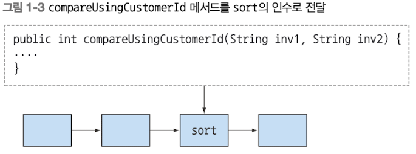

- [1. 자바 8, 9, 10, 11: 무슨 일이 일어나고 있는가](#1-자바-8-9-10-11-무슨-일이-일어나고-있는가)
  - [1.1 역사의 흐름은 무엇인가?](#11-역사의-흐름은-무엇인가)
  - [1.2 왜 아직도 자바는 변화하는가?](#12-왜-아직도-자바는-변화하는가)
    - [1.2.1 프로그래밍 언어 생태계에서 자바의 위치](#121-프로그래밍-언어-생태계에서-자바의-위치)
    - [1.2.2 스트림 처리](#122-스트림-처리)
    - [1.2.3 동작 파라미터화로 메서드에 코드 전달하기](#123-동작-파라미터화로-메서드에-코드-전달하기)
    - [1.2.4 병렬성과 공유 가변 데이터](#124-병렬성과-공유-가변-데이터)
    - [1.2.5 자바가 진화해야 하는 이유](#125-자바가-진화해야-하는-이유)
  - [1.3 자바 함수](#13-자바-함수)
    - [1.3.1 메서드와 람다를 일급 시민으로](#131-메서드와-람다를-일급-시민으로)
  - [1.4 스트림](#14-스트림)
  - [1.5 디폴트 메서드와 자바 모듈](#15-디폴트-메서드와-자바-모듈)

# 1. 자바 8, 9, 10, 11: 무슨 일이 일어나고 있는가

## 1.1 역사의 흐름은 무엇인가?
자바 8에서 자바 역사를 통틀어 가장 큰 변화가 있었다.

자바 8은 간결한 코드, 멀티코어 프로세서의 쉬운 활용이라는 두 가지 요구사항을 기반으로 다음과 같은 새로운 기술을 추가했다.

- 스트림 API
- 메서드에 코드를 전달하는 기법
- 인터페이스의 디폴트 메서드

스트림 API란 병렬 연산을 지원하는 API로 데이터베이스 질의 언어에서 고수준 언어로 원하는 동작을 표현하면, 구현(자바 스트림 라이브러리)에서 최적의 저수준 실행방법을 선택하는 방식으로 동작한다.

스트림 API 덕분에 메서드에 `코드를 전달하는 간결 기법`(메서드 참조와 람다)과 인터페이스의 `디폴트 메서드`가 존재할 수 있음을 알 수 있다.

## 1.2 왜 아직도 자바는 변화하는가?
새로운 언어가 등장하면서 진화하지 않은 기존 언어는 사장된다. 자바는 1995년 베타 버전 공개 이후 경쟁 언어를 대신하여 성공을 거둘 수 있었다.

### 1.2.1 프로그래밍 언어 생태계에서 자바의 위치
자바 8에 추가된 기능은 현재 시장에서 요구하는 기능을 제공한다. 대표적 세 가지 기술을 간략히 알아보자.

### 1.2.2 스트림 처리
스트림이란 한 번에 한 개씩 만들어지는 연속적인 데이터 항목들의 모임이다.

```
cat file1 file2 | tr "[A-Z]" "[a-z]" | sort | tail -3
```

위 예제는 파일의 단어를 소문자로 바꾼 다음 사전순 정렬시 마지막 세 단어를 출력하는 프로그램으로  
유닉스에서는 여러 명령을 병렬로 실행한다.

자바 8에 추가된 java.util.stream 패키지의 스트림 API는 파이프라인을 만드는데 필요한 많은 메서드를 제공한다. 스트림 API 는 기존의 한 번에 한 항목을 처리했던 것과 달리 일련의 스트림으로 만들어 처리할 수 있다.

### 1.2.3 동작 파라미터화로 메서드에 코드 전달하기
자바 8 이전에는 메서드를 다른 메서드로 전달할 방법이 없었지만 이제는 해당 기능을 제공한다. 이 기능을 이론적으로 `동작 파라미터화`라고 부른다.



### 1.2.4 병렬성과 공유 가변 데이터
다른 코드와 동시에 실행하더라도 안전하게 실행할 수 있는 코드를 만들려면 공유된 가변데이터에 접근하지 않아야 한다.  
공유된 변수나 객체가 있으면 병렬성에 문제가 발생한다. 기존처럼 synchronized를 이용해 공유된 가변 데이터를 보호하는 규칙을 만들 수 있지만 자바8의 스트림을 이용하면 기존의 자바 스레드 API보다 쉽게 병렬성을 활용할 수 있다.

### 1.2.5 자바가 진화해야 하는 이유
언어는 하드웨어나 프로그래머 기대에 부응하는 방향으로 변화해야 한다.

## 1.3 자바 함수
자바 8에서는 함수를 새로운 값의 형식으로 추가했다.

자바 프로그램에서 조작할 수 있는 값은
- 기본값
- 객체(클래스의 인스턴스, Collections, 배열)
- 함수

프로그래밍 언어의 핵심을 값을 바꾸는 것이고 이 값을 일급 값이라고 부른다.  
기본값, 객체는 일급 시민이지만 메서드, 클래스 등은 이급 시민에 해당한다. 하지만 런타임에 메서드를 전달할 수 있다면 이급 시민을 일급 시민으로 바꿀 수 있다. 따라서, 자바8 설계자들은 이급 시민을 일급 시민으로 바꿀 수 있는 기능을 추가했다.

### 1.3.1 메서드와 람다를 일급 시민으로
메서드를 일급 값으로 사용하면 활용할 수 있는 도구가 다양해진다. 그래서 자바8은 메서드를 값으로 취급할 수 있게 해 더 쉽게 프로그램을 구현할 수 있게 만들었다.

1. 메서드 참조: `::`로 사용하며 메서드를 직접 전달할 수 있다.
   ```java
    File[] hiddenFiles = new File(".").listFiles(new FileFilter() {
        @Override
        public boolean accept(File pathname) {
            return pathname.isHidden();
        }
    });
   ```
   참고로 FileFilter는 함수형 인터페이스로 다음과 같이 구현돼있다.
   ```java
   @FunctionalInterface
   public interface FileFilter {
       boolean accept(File pathname);
   }
   ```

   ```java
   File[] hiddenFiles = new File(".").listFiles(File::isHidden);
   ```


## 1.4 스트림

## 1.5 디폴트 메서드와 자바 모듈