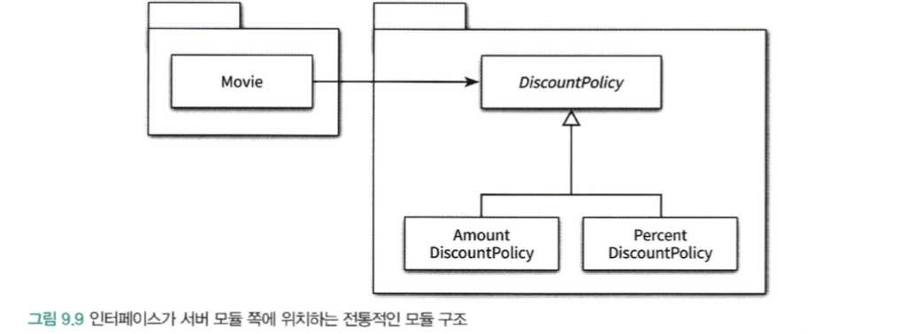
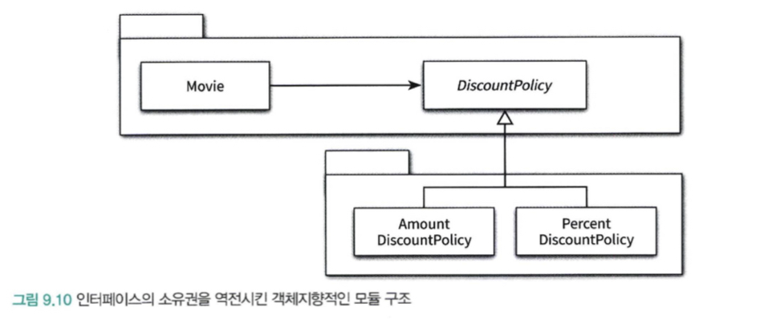

- [의존성 관리하기](#의존성-관리하기)
  - [1. 의존성 이해하기](#1-의존성-이해하기)
- [유연한 설계](#유연한-설계)
  - [1. 개방-폐쇄 원칙](#1-개방-폐쇄-원칙)
    - [컴파일 타임 의존성성을 고정시키고 런타임 의존성을 변경하라](#컴파일-타임-의존성성을-고정시키고-런타임-의존성을-변경하라)
    - [추상화가 핵심이다.](#추상화가-핵심이다)
  - [2. 생성 사용 분리](#2-생성-사용-분리)
    - [FACTORY 추가하기](#factory-추가하기)
    - [순수한 가공물에게 책임 할당하기](#순수한-가공물에게-책임-할당하기)
  - [3. 의존성 주입](#3-의존성-주입)
    - [숨겨진 의존성은 나쁘다.](#숨겨진-의존성은-나쁘다)
  - [4. 의존성 역전 원칙](#4-의존성-역전-원칙)
    - [인터페이스 소유권에도 적용되는 의존성 역전](#인터페이스-소유권에도-적용되는-의존성-역전)
  - [5. 유연성에 대한 조언](#5-유연성에-대한-조언)
    - [협력과 책임이 중요하다.](#협력과-책임이-중요하다)


# 의존성 관리하기
잘 설계된 객체는 작은 한 가지 역할을 가지고 다른 역할을 지닌 객체와 잘 협력한다. 하지만 과도한 협력은 다른 객체에 대해 알 것을 강요한다.  
따라서 필요한 의존성을 의존성을 유지하면서도 변경을 방해하는 의존성은 제거하는 것이 중요하다.

객체지향 설계란 의존성을 관리하고 객체가 변화를 받아들일 수 있게 의존성을 정리하는 기술이라고 할 수 있다.

이번 장에서는 의존성을 관리하는 방법에 대해 살펴본다.

## 1. 의존성 이해하기

# 유연한 설계
해당 장에서는 8장에서 소개한 의존성 관리 기법들을 원칙이라는 관점에서 정리한다.

## 1. 개방-폐쇄 원칙
소프트웨어는 `확장(클래스, 모듈, 함수 등)`에 열려있어야 하고 `수정`에 대해서는 닫혀 있어야 한다.

확장은 동작의 관점, 수정은 코드의 관점을 반영한다.

### 컴파일 타임 의존성성을 고정시키고 런타임 의존성을 변경하라
마지막에 이야기 했던 DiscountPolicy에 NoneDiscountPolicy추가 과정을 생각해보면 기존 코드의 수정 없이 클래스 추가만으로 할인 정책이 적용되지 않는 영화를 구현할 수 있었다.


따라서, 새로운 클래스의 추가만으로 확장할 수 있고 코드의 수정 없이 구현 가능하다.

개방-폐쇄 원칙을 수용하는 코드는 컴파일타임 의존성의 수정 없이 런타임 의존성을 쉽게 변경할 수 있다.

### 추상화가 핵심이다.
개방-폐쇄 원칙의 핵심은 추상화에 의존하는 것으로 

- 추상화: 핵심적인 부분만 남기고 불필요한 부분은 생략함으로써 복잡성을 극복하는 기법

개방-폐쇄 원칙의 관점에서 생략되지 않고 남겨지는 부분은 공통점을 반영한 추상화의 결과물로 남겨지는 부분은 수정할 필요가 없어야 한다. 따라서 수정에 대해 닫혀있고 생략을 통해 확장의 여지를 남긴다. 이런 추상화가 개방-폐쇄 원칙을 가능하게 만든다.

어떤 개념을 추상화 한 것이 수정해 대해 닫힌 설계를 만들 수 있는 것은 아니고 폐쇄를 가능하게 하는 것은 의존성의 방향이다. 수정에 대한 영향을 최소화하기 위해서는 모든 요소가 추상화에 의존해야 한다.

```java
public class Movie {
  private DiscountPolicy discountPolicy;

  public Movie(String title, Duration runningTime, Money fee, DiscountPolicy discountPolicy) {
    this.discountPolicy = discountPolicy;
  }
  
  public Money calculateMovieFee(Screening screening) {
    return fee.minus(discountPolicy.calculateDiscountAmount(screening));
  }
}
```

Movie는 할인 정책을 추상화한 DiscountPolicy에 대해서만 의존한다. Movie는 안정화 추상화인 DiscountPolicy에 의존하기 때문에 할인 정책을 추가하기 위해 DiscountPolicy의 자식 클래스를 추가하더라도 영향을 받지 않는다. 다시말해 Movie와 DiscountPolicy는 수정에 대해 닫혀있다.

추상화를 했다고 해서 모든 수정에 대해 설계가 폐쇄되는 것이 아니기 때문에 변하는 것과 변하지 않는 것이 무엇인지 이해하고 이를 추상화의 목적으로 삼아야 한다.


## 2. 생성 사용 분리
Movie가 DiscountPolicy라는 추상화에만 의존하기 위해서는 Movie 내부에 DiscountPolicy의 구체 클래스의 인스턴스를 생성해서는 안된다. 만약 구체 클래스를 사용한다면 동작의 추가나 변경을 위해 기존의 코드를 수정하도록 만들기 때문에 개방-폐쇄 원칙을 위반한다.

객체 생성에 대한 지식은 과도한 결합도를 초래하는 경향이 있다.

Movie 클래스의 문제는 객체의 생성과 사용이라는 두 가지 이질적인 목적을 가진 코드가 공존한다.

유연하고 재사용 가능한 설계를 원한다면 객체에 대한 `생성과 사용을 분리`해야한다.

이는 객체를 생성할 책임을 클라이언트로 옮김으로써 구현 가능하다.
```java
public class Client{
  public Money getAvatarFee() {
    Movie avatar = new Movie("아바타",
                              Duration.ofMinutes(120),
                              Money.wons(10000),
                              new AmountDiscountPolicy();
    )
    return avatar.getFee();
  }
}
```

이 코드는 Movie의 의존성을 추상화인 DiscountPolicy로만 제한하기 때문에 확장에는 열려있고 수정에는 닫혀있다.

### FACTORY 추가하기
눈음 감았다 떠보면 결국 Movie의 두 가지 의존성 중 하나를 Client로 넘겨서 Client가 두 가지 의존성을 가지게 됐다. Client 또한 생성과 사용의 책임을 가져버렸다.

더 이상의 Movie 관련 생성 지식이 넘어가게 하고 싶지 않다면 객체 생성과 관련된 책임만 전담하는 별도의 객체를 추가하고 Client가 이 객체를 사용하도록 만들 수 있다. 생성과 사용을 분리하기 위해 객체 생성에 특화된 객체를 FACTORY라고 부른다.

```java
public class FACTORY {
  public Movie createAvartarMovie() {
    return new Movie("아바타", Duration.ofMinutes(120), Money.wons(10000), new AmountDiscountPolicy());
  }
}

public class Client {
  
  private Factory factory;
  
  public Client(Factory factory) {
    this.factory = factory;
  }
  
  public Money getAvatarFee() {
    Movie avatar = factory.createAvartarMovie();
    return avartar.getFee();
  }
}
```

FACTORY를 사용하면 Movie와 AmountDiscountPolicy 생성 책임은 모두 FACTORY로 이동하고 Client에는 사용 관련 책임만 남길 수 있다.

### 순수한 가공물에게 책임 할당하기
지금까지 객체지향은 책임이 가장 중요하고 5장에서는 GRASP 패턴에 대해 이야기 하면서 책임 할당의 기본 원칙을 INFORMATION EXPERT 도메인에게 책임을 할당하는 거였다. 하지만 FACTORY는 도메인 모델에 속하지 않는다. 이는 결합도를 낮추고 재사용성을 높이기 위해 객체 생성 책임을 가공의 객체로 이동시킨 것으로 

크레이그 라만은 시스템을 객체로 분해하는데는 `표현적 분해` `행위적 분해` 두 가지 방식이 존재한다고 했는데 표현적 분해가 우리가 흔히 하는 객체지향 설계를 위한 접근법이다. 하지만 모든 책임을 도메인 개념을 표현하는 객체에게 책임을 할당한다면 낮은 응집도, 높은 결합도, 재사용성 저하 같은 문제가 생길 수 있기 때문에 이 경우 도메인 개념을 표현한 객체가 아닌 설계자가 임의로 만들어낸 가공의 객체에게 책임을 할당해 문제를 해결해야 한다. FACTORY같은 객체를 PURE FABRICATION이라고 한다.

행동 추가에 대한 마땅한 도메인 개념이 없다면 행위적 분해에 의해 생성되는 PURE FABRICATION을 추가하고 해당 객체에 책임을 할당하자. 

객체지향은 실세계가 아니다. 도메인 개념이 만족스럽지 못하다면 주저 말고 인공 객체를 창조해야 한다.


## 3. 의존성 주입
결국 완성된 Movie는 외부의 다른 객체에 의해 생성된 인스턴스가 전달된다. 이를 `의존성 주입`이라고 부르고 세 가지로 나뉜다.

- 생성자 주입: 객체 생성 시점
  - 위의 방식이 생성자 주입 방식이다.
  - 객체의 생명주기 전체에 걸쳐 관계를 유지한다.
- setter 주입: 객체 생성 후 필요 시점
  - 언제라도 의존 대상을 교체할 수 있다.
  - 객체가 올바로 생성되기 위해 어떤 의존성이 필수적인지 명시적으로 표현할 수 없다.
- 메서드 주입: 메서드 실행 시 시점으로 인자를 이용
  - 메서드 호출 주입이라고 부른다.
  - 주입된 의존성이 한 두개의 메서드에서만 사용된다면 인자로 전달하는 것이 더 나은 방식일 수 있따.

### 숨겨진 의존성은 나쁘다.
가능하다면 의존성을 명시적으로 표현할 수 있는 기법을 사용하는 것이 낫다.

의존성 주입 외의 의존성 해결 방법은 객체가 직접 SERVICE LOCATOR에게 의존성을 해결해줄 것을 요청하는 SERVICE LOCATOR 등이 있다.

`SERVICE LOCATOR 패턴은 서비스를 사용하는 코드로부터 서비스가 누구인지, 어디에있는지를 몰라도 되게 해준다.`

```java
public class Movie {
  private DiscountPolicy discountPolicy;
  
  public Movie(String title, Duration runningTime, Money fee) {
    this.title = title;
    this.runningTime = runningTime;
    this.fee = fee;
    this.dicountPolicy = ServiceLocator.discountPolicy();
  }
}

public class ServiceLocator {
  private static ServiceLocator singleton = new ServiceLocator();
  
  public static DiscountPolicy discountPolicy() {
    return singleton.discountPolicy();
  }
  
  public static void provide(DicountPolicy discountPolicy) {
    singleton.discountPolicy = discountPolicy;
  }

  private ServiceLocator() {}
}

ServiceLocator.provide(new AmountDiscountPolicy());
Movie avatar = new Movie("아바타"
                          Duration.ofMinutes(120),
                          Money.wons(10000));
```

SERVICE LOCATOR 패턴은 다음과 같은 단점들이 있다.

- 코드는 이런 식으로 사용 가능한데 의존성 해결에는 유용해 보이지만 가장 큰 문제가 의존성을 감춘다. Movie는 DiscountPolicy에 의존하지만 Movie의 인터페이스 어디에서 해당 의존성의 정보가 없기 때문에 해당 의존성과 관련된 문제가 컴파일 타임이 아닌 런타임에 발견된다.

- 단위 테스트 작성시에도 일반적인 단위 테스트 프레임워크는 테스트 케이스 단위로 테스트에 사용될 객체들을 새로 생성하는 기능을 제공하는데 ServiceLocator는 정적 변수를 이용하기 때문에 모든 단위 테스트케이스에 걸쳐 ServiceLocator의 상태를 공유하게 되기 때문에 각 단위 테스트가 고립될 수 없다.

- 마지막으로 가장 큰 문제는 숨겨진 의존성에 의해 코드 내부 구현을 이해할 것을 강요한다. 따라서 캡슐화가 위반된다.

명시적 의존성 주입인 의존성 주입은 위의 문제들을 해결해준다. 만일 DI 프레임워크를 사용하지 못하거나 깊은 호출 계층에 걸쳐 동일한 객체를 계속 전달하는 고통이 있다면 어쩔 수 없이 사용할 수는 있다.

## 4. 의존성 역전 원칙

```java
public class Movie {
  private AmountDiscountPolicy dicountPolicy;
}
```
- 상위 수준의 클래스는 어떤 식으로든 하위 수준의 클래스에 의존해서는 안된다. 
  - 만일 그런다면 상위 수준 클래스가 하위 수준의 변경에 영향을 받게 된다.
- 추상화는 구체적인 사항에 의존해서는 안 된다. 구체적인 사항은 추상화에 의존해야 한다.
  - 상위 수준의 클래스가 하위 수준의 클래스에 의존하면 상위 수준의 클래스를 재사용할 때 하위 수준의 클래스도 필요하기 때문에 재사용하기 어려워진다.

이를 의존성의 방향이 절차형 프로그래밍과 반대 방향으로 나타내기 때문에 `의존성 역전 원칙`이라고 부른다


### 인터페이스 소유권에도 적용되는 의존성 역전



구체 클래스인 Movie, AmountDiscountPolicy, PercentDiscountPolicy 모두 추상 클래스인 DiscountPolicy에 의존하기 때문에 개방-폐쇄, 의존성 역전을 따라 설계가 유연하고 재사용 가능하다고 생각할 수도 있지만 Movie는 다양한 컨텍스트(DB 등)에서 재사용되기 때문에 불필요한 클래스들이 함께 배포된다.

Movie의 정상적 컴파일을 위해서는 DiscountPolicy가 필요하고 DiscountPolicy패키지 안에 AmountDiscountPolicy, PercentDiscountPolicy클래스가 들어있기 때문에 DiscountPolicy에 의존하기 위해 반드시 같은 패키지에 포함된 AmountDiscountPolicy, PercentDiscountPolicy도 함께 존재해야 한다.

C++ 같은 언어에서는 같은 패키지 안에 존재하는 불필요한 클래스들로 인해 빈번한 재컴파일과 재배포가 발생할 수 있으며 Movie는 DiscountPolicy가 수정되지 않는다면 영향을 받지 말아야 한다. 하지만 컴파일 측면에서는 아니다.

DiscountPolicy가 포함된 패키지 안의 어떤 클래스가 수정되더라도 패키지 전체가 재배포되어야 하고 이 패키지에 의존하는 Movie 등 애플리케이션 전체로 번져가 불필요한 클래스들을 같은 패키지에 두는 것은 전체 빌드 시간을 상승시킨다.



Movie 재사용을 위해 필요한 것이 DiscountPolicy 뿐이라면 DiscountPolicy와 Movie를 같은 패키지로 모으는 것이 의존성 문제를 해결할 수 있다. 추상화는 별도의 패키지가 아니라 클라이언트가 속한 패키지에 포함시켜야 한다. 이를 SEPARATED INTERFACE 패턴이라고 부른다.

## 5. 유연성에 대한 조언
재사용 가능한 설계가 항상 좋은 것은 아니다. 유연한 설계는 복잡한 설계라는 뜻이기도 하기 때문이다. 유연성은 코드를 읽는 사람들이 복잡성을 수용할 수 있을때만 가치있다.

### 협력과 책임이 중요하다.
설계를 유연하게 만들기 위해서는 결국 협력에 참여하는 객체가 다른 객체에게 어떤 메시지를 전송하는지가 중요하다.

중요한 비즈니스 로직을 처리하기 위해 책임을 할당하고 협력의 균형을 맞추는 것이 객체 생성에 관한 책임 할당보다 우선이다. 객체 생성 방법에 대한 결정은 모든 책임이 자리를 잡은 후 마지막 시점에 내리는 것이 적절한다.