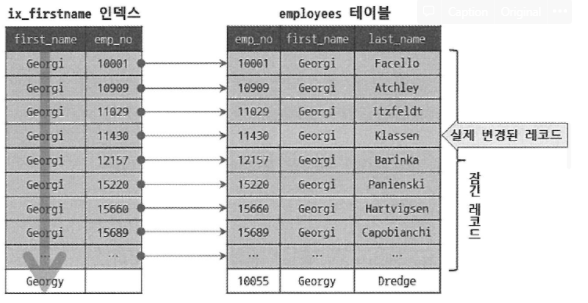
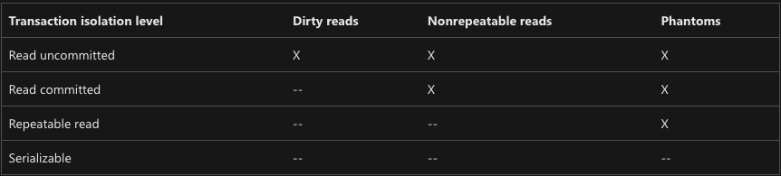
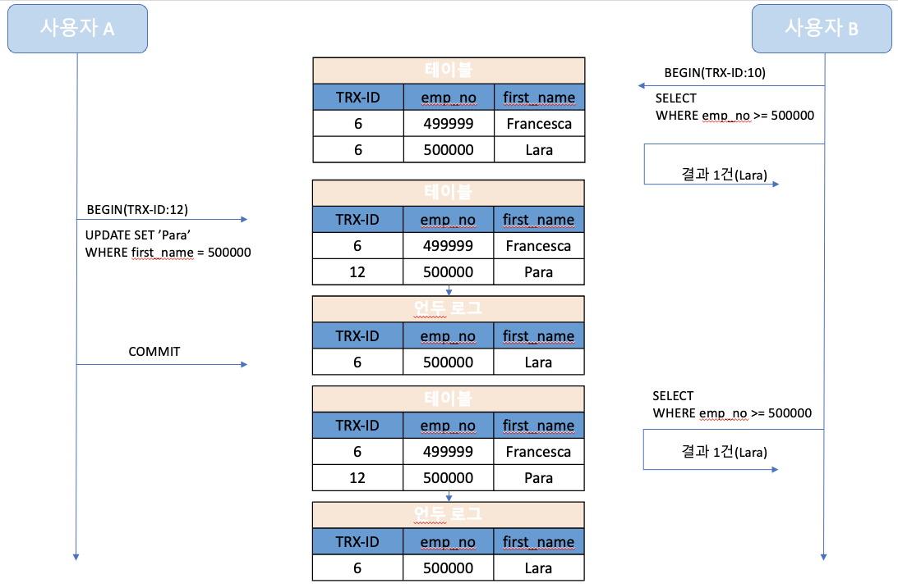

- [5.1 트랜잭션과 잠금](#51-트랜잭션과-잠금)
  - [트랜잭션](#트랜잭션)
    - [MySQL에서의 트랜잭션](#mysql에서의-트랜잭션)
- [5.2 MySQL 엔진의 잠금](#52-mysql-엔진의-잠금)
    - [글로벌 락](#글로벌-락)
    - [테이블 락](#테이블-락)
    - [네임드 락](#네임드-락)
    - [메타 데이터 락](#메타-데이터-락)
- [5.3 InnoDB 스토리지 엔진 잠금](#53-innodb-스토리지-엔진-잠금)
    - [레코드 락](#레코드-락)
    - [갭 락](#갭-락)
    - [넥스트 키 락](#넥스트-키-락)
    - [자동 증가 락](#자동-증가-락)
  - [인덱스와 잠금](#인덱스와-잠금)
  - [레코드 수준의 잠금 확인 및 해제](#레코드-수준의-잠금-확인-및-해제)
- [5.4 MySQL의 격리 수준](#54-mysql의-격리-수준)
  - [READ\_UNCOMMITTED](#read_uncommitted)
  - [READ\_COMMITTED](#read_committed)
  - [REPEATABLE\_READ](#repeatable_read)
  - [SERIALIZABLE](#serializable)
- [의문점](#의문점)

# 5.1 트랜잭션과 잠금
MySQL의 동시성에 영향을 미치는 잠금, 트랜잭션, 트랜잭션의 격리 수준에 대한 장이다.

## 트랜잭션
MyISAM, MEMORY같은 스토리지 엔진은 트랜잭션을 지원하지 않는다. 이번 장의 내용은 InnoDB가 주가 된다.

### MySQL에서의 트랜잭션
트랜잭션은 논리적인 작업 셋 자체가 100% 적용되거나 아무것도 적용되지 않아야 함을 보장해준다.  
MySQL 스토리지 엔진 중에는 InnoDB만 트랜잭션을 지원해준다.

데이터 커넥션의 범위와 트랜잭션의 범위는 최소화해야 한다. 문제가 많은 예로 살펴보면  

```markdown
1. 처리 시작
   - 데이터베이스 커넥션 생성(또는 커넥션 풀에서 가져오기)
   - 트랜잭션 시작
2. 사용자의 로그인 여부 확인
3. 사용자의 글쓰기 내용의 오류 여부 확인
4. 첨부로 업로드된 파일 확인 및 저장
5. 사용자의 입력 내용을 DBMS에 저장
6. 첨부 파일 정보를 DBMS에 저장
7. 저장된 내용 또는 기타 정보를 DBMS에서 조회
8. 게시물 등록에 대한 알림 메일 발송
9. 알림 메일 발송 이력을 DBMS에 저장
    - 트랜잭션 종료(COMMIT)
    - 데이터베이스 커넥션 반납
10. 처리 완료
```

- 실제로 DBMS에 데이터를 저장하는 작업은 5번부터 시작된다.
   - 데이터베이스 커넥션은 개수가 제한적이라 각 단위 프로그램의 커넥션 소유 시간이 길어질수록 여유 커넥션이 줄어든다.
- 8번 메일 전송, FTP파일 전송, 원격통신 등은 트랜잭션 내에서 제거해야 한다.
  - 메일 서버와 통신할 수 없다면 웹 서버뿐 아니라 DBMS 서버까지 위험해진다.
- 하나의 트랜잭션으로 묶을 필요가 없다.
  - 5, 6번은 하나의 트랜잭션으로 묶어야 한다.
  - 7번은 데이터의 단순 확인 및 조회로 트랜잭션에 포함하지 않아도 된다.
  - 9번은 성격이 다르기 때문에 별도의 트랜잭션으로 분리하는 것이 좋다.

```markdown
1. 처리 시작
2. 사용자의 로그인 여부 확인
3. 사용자의 글쓰기 내용의 오류 여부 확인
4. 첨부로 업로드된 파일 확인 및 저장
   - 데이터베이스 커넥션 생성(또는 커넥션 풀에서 가져오기)
   - 트랜잭션 시작
5. 사용자의 입력 내용을 DBMS에 저장
6. 첨부 파일 정보를 DBMS에 저장
    - 트랜잭션 종료(COMMIT)
7. 저장된 내용 또는 기타 정보를 DBMS에서 조회
8. 게시물 등록에 대한 알림 메일 발송
   - 트랜잭션 시작
9. 알림 메일 발송 이력을 DBMS에 저장
    - 트랜잭션 종료(COMMIT)
    - 데이터베이스 커넥션 반납(또는 커넥션 풀에 반납)
10. 처리 완료
```

이렇게 하면 DBMS의 부하를 낮출 수 있다.


# 5.2 MySQL 엔진의 잠금
MySQL의 잠금은 스토리지 엔진 레벨과 MySQL 엔진 레벨로 나뉜다.

MySQL 엔진에서는
- 글로벌 락
- 테이블 락: 테이블 데이터 동기화를 위한 락
- 메타데이터 락: 테이블의 구조를 잠그는 락
- 네임드 락: 사용자의 필요에 맞게 사용할 수 있는 락

등의 락들이 있고 하나씩 이야기해보자.

### 글로벌 락
- MySQL에서 제공하는 락 가운데 가장 범위가 크다.
- FLUSH TABLES WITH READ LOCK 명령으로 획득할 수 있다.
- SELECT를 제외한 DDL, DML 문장의 실행은 MySQL 서버 전체에서 락이 해제될때까지 대기 상태로 남는다.


```
FLUSH TABLES WITH READ LOCK이 실행되기 전에 테이블이나 레코드에 쓰기 잠금이 실행됐다면
해당 테이블의 읽기 잠금을 걸기 위해 먼저 실행된 SQL과 트랜잭션이 완료될 때까지 기다려야 한다.
장시간 실행되는 쿼리와 FLUSH TABLES WITH READ LOCK이 최악의 케이스로 실행되면 MySQL 서버의
모든 테이블에 대한 INSERT, UPDATE, DELETE 쿼리의 실행이 오랫동안 실행되지 못할수도 있다.
따라서, 가급적 사용하지 않는 것이 좋다.
```

하지만 8.0부터는 InnoDB가 기본 스토리지 엔진으로 채택됐고 InnoDB는 트랜잭션을 지원하기 때문에 일관된  
데이터 상태를 위해 모든 데이터 변경 작업을 멈출 필요가 없어졌기에 조금 더 가벼운 글로벌 락 Xtrabackup이나 Enterprise Backup같은 백업 툴들의 안정적인 실행을 위해 백업 락이 도입됐다.

```
LOCK INSTANCE FOR BACKUP;
-- 백업
UNLOCK INSTANCE;
```

특정 세션에서 백업 락을 획득하면 모든 세션에서 테이블의 스키나마 사용자의 인증 관련 정보를 변경할 수 없다.
- 데이터베이스 및 테이블 등 모든 객체 생성 및 변경, 삭제
- REPAIR TABLE과 OPTIMIZE TABLE 명령
- 사용자 관리 및 비밀번호 변경

백업 락은 일반적인 테이블의 데이터 변경은 허용된다. 
MySQL 서버 구성은 소스 서버와 레플리카 서버로 구성되는데 백업은 주로 레플리카 서버에서 실행된다. 
백업이 FLUSH TABLES WITH READ LOCK 명령을 통해 글로벌 락을 획득하면 복제는 백업 시간만큼 지연될 수밖에 없다.  
Xtrabackup이나 Enterprise Backup 툴들은 복제 진행 상태에서도 일관된 백업을 만들 수 있지만 실행 도중 스키마 변경이 일어나면 백업이 실패하고 시간을 들여 다시 백업을 실행해야 한다. 이를 막기 위해 백업 락이 생겼다.

### 테이블 락
테이블 락은 개별 테이블 단위로 설정되는 잠금이며 명시적 또는 묵시적으로 특정 테이블의 락을 획득할 수 있다.

- 명시적 테이블 락
  - LOCK TABLES table_name [READ | WRITE] 명령으로 특정 테이블 락을 획득할 수 있다.
  - MyISAM, InnoDB 스토리지 엔진을 사용하는 테이블도 동일하게 설정할 수 있다.
  - UNLOCK TABLES 명령으로 잠금을 반납할 수 있다.
  - 명시적 잠금은 타 작업에 영향이 크기 때문에 사용할 필요가 없다.
- 묵시적 테이블 락
  - MyISAM이나 MEMORY 테이블에 데이터를 변경하는 쿼리를 실행하면 발생한다.
  - 쿼리가 실행되는 동안 자동으로 획득했다가 쿼리가 완료된 후 자동 해제된다.
  - InnoDB 테이블은 스토리지 엔진에서 레코드 기반의 잠금을 제공하기 때문에 묵시적 테이블 락이 설정되지 않는다.
    - DML쿼리에서는 무시되고 DDL쿼리에서만 영향을 미친다.

READ LOCK
- 락을 가지고 있는 세션이 테이블을 읽을 수 있다(하지만 쓰지는 못한다.)
- 여러 세션이 동시에 테이블에 대한 READ LOCK을 획득할 수 있다.
- 다른 세션들은 명시적으로 READ LOCK 없이 테이블을 읽을 수 있다.
- LOCK IN SHARE MODE를 통해 걸 수 있다.

WRITE LOCK
- 락을 가지고 있는 세션이 읽고 쓸 수 있다.
- 락을 가지고 있는 세션만 테이블에 접근할 수 있고 다른 세션은 접근 불가능하다.
- FOR UPDATE를 통해 걸 수 있다.


### 네임드 락
GET_LOCK() 함수를 이용해 임의의 문자열에 대한 잠금을 설정할 수 있다.  
일반적 상황은 아니고 DB서버 1대에 5대의 웹 서버가 연결되어 있고 어떤 정보를 동기화 하는 요건 등에 네임드 락을 사용하면 편리하다.  

```sql
-- // "mylock"이라는 문자열에 대한 잠금을 획득
-- // 이미 잠금을 사용중이면 2초만 대기(2초 이후 자동 잠금 해제)
SELECT GET_LOCK('mylock', 2);

-- // "mylock"이라는 문자열에 대해 잠금이 설정돼 있는지 확인
SELECT IS_FREE_LOCK('mylock');

-- // "mylock"이라는 문자열에 대해 획득했던 잠금을 반납(해제)한다.
SELECT RELEASE_LOCK('mylock');

-- // 3개 함수 모두 정상적으로 락을 획득하거나 해제한 경우에는 1, 아니면 NULL이나 0
```

배치 등으로 많은 레코드에 대해서 복잡한 요건으로 레코드를 변경하는 트랜잭션에 유용하게 사용할 수 있다. 
동일 데이터를 변경하거나 참조하는 프로그램끼리 분류해서 네임드 락을 걸고 쿼리를 실행하면 데드락을 간단히 해결 가능하다.

MySQL8.0버전부터는 네임드 락을 중첩해서 사용할 수 있으며 현재 세션의 네임드 락을 한 번에 모두 해제하는 기능도 추가됐다.
```sql
SELECT GET_LOCK('mylock_1', 10);
SELECT GET_LOCK('mylock_2', 10);

SELECT RELEASE_LOCK('mylock_2');
SELECT RELEASE_LOCK('mylock_1');

-- // 모든 락 해제
SELECT RELEASE_ALL_LOCKS();
```

[멀티 스레드 상황에서의 네임드락 사용 예제](https://techblog.woowahan.com/2631/)

### 메타 데이터 락
데이터베이스 객체의 이름이나 구조를 변경하는 경우에 획득하는 잠금이다.  
명시적 획득 또는 해제가 불가능하고 테이블의 이름을 변경하는 경우 자동으로 획득하는 잠금이다.

```sql
RENAME TABLE rank TO rank_backup, rank_new TO rank
```
다음과 같은 염령이 있으면 두 작업을 한번에 실행하면 문제없지만 2개로 나눠 실행하면 rank 테이블이 존재하지 않는 순간이 생긴다.  
이 순간 쿼리는 Table not found 'rank' 오류를 발생시킨다.

# 5.3 InnoDB 스토리지 엔진 잠금
InnoDB 스토리지 엔진은 MySQL 잠금과 별개로 스토리지 엔진 내부에서 레코드 기반의 잠금 방식을 탑재하고 있다. 이 덕분에 동시성 처리에 뛰어나다.  
하지만 이원화된 잠금 처리 때문에 InnoDB스토리지 엔진에서의 잠금 정보는 MySQL명령을 이용해 접근하기 까다롭다.  

과거에는 lock_monitor의 테이블을 생성해 InnoDB 잠금 정보를 덤프하는 방법과 SHOW ENGINE INNODB STATUS 명령이 전부였지만  
최근 버전에서는 트랜잭션과 잠금, 잠금 대기중인 트랜잭션의 목록을 조회할 수 있는 방법, Performance Schema를 이용한 스토리지 엔진 세마포어에 대한 모니터링 방법도 추가됐다.

InnoDB 스토리지 엔진은 레코드 기반의 잠금 기능을 제공해 잠금 정보의 레벨업(락 에스컬레이션)은 없다. 그 대신 레코드 락 뿐만 아니라 레코드 사이의 간격을 잠그는 갭락이 존재한다.

### 레코드 락

레코드 자체만을 잠그는 것을 레코드 락이라고 한다. InnoDB 스토리지 엔진은 레코드 자체가 아닌 인덱스의 레코드를 잠근다.

보조 인덱스를 이용한 변경 작업은 넥스트 키 락, 갭 락을 이용하지만 PK 또는 유니크 인덱스에 의한 변경 작업에서는 레코드 자체에 대해서만 락을 건다.

### 갭 락
레코드와 인접한 레코드 사이의 간격만을 잠그는 것으로 레코드와 레코드 사이의 간격에 새로운 레코드가 생성되는 것을 제어한다.  
만약 2, 3의 인덱스가 존재하고 1 이상 5 이하의 데이터를 검색한다면 1, 4, 5의 공간에 걸리는 락이 갭락이 된다.
자체보다는 넥스트 키 락의 일부로 자주 사용된다.

### 넥스트 키 락
레코드 락과 갭 락을 합쳐놓은 형태의 잠금으로 STATEMENT 포멧의 바이너리 로그를 사용하는 MySQL 서버에서는 REPEATABLE_READ격리 수준을 사용해야 한다. innodb_locks_unsafe_for_binlog 변수가 비활성돠되면 변경을 위해 검색하는 레코드에는 넥스트 키 락 방식으로 잠금이 걸린다.

InnoDB의 갭 락이나 넥스트 키 락은 바이너리 로그에 기록되는 쿼리가 레플리카 서버에서 실행될 때 소스 서버에서 만들어낸 결과와 동일한 결과를 만들어내도록 보장하는 것이 주목적이지만 넥스트 키 락과 갭 락으로 데드락이 발생하거나 다른 트랜잭션을 기다리게 하는 일이 자주 발생한다.

바이너리 로그 포멧을 ROW 형태로 바꿔서 넥스트 키 락이나 갭 락을 줄이는 것이 좋다.

**8.0에서는 ROW 형태의 바이너리 로그가 기본 설정이다**

```markdown
MySQL의 복제는 바이너리 로그에 기록된 이벤트를 소스에서 읽은 다음 복제본에서 처리하기 때문에 작동하며  
포멧은 이벤트 유형에 따라 다른 형식으로 바이너리 로그에 기록된다.  
이벤트가 소스의 바이너리 로그에 기록될 때 형태를 따라가며 3가지 형태가 있다.

- Statement: SQL 명령문 기반의 로깅 방식
- Row: 행 기반의 데이터 로깅 방식으로 개별 테이블 행이 변경되었는지를 기록한다
- Mixed: Statement와 Row의 장점을 혼합한 로깅 방식으로 명령문 기반의 로깅이 default로 사용되고 특정 상태나 스토리지 엔진에 따라 자동으로 행 기반으로 전환된다.

```

### 자동 증가 락
AUTO_INCREMENT 칼럼 속성을 위해 InnoDB 엔진은 AUTO_INCREMENT락이라는 테이블 수준의 잠금을 사용한다.
- INSERT, REPLACE에서만 걸린다.
- 테이블에 단 하나만 존재하기 때문에 INSERT 동시 실행의 경우 나머지 쿼리는 기다리게 된다.
- MySQL5.1 이상부터는 innodb_autoinc_lock_mode 시스템 변수를 이용해 자동 증가 락의 작동 방식을 변경할 수 있다. 8.0에서는 2가 기본이다.
  - innodb_autoinc_lock_mode=0
    - MySQL 5.0과 동일한 잠금 방식으로 모든 INSERT 문장은 자동 증가 락을 사용한다.
  - innodb_autoinc_lock_mode=1
    - 단순히 한건 또는 여러 건의 레코드를 INSERT하는 SQL 중에 INSERT되는 레코드 건수를 정확히 예측할 수 있을 때 자동증가락을 사용하지 않고 경량화된 래치(뮤텍스)를 이용해 처리한다.
    - INSERT ... SELECT 같은 MySQL 서버가 건수를 예측할 수 없을 때는 자동 증가 락을 사용한다.
    - 대량 INSERT 시에는 여러 개의 자동 증가 값을 한번에 할당받는데 남아서 사용하지 못하게 되면 폐기하므로 대량 INSERT 이후의 INSERT레코드는 연속되지 않고 누락될 수 있다. 최소한 하나의 INSERT 문에서는 연속됨을 보장하며 연속모드(Consecutive mode)라고도 한다.
  - innodb_autoinc_lock_mode=2
    - InnoDB 스토리지 엔진이 절대 자동 증가 락을 걸지 않고 경량화된 뮤텍스를 사용한다.
    - 하나의 INSERT라도 연속된 값을 보장하지 않는다. 인터리빙(Interleaved mode)라고도 한다.
    - INSERT ... SELECT의 대량 INSERT에서도 다른 커넥션에서 INSERT를 사용할 수 있어 동시 처리 성능이 높다.
    - 유니크한 값만 보장한다. STATEMENT포멧의 바이너리 로그 사용시에는 키 값이 달라질 수도 있다.


## 인덱스와 잠금
InnoDB 잠금은 레코드 잠금이 아니라 인덱스를 잠그는 방식으로 처리된다.

```sql
SELECT COUNT(*) FROM employees WHERE first_name='Georgi';
253

SELECT COUNT(*) FROM employees WHERE first_name='Georgi' AND last_name='Klassen';
1
```
다음과 같은 상황에 KEY가 ix_firstname라는 인덱스가 준비돼 있다면

```sql
UPDATE employees SET hire_date=NOW() WHERE='Georgi' AND last_name='Klassen';
```
해당 쿼리에서 253건의 레코드가 모두 잠기게 된다.  



만약 인덱스가 없다면 테이블을 풀스캔 하면서 UPDATE작업을 하기 때문에 이 과정에서 모든 레코드를 잠그게 된다. 따라서, 인덱스 설계가 중요하다.

## 레코드 수준의 잠금 확인 및 해제
InnoDB 스토리지 엔진을 사용하는 테이블의 레코드 수준 잠금은 테이블 수준의 잠금보다 복잡하다. 해당 레코드가 자주 사용되지 않는다면 오랜 시간 잠겨져 있어도 잘 발견되지 않는다.

- 5.1 버전부터는 `information_schema`라는 DB에 INNODB_TRX라는 테이블과 INNODB_LOCKS, INNODB_LOCK_WAITS라는 테이블을 통해 확인이 가능했다.
- 8.0 버전부터는 Performance_schema의 data_locks와 data_lock_waits테이블로 대체되고 있다.

# 5.4 MySQL의 격리 수준
트랜잭션의 격리 수준이란 여러 트랜잭션이 동시에 처리될 때 특정 트랜잭션이 다른 트랜잭션에서 변경하거나 조회하는 데이터를 볼 수 있게 허용할지 여부를 결정하는 것이다.  
READ_UNCOMMITTED는 DIRTY READ라고도 하며 일반적으로 잘 사용하지 않으며 SERIALIZABLE 또한 동시성이 중요한 데이터베이스에서는 거의 사용하지 않는다.  
Oracle에서는 READ_COMMITTED, MySQL에서는 REPEATABLE_READ를 주로 사용한다.



## READ_UNCOMMITTED
트랜잭션에서의 변경 내용이 COMMIT이나 ROLLBACK 여부에 상관없이 다른 트랜잭션에서 보인다. 만약 롤백해도 다른 사용자는 롤백 전의 내용을 가져가게 된다.

트랜잭션에서 처리한 작업이 완료되지 않았는데 다른 트랜잭션에서 볼 수 있는 현상을 `더티리드`라고 한다. 정합성에 문제가 많기 때문에 최소한 READ_COMMITTED 사용을 권장한다.

## READ_COMMITTED
오라클 DBMS에서 기본으로 사용되는 격리 수준으로 온라인 서비스에서 가장 많이 선택되는 격리 수준이다.

어떤 트랜잭션에서 데이터를 변경했더라도 COMMIT이 완료된 데이터만 조회 가능하다.  
사용자 A가 데이터를 변경하고 커밋을 하지 않았다면 사용자 B가 같은 내용을 조회했을 때 테이블이 안니 언두 영역에 백업된 데이터를 가져온다.

READ_COMMITTED 격리 수준에서도 REPEATABLE_READ가 불가능하다 라는 부정합의 문제가 있다.

사용자 B가 하나의 트랜잭션 내에서 같은 SELECT문을 2번 쐈을 때 첫 번째와 두 번째 실행 사이에 사용자 A가 데이터를 변경하면 하나의 트랜잭션 내에서 같은 SELECT 쿼리를 실행했을 때는 항상 같은 결과를 가져와야 한다는 REPEATABLE_READ 정합성에 어긋난다.

## REPEATABLE_READ
MySQL의 InnoDB 스토리지 엔진에서 기본으로 사용되는 격리 수준으로 바이너리 로그를 가진 MySQL 서버에서는 최소 REPEATABLE_READ를 사용해야 한다.
READ_COMMITTED와 REPEATABLE_READ의 차이는 언두 영역에 백업된 레코드의 여러 버전 가운데 몇 번째 이전 버전까지 찾아 들어가야 하느냐에 있다.

모든 InnoDB 트랜잭션은 고유한 트랜잭션 번호를 가지며 언두 영역의 데이터 중 삭제 가능한 영역은 실행 중인 트랜잭션 가운데 가장 오래된 트랜잭션 번호보다 뒷번호다.

  

위의 그림과 같이 사용자 B의 트랜잭션이 끝나지 않은 상태에서 데이터 변경이 일어나도 UNDO 로그를 이용해 본인의 트랜잭션 ID보다 이전의 데이터를 가져오게 된다. 이로써 일반적인 상황에서는 펜텀리드가 일어나지 않는다.

REPEATABLE_READ에서도 부정합이 발생할 수 있다....

## SERIALIZABLE
가장 단순한 격리 수준이면서 동시에 가장 엄격한 격리 수준이다. 동시 처리 성능도 많이 떨어진다.
읽기 작업도 읽기 잠금을 획득해야 하며 다른 트랜잭션들이 레코드를 변경하지 못하게 된다.

InnoDB 스토리지 엔진에서는 갭 락과 넥스트 키 락 덕분에 REPEATABLE_READ에서도 PHANTOM READ가 발생하지 않기 때문에 SERIALIZABLE을 사용할 이유가 없다.

# 의문점
- 왜 STATEMENT포멧의 바이너리 로그를 사용하는 MySQL 서버에서는 REPEATABLE_READ를 사용해야될까?
  - STATEMENT는 실행된 SQL를 저장하기 때문에
  - 정합성이 깨지게 되면 레플리카에서의 데이터가 바뀌게 된다.
  - 데이터의 정합성을 위해?

출처:  
[Real MySQL8.0](https://www.aladin.co.kr/shop/wproduct.aspx?ItemId=278488709&start=slayer)  
MySQL docs  