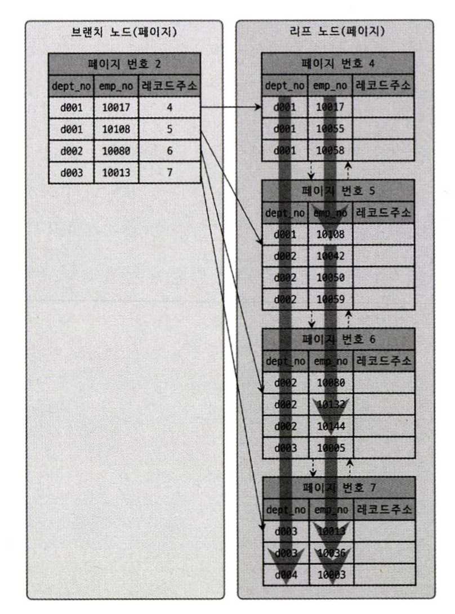

- [8.1 디스크 읽기 방식](#81-디스크-읽기-방식)
- [8.2 인덱스란?](#82-인덱스란)
- [8.3 B-Tree 인덱스(Balanced-Tree)](#83-b-tree-인덱스balanced-tree)
  - [구조 및 특성](#구조-및-특성)
  - [B-Tree 인덱스 키 추가 및 삭제](#b-tree-인덱스-키-추가-및-삭제)
    - [인덱스 키 추가](#인덱스-키-추가)
    - [인덱스 키 삭제](#인덱스-키-삭제)
    - [인덱스 키 변경](#인덱스-키-변경)
    - [인덱스 키 검색](#인덱스-키-검색)
  - [B-Tree 인덱스 사용에 영향을 미치는 요소](#b-tree-인덱스-사용에-영향을-미치는-요소)
    - [인덱스 키 값의 크기](#인덱스-키-값의-크기)
    - [B-Tree 깊이](#b-tree-깊이)
    - [선택도(기수성)](#선택도기수성)
    - [읽어야 하는 레코드의 건수](#읽어야-하는-레코드의-건수)
  - [B-Tree 인덱스를 통한 데이터 읽기](#b-tree-인덱스를-통한-데이터-읽기)
    - [인덱스 레인지 스캔](#인덱스-레인지-스캔)
    - [인덱스 풀 스캔](#인덱스-풀-스캔)
    - [루스 인덱스 스캔](#루스-인덱스-스캔)
    - [인덱스 스킵 스캔](#인덱스-스킵-스캔)
  - [다중 칼럼 인덱스](#다중-칼럼-인덱스)
  - [B-Tree 인덱스의 정렬 및 스캔 방향](#b-tree-인덱스의-정렬-및-스캔-방향)
    - [인덱스의 정렬](#인덱스의-정렬)
      - [인덱스 스캔 방향](#인덱스-스캔-방향)
      - [내림차순 인덱스](#내림차순-인덱스)
  - [B-Tree 인덱스의 가용성과 효율성](#b-tree-인덱스의-가용성과-효율성)
    - [비교 조건의 종류와 효율성](#비교-조건의-종류와-효율성)
    - [인덱스의 가용성](#인덱스의-가용성)
    - [가용성과 효율성 판단](#가용성과-효율성-판단)

# 8.1 디스크 읽기 방식
MySQL에서 사용 가능한 인덱스의 종류 및 특성에 대한 장이다.

데이터베이스 성능 튜닝은 어떻게 디스크 IO를 줄이느냐가 관건일 때가 많다. 요즘은 DBMS용으로 사용할 서버에서 대부분 SSD를 채택하고 있다. 순차 IO에서는 속도가 비슷할 수 있지만 랜덤 IO에서는 SSD가 압도적으로 빠르다.

쿼리를 튜닝해서 랜덤IO를 순차IO로 바꿔 실행할 방법은 많지 않아서 랜덤IO 자체를 줄여주는 것이 쿼리 튜닝의 목적이다.

# 8.2 인덱스란?
인덱스 - 책의 마지막에 찾아보기
데이터 파일 - 책의 내용
데이터 파일에 저장된 레코드의 주소 - 페이지 번호

DBMS에서 인덱스는 데이터가 저장될 때마다 정렬해야 하므로 데이터의 저장 성능을 희생하고 데이터의 읽기 속도를 높이는 기능이다.

인덱스는 역할별로 프라이머리키와 보조키(세컨더리 인덱스)로 구분할 수 있다.

- 프라이머리키: NULL을 허용하지 않으며 중복을 허용하지 않는 레코드를 식별할 수 있는 식별자
- 세컨더리인덱스: 프라이머리키를 제외한 모든 인덱스

알고리즘별 분류

- B-Tree: 가장 일반적으로 사용되는 인덱스 알고리즘, 칼럼의 값을 변형하지 않고 원래의 값을 인덱싱하는 알고리즘 R-Tree는 B-Tree의 응용 알고리즘이다.
- Hash: 칼럼의 값으로 해시값을 계산해서 인덱싱하는 알고리즘으로 빠른 검색을 지원하지만 값을 변형해서 인덱싱하므로 값의 일부만 검색하거나 범위 검색에서는 이용할 수 없으며 메모리 기반의 데이터베이스에서 많이 사용한다.

# 8.3 B-Tree 인덱스(Balanced-Tree)
가장 일반적 알고리즘으로 일반적으로 DBMS에서는 B+-Tree 혹은 B-Tree가 사용된다.  

## 구조 및 특성
B-Tree는 최상위 하나의 `루트 노드`, 그 하위의 `브랜치 노드`  가장 하위 노드를 `리프 노드`라고 한다.  
데이터베이스에서 인덱스와 실제 데이터가 저장된 데이터는 따로 관리되는데 리프노드는 항상 실제 데이터 레코드의 주솟값을 가지고 있다.

  

InnoDB 테이블은 프라이머리 키가 물리적 주솟값 역할을 하고 세컨더리 인덱스가 프라이머리 키를 주소처럼 사용하기 때문에 논리적인 주소를 가진다고 볼 수 있다.  

## B-Tree 인덱스 키 추가 및 삭제
테이블의 레코드를 저장하거나 변경하는 경우 인덱스 키 추가나 삭제 작업이 발생한다.

### 인덱스 키 추가
새로운 키 값이 B-Tree에 저장되려면 B-Tree의 적절한 위치를 검색해 리프노드가 꽉 차면 리프노드가 분리되고 이는 상위 브랜치 노드까지 범위가 넓어진다.

테이블에 레코드를 추가하는 작업 비용을 1이라고 하면 인덱스에 키를 추가하는 작업 비용은 1.5정도로 예측된다. 인덱스가 3개인 테이블이라면 1 만큼의 저장에 (1.5 * 3 + 1)5.5의 비용이 예측된다.

InnoDB엔진은 인덱스 키 추가 작업을 지연시켜 나중에 처리할 수 있지만 프라이머리키나 유니크 인덱스는 중복 체크를 위해 즉시 처리한다.

### 인덱스 키 삭제
B-Tree의 삭제는 해당 키 값이 저장된 B-Tree의 리프 노드를 찾아서 삭제 마크만 하면 작업이 완료된다. 이것도 5.5버전 이상에서는 버퍼링되어 지연 처리될 수 있다.

### 인덱스 키 변경
B-Tree의 키 값 변경은 키 값을 삭제한 후 다시 새로운 값을 추가하는 형태로 처리되며 체인지 버퍼를 이용해 지연처리될 수 있다.

### 인덱스 키 검색
인덱스 검색은 B-Tree의 루트 노드부터 브랜치를 거쳐 리프까지 이동하면서 비교 작업을 수행하는데 이 작업을 `트리 탐색`이라 하며 UPDATE나 DELETE를 위한 선행검색에도 사용된다.

B-Tree 인덱스 검색은 100% 일치 또는 값의 앞부분만 일치하는 경우, 부등호 등을 사용할 수 있지만 뒷부분만 검색하는 용도로는 사용할 수 없다.  
인덱스 키 값 변경이 가해진 후 비교되는 경우에도 빠른 검색 기능을 사용할 수 없다.

## B-Tree 인덱스 사용에 영향을 미치는 요소
인덱스는 
- 인덱스를 구성하는 칼럼의 크기와 레코드 건수
- 유니크한 인데스 키 값의 개수

등에 의해 검색이나 변경 작업의 성능이 영향을 받는다.

### 인덱스 키 값의 크기
스토리지 엔진은 디스크에 데이터를 저장하는 기본 단위를 페이지 또는 블록이라하고 모든 읽기 및 쓰기 작업의 최소 작업 단위가 되고, 버퍼링의 기본 단위이기도 하다.

페이지 사이즈는 `innodb_page_size` 변수를 이용해 4 ~ 64KB 사이의 값 설정이 가능하다. 기본은 16KB다.

자식 노드 주소는 복합적인 정보가 담긴 영역으로 6byte ~ 12byte의 다양한 값을 갖는다.

그럼 하나의 인덱스 페이지에  
16 * 1024 / (16 + 12) = 585의 키 값이 저장 가능하다. 키 값이 32바이트라고 가정하면 372개의 키 값 저장이 가능해진다.

인덱스의 키 값이 커지면 디스크로부터 읽어야 하는 횟수가 느려지고 메모리에 캐시해둘 수 있는 레코드 수가 줄어들어 메모리 효율이 떨어지게 된다.

### B-Tree 깊이
B-Tree의 깊이가 3인 경우 585 * 585 * 585 = 2억 정도의 키 값이 담긴다. 키 값이 32byte라면 372 * 372 * 372 = 5천만개의 키 값 저장이 가능하므로 사이즈가 작을수록 깊이가 얕아진다. 물론 depth는 보통 5를 넘지 않는다.

### 선택도(기수성)
선택도와 기수성은 거의 같은 의미로 모든 인덱스 키 값 가운데 유니크한 값의 수를 의미한다. 인덱스는 선택도가 높을수록 빠르게 처리된다.

레코드 건수가 1만건이고 인덱스 칼럼의 유니크 갯수가 각각 10개, 1000개인 A, B의 사례로 보면 A는 선택도가 1000, B는 10이 되기 때문에 A의 인덱스는 비효율적이다.

```sql
SELECT *
FROM tb_test
WHERE country='KOREA' AND city='SEOUL';
```

A: country 컬럼의 유니크 값이 10개일 때
B: country 컬럼의 유니크 값이 1000개일 때

A는 검색시 1000개의 결과가 나오고 AND 이후의 연산에서 1건만 검색해 999건의 불필요한 읽기가 발생했고  
B는 검색시 10개의 결과가 나오고 1건만 검색해 9건의 불필요한 읽기가 나왔기 때문에 효율성에서 차이가 난다.

### 읽어야 하는 레코드의 건수
인덱스를 통해 레코드 1 건을 읽는 것이 직접 레코드 1 건을 읽는 것보다 4~5배 정도 비용이 더 많이 드는 것으로 옵티마이저는 예측하기 때문에 읽어야 할 레코드의 건수가 전체 테이블 레코드의 20 ~ 25를 넘어서면 인덱스보다 직접 필터링 방식을 하는 것이 효율적이다.

## B-Tree 인덱스를 통한 데이터 읽기
인덱스를 이용하는 세 가지 방법을 살펴보자.

### 인덱스 레인지 스캔
가장 대표적 방법으로 나머지 접근 방식보다는 빠른 방법이다.
인덱스를 통해 한 건만 읽는 경우와 한 건 이상을 읽는 경우의 이름은 구분되지만 이번 절에서는 동일하게 인덱스 레인지 스캔으로 표현한다.

```sql
SELECT * FROM employees WHERE first_name BETWEEN 'Ebbe' AND 'Gad';
```
인덱스 레인지 스캔은 검색해야 할 인덱스의 범위가 결정됐을 때 사용하는 방식으로 


스캔하다가 리프 노드의 끝까지 읽으면 리프 노드 간의 링크를 이용해 다음 리프노드를 찾아 스캔한다.

인덱스의 레코드를 스캔하면서 실제 데이터 파일의 레코드를 읽어와야 하는 경우도 발생하는데 이 경우 인덱스를 구성하는 칼럼의 정순 또는 역순으로 정렬된 상태로 레코드를 가져온다.


인덱스의 검색 조건에 일치하는 건들은 리프 노드의 레코드 주소로 데이터 파일을 읽어오는데 한건 단위마다 랜덤IO가 일어난다. 인덱스를 통한 레코드 스캔은 4~5배 시간이 든다고 했기 때문에 읽어야 할 레코드가 20~25%를 넘어가면 직접 읽는 것이 더 효율적인 방식이다.

인덱스 레인지 스캔의 순서는 다음과 같다.
1. 인덱스에서 조건을 만족하는 값이 저장된 위치를 찾는다(인덱스 탐색)
2. 1번에서 탐색된 위치부터 필요한만큼 인덱스를 차례대로 읽는다.
3. 2번에서 읽어 들인 인덱스 키와 레코드 주소를 이용해 레코드가 저장된 페이지를 가져오고, 최종 레코드를 읽어온다.

만약 쿼리가 필요한 데이터가 인덱스에 있다면 이를 커버링 인덱스라고 하고 성능이 빨라진다.

MySQL 서버는 1번과 2번 단계의 작업 수행 객수를 확인할 수 있는 상태값을 제공한다.

```sql
SHOW STATUS LIKE 'Handler_%'
```
- Handler_read_first: 1번의 실행 횟수
- Handler_read_last: 마지막 레코드를 읽은 횟수
- Handler_read_key: 첫번째 레코드를 읽은 횟수
- Handler_read_next: 2번 단계로 읽은 레코드 건수
- Handler_read_prev: 2번 단계로 읽은 레코드 건수

### 인덱스 풀 스캔
인덱스의 처음부터 끝까지 모두 읽는 방식을 인덱스 풀 스캔이라고 한다.  
쿼리의 조건절에 사용된 컬럼이 인덱스의 첫 번째 컬럼이 아닌경우 이 방식을 사용한다.

쿼리가 인덱스에 명시된 컬럼만으로 조건을 처리할 수 있는경우 이 방식이 사용된다.


### 루스 인덱스 스캔
오라클의 인덱스 스킵 스캔과 작동 방식이 비슷한 스캔으로 8.0부터 최적화를 지원하기 시작했다.  

앞의 두 스캔은 타이트 스캔, 해당 스캔은 상반된 의미에서 듬성듬성 인덱스를 읽는 것을 의미한다.

인덱스 레인지 스캔과 비슷하지만 중간에 필요하지 않는 인덱스 키 값은 무시하고 넘어가는 형태로 처리한다.

```sql
SELECT dept_no, MIN(emp_no)
FROM dept_emp
WHERE dept_no BETWEEN 'd002' AND 'd004'
GROUP BY dept_no;
```
위의 쿼리에서 검색 조건에 들어있는 dept_emp 테이블은 (dept_no, emp_no) 조합으로 정렬이 돼 있어서 dept 그룹별로 첫 번째 레코드의 emp_no 값만 읽으면 된다. 따라서 필요한 값만 읽을 수 있따.

### 인덱스 스킵 스캔
DBMS에서 인덱스의 핵심은 값이 정렬돼 있다는 것이며 인덱스를 구성하는 칼럼의 순서가 중요하다.

```sql
ALTER TABLE employees
  ADD INDEX ix_gender_birthdate(gender, birth_date);
```
다음과 같은 인덱스를 가진 테이블이 있을 때 인덱스를 사용하려면 WHERE 조건절에 gender 칼럼의 비교조건이 필수다.

```sql
SELECT * FROM employees WHERE gender='M' AND birth_date>='1965-02-01';
```
8.0 부터 옵티마이저가 gender 컬럼을 뛰어넘어 birth_date컬럼만으로 인덱스 검색이 가능하게 해주는 인덱스 스킵 스캔 최적화 기능이 도입됐다.

루스 인덱스 스캔이 GROUP BY 작업을 수행하기 위해 인덱스를 사용하는 경우에만 적용 가능한 반면 인덱스 스킵 스캔은 WHERE 조건절의 검색을 위해 사용 가능하도록 용도가 넓어졌다.

MySQL 옵티마이저는 gender 컬럼에서 유니크한 값을 모두 조회해서 주어진 쿼리에 gender 칼럼의 조건을 추가해서 쿼리를 다시 실행하는 형태로 처리한다.

인덱스 스킵 스캔은
- WHERE 조건절에 조건이 없는 인덱스의 선행 컬럼의 유니크한 값의 개수가 적어야 함
- 쿼리가 인덱스에 존재하는 칼럼만으로 처리 가능해야 함

이라는 단점이 있다.

## 다중 칼럼 인덱스
실제 서비스용 DB에서는 2개 이상의 컬럼을 포함하는 인덱스가 더 많이 사용되는데 이를 다중 칼럼 인덱스라고 하며 Concatenated Index라고도 한다.



인덱스 내에서 각 칼럼의 위치가 상당히 중요하다. 다음 순서의 인덱스 컬럼은 이전의 컬럼에 의해 정렬된 후 정렬된다.

## B-Tree 인덱스의 정렬 및 스캔 방향
인덱스를 생성할 때 정렬 규칙에 따라 인덱스의 키 값은 오름차순이나 내림차순으로 정렬되며 어느 방향으로 읽을지는 옵티마이저가 실시간으로 만들어내는 실행 계획에 따라 결정된다.

### 인덱스의 정렬
상용 DBMS에서는 인덱스를 생성하는 시점에 인덱스의 각 컬럼의 정렬을 설정할 수 있다. 5.7버전까지는 컬럼단위로 설정이 불가능해 숫자 컬럼에 -1을 곱하는 우회 방법을 사용했지만 8.0부터는 다음과 같이 설정 가능해졌다.

```sql
CREATE INDEX ix_teamname_userscore ON employees (team_name ASC, user_score DESC);
```

#### 인덱스 스캔 방향
옵티마이저는 ORDER BY 값에 따라 인덱스를 위에서부터 읽을지 아래서부터 읽을지 실행 계획을 만들어내 추가적 ordering을 방지한다.

#### 내림차순 인덱스
내림차순, 오름차순과 관계없이 인덱스를 읽는 순서만 변경하면 속도가 똑같을 것 같지만 InnoDB에서 인덱스 역순 스캔이 정순 스캔에 비해 느리다. 그 이유는

- 페이지 잠금이 인덱스 정순 스캔에 적합한 구조
- 페이지 내에서 인덱스 레코드가 단방향으로만 연결된 구조


결국 쿼리에서 자주 사용되는 정렬 순서대로 인덱스를 생성하는 것이 잠금 병목 현상 완화에 도움이 될 것이다.

## B-Tree 인덱스의 가용성과 효율성
WHERE, GROUP BY, ORDER BY 절이 어떤 경우에 인덱스를 사용할 수 있고 어떤 방식으로 사용할 수 있는지 식별할 수 있어야 한다. 그래야 쿼리의 조건을 최적화하거나 쿼리에 맞게 인덱스를 최적화할 수 있다.

### 비교 조건의 종류와 효율성
다중 칼럼 인덱스에서 각 칼럼의 순서와 칼럼에 사용된 조건이 동등비교인지, 범위조건인지에 따라 인덱스 칼럼의 활용 형태와 효율이 달라진다.

```sql
SELECT * FROM dept_emp
WHERE dept_no='d002' AND emp_no >= 10114;
```
A: INDEX(dept_no, emp_no)
B: INDEX(emp_no, dept_no)

A는 dept_no=d002 AND emp_no>=10144인 레코드를 찾고 인덱스를 쭉 읽기만 하면 된다.

B는 emp_no>=10144 AND dept_no=d002인 레코드를 찾고 모든 레코드에 대해 dept_no가 d002인지 비교하는 과정을 거쳐야 한다. 이를 필터링이라고 한다.

A에서 2번째 칼럼 emp_no은 비교 작업의 범위를 좁히는데 도움을 주지만 B는 조건 확인만 하고 범위를 좁혀주진 못한다.

A는 작업 범위 결정 조건이라고 하고 B는 필터링 조건 또는 체크 조건이라고 한다.

체크 조건은 쿼리 실행을 더 느리게 만들 때가 많다.

### 인덱스의 가용성
B-Tree 인덱스의 특징은 왼쪽 값에 기준에서 오른쪽 값이 정렬돼 있다는 것으로 다중 칼럼 인덱스의 칼럼에 대해서도 함께 적용된다.

A: INDEX(first_name)
B: INDEX(dept_no, emp_no)

하나의 칼럼으로 검색해도 값의 왼쪽 부분이 없으면 인덱스 레인지 스캔 방식의 검색이 불가능하고 다중 칼럼 인덱스에서도 왼쪽 칼럼의 값을 모르면 인덱스 레인지 스캔을 사용할 수 없다.

그 예로 다음과 같은 케이스들이 있다.

A: SELECT * FROM employees WHERE first_name LIKE '%mer';
B: SELECT * FROM dept_emp WHERE emp_no>=10144;

### 가용성과 효율성 판단
B-Tree 인덱스의 특성상 다음 조건에서는 작업 범위 결정 조건으로 사용할 수 없다.

- NOT-EQUAL로 비교된 경우(<>, NOT IN, NOT BETWEEN, IS NOT NULL)
- LIKE '%??'(뒷부분 일치)
- 스토어드 함수나 다른 연산자로 인덱스 칼럼이 변형된 후 비교된 경우
  - WHERE SUBSTRING(column, 1, 1) = 'X'
  - WHERE DAYOFMONTH(column) = 1
- NOT-DETERMINISTIC 속성의 스토어드 함수가 비교 조건에 사용된 경우
  - WHERE column = deterministic_function()
- 데이터 타입이 서로 다른 비교
- 문자열 데이터 타입의 콜레이션이 다른경우
  - WHERE utf8_bin_char_column = euckr_bin_char_column


MySQL에서는 NULL도 인덱스에 저장된다. 따라서 다음과 같은 WHERE 조건도 작업 범위 결정 조건으로 인덱스를 사용한다.
```sql
WHERE column IS NULL;
```

다중 칼럼으로 만들어진 인덱스의 조건들에 대해 알아보면  
다음과 같은 인덱스가 있을 때
```sql
INDEX ix_test(column_1, column_2, column_3...)
```

- 작업 범위 결정 조건으로 인덱스를 사용하지 못하는 경우
  - column_1 칼럼에 대한 조건이 없는 경우
  - column_1 칼럼의 비교 조건이 위의 인덱스 사용 불가 조건 중 하나인 경우
- 작업 범위 결정 조건으로 인덱스를 사용하는 경우(2 < i < n)
  - column_1 ~ column_(i - 1) 칼럼까지 동등 비교하는 형태
  - column_i 칼럼에 대해 다음 연산자 중 하나로 비교
    - 동등 비교(=, IN)
    - 크다 작다 형태
    - LIKE 좌측 일치 패턴


