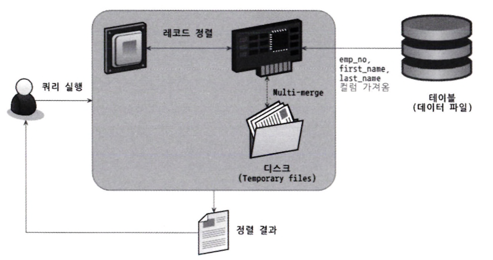
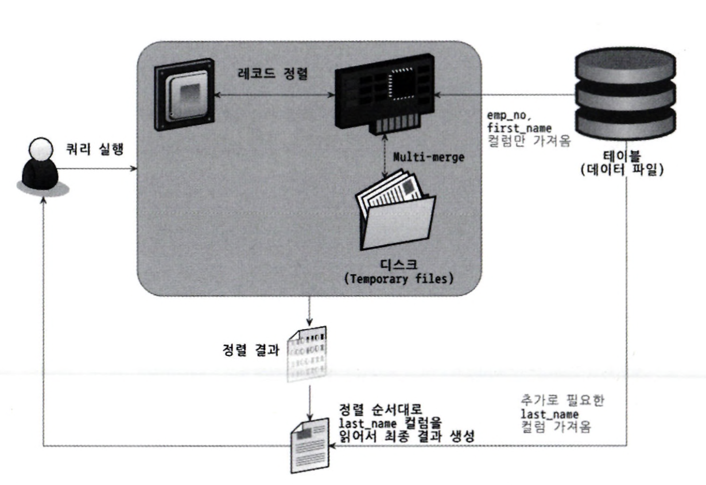

- [9.1 개요](#91-개요)
  - [쿼리 실행 절차](#쿼리-실행-절차)
  - [옵티마이저의 종류](#옵티마이저의-종류)
- [9.2 기본 데이터 처리](#92-기본-데이터-처리)
  - [풀 테이블 스캔과 풀 인덱스 스캔](#풀-테이블-스캔과-풀-인덱스-스캔)
  - [병렬 처리](#병렬-처리)
  - [ORDER BY 처리](#order-by-처리)
    - [소트 버퍼](#소트-버퍼)
    - [정렬 알고리즘](#정렬-알고리즘)
      - [싱글 패스 정렬 방식](#싱글-패스-정렬-방식)
      - [투 패스 정렬 방식](#투-패스-정렬-방식)
      - [정렬 처리 방법](#정렬-처리-방법)
      - [쿼리 처리 방법](#쿼리-처리-방법)
      - [정렬 관련 상태 변수](#정렬-관련-상태-변수)
  - [GROUP BY 처리](#group-by-처리)
  - [DISTINCT 처리](#distinct-처리)
    - [SELECT DISTINCT](#select-distinct)
    - [집합 함수와 함께 사용된 DISTINCT](#집합-함수와-함께-사용된-distinct)
  - [내부 임시 테이블 활용](#내부-임시-테이블-활용)
    - [메모리 임시 테이블과 디스크 임시 테이블](#메모리-임시-테이블과-디스크-임시-테이블)
      - [임시 테이블이 필요한 쿼리](#임시-테이블이-필요한-쿼리)
      - [임시 테이블이 디스크에 생성되는 경우](#임시-테이블이-디스크에-생성되는-경우)
- [9.3 고급 최적화](#93-고급-최적화)
  - [옵티마이저 스위치 옵션](#옵티마이저-스위치-옵션)
    - [MRR과 배치 키 액세스(mrr \& batched\_key\_access)](#mrr과-배치-키-액세스mrr--batched_key_access)
    - [블록 네스티드 루프 조인](#블록-네스티드-루프-조인)
    - [인덱스 컨디션 푸시 다운](#인덱스-컨디션-푸시-다운)
    - [인덱스 확장(use\_index\_extensions)](#인덱스-확장use_index_extensions)
    - [인덱스 머지(Index\_merge)](#인덱스-머지index_merge)
    - [인덱스 머지 - 교집합(index\_merge\_intersection)](#인덱스-머지---교집합index_merge_intersection)
    - [인덱스 머지 - 합집합(index\_merge\_union)](#인덱스-머지---합집합index_merge_union)
    - [인덱스 머지 - 정렬 후 합집합(index\_merge\_sort\_union)](#인덱스-머지---정렬-후-합집합index_merge_sort_union)
    - [세미 조인(semijoin)](#세미-조인semijoin)
    - [테이블 풀-아웃(Table Pull-out)](#테이블-풀-아웃table-pull-out)
    - [퍼스트 매치(firstmatch)](#퍼스트-매치firstmatch)
    - [루스 스캔(loosescan)](#루스-스캔loosescan)
    - [구체화(Meterialization)](#구체화meterialization)
    - [중복 제거(Duplicated Weed-out)](#중복-제거duplicated-weed-out)

# 9.1 개요
MySQL 서버가 사용자의 요청을 처리하기 위해 데이터를 가공하는 기본 절차와 빠른 성능을 보장하기 위해 수행하는 최적화에 대해 살펴본다.

실행 계획을 이해할 수 있어야 실행 계획의 불합리한 부분을 찾아내고 더 최적화된 방법으로 실행 계획을 수립하도록 유도할 수 있다.

## 쿼리 실행 절차
MySQL 서버에서 쿼리가 실행되는 과정은 크게 세 단계로 나눌 수 있다.

1. 사용자로부터 요청된 SQL 문장을 잘게 쪼개서 MySQL 서버가 이해할 수 있는 수준으로 분리(파스 트리)한다. 
   - SQL 파싱
2. SQL의 파싱 정보를 확인하면서 어떤 테이블로부터 읽고 어떤 인덱스를 이용해 테이블을 읽을지 선택한다.(옵티마이저)
   - 불필요한 조건 제거 및 복잡한 연산의 단순화
   - 여러 테이블의 조인이 있는 경우 인덱스 통계 정보를 이용해 사용할 인덱스를 결정
   - 각 테이블에 사용된 조건과 인덱스 통계 정보를 이용해 사용할 인덱스를 결정
   - 가져온 레코드들을 임시 테이블에 넣고 다시 한번 가공해야 하는지 결정
3. 두 번째 단계에서 결정된 테이블의 읽기 순서나 선택된 인덱스를 이용해 스토리지 엔진으로부터 데이터를 가져온다.

2번까지는 MySQL 서버가 처리하고 3번은 서버와 스토리지 엔진이 함께 처리한다.

## 옵티마이저의 종류
옵티마이저는 DB 서버에서 두뇌와 같은 역할을 한다. 옵티마이저의 종류는 크게 두 가지로 나눌 수 있다.

- 규칙 기반 최적화: 대상 테이블의 레코드 건수나 선택도를 고려하지 않고 옵티마이저에 내장된 우선순위에 따라 실행 계획을 수립하는 방식
  - 통계 정보를 조사하지 않기 때문에 같은 쿼리에 대해 항상 같은 실행 방법을 만들어낸다.
- 비용 기반 최적화: 쿼리를 처리하기 위한 여러 가지 가능한 방법을 만들고 각 단위 작업의 비용(부하) 정보와 대상 테이블의 예측된 통계 정보를 이용해 실행 계획별 비용을 산출, 비용이 최소인 처리 방식을 선택해 쿼리를 실행한다.

MySQL을 포함한 대부분의 RDBMS는 비용 기반 최적화를 사용한다.

# 9.2 기본 데이터 처리

## 풀 테이블 스캔과 풀 인덱스 스캔

MySQL 옵티마이저는 다음 조건에 풀 인덱스 스캔을 선택한다.
- 테이블의 레코드 건수가 작아서 인덱스보다 풀 스캔이 빠른 경우(테이블이 페이지 1개로 구성된 경우)
- WHERE 절이나 ON 절에 인덱스를 이용할 수 있는 적절한 조건이 없는 경우
- 인덱스 레인지 스캔을 사용할 수 있는 쿼리라고 하더라도 옵티마이저가 판단한 조건 일치 레코드 건수가 너무 많은 경우

InnoDB 스토리지 엔진은 풀 테이블 스캔을 할 때 특정 테이블의 연속된 데이터 페이지가 읽히면 백그라운드 스레드에 의해 리드 어헤드 작업이 자동으로 시작된다. 백그라운드 스레드는 읽기를 넘겨받으면 최대 64개의 데이터 페이지를 읽어서 버퍼 풀에 저장해둔다. 포그라운드 스레드는 버퍼 풀에 준비된 데이터를 사용하기만 하면 된다.

**innodb_read_ahead_threshold** 변수를 이용해 임계값을 설정할 수 있다.

리드 어헤드는 풀 인덱스 스캔에서도 동일하게 사용되는데 

```sql
1. SELECT COUNT(*) FROM employees;
2. SELECT * FROM employees;
```
1 같은 레코드 건수 쿼리면 인덱스를 사용하고 2는 풀 테이블 스캔을 한다.

## 병렬 처리
**innodb_parallel_read_threads** 변수를 이용해 하나의 쿼리를 최대 몇개의 스레드를 이용해서 처리할지 변경할 수 있으며 MySQL8.0 버전에서는 아무런 WHERE조건 없이 단순히 테이블의 건수를 가져오는 쿼리만 병렬 처리가 가능하다.

## ORDER BY 처리
정렬을 처리하는 방법은 두 가지로 나눌 수 있다.

- 인덱스 이용
  - 장점
    - INSERT, UPDATE, DELETE 쿼리가 실행될 때 인덱스가 정렬돼 있어서 순서대로 읽기만 하면 돼 빠르다.
  - 단점
    - 위의 작업을 할 때 부가적인 인덱스 추가/삭제 작업이 필요해 느리다
    - 인덱스 때문에 디스크 공간이 더 많이 필요하다
    - 인덱스의 개수가 늘어날수록 InnoDB의 버퍼 풀을 위한 메모리가 많이 필요하다.
- FileSort 이용
  - 장점
    - 인덱스의 단점이 장점이다.
    - 정렬해야 할 레코드가 많이 않으면 메모리에서 FileSort가 처리돼 충분히 빠르다.
  - 단점
    - 레코드 대상 건수가 많아질수록 쿼리의 응답속도가 느리다.

모든 정렬을 인덱스를 이용하도록 튜닝하기는 힘들다.
- 정렬 기준이 많아 요건별로 모두 인덱스를 생성하는 것이 불가능한경우
- GROUP BY의 결과 또는 DISTINCT같은 처리의 결과를 정렬해야 하는 경우
- UNION의 결과와 같이 임시 테이블의 결과를 다시 정렬해야 하는 경우
- 랜덤하게 결과 레코드를 가져와야 하는 경우

실행 계획의 Extra 컬럼의 Using FileSort메시지를 통해 별도의 정렬 처리 여부를 알 수 있다.

### 소트 버퍼
MySQL의 정렬을 수행하기 위한 별도의 메모리 공간을 소트 버퍼라고 한다. 최대 공간은 **sort_buffer_size** 시스템 변수로 설정 가능하다. 쿼리 실행 완료 후 시스템으로 반납된다.

멀티 머지: 정렬해야 할 레코드의 건수가 소트 버퍼 공간보다 크다면 레코드를 여러 조각으로 나눠 정렬 작업 후 디스크에 임시 저장한다. 멀티 머지 횟수는 **Sort_merge_passes** 상태 변수에 집계된다.

소트 버퍼는 세션 메모리에 해당해 여러 클라이언트가 공유할 수 있는 영역이 아니므로 커넥션이 많고 정렬 작업이 많으면 소트 버퍼 소비 메모리가 많아진다.

### 정렬 알고리즘
- <sort_key, rowid>: 정렬 키와 레코드의 로우 아이디(Row ID)만 가져와서 정렬하는 방식
- <sort_key, additional_fields>: 정렬 키와 레코드 전체를 가져와서 정렬하는 방식, 레코드 컬럼들은 고정 사이즈로 메모리 저장
- <sort_key, packed_additional_fields>: 정렬 키와 레코드 전체를 가져와서 정렬하는 방식, 레코드의 컬럼들은 가변 사이즈의 메모리 저장

#### 싱글 패스 정렬 방식

소트 버퍼에 정렬 기준 컬럼을 포함 모든 컬럼을 담아 정렬을 수행하는 방식



#### 투 패스 정렬 방식

정렬 대상 컬럼과 키 값만 소트 버퍼에 담아 정렬을 수행하고 정렬된 순서대로 다시 PK로 테이블을 읽어서 SELECT할 컬럼을 가져오는 정렬 방식



투 패스는 테이블을 두 번 읽어야 하기 때문에 느리지만 버퍼를 적게 사용한다. 싱글패스는 빠르지만 버퍼를 많이 사용한다.  
최신 버전의 경우 싱글 패스 정렬 방식을 사용하지만 다음의 경우는 투 패스 정렬 방식을 사용한다.

- 레코드의 크기가 max_length_for_sort_data 시스템 변수 값보다 클 때
- BLOB이나 TEXT타입의 칼럼이 SELECT 대상에 포함될 때

그래서 SELECT * 보다는 필요한 컬럼만 선택해야 한다.

#### 정렬 처리 방법
ORDER BY의 방법에는 세 가지가 있다. 아래로 갈수록 느리다.
- 인덱스를 사용한 정렬
  - ORDER BY에 명시된 컬럼이 제일 먼저 읽는 테이블(드라이빙 테이블)에 속하고, ORDER BY 순서대로 생성된 인덱스가 있는 경우
  - WHERE절에 첫번째로 읽는 테이블의 컬럼에 대한 조건이 있다면 그 조건과 ORDER BY는 같은 인덱스를 사용할 것
- 조인에서 드라이빙 테이블만 정렬
  - "Using filesort"
  - 첫 번째 레코드를 먼저 정렬한 다음 조인을 시행하는 것
  - 조인에서 첫 번째로 읽히는 테이블의 칼럼만으로 ORDER BY절을 작성
- 조인에서 조인 결과를 임시 테이블로 저장 후 정렬
  - "Using Temporary; Using filesort"
  - ORDER BY절의 정렬 기준 컬럼이 드라이빙 테이블이 아니라 드리븐 테이블에 있는 경우

#### 쿼리 처리 방법
- 스트리밍 방식
  - 서버 쪽 처리 데이터의 양과 관계없이 조건에 일치하는 레코드가 검색될 때마다 바로 클라이언트로 전송해주는 방식
  - LIMIT처럼 결과 건수를 제한하는 조건들에 대한 실행 시간을 상당히 줄여준다.

- 버퍼링 방식
  - ORDER BY, GROUP BY는 스트리밍 처리가 불가능하기 때문에 MySQL 서버에서 모든 레코드를 검색하고 정렬하는 동안 클라이언트는 기다려야 한다.

위의 세 가지 정렬 처리 방법 가운데 인덱스를 사용한 정렬 방식만 스트리밍 형태의 처리이며 나머지는 모두 버퍼링 처리된다.

가능하다면 인덱스를 사용한 정렬로 유도하고 그렇지 못하다면 최소한 드라이빙 테이블만 정렬해도 되는 수준으로 유도하는 것이 좋은 튜닝 방법이다.

#### 정렬 관련 상태 변수
MySQL 서버는 처리하는 주요 작업에 대해 해당 작업의 실행 횟수를 상태 변수로 저장한다.

```sql
FLUSH STATUS
SHOW STATUS LIKE 'Sort%';
```

<details>
<summary>상태변수</summary>

```markdown
- Sort_merge_passes: 멀티 머지 처리 횟수
- Sort_range: 인덱스 레인지 스캔을 통해 검색된 결과에 대한 정렬 작업 횟수
- Sort_scan: 풀 테이블 스캔을 통해 검색된 결과에 대한 정렬 작업 횟수
- Sort_rows: 지금까지 정렬한 전체 레코드 건수
```
</details>

## GROUP BY 처리
GROUP BY 작업도 인덱스를 사용하는 경우와 그렇지 못한 경우로 나뉜다.
- 인덱스 스캔
  - 조인의 드라이빙 테이블에 속한 칼럼만 이용해 그루핑할 때 GROUP BY 칼럼으로 이미 인덱스가 있다면 인덱스를 이용해 그루핑 작업을 하고 결과로 조인을 처리한다.
- 루스 인덱스 스캔
  - 실행 계획의 Extra컬럼에 "Using index for group-by" 코멘트가 표시된다.
  - 단일 테이블에 대해 수행되는 GROUP BY 처리에만 이용되며 프리픽스 인덱스는 사용할 수 없다.
- 임시 테이블을 사용하는 GROUP BY
  - "Using temporary"
  - GROUP BY에 ORDER BY절이 없는 쿼리에 대해서는 묵시적 정렬을 실행하지 않는다.
  - GROUP BY가 필요한 경우 내부적으로 GROUP BY 절의 컬럼들로 구성된 유니크 인덱스를 가진 임시테이블을 만들어 중복 제거와 집합 함수 연산을 수행한다.
  - GROUP BY와 ORDER BY가 함께 사용되면 명시적으로 정렬 작업을 실행한다.

## DISTINCT 처리
특정 컬럼의 유니크한 값만 조회하려면 SELECT 쿼리에 DISTINCT를 사용한다. DISTINCT는 MIN(), MAX(), COUNT() 같은 집합 함수와 함께 사용되는 경우와 집합 함수가 없는 경우의 2 가지로 구분된다. DISTINCT와 집합 함수가 함께 사용되는 경우 인덱스를 사용하지 못하기 때문에 항상 임시 테이블이 필요하다. 하지만 Extra컬럼에는 Using temporary가 출력되지 않는다.

### SELECT DISTINCT
단순한 레코드 SELECT의 경우 GROUP BY와 동일한 방식으로 처리된다.

DISTINCT는 함수가 아니다. SELECT하는 레코드를 유니크하게 하는 것이고 특정 컬럼을 유니크하게 조회하는 것이 아니다.

```sql
SELECT DISTINCT(first_name), last_name FROM employees;
SELECT DISTINCT first_name, last_name FROM employees;
```
위의 두 쿼리는 같은 쿼리다.

### 집합 함수와 함께 사용된 DISTINCT
COUNT(), MIN(), MAX() 같은 집합 함수 내에서 DISTINCT 키워드가 사용될 수 있는데  
집합 함수 내에서 사용된 DISTINCT는 그 집합 함수의 인자로 전달된 컬럼값이 유니크한 것들을 가져온다.

```sql
SELECT COUNT(DISTINCT s.salary)
FROM employees e, salaries s
WHERE e.emp_no = s.emp_no
AND e.emp_no BETWEEN 100001 AND 100100;
```

COUNT(DISTINCT s.salary)를 처리하기 위해 임시 테이블을 사용하는데 EXPLAIN 을 이용해도 Using temporary가 표시되지는 않는다.

만약 COUNT(DISTINCT)가 하나 추가된다면 임시 테이블을 두 개 생성하게 된다.

하지만 인덱스된 컬럼에 대해 DISTINCT를 처리한다면 인덱스 풀 스캔이나 레인지 스캔으로 임시 테이블 없이 최적화된 처리르 수행할 수 있다.

## 내부 임시 테이블 활용
MySQL 엔진이 스토리지 엔진으로부터 받아온 레코드를 정렬하거나 그루핑할 때는 내부 임시 테이블을 사용하는데 이는 CREATE TEMPORARY TABLE의 임시 테이블과는 다르며 처음에는 메모리에 생성됐다가 크기가 커지면 디스크로 옮겨진다. 이는 다른 세션이나 쿼리에서 볼 수 없고 사용할수도 없다.

### 메모리 임시 테이블과 디스크 임시 테이블

5.7에서 메모리 = MEMORY, 디스크 = MyISAM
8.0에서 메모리 = TempTable, 디스크 = InnoDB

TempTable은 VARCHAR 같은 가변 길이 타입을 지원하고 InnoDB는 트랜잭션을 지원해서 개선됐다.

#### 임시 테이블이 필요한 쿼리
- ORDER BY나 GROUP BY에 명시된 컬럼이 다른 쿼리
- ORDER BY나 GROUP BY에 명시된 컬럼이 조인의 순서상 첫 번째 테이블이 아닌 쿼리
- DISTINCT와 ORDER BY가 동시에 쿼리에 존재하는 경우 또는 DISTINCT가 인덱스로 처리되지 못하는 쿼리
- UNION이나 UNION DISTINCT가 사용된 쿼리(select_type 컬럼이 UNION RESULT인 경우)
- 쿼리의 실행 계획에서 select_type이 DERIVED인 쿼리

#### 임시 테이블이 디스크에 생성되는 경우
임시 테이블은 기본적으로 메모리에 만들어지지만 다음 조건을 만족하면 메모리 임시 테이블을 사용할 수 없게된다.
- UNION이나 UNION ALL에서 SELECT되는 컬럼 중에서 길이가 512바이트 이상인 크기의 컬럼이 있는 경우
- GROUP BY나 DISTINCT컬럼에서 512 바이트 이상인 크기의 컬럼이 있는 경우
- 메모리 임시 테이블의 크기가(MEMORY 스토리지 엔진에서) temp_table_size 또는 max_heap_table_size 시스템 변수보다 크거나 (TempTable 스토리이 엔진에서) temptable_max_ram 시스템 변수 값보다 큰 경우

# 9.3 고급 최적화
MySQL 서버의 옵티마이저가 실행 계획을 수립할 때 통계 정보와 옵티마이저 옵션을 결합해 최적의 실행 계획을 수립한다.  
옵티마이저 옵션은 조인 관련 `옵티마이저 옵션`과 고급 최적화 기능 활성화 관련 `옵티마이저 스위치`로 구분할 수 있다.


## 옵티마이저 스위치 옵션

옵티마이저 스위치 옵션은 `optimizer_switch` 시스템 변수로 제어하고 여러 개의 옵션을 세트로 묶어서 설정하는 방식으로 사용한다.


각각의 옵티마이저 스위치 옵션은 default, on, off중 하나를 선택할 수 있다. 옵티마이저 스위치 옵션은 글로벌과 세션별 모두 설정 가능해 다음과 같이 설정 가능하다.

```sql
SET GLOBAL optimizer_switch='index_merge=on, index_merge_union=on';

SET SESSION optimizer_switch='index_merge=on, index_merge_union=on';

SELECT /*+ SET_VAR(optimizer_switch='condition_fanout_filter=off') */
FROM ...
```

마지막 같이 옵티마이저 힌트를 쿼리에 설정할 수도 있다.

### MRR과 배치 키 액세스(mrr & batched_key_access)

MRR(Multi-Range Read), DSS-MRR(Disk Sweep Multi-Range Read)라고도 한다.

MySQL 서버에서 지금까지 지원한 조인 방식은 Nested Loop Join(드라이빙 테이블에서 레코드를 한 건 읽어서 드리븐 테이블의 일치하는 레코드를 찾아서 조인을 수행하는 것)이었고 MySQL 서버의 내부 구조상 조인은 엔진이, 실제 레코드를 검색하고 읽는 부분은 스토리지 엔진이 담당한다. 이때 드라이빙 테이블의 레코드 건별로 드리븐 테이블의 레코드를 찾으면 스토리지 엔진은 할 수 있는 것이 없다.

MySQL 서버는 이를 보완하기 위해 조인 대상 테이블 중 하나로부터 레코드를 읽어서 조인 버퍼에 버퍼링한다. 조인 버퍼에 레코드가 가득 차면 MySQL 엔진은 스토리지 엔진에 한 번에 요청한다. 이렇게 해서 데이터 페이지 읽기를 최소화할 수 있다.

### 블록 네스티드 루프 조인
MySQL 서버에서 대부분의 조인은 네스티드 루프 조인인데 조인 연결 조건에 있는 컬럼이 모두 인덱스에 있는 경우 사용된다.

네스티드 루프 조인과 블록 네스티드 루프 조인의 가장 큰 차이는 

1. 조인 버퍼가 사용되는지 여부
2. 조인에서 드라이빙 테이블과 드리븐 테이블이 어떤 순서로 조인되느냐.

두 가지로 조인 쿼리의 실행 계획의 Extra 컬럼에 Using Join Buffer가 표시되면 해당 실행 계획이 조인 버퍼를 사용한다는 것을 의미한다.

어떤 방식으로도 드리븐 테이블의 풀 테이블 스캔이나 인덱스 풀 스캔을 피할 수 없다면 옵티마이저는 드라이빙 테이블에서 읽은 레코드를 메모리에 캐시한 후 드리븐 테이블과 메모리 캐시를 조인하는 형태로 처리한다. 이때 사용되는 메모리를 조인 버퍼라고 한다.(join_buffer_size로 사이즈를 조절할 수 있다.) 조인이 완료되면 조인 버퍼는 해제된다.

```sql
SELECT *
FROM dept_emp de, employees e
WHERE de.from_date>'1995-01-01' AND e.emp_no<109004;
```

해당 쿼리를 실행한다고 했을 때 

|id|select_type|table|type|key|Extra|
|--|--|--|--|--|--|
|1|SIMPLE|de|range|ix_fromdate|Using index condition|
|1|SIMPLE|e|range|PRIMARY|Using join buffer(block nested loop)|

다음과 같은 실행 계획이 나온다면
1. dept_emp 테이블의 ix_fromdate 인덱스를 이용해 (from_date>'1995-01-01') 조건의 레코드 검색
2. 조인에 필요한 나머지 컬럼을 모두 dept_emp 테이블에서 조인 버퍼에 저장
3. employees 테이블의 PK를 이용해 (emp_no<109004)조건의 레코드를 검색
4. 3번에서 검색된 결과에 2번의 캐시된 조인 버퍼의 레코드를 결합해서 반환

일반적 조인은 결과가 드라이빙 테이블의 순서에 의해 결정되지만 조인 버퍼가 사용되는 조인에서는 드라이빙 테이블의 결과를 조인 버퍼에 담아두고 드리븐 테이블의 데이터에서 조인 버퍼에 일치하는 레코드를 찾기 때문에 결과의 정렬 순서가 흐트러질 수 있다.

```markdown
MySQL8.0.20버전부터는 블록 네스티드 루프 조인은 사용되지 않고 해시 조인 알고리즘이 사용된다.
```

### 인덱스 컨디션 푸시 다운
MySQL 5.6버전부터 인덱스 컨디션 푸시다운이 도입됐다.

인덱스 컨디션 푸시 다운이 비활성화된 상태에서

```sql
ALTER TABLE employees ADD INDEX ix_lastname_firstname (last_name, first_name);

SET optimizer_switch='index_condition_pushdown=off';

SELECT * FROM employees WHERE last_name='Acton' AND first_name LIKE '%sal';
```

만약 인덱스 컨디션 푸시다운이 실행되지 않는다면 실행계획은
|id|select_type|table|type|key|Extra|
|--|--|--|--|--|--|
|1|SIMPLE|employees|ref|ix_lastname_firstname|Using where|

다음과 같고 last_name='Acton' 조건으로 인덱스 레인지 스캔을 하고 테이블의 레코드를 읽은 후 
first_name LIKE '%sal' 조건에 부합되는지 레코드 스캔을 하게된다. 만약 Acton 조건이 10만건이고 %sal 조건이 1건이라면 1건을 제외한 모든 레코드 읽기는 불필요한 작업이다.

인덱스 비교 작업은 InnoDB 스토리지 엔진이 수행하지만 first_name 조건을 비교하는 작업은 MySQL 엔진이 수행하는 작업으로 MySQL 5.5 버전까지는 인덱스를 범위 제한 조건으로 사용하지 못하는 first_name 조건을 아예 전달해주지 않았기 때문에 불필요한 테이블 읽기를 수행할수밖에 없었다.

5.6버전부터는 인덱스를 범위 제한 조건으로 사용하지 못하더라도 인덱스에 포함된 컬럼의 조건이 있다면 모두 모아서 스토리지 엔진으로 전달할 수 있게 핸들러 API가 개선됐다.

인덱스 컨디션 푸시다운이 실행된다면 다음과 같이 출력된다.
|id|select_type|table|type|key|Extra|
|--|--|--|--|--|--|
|1|SIMPLE|employees|ref|ix_lastname_firstname|Using index condition|

```markdown
engine_condition_pushdown 옵티마이저 스위치는 흡사한 내부동작의 NDB(MySQL Cluster)에서만 사용 가능한 옵션이다.
```

### 인덱스 확장(use_index_extensions)
use_index_extensions 옵션은 innoDB 스토리지 엔진을 사용하는 테이블에서 세컨더리 인덱스에 자동으로 추가된 프라이머리키를 활용할 수 있게 할지 결정하는 옵션이다.

InnoDB 스토리지 엔진은 프라미어리키를 클러스터링 키로 생성한다. 그래서 모든 세컨더리 인덱스는 리프 노드에 프라이머리키를 가진다.

예전 MySQL 버전에서는 다음 쿼리가 세컨더리 인덱스의 마지막에 자동 추가되는 프라이머리키를 제대로 활용하지 못했지만 MySQL 서버가 업그레이드되면서 옵티마이저가 세컨더리인덱스의 마지막에 PK 컬럼이 숨어있다는 것을 인지하고 실행계획을 수립하도록 개선됐다.

PK로 (dept_no(CHAR4), emp_no(INT))를 가지는 테이블이 있을 때 from_date(DATE)를 세컨더리 인덱스로 가진다면

```sql
EXPLAIN SELECT COUNT(*) FROM dept_emp WHERE from_date='1987-07-25' AND dept_no='d001';
```
|id|select_type|table|type|key|key_len|ref|
|--|--|--|--|--|--|--|
|1|SIMPLE|dept_emp|ref|ix_fromdate|19|const, const|

실행 계획의 key_len 컬럼은 이 쿼리가 인덱스 컬럼 중 어느 부분까지 사용하는지 바이트 수로 보여주는데 19바이트라면 from_date + dept_emp(16Byte)까지 사용했다는 것을 알 수 있다.

근데 8바이트 아닌가 왜 16이지

```sql
EXPLAIN SELECT COUNT(*) FROM dept_emp WHERE from_date='1987-07-25';
```
위 쿼리는 
|id|select_type|table|type|key|key_len|ref|
|--|--|--|--|--|--|--|
|1|SIMPLE|dept_emp|ref|ix_fromdate|3|const|

다음과 같이 3바이트만 사용한다. 또한, 인덱스가 정렬에 사용될 때도 Extra 컬럼에 Using filesort가 아니라 NULL이 나오게 된다.

### 인덱스 머지(Index_merge)

하나의 인덱스만 사용해 작업 범위를 충분히 줄일 수 있는 경우라면 하나의 인덱스만 사용하는 것이 효율적이지만 쿼리에 사용된 각각의 조건이 서로 다른 인덱스를 사용할 수 있고 그 조건을 만족하는 레코드 건수가 많을 것으로 예상될 때 MySQL 서버는 인덱스 머지 실행 계획을 선택한다.

인덱스 머지 실행 계획은 3개의 세부 실행 계획으로 나누어 볼 수 있고, 결과 병합 방식에 따라 나뉜다.

- index_merge_intersection
- index_merge_sort_union
- index_merge_union

index_merge옵션은 나열된 3개의 최적화 옵션을 한 번에 제어할 수 있는 옵션이다.

### 인덱스 머지 - 교집합(index_merge_intersection)

다음 쿼리를 실행했을 때
```sql
EXPLAIN SELECT *
FROM employees
WHERE first_name='Georgi' AND emp_no BETWEEN 10000 AND 20000;
```

|type|key|key_len|Extra|
|--|--|--|--|
|index_merge|ix_firstname, PRIMARY|62, 4|Using intersect(ix_firstname, PRIMARY); Using where|

index_merge_intersection를 사용했음을 알 수 있는데 레코드 갯수로 생각했을 때 

first_name='Georgi'에 해당하는 레코드가 253건  
BETWEEN 10000 AND 20000에 해당하는 레코드가 10000건이고

둘 다 만족하는 레코드가 14건이라면 한가지 인덱스만 사용하고 필터링 작업을 했을 경우
각각 239번, 9986건은 의미없는 데이터 페이지 읽기였을 것이다.

만약 사용자의 판단 하에 ix_firstname 인덱스가 PK를 포함하고 있기 때문에 ix_firstname 인덱스만 사용하는 것이 효율적이라 판단한다면 index_merge_intersection 설정을 조작하면 된다.

### 인덱스 머지 - 합집합(index_merge_union)
WHERE절에 사용된 2개 이상의 조건이 각각의 인덱스를 사용하되 OR 연산자로 연결된 경우에 사용하는 최적화로

```sql
SELECT *
FROM employees
WHERE first_name='Matt' OR hire_date='1987-03-31';
```
다음 쿼리의 first_name과 hire_date가 모두 각각의 인덱스가 있을 때 이 쿼리의 실행 계획은 Using union 최적화를 사용한다.

Using union은 중복 제거를 위해 정렬을 실행하지 않을 수 있는데 first_name과 hire_date 조건의 결과가 PK로 이미 정렬돼있음을 알기 때문에 하나씨 가져와서 우선순위 큐를 이용해 결과를 가져온다.

### 인덱스 머지 - 정렬 후 합집합(index_merge_sort_union)
만약 인덱스 머지 작업을 하는 도중 결과 정렬이 필요한 경우 MySQL 서버는 인덱스 머지 최적화의 Sort union 알고리즘을 사용한다.

```sql
EXPLAIN SELECT *
FROM employees
WHERE first_name='Matt'
OR hire_date BETWEEN '1987-03-01' AND '1987-03-31'
```

첫 번째 쿼리는 결과가 emp_no로 정렬되어 출력되지만 두 번째 쿼리의 결과는 emp_no 컬럼으로 정렬돼있지 않다. 따라서 중복 제거를 위해 우선순위 큐는 불가능하다. MySQL 서버는 중복 제거를 위해 각 집합을 emp_no로 정렬한 다음 중복 제거를 수행한다. Extra컬럼에는 Using_sort_union 문구가 표시된다.

정렬되지 않은 이유는 뭐지

### 세미 조인(semijoin)
다른 테이블과 실제 조인을 수행하지 않고 다른 테이블에 조건에 일치하는 레코드 유무만 체크하는 형태의 쿼리를 세미조인이라고 한다.

예를 들어
```sql
SELECT *
FROM employees e
WHERE e.emp_no IN
(SELECT de.emp_no FROM dept_emp de WHERE de.from_date='1995-01-01');
```

다음 쿼리에서 세미 조인이 적영된다면 emp_no 서브쿼리가 먼저 실행된다.

세미 조인 형태의 쿼리와 안티 세미 조인 형태의 쿼리는 최적화 방법에 차이가 있다.  
=(), IN() 형태의 세미조인 쿼리는 
- 세미 조인 최적화
- IN-to-EXISTS 최적화
- MATERIALIZATION 최적화

안티 세미 조인 쿼리는 
- IN-to-EXISTS 최적화
- MATERIALIZATION 최적화

여기서는 세미 조인 최적화에 대해서만 살펴본다.

- Table Pull-out
  - 사용 가능하다면 항상 세미 조인보다 좋은 성능을 내서 옵션이 없다.
- Duplicate Weed-out
  - materialization 옵티마이저 스위치로 사용 여부 선택
- First Match
  - firstmatch 옵션
- Loose Scan
  -loosescan 옵션
- Materialization
  - materialization 옵티마이저 스위치로 사용 여부 선택


### 테이블 풀-아웃(Table Pull-out)
Table pullout 최적화는 세미 조인의 서브쿼리에 사용된 테이블을 아우터 쿼리로 꾸집어낸 뒤 쿼리를 조인 쿼리로 재작성하는 형태의 최적화다.

```sql
EXPLAIN SELECT *
FROM employees e
WHERE e.emp_no IN (SELECT de.emp_no FROM dept_emp de WHERE de.dept_no='d009');
```

|id|select_type|table|type|key|rows|Extra|
|--|--|--|--|--|--|--|
|1|SIMPLE|de|ref|PRIMARY|46012|Using index|
|1|SIMPLE|e|eq_ref|PRIMARY|1|NULL|

- id컬럼이 같다는 것은 두 테이블의 서브쿼리 형태가 조인으로 처리됐음을 의미한다.
- 동시에 Extra 컬럼에 아무것도 출력되지 않는다면 Table pullout이 사용됐는지 여부를 알 수 있다.

더 정확한 확인 방법은 EXPLAIN 직후 SHOW WARNINGS 명령으로 재작성한 쿼리를 살펴보는 것이다.
`SHOW WARNINGS \G`

Table pullout의 제한 사항과 특성은 다음과 같다.
- 세미 조인 서브쿼리에서만 가능하다.
- 서브쿼리 부분이 UNIQUE 인덱스나 프라이머리키 룩업으로 결과가 1건인 경우에만 사용 가능하다.
- 적용된다고 하더라도 기존 쿼리에서 가능했던 최적화 방법이 사용 불가능한 것이 아니므로 가능하다면 Table pullout 최적화를 최대한 적용한다.
- 서브쿼리의 테이블을 아우터 쿼리로 가져와서 조인으로 풀어쓰는 최적화를 수행해 서브쿼리의 모든 테이블이 아우터 쿼리로 끄집어낼 수 있다면 서브쿼리 자체는 사라진다.
- 이 기능 덕분에 서브쿼리를 조인으로 풀어서 사용할 필요가 없다.

### 퍼스트 매치(firstmatch)
First Match 전략은 IN(subquery) 형태의 세미 조인을 EXISTS(subquery) 형태로 튜닝한 것과 비슷한 방법으로 실행된다.

```sql
EXPLAIN SELECT *
FROM employees e 
WHERE e.first_name = 'Matt'
  AND e.emp_no IN(
    SELECT t.emp_no FROM titles t
    WHERE t.from_date BETWEEN '1995-01-01' AND '1995-01-30'
  );
```
이 쿼리의 실행계획은 

|id|table|type|key|rows|Extra|
|--|--|--|--|--|--|--|
|1|e|ref|ix_firstname|233|NULL|
|1|t|ref|PRIMARY|1|Using where; Using index; FirstMatch(e)|

id가 1이기 때문에 서브쿼리 패턴이 아닌 조인으로 처리됐음을 알 수 있다. FirstMatch(e) 문구는 employees 테이블의 레코드에 대해 titles 테이블에 일치하는 레코드 1건만 찾으면 더 이상의 Titles 테이블 검색을 하지 않음을 의미한다.

5.5버전의 IN-to-EXISTS 변환과 거의 비슷하지만 장점은 다음과 같다.
- 조인 형태로 처리되기 때문에 서브쿼리 뿐만 아니라 아우터 쿼리의 테이블까지 동등 조건 최적화가 전파될 수 있다. 즉 더 나은 실행 계획을 수립할 수 있다.
- IN-to-EXISTS 변환 최적화 전략에서는 아무런 조건 없이 변환이 가능한 경우에 무조건 그 최적화를 수행했지만 FirstMatch 최적화에서는 서브쿼리의 모든 테이블에 대해 FirstMatch 최적화를 수행할지 일부 테이블만 수행할지 선택할 수 있다.

FirstMatch 최적화의 제한 사항
- 서브쿼리에서 하나의 레코드만 검색되면 검색을 멈추는 단축실행경로(Short-cut path)이기 때문에 서브쿼리가 참조하는 모든 아우터 테이블이 먼저 조회된 이후에 실행된다.
- 실행 계획의 Extra컬럼에는 FirstMatch(table-N) 문구가 표시된다.
- 상관 서브쿼리(Correlated subquery)에도 사용될 수 있다.
- GROUP BY나 집합함수가 사용된 서브쿼리에는 사용될 수 없다.

FirstMatch는 optimizer_switch의 semijoin 옵션과 firstmatch 옵션이 모두 ON인 경우에만 사용할 수 있다.


### 루스 스캔(loosescan)
LooseScan은 인덱스를 사용하는 Using index for group-by의 루스 인덱스 스캔과 비슷한 읽기 방식을 사용한다.

```sql
EXPLAIN SELECT *
FROM departments d
WHERE d.dept_no IN(
  SELECT de.dept_no FROM dept_emp de
);
```

departments는 9건, dept_emp는 33만건이라고 하고 dept_emp는 (dept_no, empt_no)로 PK가 만들어져있다면 dept_emp의 PK를 루스 인덱스 스캔으로 유니크한 dept_no만 읽으면 효율적으로 서브쿼리를 실행할 수 있다.

|id|table|type|key|rows|Extra|
|--|--|--|--|--|--|--|
|1|de|index|PRIMARY|331143|Using index; LooseScan|
|1|d|eq_ref|PRIMARY|1|NULL|

- LooseScan은 루스 인덱스 스캔으로 서브쿼리 테이블을 읽고 아우터 테이블을 드리븐으로 사용해 조인을 수행한다.

### 구체화(Meterialization)
세미 조인에 사용된 서브쿼리를 통째로 구체화해서 쿼리를 최적화한다는 의미로 임시 테이블 생성을 의미한다.

```sql
EXPLAIN SELECT *
FROM employees e
WHERE e.emp_no IN
  (
    SELECT de.emp_no
    FROM dept_emp de
    WHERE de.from_date = '1995-01-01'
  );
```
위 쿼리는 employees 테이블에 대한 조건이 서브쿼리 이외에는 없기 때문에 풀 스캔해야한다. 따라서 FirstMatch가 도움이 되지 않는다.

이를 위해 서브쿼리 구체화라는 최적화가 도입됐는데 

|id|select_type|table|type|key|ref|
|--|--|--|--|--|--|
|1|SIMPLE|<subquery2>|ALL|NULL|NULL|
|1|SIMPLE|e|eq_ref|PRIMARY|<subquery2>.emp_no|
|2|MATERIALIZATION|de|ref|ix_fromdate|const|

이 경우 dept_emp 테이블을 읽는 서브쿼리가 실행돼 최종적으로 서브쿼리가 구체화된 임시테이블과 employees테이블을 조인해 결과를 반환한다. 이런 경우 서브쿼리 내에 GROUP BY절이 있어도 해당 최적화 전략을 사용할 수 있다.

Meterialization최적화의 제한 사항은 다음과 같다.
- IN(subquery)에서 서브쿼리는 상관 서브쿼리(Correlatd subquery)가 아니어야 한다.
- 서브쿼리는 GROUP BY나 집합 함수들이 사옹돼도 구체화를 사용할 수 있다.
- 구체화가 사용된 경우에는 내부 임시 테이블이 사용된다.

### 중복 제거(Duplicated Weed-out)
중복제거는 세미 조인 서브쿼리를 INNER JOIN 쿼리로 바꿔서 실행하고 마지막에 중복된 레코드를 제거하는 최적화 알고리즘이다.

```sql
EXPLAIN SELECT *
FROM employees e
WHERE e.emp_no IN 
  (
    SELECT s.emp_no
    FROM salaries s
    WHERE s.salary>150000
  );
```

다음 쿼리는 salaries의 PK가 emp_no + from_date이므로 salaries 테이블에서 조회하면 중복된 emp_no가 발생할 수 있다. 따라서 GROUP BY절을 넣어주면 위의 세미 조인 서브쿼리와 동일한 결과를 얻을 수 있다.

```sql
EXPLAIN e.*
FROM employees e, salaries s
WHERE e.emp_no=s.emp_no AND s.salary>150000
GROUP BY e.emp_no;
```

1. salaries 테이블의 (emp_no, salary) 인덱스를 스캔해서 150000+의 employees테이블 조인을 실행
2. 결과를 임시 테이블에 저장
3. 결과를 emp_no 기준으로 중복 제거
4. 중복을 제거하고 남은 레코드를 최종적으로 반환

|id|select_type|table|type|key|Extra|
|--|--|--|--|--|--|
|1|SIMPLE|s|range|ix_salary|Using where; Using index; Start temporary|
|1|SIMPLE|e|eq_ref|PRIMARY|End temporary|

Duplicate Weedout은 다음과 같은 장점과 제약사항이 있다.
- 서브쿼리가 상관 서브쿼리라고 하더라도 사용할 수 있다.
- 서브쿼리가 GROUP BY나 집합 함수가 사용된 경우 사용할 수 없다.
- Duplicate Weedout은 서브쿼리의 테이블을 조인으로 처리하기 때문에 최적화할 수 있는 방법이 많다.