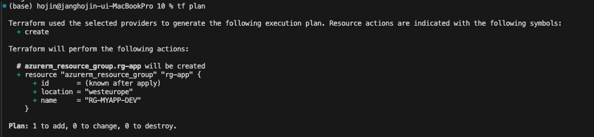

# 2장

- [2장](#2장)
  - [2.2 사용할 테라폼과 프로바이더 버전 구성하기](#22-사용할-테라폼과-프로바이더-버전-구성하기)
  - [2.3 프로바이더에 별칭을 추가해서 동일한 프로바이더의 여러 인스턴스 만들기](#23-프로바이더에-별칭을-추가해서-동일한-프로바이더의-여러-인스턴스-만들기)
  - [2.4 변수 조작하기](#24-변수-조작하기)
  - [2.5 민감 변수 안전하게 유지하기](#25-민감-변수-안전하게-유지하기)
  - [2.6 사용자 정의 함수에서 로컬 변수 사용하기](#26-사용자-정의-함수에서-로컬-변수-사용하기)
  - [2.7 출력을 사용해서 프로비저닝된 데이터 노출하기](#27-출력을-사용해서-프로비저닝된-데이터-노출하기)
  - [2.8 테라폼 내장 함수 호출하기](#28-테라폼-내장-함수-호출하기)
  - [2.10 조건문 작성하기](#210-조건문-작성하기)
  - [2.11 테라폼으로 패스워드 생성하기](#211-테라폼으로-패스워드-생성하기)
  - [2.13 사용자 지정 사전 및 사후 조건 추가하기](#213-사용자-지정-사전-및-사후-조건-추가하기)
- [2.14 인프라의 유효성 검사하기](#214-인프라의-유효성-검사하기)

## 2.2 사용할 테라폼과 프로바이더 버전 구성하기

테라폼 구성에서 사용할 테라폼 바이너리 버전을 지정하는 것이 좋으며, 프로바이더에서도 호환성 문제가 발생하지 않도록 버전을 지정하는 것이 좋다.

사용할 테라폼 바이너리 버전에 대한 정보가 테라폼 상태 파일(terraform.lock.hcl)파일에 생성되어 있다. 이를 통해 더 낮은 버전의 테라폼 바이너리로 실행되지 않도록 보장한다.

terraform init 명령을 실행하면, 테라폼 구성을 실행하는 테라폼의 버전이 terraform 블록 내에 있는 required_version에 해당하는 버전인지 확인하고  
명시된 버전보다 상위 버전이거나 같은 버전이면 에러가 발생하지 않지만 그렇지 않으면 에러가 발생한다.

```bash
terraform {
  required_version = ">= 0.13,<=1"
  # 테라폼 버전 명시
  required_providers {
    azurerm = {
      version = "2.10.0" # not available on darwin/arm64
      # 프로바이더의 소스와 버전 명시
    }
  }
}

provider "azurerm" {
  features {}
}

variable "resource_group_name" {
  default = "rg_test"
  type    = string
}

resource "azurerm_resource_group" "rg" {
  name     = var.resource_group_name
  location = "westeurope"
}

resource "azurerm_public_ip" "pip" {
  name                         = "book-ip"
  location                     = "westeurope"
  resource_group_name          = azurerm_resource_group.rg.name
  allocation_method            = "Dynamic"
  domain_name_label            = "bookdevops"
}
```

## 2.3 프로바이더에 별칭을 추가해서 동일한 프로바이더의 여러 인스턴스 만들기

1. azurerm 블록을 복사한 후 각각의 프로바이더에 식별할 수 있는 이름과 함께 alias 속성을 추가한다.
2. 각각의 리소스가 생성되어야 하는 구독 정보를 subscription_id 속성에 추가한다.
3. azurerm_resource_group 리소스에 provider 속성을 추가한 뒤 alias 속성에 설정된 이름으로 설정한다.
4. azurerm_resource_group 리소스는 프로바이더의 alias 속성을 이용해 프로비저닝 되어야 하는 구독 ID를 식별한다.

```bash
terraform {
  required_version = "~> 1.1"
  required_providers {
    azurerm = {
      version = "~> 3.9.0"
    }
  }
}

provider "azurerm" {
  subscription_id = "xxxxxxxx-xxxx-xxxx-xxxx-xxxxxxxxxxxx"
  alias           = "sub1"
  features {}
}

provider "azurerm" {
  subscription_id = "yyyyyyyy-yyyy-yyyy-yyyy-yyyyyyyyyyyy"
  alias           = "sub2"
  features {}
}

resource "azurerm_resource_group" "rg" {
  provider = azurerm.sub1
  name     = "rg-sub1"
  location = "westeurope"
}

resource "azurerm_resource_group" "rg2" {
  provider = azurerm.sub2
  name     = "rg-sub2"
  location = "westeurope"
}
```

위와 같이 구독 두 개에 alias(별칭)을 넣고, 각각의 리소스 그룹 생성에서 별칭을 이용해 프로비저닝 되어야 하는 구독 ID를 식별한다.

## 2.4 변수 조작하기

테라폼의 모든 속성값을 하드코딩하면 재사용에 문제가 생긴다. 변수를 이용해 테라폼 구성을 동적으로 만들어보자

1. variable로 변수를 설정하고
2. var.resource_group_name 등의 형식으로 변수를 사용할 수 있다.
3. 마지막으로 main.tf와 같은 루트의 폴더 내에 terraform.tfvars라는 파일을 만들면 된다.

변수에 값을 설정하는 방법으로는 TF_VAR_변수명 이라는 환경 변수를 설정하는 또 다른 방법도 있다.

변수 규칙은 다음과 같다.

1. 변수 이름: 이름은 테라폼 구성 내에서 고유해야 하고, 명시적이어야 한다.
2. 변수가 나타내는 값에 대한 설명: CLI와 테라폼 구성 문서에 통합될 수 있기 떄문에 사용해야 한다.
3. 기본값: 기본값은 선택이지만 기본값을 설정하지 않으면 필수로 값을 입력해야 한다
   1. terraform plan과 apply 명령에 -var 옵션을 사용하면 변수에 값을 지정할 수 있다.
   2. 0.13버전부터 사용자 정의 유효성 검사 규칙을 생성할 수 있어 plan 명령의 실행 과정에서 검증할 수 있다.

```bash main.tf
terraform {
  required_version = "~> 1.0"
  required_providers {
    azurerm = {
      version = "~> 3.18"
    }
  }
}

provider "azurerm" {
  features {}
}

variable "resource_group_name" {
  description = "The name of the resource group"
  type        = string
}

variable "location" {
  description = "The name of the Azure location"
  default     = "westeurope"
  type        = string
  validation {
    condition     = contains(["westeurope", "westus"], var.location)
    error_message = "The location must be westeurope or westus."
  }
}

resource "azurerm_resource_group" "rg" {
  name     = var.resource_group_name
  location = var.location
}
```

```bash terraform.tfvars
resource_group_name = "My-RG"
location            = "westeurope"
```

## 2.5 민감 변수 안전하게 유지하기

콘솔 상의 출력 결과에 변숫값을 평문으로 표시하지 않도록 해 테라폼 변수 정보를 외부로부터 안전하게 보호하는 방법에 대해 알아보자.

명심해야 할 것은 sensitive 플래그는 콘솔 출력 창에 변수가 보이지 않게 해주지만 테라폼 상태 파일에는 여전히 평문으로 저장된다.
이렇게 변수를 민감 변수로 만들어서 사용하는 것은 CI/CD 파이프라인을 테라폼을 실행하는 경우에 효과적이다.

애저 키 볼트 또는 해시코프 볼트같은 외부 시크릿 솔루션을 사용하는 것도 모범사례다.

variables.tf 파일에 변수들을 명시하고

```bash variables.tf
variable "api_key" {
  description = "Custom application API key"
  sensitive   = true
  type        = string
}
```

main.tf 파일을 통해 sensitive한 변수를 사용

```bash main.tf
resource "azurerm_linux_web_app" "app" {
  name                = "${var.app_name}-${var.environment}-${random_string.random.result}"
  location            = azurerm_resource_group.rg-app.location
  resource_group_name = azurerm_resource_group.rg-app.name
  service_plan_id     = azurerm_service_plan.plan-app.id

  site_config {}
  app_settings = {
    API_KEY = var.api_key
  }
}
```

terraform.tfvars 파일에 값을 설정

```bash terraform.tfvars
resource_group_name = "RG-App-demo"
service_plan_name   = "Plan-App-demo"
environment         = "DEV1"
api_key             = "xxxxxxxxxxxxxxxxxxxxxxxx"
```

## 2.6 사용자 정의 함수에서 로컬 변수 사용하기

로컬 변수를 구현하고 이를 사용자 정의 함수를 통해 사용하는 방법에 대해 알아보면

애저 시소스의 이름을 일관되게 다음과 같은 명명규칙을 이용한다고 하고

```bash
CodeAzureResource - Name Application - Environment name - Country Code
```

1. 테라폼 구성을 포함하고 있는 main.tf 파일에 resource_name이라는 로컬 변수를 위한 코드를 다음과 같이 추가한다.
2. 아래와 같이 ${local.resource_name} 형식으로 로컬변수를 리소스에서 사용한다.

로컬 변수는 -var 옵션을 통해 재정의할 수 없다.

```bash main.tf
terraform {
  required_version = "~> 1.0"
  required_providers {
    azurerm = {
      version = "~> 3.18"
    }
  }
}

provider "azurerm" {
  features {}
}

variable "application_name" {
  description = "The name of application"
  type        = string
}

variable "environment_name" {
  description = "The name of environment"
  type        = string
}

variable "country_code" {
  description = "The country code (FR-US-...)"
  type        = string

}

resource "azurerm_resource_group" "rg" {
  name     = "RG-${local.resource_name}"
  location = "westeurope"
}

resource "azurerm_public_ip" "pip" {
  name                = "IP-${local.resource_name}"
  location            = "westeurope"
  resource_group_name = azurerm_resource_group.rg.name
  allocation_method   = "Dynamic"
  domain_name_label   = "mydomain"
}


locals {
  resource_name = "${var.application_name}-${var.environment_name}-${var.country_code}"
}
```

## 2.7 출력을 사용해서 프로비저닝된 데이터 노출하기

코드형 인프라 도구를 사용할 때, 코드 실행 후 프로비저닝된 리소스로부터 생성된 출력값을 사용해야 하는 경우가 있다.  
테라폼을 통해 프로비저닝된 애저 웹 앱의 이름을 출력에 포함시키는 방법에 대해 알아본다.

```bash
resource "azurerm_linux_web_app" "app" {
  name                = "${var.app_name}-${var.environment}-${random_string.random.result}"
  location            = azurerm_resource_group.rg-app.location
  resource_group_name = azurerm_resource_group.rg-app.name
  service_plan_id     = azurerm_service_plan.plan-app.id

  site_config {}
  app_settings = {
    API_KEY = var.api_key
  }
}
```

출력값을 얻기 위해선 main.tf파일에 output코드를 추가해야 한다.

```bash
output "webapp_name" {
  description = "Name of the webapp"
  value       = azurerm_linux_web_app.app.name
}
```

output 블록은 webapp_name이라는 이름과 azurerm_linux_web_app.name이라는 값으로 정의됐는데
이 값들은 테라폼을 통해 프로비저닝되는 애저 앱 서비스 인스턴스의 이름을 나타낸다.

출력이 반환하는 값에 대한 설명으로 description 속성을 추가할 수 있다. 이는 자동 생성되는 문서에 유용하게 사용된다.

## 2.8 테라폼 내장 함수 호출하기

테라폼으로 인프라를 프로비저닝하거나 리소스를 다룰 때 테라폼 구성에 있는 요소들을 변환하거나 조합하는 등의 작업을 해야 할 경우가 있다.  
테라폼에는 몇몇 내장 함수들이 존재한다. 지금은 그 중 하나인 Upper Case로 출력하는 방법에 대해 배운다.  
리소스 그룹의 이름은 다음의 명명규칙을 따른다.

```bash
RG - app name - environment
```

1. main.tf파일에 다음과 같은 코드를 작성한다.

    ```bash
    variable "app_name" {
      description = "Name of application"
      type        = string
    }

    variable "environment" {
      description = "Environment Name"
      type        = string
    }
   ```

2. main.tf 파일에 다음과 같은 테라폼 구성을 작성한다.

    ```bash
    resource "azurerm_resource_group" "rg-app" {
      name     = upper(format("RG-%s-%s",var.app_name,var.environment))
      location = "westeurope"
    }
    ```

## 2.9 테라폼 구성에서 YAML 파일 사용하기

실제 테라폼 구성을 작성하다 보면 JSON 혹은 YAML 파일 같은 외부 소스를 사용해야할 경우가 있는데 이런 파일들을 테라폼 변수로 다시 작성 할 수 는 없다.

여기서는 테라폼 구성 안에서 YAML 파일을 사용하는 방법에 대해 배운다.

다음과 같이 network.yaml 파일을 작성한다.

```bash network.yaml
vnet: "myvnet"
address_space: "10.0.0.0/16"
subnets: 
- name: subnet1
  iprange: "10.0.1.0/24"
- name: subnet2
  iprange: "10.0.2.0/24"
```

1. main.tf에서 yamldecode라는 내장 함수를 호출하는 network라는 이름의 로컬 변수를 만들어준다.

   ```bash
   network = yamldecode(file("network.yaml"))
   ```

2. 테라폼 리소스 내부에서 local.network 변수와 YAML 파일에 정의된 local.network 변수의 속성들을 호출한다.

   ```bash
    resource "azurerm_virtual_network" "vnet" {
    name                = local.network.vnet
    location            = azurerm_resource_group.rg.location
    resource_group_name = azurerm_resource_group.rg.name
    address_space       = [local.network.address_space]
    dynamic "subnet" {
      for_each = local.network.subnets
      content {
        name           = subnet.value.name
        address_prefix = subnet.value.iprange
        }
      }
    }
   ```

plan을 실행하면 테라폼 구성이 YAML 파일에 구성된 정보를 바탕으로 만들어졌음을 알 수 있다.

## 2.10 조건문 작성하기

리소스를 동적으로 만들어야 하는 경우가 생긴다. 이번 예제에서는 조건문을 작성하는 방법에 대해서 배워보자.

만약 환경 이름이 Production과 같다면 리소스 그룹의 이름을 RG-앱이름 으로 설정하고, 아니라면 리소스 그룹의 이름을 RG-앱이름-환경이름 으로 설정한다.

```bash
resource "azurerm_resource_group" "rg-app" {
  name     = var.environment == "Production" ? upper(format("RG-%s", var.app_name)) : upper(format("RG-%s-%s", var.app_name, var.environment))
  location = "westeurope"
}
```

다음과 같은 문법의 조건문을 추가한다.

```bash
condition ? true assert : false assert
```



기능 플래그를 사용해 리소스의 프로비저닝 여부를 동적으로 결정할 수 있다.

```bash
resource "azurerm_application_insights" "appinsight-app" {
  count = var.use_appinsight == true ? 1 : 0
}
```

## 2.11 테라폼으로 패스워드 생성하기

테라폼으로 인프라를 프로비저닝하다 보면 계정 인증 정보, 가상 머신과 데이터베이스에 대한 접속 정보 등과 같이 속성 중에 패스워드를 필요로 하는 경우가 있다.

테라폼 random 프로바이더를 사용하면 관리자 패스워드 등을 동적으로 할당할 수 있다.

1. 가상 머신의 프로비저닝을 위한 테라폼 구성에 다음 코드를 추가한다.

   ```bash
    resource "random_password" "password" {
    length           = 16
    special          = true
    override_special = "_%@"
    }
   ```

2. 리소스 코드 내에서 password 속성을 다음과 같이 수정한다.

    ```bash
    # Create virtual machine
    resource "azurerm_linux_virtual_machine" "myterraformvm" {
      name                            = "myVM"
      location                        = "westeurope"
      resource_group_name             = azurerm_resource_group.myterraformgroup.name
      network_interface_ids           = [azurerm_network_interface.myterraformnic.id]
      disable_password_authentication = false
      computer_name                   = "vmdemo"
      admin_username                  = "uservm"
      admin_password                  = random_password.password.result
      size                            = "Standard_DS1_v2"

      os_disk {
        name                 = "myOsDisk"
        caching              = "ReadWrite"
        storage_account_type = "Standard_LRS"
      }
   ```

첫 번째 단계에서는 설정된 속성에 따라 문자열을 생성할 수 있도록 random 프로바이더를 통해 random_password 리소스를 추가한다.

## 2.12 테라폼 리소스간 의존성 관리하기

테라폼의 주요 기능 중 하나는 리소스간 의존성을 고려하면서 작업을 자동으로 병렬화해서 진행하는 것이다.

의존성에는 암시적 의존성과 명시적 의존성 모두를 사용한다.

```bash
terraform {
  required_version = "~> 1.0"
  required_providers {
    azurerm = {
      version = "~> 3.18"
    }
  }
}

provider "azurerm" {
  features {}
}

resource "azurerm_resource_group" "rg" {
  name     = "rgdep"
  location = "westeurope"
}

resource "azurerm_virtual_network" "vnet" {
  name                = "vnet"
  location            = "westeurope"
  resource_group_name = "azurerm_resource_group.rg.name"
  address_space       = ["10.0.0.0/16"]

  depends_on = [azurerm_resource_group.rg]

}
```

depends_on 을 이용해 명시적 의존성을 만들 수 있고 해당 라인이 없다면 암시적 의존성이 된다.

이렇게 해 놓으면 depends_on가 엮여있는 리소스를 먼저 만들기 때문에 생성 과정에서 순서가 나열되는 것을 확인할 수 있다.

암시적 의존성과 명시적 의존성을 선택할 수 있다면 암시적 의존성을 선택하는 것이 좋다.

## 2.13 사용자 지정 사전 및 사후 조건 추가하기

변수 조작하기에서 변수를 정의할 때 조건문을 통해 유효성 검사를 추가하는 방법에 대해 배웠는데, 테라폼 1.2부터 사전, 사후 조건을 사용해  
리소스, 모듈, 데이터 소스에 대해 사용자 정의 유효성 검사를 추가할 수 있다.

사전 조건은 plan 작업 전에 유효성 검사를 진행하고 사후 조건은 plan 작업 후에 유효성 검사를 진행한다.

```bash
terraform {
  required_version = "~> 1.0"
  required_providers {
    azurerm = {
      version = "~> 3.18"
    }
  }
}

provider "azurerm" {
  features {}
}

resource "azurerm_resource_group" "rg" {
  name     = "rgdep"
  location = "westus"
}

resource "azurerm_virtual_network" "vnet" {
  name                = "vnet"
  location            = azurerm_resource_group.rg.location
  resource_group_name = azurerm_resource_group.rg.name
  address_space       = [var.address_space]
  lifecycle {
    precondition {
      condition     = cidrnetmask(var.address_space) == "255.255.0.0"
      error_message = "The IP Range must be /16"
    }
    postcondition {
      condition     = self.location == "westeurope"
      error_message = "Location must be westeurope"
    }
  }
}

variable "address_space" {
  default = "10.0.0.0/16"
  type    = string
}
```

1. precondition을 통해 /16 IP 범위를 가지고 있는지 확인하고
2. postcondition을 동해 location을 확인한다.

# 2.14 인프라의 유효성 검사하기

이번 예제에서는 테라폼 구성을 사용해 새로운 애저 앱 서비스가 인스턴스를 프로비저닝 한 후 동일한 테라폼 구성 내에서 프로비저닝된 앱 서비스 인스턴스가 실행중인지 200코드를 반환하는지 확인한다.

코드참조