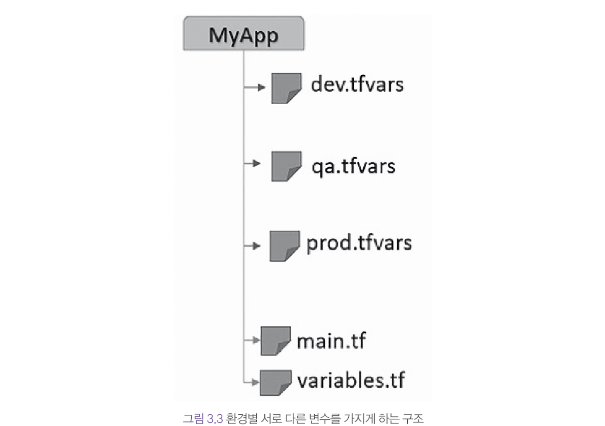
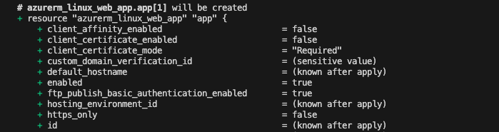
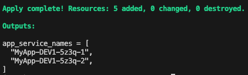
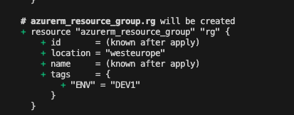
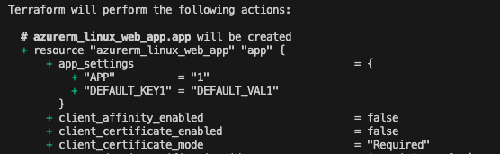

# 3장

count, map, collection, array같은 테라폼 표현식과 dynamic 블록을 사용하는 방법에 대한 내용으로 코드의 중복을 제거하고 여러 개의 인프라를 배포하는 방법에 대해 배운다.

- 여러 환경에서 인프라를 프로비저닝하기
- count인수를 사용해 여러 리소스를 프로비저닝
- 맵 사용하기
- 객체로 구성된 맵 순환하기
- dynamic 블록을 사용해 여러 개의 블록 생성하기
- 맵 필터링하기

- [3장](#3장)
  - [3.1 기술적 요구사항](#31-기술적-요구사항)
  - [2.3 프로바이더에 별칭을 추가해서 동일한 프로바이더의 여러 인스턴스 만들기](#23-프로바이더에-별칭을-추가해서-동일한-프로바이더의-여러-인스턴스-만들기)

## 3.2 여러 환경에서 인프라를 프로비저닝하기

### 테라폼 구성

- main.tf파일은 프로비저닝 되어야 할 리소스들의 구성을 담고 있다.
- variables.tf파일은 변수 선언을 담고 있다.
- terraform.tfvars파일은 변수의 값을 담고 있다.

### 기본 구성 작동 방법

1. 빈 폴더에 환경별로 폴더를 만든다. dev, test production
2. 기본 테라폼 구성을 각 폴더에 동일하게 복사한다.

```bash
resource_group_name = "RG-Appdemo"
service_plan_name   = "Plan-App"
environment         = "DEV"
```


해당 구성은 다른 환경에 영향을 주지 않고, 환경별로 리소스를 쉽게 추가하거나 제거할 수 있다.

하지만, 코드 중복이 발생하기 때문에 유지보수 비용이 든다.

### 수정안



이 구조를 사용하면 plan, apply 명령시 -var-file 옵션을 추가해야 하지만, 공통 부분이 하나만 있고환경별로 채워야 할 테라폼 변수 파일이 각각 존재하기 때문에 코드를 변경하거나 새로운 환경이 발새할 경우 적은 작업만 하면 된다.

## 3.3 count인수를 사용해서 여러 리소스를 프로비저닝 하기

실무에서 리소스의 수평 확장해야 할 경우가 있을 수 있는데

- 중복 코드를 사용하지 않고 동일한 리소스를 여러 개 프로비저닝 하는 테라폼 구성 작성하기
- 프로비저닝할 동일한 리소스의 수를 빠르게 증가시키거나 감소시키기

```bash

## main.tf
terraform {
  required_version = "~> 1.1"
  required_providers {
    azurerm = {
      version = "~> 3.23"
    }
    random = {
      source  = "hashicorp/random"
      version = ">= 3.0.0" # arm 지원 random 버전
    }
  }
}

provider "azurerm" {
  features {}
}

resource "random_string" "random" {
  length  = 4
  special = false
  upper   = false
}

resource "azurerm_resource_group" "rg" {
  name     = "${var.resource_group_name}-${var.environment}-${random_string.random.result}"
  location = var.location
  tags = {
    ENV = var.environment
  }
}

resource "azurerm_service_plan" "plan" {
  name                = "${var.service_plan_name}-${var.environment}-${random_string.random.result}"
  location            = azurerm_resource_group.rg.location
  resource_group_name = azurerm_resource_group.rg.name
  sku_name            = "S1"
  os_type             = "Linux"
}


resource "azurerm_linux_web_app" "app" {
  count               = var.webapp_count
  name                = "${var.app_name}-${var.environment}-${random_string.random.result}-${count.index + 1}"
  location            = azurerm_resource_group.rg.location
  resource_group_name = azurerm_resource_group.rg.name
  service_plan_id     = azurerm_service_plan.plan.id
  site_config {} # 웹 어플리케이션의 구성 설정을 정의하는 블록으로 빈칸이라면 기본값이 적용
  # 웹 앱의 세부 구성 요소(애플리케이션 스택, HTTP/HTTPS 동작, 리소스제한, 사용자 지정 설정 등)
}

## variables.tf
resource_group_name = "RG-App"
service_plan_name   = "Plan-App"
environment         = "DEV1"


webapp_count = 2
```

1. webapp_count라는 애저 앱 서비스의 개수를 설정
2. azurerm_linux_web_app 리소스에 count인수를 추가해 값을 webapp_count 변수로 설정
3. azurerm_linux_web_app 리소스 name 속성에 count인수의 현재 인덱스 값을 접미사로 추가





하지만 이처럼 index를 사용하는 조건문을 사용하는 것 보다는 모든 속성을 동일하게 유지하는 것이 좋다. 따라서 이 장의 다음에서 for_each 표현식을 학습한다.

## 3.4 맵 사용하기

표준 변수 유형 말고도 다양한 유형의 변수들을 제공한다.

맵은 다음 용도로 사용될 수 있다.

- 테라폼 리소스에 있는 블록의 모든 속성을 단일 변수에 설정
- 테라폼 구성에 사용될 키-값 모음을 설정
- 동일한 리소스의 여러 인스턴스에 대한 데이터 선언 후 for_each를 통해 반복

이 예제에서는 맵의 사용 방법에 대한 두 가지 방법을 살펴본다.

- 리소스 그룹의 태그 구현
- 앱 서비스의 속성 설정

```bash
# variables.tf
variable "tags" {
  type        = map(string)
  description = "Tags"
  default     = {}
}

variable "app_settings" {
  type        = map(string)
  description = "App settings of the web app"
  default     = {}
}

# main.tf
resource "azurerm_linux_web_app" "app" {
  name                = "${var.app_name}-${var.environment}-${random_string.random.result}"
  location            = azurerm_resource_group.rg-app.location
  resource_group_name = azurerm_resource_group.rg-app.name
  service_plan_id     = azurerm_service_plan.plan-app.id

  site_config {}

  app_settings = var.app_settings
}

# terraform.tfvars
tags = {
  ENV          = "DEV1"
  CODE_PROJECT = "DEMO"
}

app_settings = {
  KEY1 = "VAL1"
}
```

1. variables.tf에서 맵 형식의 변수 두 개를 설정
2. 리소스를 위한 tags와 서비스를 위한 app_settings에 값을 설정
3. 테라폼 구성 내에서 변수들을 사용해 리소스 그룹과 앱 서비스를 프로비저닝



merge를 사용해 두 맵을 병합하는 것도 가능하다.

```bash
# variables.tf
variable "custom_app_settings" {
  description = "Cusom app settings"
  type = map(string)
  default = {}
}

# terraform.tfvars
custom_app_settings = {
  APP = "1"
}

# main.tf
locals {
  default_app_settings = {
    "DEFAULT_KEY1" = "DEFAULT_VAL1"
  }
}
```

이렇게 추가해주면 다음과 같은 app_settings 값을 얻을 수 있다.



## 3.5 객체로 구성된 맵 순환하기

count가 아닌 객체를 이용해 리소스를 프로비저닝 하는 방법에 대해 배워본다.

```bash
# variables.tf
variable "web_apps" {
  description = "List of web App to create"
  type = map(object({
    name                = string
    location            = optional(string, "westeurope")
    serverdatabase_name = string
  }))
}

# terraform.tfvars
web_apps = {
  webapp1 = {
    "name"                = "webappdemobook1"
    "location"            = "westeurope"
    "serverdatabase_name" = "server1"
  },
  webapp2 = {
    "name"                = "webapptestbook2"
    "serverdatabase_name" = "server2"
  }
}

# main.tf
resource "azurerm_linux_web_app" "app" {
  for_each            = var.web_apps
  name                = each.value["name"]
  location            = lookup(each.value, "location", "westeurope")
  resource_group_name = azurerm_resource_group.rg-app.name
  service_plan_id     = azurerm_service_plan.plan-app.id

  site_config {}

  connection_string {
    name  = "DataBase"
    type  = "SQLServer"
    value = "Server=${each.value["serverdatabase_name"]};Integrated Security=SSPI"
  }
}
```

1. 새로운 객체 맵 변수를 선언하고 다음 속성들(name, location(옵션), serverdatabase_name)을 포함하도록 정의
2. 객체 맵으로 구성된 변수의 값들을 각 앱 서비스의 속성에 맞게 설정
3. azurerm_linux_web_app 리소스에 for_each 표현식을 사용해 맵의 값을 순환(for_each의 each, value를 이용해 가져오거나 테라폼 내장함수 lookup함수를 이용)

## 3.6 dynamic 블록을 사용해서 여러 개의 블록 생성하기

테라폼 리소스는 다음의 요소들로 정리된다.

- name = value
- azurerm_linux_web_app 리소스 내부에 site_config블록 같이 여러 개의 속성을 묶은 블록 형태의 정의

테라폼의 주요 특징 중 하나인 dynamic 블록은 리소스 내부에 정의되는 블록들을 반복하는데 사용된다.  
dynamic 블록을 이용해 azurerm_network_security_group에 여러 security_rule 블록을 정의한다.

```bash
dynamic "security_rule" {
    for_each = var.nsg_rules
    content {
      name                       = security_rule.value["name"]
      priority                   = security_rule.value["priority"]
      direction                  = security_rule.value["direction"]
      access                     = security_rule.value["access"]
      protocol                   = security_rule.value["protocol"]
      source_port_range          = security_rule.value["source_port_range"]
      destination_port_range     = security_rule.value["destination_port_range"]
      source_address_prefix      = security_rule.value["source_address_prefix"]
      destination_address_prefix = security_rule.value["destination_address_prefix"]
    }
  }
```

for_each를 사용해도 되지만, 조건부로 사용하거나 중첩된 for문을 이용해야 하는경우 dynamic이 유용하게 쓰일 수 있다.

```bash
dynamic "boot_diagnostics" {
  for_each = local.use_boot_diagnostics == true ? [1] : []
  content {
    storage_accout_uri = "https://storageboot.blob.core.windows.net/"
    }
  }
}
```

## 3.7 맵 필터링하기

대부분 맵으로 정의된 리스트 값을 바탕으로 리소스를 만들지만 리스트 값 중 필터링이 필요한 경우를 알아본다.

```bash
# terraform.tfvars
web_apps = [
  webapp1 = {
      "name" = "webapptestbook1"
      "os"   = "Linux"
  },
  webapp2 = {
      "name" = "webapptestbook2"
      "os"   = "Linux"
  },
  webapp3 = {
      "name" = "webapptestbook3"
      "os"   = "Windows"
  }
]

# main.tf
locals {
  linux_web_app = toset([for each in var.web_apps : each.name if each.os == "Linux"])
  Windows_web_app = toset([for each in var.web_apps : each.name if each.os == "Windows"])
}

# main.tf 리소스
resource "azurerm_linux_web_app" "app" {
  for_each = local.linux_web_app

  name     = each.value
  location = "westeurope"
  
  site_config {}
}
```

해당 어플리케이션을 프로비저닝 하면 두 개의 로컬 변수를 만들어 os 키 값이 리눅스, 윈도우인지에 따라서 변수를 읽어온 후 어플리케이션을 프로비저닝 한다.
