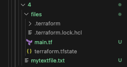
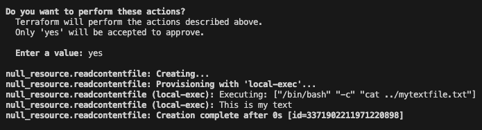

# 4장 외부 데이터를 활용해서 테라폼 사용하기

테라폼으로 프로비저닝 하지 않거나 이미 존재하는 리소스 정보를 필요하는 경우가 있는데 이 경우 외부 시스템으로부터 데이터를 검색하는 방법과 외부 리소스에 쿼리하는 방법에 등등에 대한 내용이다.

- [4장 외부 데이터를 활용해서 테라폼 사용하기](#4장-외부-데이터를-활용해서-테라폼-사용하기)
  - [4.2 데이터 소스를 활용해 외부 데이터 획득하기](#42-데이터-소스를-활용해-외부-데이터-획득하기)
  - [4.3 테라폼으로 외부 데이터 쿼리하기](#43-테라폼으로-외부-데이터-쿼리하기)
  - [4.4 테라폼으로 로컬 파일 조작하기](#44-테라폼으로-로컬-파일-조작하기)
  - [4.5 테라폼으로 로컬 프로그램 실행하기](#45-테라폼으로-로컬-프로그램-실행하기)
  - [4.6 테라폼 쉘 프로바이더를 사용해서 쉘 스크립트 실행하기](#46-테라폼-쉘-프로바이더를-사용해서-쉘-스크립트-실행하기)

## 4.2 데이터 소스를 활용해 외부 데이터 획득하기

데이터 소스는 모든 리소스에 쉽게 접근할 수 있지만 이미 테라폼으로 관리되고 있는 리소스의 경우 출력을 통해 데이터를 노출해야 하며, 애저 데이터 소스가 아닌 terraform_remote_state 데이터 소스를 사용해 접근해야 한다.

```bash
# main.tf
data "azurerm_service_plan" "myplan" {
  name                = "app-service-plan"
  resource_group_name = "rg-service_plan"
}

# terraform.tfvars
resource "azurerm_linux_web_app" "app" {
  name                = "${var.app_name}-${var.environment}"
  location            = azurerm_resource_group.rg-app.location
  resource_group_name = azurerm_resource_group.rg-app.name
  service_plan_id     = data.azurerm_service_plan.myplan.id
  site_config {}
}
```

테라폼 구성 파일 내에 myplan이라는 data블록을 추가하며, 추가할 앱 서비스 플랜의 이름과 리소스 그룹을 명시해준다.

1. data 블록을 통해 이미 존재하는 리소스에 대한 정보를 가져온다.
2. data 블록을 통해 가져온 서비스 플랜의 ID를 명시한다.
3. destroy시 data블록에 명시된 리소스는 삭제하지 않으며, 데이터를 동적으로 가져오기 때문에 리소스 ID를 명시하는 것 보다 좋은 방법이다.

## 4.3 테라폼으로 외부 데이터 쿼리하기

외부 API를 호출하거나 로컬 프로그램의 출력 결과를 사용해야 하는 경우 data블록을 사용할 수 없는 경우도 존재한다. 이런 경우에는 external이라는 외부 프로그램을 호출하고 출력 결과를 테라폼 구성에 사용할 수 있는 리소스가 존재한다.

1. 해당 장의 예제에서는 powershell 스크립트를 이용해 JSON 형식의 매개변수로 environment를 받고, 해당 값으로 조건문을 만들어 조건에 맞는 애저 리전을 출력한다.(Production이면 location을 westeurope으로 출력)

    ```powershell
    # Read the JSON payload from stdin
    $jsonpayload = [Console]::In.ReadLine()

    # Convert JSON to a string
    $json = ConvertFrom-Json $jsonpayload
    $environment = $json.environment

    if($environment -eq "Production"){
        $location="westeurope"
    }else{
        $location="westus"
    }

    # Write output to stdout
    Write-Output "{ ""location"" : ""$location""}"
    ```

2. external 블록에서 environment_name변수의 값을 GetLocation.ps1 스크립트의 매개변수로 주고 호출한다.

    ```bash external
    # external 블록을 추가
    data "external" "getlocation" {
    program = ["pwsh", "./GetLocation.ps1"]

    query = {
        environment = var.environment_name
    }
    }

    output "locationname" {
    value = data.external.getlocation.result.location
    }
    ```

3. 애저 리소스 그룹의 location 속성을 external 데이터 소스의 출력값으로 설정

## 4.4 테라폼으로 로컬 파일 조작하기

테라폼은 로컬 시스템을 조작하기 위한 프로바이더도 가지고 있다.

```bash
resource "local_file" "myfile" {
  content = "This is my text"
  filename = "../mytextfile.txt"
}
```

다음과 같은 실행 파일을 만들고 실행하면 실제 하위 디렉토리에 mytextfiel.txt 파일이 생성된다.



두 번째 archives 파일에 main.tf를 만들고

```bash
data "archive_file" "backup" {
  type        = "zip"
  source_file = "../mytextfile.txt"
  output_path = "${path.module}/archives/backup.zip"
}
```

실행하면 아래와 같이 zip파일을 생성할 수 있다.


## 4.5 테라폼으로 로컬 프로그램 실행하기

인프라 프로비저닝과 별개로 테라폼으로 로컬 워크스테이션 조작이 가능한데, 이번엔 로컬 프로그램을 실행하는 방법에 대해 알아본다.

1. 아래와 같이 txt파일을 cat하는 명령어를 입력하면

    ```bash
    resource "local_file" "myfile" {
    content  = "This is my text"
    filename = "../mytextfile.txt"
    }

    resource "null_resource" "readcontentfile" {
    provisioner "local-exec" {
        command = "cat ../mytextfile.txt"
        interpreter = ["/bin/bash", "-c"]
    }
    }
    ```

2. This is my text 텍스트가 출력되는 것을 볼 수 있다.
   

프로비저너는 한 번 실행되고 나면 terraform apply 명령어를 다시 실행해도 상태 파일이 변하지 않는 것을 알 수 있는데 null_resource 리소스 안에 trigger 속성을 추가하면 해당 명령어를 실행할 때마다 테라폼 상태 파일도 수정된다.

## 4.6 테라폼 쉘 프로바이더를 사용해서 쉘 스크립트 실행하기

null_resource 이외에도 테라폼 쉘 프로바이더를 이용할 수 있다.

```bash
terraform {
  required_version = "~> 1.2"
  required_providers {
    shell = {
      source  = "scottwinkler/shell"
      version = "1.7.10"
    }
  }
}

provider "shell" {}

resource "shell_script" "sh" {
  lifecycle_commands {
    //I suggest having these command be as separate files if they are non-trivial
    create = file("${path.module}/scripts/create.sh")
    read   = file("${path.module}/scripts/read.sh")
    delete = file("${path.module}/scripts/delete.sh")
  }

  interpreter       = ["/bin/bash", "-c"]
  working_directory = path.module

  //triggers a force new update if value changes, like null_resource
  triggers = {
    timestamp = timestamp()
  }
}

output "id" {
  value = shell_script.sh.output["id"]
}
```

각각 apply를 실행할 때 create, plan을 실행할 때 plan, destroy를 실행할 때 delete가 실행된다.