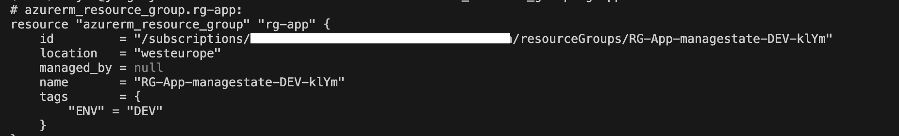
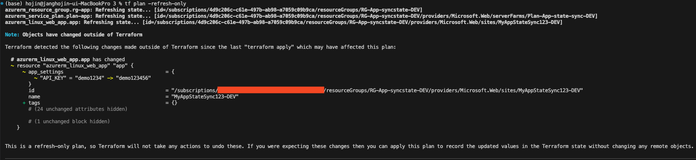
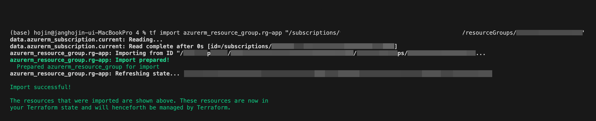
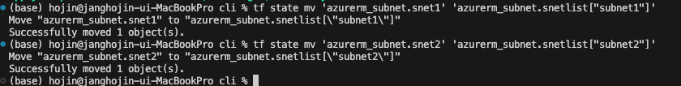
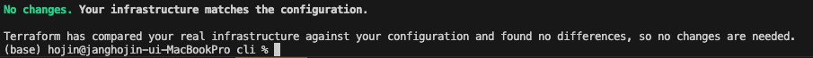

# 5장 태라폼 상태 관리하기

테라폼 상태 파일이 수동으로 수정되면 파일이 손상되어 리소스 프로비저닝에 사용할 수 없게 될 수 있다.

- [5장 태라폼 상태 관리하기](#5장-태라폼-상태-관리하기)
  - [5.1 로컬 테라폼 상태 사용하기](#51-로컬-테라폼-상태-사용하기)
  - [5.2 테라폼 상태에 있는 리소스 관리하기](#52-테라폼-상태에-있는-리소스-관리하기)
    - [리소스 이름 나열하기](#리소스-이름-나열하기)
    - [테라폼 상태 내에 존재하는 리소스 삭제](#테라폼-상태-내에-존재하는-리소스-삭제)
  - [5.3 테라폼 상태 동기화하기](#53-테라폼-상태-동기화하기)
  - [5.4 기존 리소스 가져오기](#54-기존-리소스-가져오기)
    - [1.5.0 이후](#150-이후)
  - [5.5 다른 테라폼 상태에 있는 리소스 사용하기](#55-다른-테라폼-상태에-있는-리소스-사용하기)
    - [5.5.1 준비사항](#551-준비사항)
  - [5.6 테라폼 구성에 있는 리소스 리팩터링하기](#56-테라폼-구성에-있는-리소스-리팩터링하기)

## 5.1 로컬 테라폼 상태 사용하기

백엔드 설정이 없을 때 테라폼 기본 동작은 테라폼 상태를 로컬에 저장하고 terraform, tfstate라는 이름으로 파일을 만든다.

```bash
terraform {
  backend "local" {
    path = "../../demo.tfstate"
  }
}
```

terraform apply 적용 시 demo.tfstate가 생성된다.

로컬 상태 파일을 다른 테라폼 구성의 원격 데이터로 사용하려면 다음과 같이 테라폼 구성을 작성하면 된다.

```bash
data "terraform_remote_state" "test" {
  backend = "local"
  config = {
    path = "${path.module}/../../demo.tfstate"
  }
}
```

## 5.2 테라폼 상태에 있는 리소스 관리하기

terraform show를 통해 리소스들의 상태, 이름을 볼 수 있으면

terraform show -json을 통해 json으로 출력도 가능



이런식으로 상태들을 나열 가능하다.

### 리소스 이름 나열하기

```bash
terraform state list
```

위 명령어를 통해 프로비저닝하고 상태 파일에 저장된 리소스들의 이름을 볼 수 있다.

```bash
terraform state list | grep 'azurerm_resource_group'
```

위의 명령어는 azurerm_resource_group의 리소스들만 필터링해 노출해준다.

### 테라폼 상태 내에 존재하는 리소스 삭제

```bash
terraform state rm azurerm_windows_web_app.app
```

## 5.3 테라폼 상태 동기화하기

테라폼 구성으로 프로비저닝되어있는 리소스를 테라폼을 사용하지 않고 수동으로 수정하면 테라폼 상태 파일과 리소스 구성이 일치하지 않는다.

우선 테라폼으로 인프라 프로비저닝 후에 환경변수를 변경하고 변경 내용을 확인한다.



```bash
terraform plan -refresh-only

terraform apply -refresh-only
```

## 5.4 기존 리소스 가져오기

인프라가 수동으로 생성되어 있는 상황에서 테라폼을 사용하고자 하거나, 테라폼 상태가 손상 되었거나 삭제되어 재생성이 필요한 경우

테라폼 CLI를 사용해서 이미 프로비저닝 되어 있는 인프라를 테라폼 상태로 가져올 수 있다.

이미 존재하는 이름으로 리소스를 생성하고 테라폼 코드를 작성해 apply 명령을 실행하면 생성에 실패한다.

```bash
# 테라폼 워크플로우 초기화
terraform init

# 테라폼 구성에 정의 되어 있는 리소스의 이름을 첫 번째 매개변수로, 가져와야 할 애저 리소스 그룹의 ID를 두 번째 매개변수로 준다
terraform import
```



동기화가 완료된다면 terraform plan 명령을 실행해도 변경 사항이 발생하지 않아야 한다.

### 1.5.0 이후

테라폼 1.5.0 이후부터는 테라폼 구성 내에서 import 블록을 사용해 리소스를 가져올 수 있는데

main.tf 파일에 있는 azurerm_resource_group리소스 하단에 다음과 같은 코드를 작성하고

```bash
import {
  id = "/subscriptions/<구독ID>/resourcegroups/RG-APP-"
  # 가져오려는 리소스의 ID 속성
  to = azurerm_resource_group.rg-app
  # 테라폼 리소스의 이름
}
```

이렇게 만들어 준 후에

```bash
terraform init
terraform plan --generate-config-out=generated.tf
# 위의 명령을 실행하면 generated.tf파일이 만들어진다.
terraform apply
```

## 5.5 다른 테라폼 상태에 있는 리소스 사용하기

4장의 데이서 소스를 이용해 myplan이라는 이름의 데이터 소스로 외부 데이터를 가져오는 방법에 대해 배웠는데

이번 예제에서는 다른 테라폼 상태에 있는 리소스의 정보를 가져오는 방법에 대해 배운다.

### 5.5.1 준비사항

프로비저닝 하려고 하는 애저 앱 서비스가 이미 존재하는 앱 서비스 플랜에 프로비저닝 하는데, 4장에서의 데이터소스와 달리 프로비저닝할 때 사용한 테라폼 상태로부터 필요한 정보를 가져온다.

terraform_remote_state 블록을 추가해 다른 테라폼 상태 파일에 있는 출력을 사용할 수 있도록 구성한다.

```bash
data "terraform_remote_state" "service_plan_tfstate" {
  backend = "azurerm"
  config = {
    resource_group_name  = "rg_tfstate"
    storage_account_name = "storstate"
    container_name       = "tfbackends"
    key                  = "serviceplan.tfstate"
  }
}

resource "azurerm_windows_web_app" "app" {
  name                = "${var.app_name}-${var.environment}"
  location            = azurerm_resource_group.rg-app.location
  resource_group_name = azurerm_resource_group.rg-app.name
  service_plan_id     = data.terraform_remote_state.service_plan_tfstate.outputs.service_plan_id
  site_config {}
}
```

테라폼을 사용해 복잡한 인프라를 배포하는 경우 테라폼 구성을 분리해서 작성할 때 유용한 방식이다.

- 데이터 소스
  - 참조해야 할 외부 리소스가 테라폼으로 프로비저닝되지 않았을 때(수동으로 만들어졌거나 스크립트를 사용해서 만들어졌을 떄)
  - 리소스에 대한 정보를 제공해줘야 하는 상대방에게 원격 백엔드에 접근하기 위한 권한이 없을 때
- terraform_remote_state
  - 참조해야 할 외부 리소스가 테라폼으로 프로비저닝 되었을 때
  - 리소스에 대한 정보를 제공해 줘야 하는 상대방에게 원격 백엔드에 대한 읽기 권한이 있을 때
  - 테라폼 구성에서 필요로 하는 속성들에 대한 출력이 테라폼 상태에 포함되어 있을 때

## 5.6 테라폼 구성에 있는 리소스 리팩터링하기

테라폼 CLI를 사용해 테라폼 상태에 있는 리소스들을 관리하는 방법에 대해 배웠는데, 다음과 같이 테라폼 구성을 리팩터링해야 할 경우가 생길 수 있다.

- 리소스의 역할에 더 일관성 있돌록 리소스 또는 모듈의 이름을 변경해야 할 경우
- 이미 존재하는 리소스를 N대의 리소스로 수평 확장하기 위해 count 또는 for_each 반복문 추가해
- 모듈 내 리소스를 이동해야 하는 경우

**테라폼 구성이 변경되면 테라폼 상태 역시 변경되어야 한다.**

이미 존재하는 리소스를 삭제하지 않고 리팩터링하는 기본적 작업 방법에 대해 배워보자.

1. 테라폼 CLI 사용하기
   1. main.tf에서 생성된 subnet들을 local변수를 사용한 테라폼 상태의 subnet으로 옮긴다

    ```bash
      resource "azurerm_subnet" "snet1" {
      name                 = "subnet1"
      resource_group_name  = azurerm_resource_group.rg.name
      virtual_network_name = azurerm_virtual_network.vnet.name
      address_prefixes     = ["10.0.1.0/24"]
    }

    resource "azurerm_subnet" "snet2" {
      name                 = "subnet2"
      resource_group_name  = azurerm_resource_group.rg.name
      virtual_network_name = azurerm_virtual_network.vnet.name
      address_prefixes     = ["10.0.2.0/24"]
    }


    locals {
      subnet_list = {
        subnet1 = "10.0.1.0/24"
        subnet2 = "10.0.2.0/24"
      }
    }

    resource "azurerm_subnet" "snetlist" {
      for_each             = local.subnet_list
      name                 = each.key
      resource_group_name  = azurerm_resource_group.rg.name
      virtual_network_name = azurerm_virtual_network.vnet.name
      address_prefixes     = [each.value]
    }
    ```

   2. terraform state mv 명령을 이용해 테라폼 상태의 각각의 리소스를 옮긴다.
      
   3. 기존 테라폼 구성은 삭제하고, 리팩터링된 구성으로 수정한다.
   4. 정상 처리 확인  
      

2. moved 블록 사용하기
   1. 테라폼 구성에 리팩터링된 구성을 작성하고 moved 코드를 추가한다.

      ```bash
      moved {
        from = azurerm_subnet.snet1
        to   = azurerm_subnet.snetlist["subnet1"]
      }

      moved {
        from = azurerm_subnet.snet2
        to   = azurerm_subnet.snetlist["subnet2"]
      }
      ```

   2. 기존 테라폼 구성을 삭제하고 init, apply를 명령을 실행한 후 Moved 블럭을 삭제한다.

각각의 장단을 보자면

- CLI 장점: 리소스를 한 파일에서 다른 상태 파일로 옮길 수 있으며, 다수의 테라폼 구성을 리팩터링 한다면 마이그레이션 스크립트를 작성할 때 활용할 수 있다.
- CLI 단점: 사용자의 최종 의사를 묻지 않고 바로 이동 작얼으 수행하며, CI/CD 파이프라인을 사용한다면 외부 스크립트 내에 해당 명령을 추가하고 실행되도록 해야 한다.
- moved 장점: 리팩터링을 위한 코드를 테라폼 구성 내에 작성하며, plan을 통해 결과를 미리 확인 가능하다
- moved 단점: 자동화된 파이프라인에 테라폼 워크플로우가 저장된다면 여러번의 커밋, 푸시 작업이 필요하다.