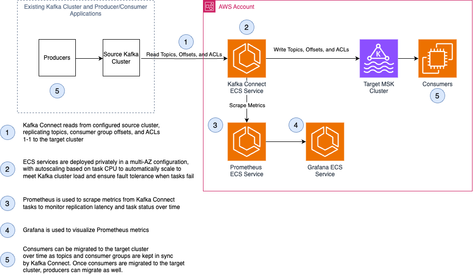
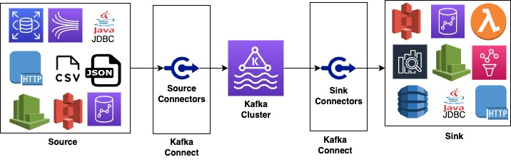
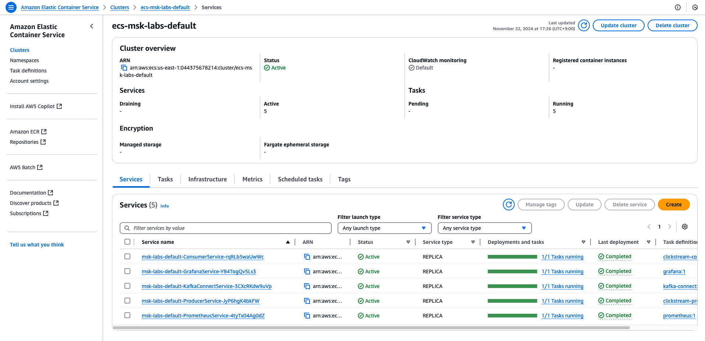
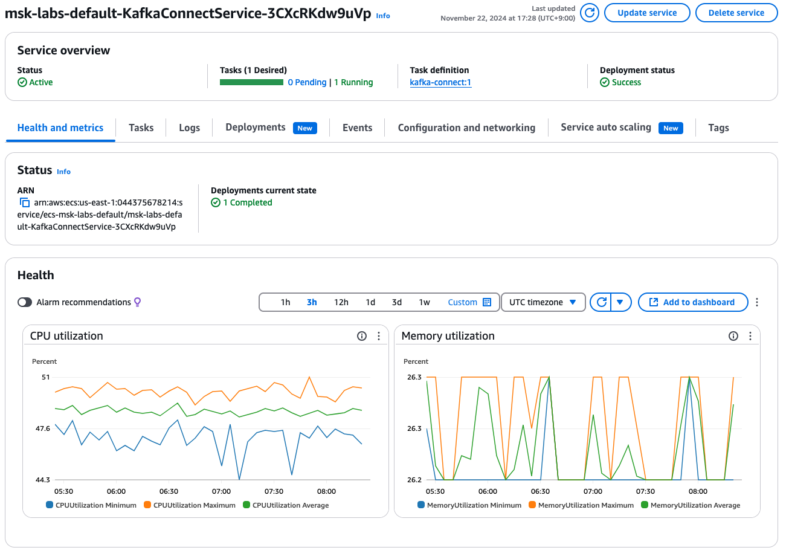
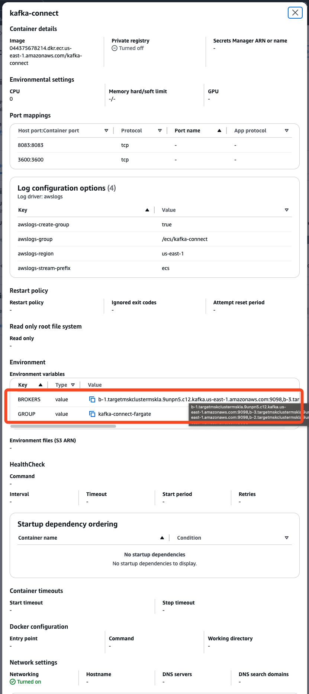
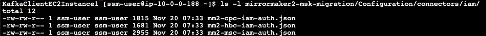
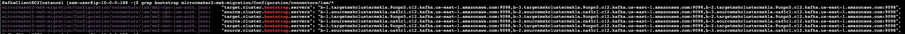

## 워크숍 개요

해당 워크숍에서는 MirrorMaker2를 이용해 기존의 온프레미스 kafka를 AWS MSK로 이전하는 과정을 가정하고 실습한다.
온프레미스 kafka는 ec2에, 타겟 MSK는 ECS로 구성되어 있다.

마이그레이션 워크샵에서 사용되는 중요 기술들



MSK(Amazon Managed Streaming for Apache Kafka): 오픈소스 버전의 Apache Kafka로 기존 kafka의 파트너와 커뮤니티에서 제공되는 도구와 플러그인을 그대로 사용할 수 있다

## MSK 설명

### Kafka Connect
Apache Kafka의 오픈소스 컴포넌트로 데이터베이스나 key-value 스토어, 검색 인덱스나 파일시스템 같은 외부 시스템과의 연결을 위한 프레임워크를 제공



- REST 인터페이스: 손쉽게 사용할 수 있는 REST API를 통해 Kafka Connect 클러스터에 커넥터를 제출(submit)하고 관리
- offset 자동 관리: 커넥터에서 제공되는 소량의 정보를 사용해 Kafka Connect가 오프셋 커밋 프로세스를 자동으로 관리
- 분산 및 확장이 기본적으로 가능

## Mirror Maker 2
Consumer들이 다운타임 없이 자체 관리형 Apache Kafka 클러스터에서 Amazon MSK 클러스터로 마이그레이션 할 수 있도록 도와준다. MM2는 Kafka Connect 프레임워크를 기반으로 하는 멀티 클러스터 데이터 복제 엔진


## 실습
### Kafka Connect 배포

미리 빌드되고 배포된 ECS 서비스가 존재하며, 소스 클러스터에서 대상 클러스터로 topic을 1대1로 복제하는 커스텀 복제 정책을 포함하고 있다.(ex topic 이름이 topicA였다면 동일하게 topicA로 복제하는 정책)



ECS의 카프카 커넥트 서비스를 확인할 수 있다.



작업 정의 화면에서 kafka-connect의 컨테이너 정의를 보면 kafka connect가 타겟 클러스터 대상으로 kafka-connect-fargate Consumer Group 명으로 동작하도록 설정되어있음을 BROKERS와 GROUP 환경변수를 통해 확인할 수 있다.



### MirrorMaker2 설정
소스 클러스터에서 타겟 클러스터로 데이터스트림을 복제하기 위해 Kafka Connect API를 통해 커넥터를 실행해야 한다. 위치는 동일한 VPC의 EC2이며 소스와 타겟이 가까울수록 좋다.

1. MM2 태스크 설정 파일 구성

1. 터미널을 이용해 mirrormaker2를 clone한다.
    ```bash
    cd /home/ssm-user/
    git clone https://github.com/aws-samples/mirrormaker2-msk-migration
    ```

2. mirrormaker2-msk-migration/Configuration/connectors/iam/ 내의 설정 파일들을 확인한다. 이 폴더에 다음과 같은 세 개의 커넥터 설정파일이 존재한다: mm2-cpc-iam-auth.json, mm2-hbc-iam-auth.json, mm2-msc-iam-auth.json`
   
3. 
    각 파일에서 준비된 MSK 클러스터를 사용하도록 소스 및 대상 부트스트랩 서버 설정을 업데이트해야 한다. 각 파일에서 다음 내용에 해당되는 줄(line)을 업데이트해야 한다: "target.cluster.bootstrap.servers": "{TARGET CLUSTER BROKERS ADDRESS}", "source.cluster.bootstrap.servers": "{SOURCE CLUSTER BROKERS ADDRESS}",
    이 작업을 위해 다음 명령을 실행합니다:
    ```bash
    export SOURCE_BROKERS=$(aws cloudformation describe-stacks --stack-name $MSK_STACK --query 'Stacks[0].Outputs[?OutputKey==`SourceClusterBrokerString`].OutputValue' --output text)
    export TARGET_BROKERS=$(aws cloudformation describe-stacks --stack-name $MSK_STACK --query 'Stacks[0].Outputs[?OutputKey==`TargetClusterBrokerString`].OutputValue' --output text)

    sed -i \
        -e "s/{TARGET CLUSTER BROKERS ADDRESS}/${TARGET_BROKERS}/" \
        -e "s/{SOURCE CLUSTER BROKERS ADDRESS}/${SOURCE_BROKERS}/" \
        mirrormaker2-msk-migration/Configuration/connectors/iam/*
    ``

4. 해당 명령어 사용으로 설정 업데이트 여부를 확인할 수 있다.
   


2. MM2 Kafka Connect 태스크 배포