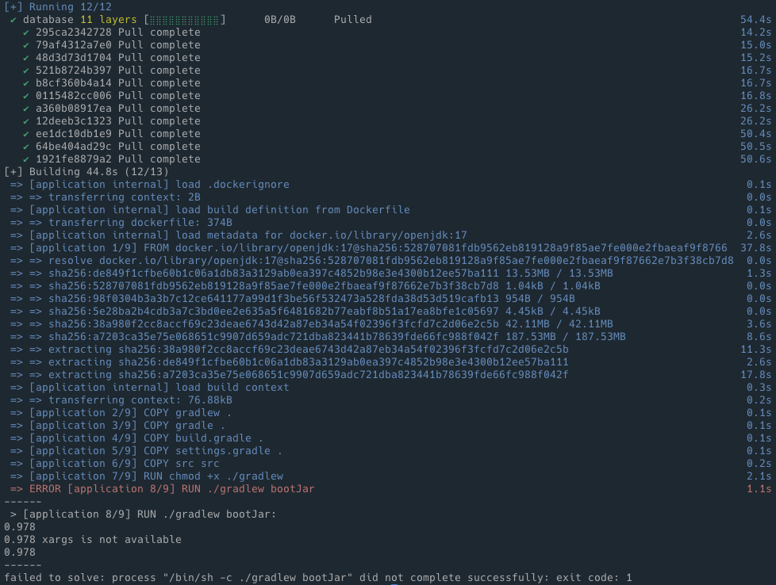

# Dockerfile에서 bootRun을 실행했을 때 생기는 문제

```bash
FROM openjdk:17 AS builder
# 추가된 부분
# xargs 에러 해결을 위한 install
# RUN microdnf install findutils

COPY gradlew .
COPY gradle gradle
COPY build.gradle .
COPY settings.gradle .
COPY src src
RUN chmod +x ./gradlew
RUN ./gradlew bootJar

FROM openjdk:17
COPY --from=builder build/libs/*.jar app.jar

ENV TZ=Asia/Seoul
ENTRYPOINT ["java", "-jar", "app.jar"]
VOLUME /tmp
```

해당 Dockerfile은 다음과 같은 형식이었고 다음과 같은 문제가 발생했습니다.



왜 동일 문제가 제 컴퓨터에서 일어나지는 않았는지에 대해 알 수는 없었지만 다른 팀원분의 컴퓨터(mac OS)에서 해당 문제가 발생했고, 클라우드 (unbuntu 20.04)환경에서 실행해본 결과도 동일한 문제가 발생했습니다.

명시되어 있듯이 xargs가 존재하지 않는 이유였습니다.

[stackoverflow](https://stackoverflow.com/questions/73516116/got-error-xargs-is-not-available-when-trying-to-run-a-docker-image)

Gradle 7.5 버전부터는 빌드시 명시적 xargs 체크가 추가됐기 때문이었습니다.

xargs는 표준 입력에서 데이터 스트림을 읽은 다음 커맨드를 실행하는 명령으로 명령의 출력을 가져와 다른 명령의 인수로 전달할 수 있습니다. 기본은 echo 셋팅입니다. 

해당 [링크](https://github.com/gradle/gradle/issues/19682)를 보면 JAVA_OPTS는 자바 앱이 자바 명령을 실행하는 호출에 추가하는 표준 환경변수인데 xargs가 실행되지 않은 경우 Unix 시작 스크립트가 JAVA_OPTS를 전달하지 않기 때문에 xargs의 존재 여부 체크가 추가되었다고 합니다.

따라서 `RUN microdnf install findutils` 명령어를 추가해줌으로써 정상 실행 결과를 얻을 수 있었습니다.