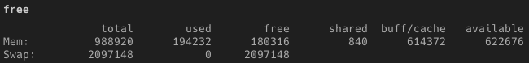
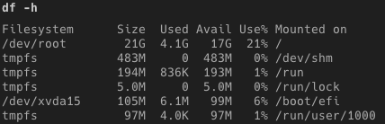

- [1. 프로젝트 세팅](#1-프로젝트-세팅)
  - [깃 브랜치 전략](#깃-브랜치-전략)
  - [공통 개발환경 구상](#공통-개발환경-구상)
  - [협업을 위한 API 명세서 작성](#협업을-위한-api-명세서-작성)
- [2. 양방향 연관관계에서 주인에 값을 입력하지 않으면 데이터베이스에 외래키가 반영되지 않는다.](#2-양방향-연관관계에서-주인에-값을-입력하지-않으면-데이터베이스에-외래키가-반영되지-않는다)
- [3. queryDsl의 from절 서브쿼리 미지원 문제](#3-querydsl의-from절-서브쿼리-미지원-문제)

# 1. 프로젝트 세팅

## 깃 브랜치 전략
본래 git-flow를 사용하려 했으나 3명의 팀원으로 구성된 작은 조직에서 운용하기는 무겁다고 판단  
- develop
- alpha
- main 
- 본인의 이름을 딴 브랜치

이렇게 네 종류의 브랜치를 사용하기로 했다. 각각의 개발은 본인의 브랜치에서 진행하고 이를 병합하고 테스트 서버를 운영하기 위한 develop 브랜치, 병합한 브랜치의 버전을 관리할 alpha브랜치, 실제 배포를 진행할 main브랜치로 구성됐다.


## 공통 개발환경 구상
각자 다른 환경(mac, windows)에서 개발을 진행하기 때문에 테스트 환경을 통일하기 위해 docker-compose를 선택했다. 

`Dockerfile`
```bash
FROM openjdk:17 AS builder
# xargs 에러 해결을 위한 install
RUN microdnf install findutils

COPY gradlew .
COPY gradle gradle
COPY build.gradle .
COPY settings.gradle .
COPY src src
RUN chmod +x ./gradlew
RUN ./gradlew bootJar

FROM openjdk:17
COPY --from=builder build/libs/*.jar app.jar

ENV TZ=Asia/Seoul
ENTRYPOINT ["java", "-jar", "app.jar"]
VOLUME /tmp
```

`docker-compose.yml`
```bash
version: "3.9"
services:
  database:
    container_name: mysql-vegiedo
    image: mysql:8.0.30
    platform: linux/x86_64
    restart: always
    ports:
      - "3306:3306"
    environment:
      MYSQL_ROOT_PASSWORD: password
      MYSQL_DATABASE: vegiedo_mysql
      MYSQL_USER: vegiedo
      MYSQL_PASSWORD: password
      TZ: Asia/Seoul
    volumes:
      - ./db/data:/var/lib/mysql
      - ./db/config:/etc/mysql/conf.d
      - ./db/init:/docker-entrypoint-initdb.d
    healthcheck:
      test: [ "CMD", "mysqladmin" ,"ping", "-h", "localhost" ]
      interval: 3s
      timeout: 20s
      retries: 10
    networks:
      - dev-network

  application:
    container_name: server
    restart: always
    build:
      dockerfile: Dockerfile
    ports:
      - "8000:8080"
    environment:
      SPRING_DATASOURCE_URL: jdbc:mysql://mysql-vegiedo:3306?allowPublicKeyRetrieval=true
      SPRING_DATASOURCE_USERNAME: "vegiedo"
      SPRING_DATASOURCE_PASSWORD: "password"
    depends_on:
      database:
        condition: service_healthy
    networks:
      - dev-network
    command: ./gradlew bootRun

networks:
  dev-network:

```

JAVA 17, MySQL8.0.3 버전을 사용하며 데이터베이스와 어플리케이션의 의존관계로 인한 다수의 부팅을 방지하기 위해 mysqldml healthcheck를 spring application의 의존성으로 추가했다.  
각각의 서버는 dev-network라는 네트워크에서 서로의 컨테이너 이름으로 통신하게 된다.

## 협업을 위한 API 명세서 작성
API 명세서는 SPRING REST DOCS를 이용해 구성하기로 했지만 개발이 진행 된 후 테스트 코드 작성 후에야 가능한 조건이었기 때문에 notion 협업 페이지에 API 명세서를 작성했습니다.

# 2. 양방향 연관관계에서 주인에 값을 입력하지 않으면 데이터베이스에 외래키가 반영되지 않는다.


# 3. queryDsl의 from절 서브쿼리 미지원 문제

```sql
@Override
public List<StoreSummaryConvertingDto> searchWithoutStampBook(Long userId, String keyword, Set<TagOption> options, Location start, Location end, Pageable pageable) {
    return queryFactory
            .select(Projections.constructor(StoreSummaryConvertingDto.class,
                    store.id,
                    store.storeName,
                    store.address,
                    store.location.latitude,
                    store.location.longitude,
                    Expressions.asNumber(1),
                    store.stars,
                    JPAExpressions
                            .select(Expressions.stringTemplate("GROUP_CONCAT({0})", storeTag.tagName))
                            .from(storeTag)
                            .where(store.id.eq(storeTag.store.id)),
                    new CaseBuilder()
                            .when(storeLike.id.isNull()).then(false)
                            .otherwise(true),
                    new CaseBuilder()
                            .when(stamp.id.isNull()).then(false)
                            .otherwise(true),
                    JPAExpressions
                            .select(storeReview.count())
                            .from(storeReview)
                            .where(storeReview.store.id.eq(store.id)),
                    storeImage.url
            ))
            .from(store)
            .leftJoin(storeLike)
            .on(storeLike.user.id.eq(userId))
            .leftJoin(stamp)
            .on(stamp.user.id.eq(userId))
            .innerJoin(storeTag)
            .on(store.id.eq(storeTag.store.id))
            .leftJoin(storeImage)
            .on(storeImage.id.eq(store.images.id))
            .where(keywordStartWith(keyword),
                    store.deleteAt.isNull(),
                    store.location.latitude.between(start.latitude(), end.latitude()),
                    store.location.longitude.between(start.longitude(), end.longitude()))
            .offset(pageable.getOffset())
            .limit(pageable.getPageSize())
            .fetch();
    }

```

4. docker로 테스트 서버 배포시 메모리 부족 문제

swap memory를 통해 해결

```linux
sudo dd if=/dev/zero of=/swapfile bs=128M count=16
```
128M * 16으로 2GB로 swapfile 메모리 할당

```linux
sudo chmod 600 /swapfile
```

swapfile에 접근 권한 설정

```linux
sudo mkswap /swapfile
```
mkswap  명령어로 swapfile을 추가할 swap 공간 생성

```linux
sudo swapon /swapfile
```
swap 공간에 swapfile 추가

```linux
sudo vi /etc/fstab

/swapfile swap swap defaults 0 0
```

fstab 수정, 파일시스템 변경사항 저장





4. 테스트 환경 구축
5. API 문서
6. 조회쿼리
쿼리 테스트 해보기
인덱스도 추가 할 수 있다.

7. JPA 연관관계 설정

@OneToMany(mappedBy = "storeReview", cascade = CascadeType.ALL, orphanRemoval = true, fetch = FetchType.LAZY)
private List<StoreReviewImage> images = new ArrayList<>();

착오로 위와 같이 설정했을 때 외래키가 두 개 생기는 일이 있었다.

이유를 모르겠네


8. nginx를 이용한 리버스 프록시

웹 서버: 웹 서비스를 사용할 수 있게 도와주는 공통규약을 사용하는 서버
Apacheㅣ 1996년 출시된 오픈소스 웹서버로 엔진엑스에 비해 다양한 기능이 있어 비교적 느리다.

