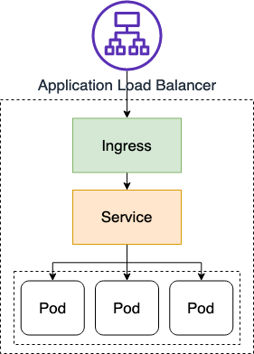
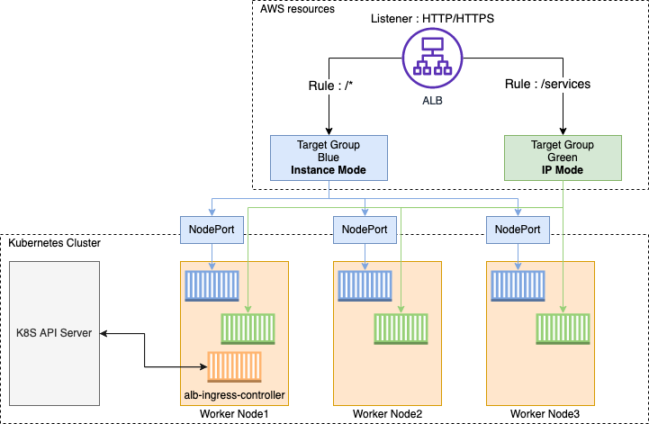
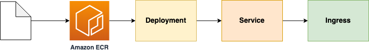
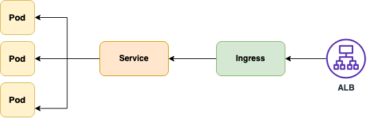
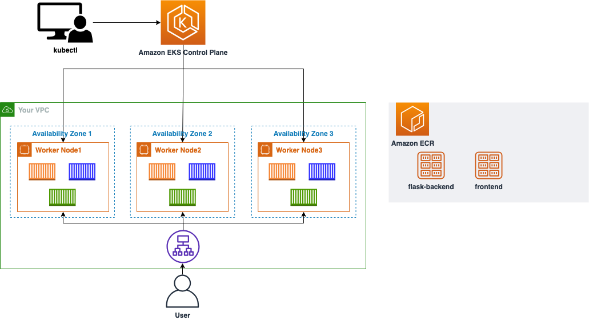
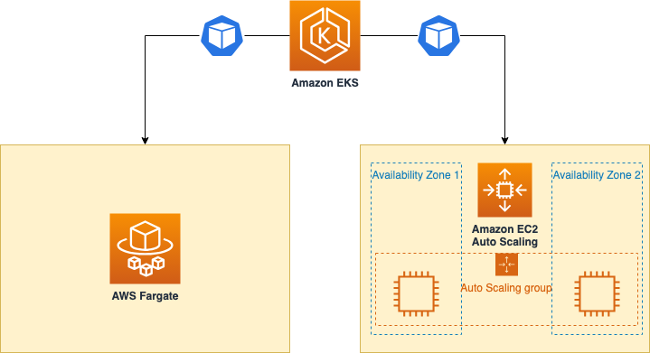
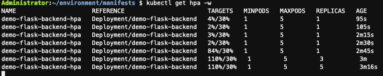
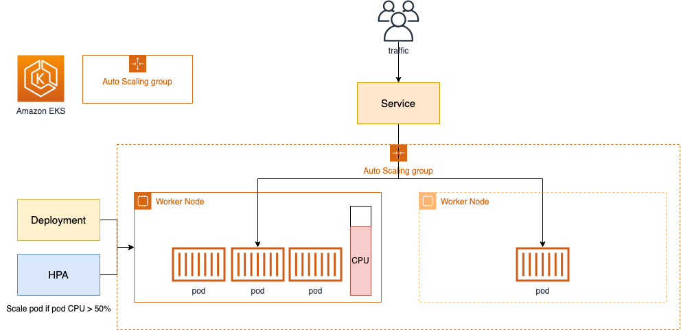
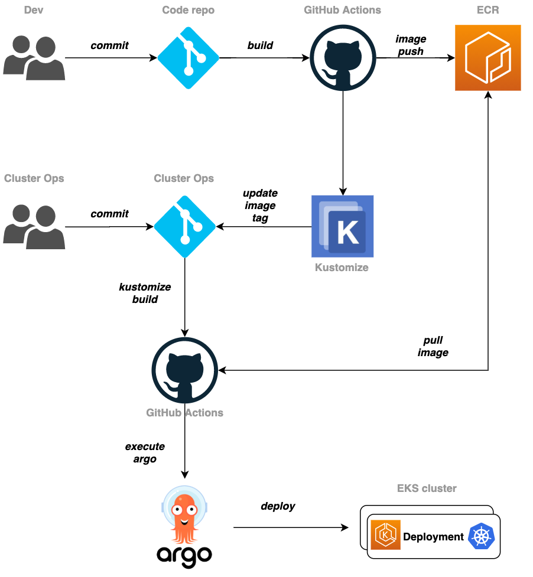
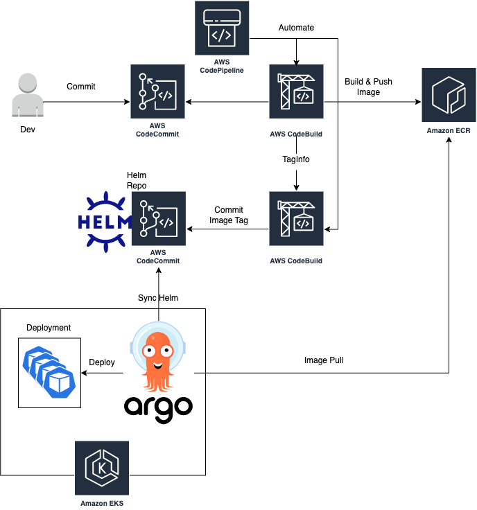

- [EKS workshop](#eks-workshop)
  - [워크샵 기본 정보](#워크샵-기본-정보)
    - [Kubernetes(k8s)란](#kubernetesk8s란)
    - [Amazon EKS](#amazon-eks)
  - [실습 환경 구축](#실습-환경-구축)
    - [Administrator 사용자 분리](#administrator-사용자-분리)
    - [Cloud9](#cloud9)
    - [kubectl 설치](#kubectl-설치)
    - [eksctl 설치](#eksctl-설치)
    - [AWS Cloud9 추가 셋팅하기](#aws-cloud9-추가-셋팅하기)
  - [도커 컨테이너 이미지 만들기](#도커-컨테이너-이미지-만들기)
    - [Amazon ECR 리포지토리 생성 및 이미지 올리기](#amazon-ecr-리포지토리-생성-및-이미지-올리기)
  - [EKS 클러스터 생성하기](#eks-클러스터-생성하기)
    - [eksctl로 클러스터 생성하기](#eksctl로-클러스터-생성하기)
    - [콘솔 크레덴셜 더하기](#콘솔-크레덴셜-더하기)
  - [인그레스 컨트롤러 만들기](#인그레스-컨트롤러-만들기)
    - [AWS Load Balancer 컨트롤러 만들기](#aws-load-balancer-컨트롤러-만들기)
    - [클러스터에 컨트롤러 추가하기](#클러스터에-컨트롤러-추가하기)
  - [서비스 배포하기](#서비스-배포하기)
  - [AWS Fargate 사용하기](#aws-fargate-사용하기)
    - [AWS Fargate로 배포하기](#aws-fargate로-배포하기)
  - [Container Insights 사용하기](#container-insights-사용하기)
  - [Autoscaling Pod \& Cluster](#autoscaling-pod--cluster)
    - [HPA를 사용해 파드 스케일링 적용하기](#hpa를-사용해-파드-스케일링-적용하기)
    - [Cluster Autoscaler 적용하기](#cluster-autoscaler-적용하기)
  - [CI/CD for EKS cluster](#cicd-for-eks-cluster)
    - [EKS 클러스터, Kubernetes를 위한 CI/CD](#eks-클러스터-kubernetes를-위한-cicd)
    - [EKS 클러스터, kubernetes를 위한 CI/CD with HELM / CDK](#eks-클러스터-kubernetes를-위한-cicd-with-helm--cdk)

# [EKS workshop](https://catalog.us-east-1.prod.workshops.aws/workshops/9c0aa9ab-90a9-44a6-abe1-8dff360ae428/ko-KR)

## 워크샵 기본 정보

### Kubernetes(k8s)란
컨테이너화된 워크로드와 서비스를 관리하기 위한 이식성있고 확장가능한 오픈소스 플랫폼

- 선언적 구성
- 자동화  
  
에 특화되어 있다.


- 클러스터: 노드의 집합
- 노드: `컨트롤 플레인`과 `데이터 플레인`으로 구성
  - 컨트롤 플레인: 워커 노드와 클러스터 내 파드를 관리하고 제어
  - 데이터 플레인: 워커 노드로 구성되어 있어 컨테이너화된 애플리케이션의 구성 요소인 파드를 호스트

Kubernetes Objects(pod, service, deployment): 바라는 상태를 담은 레코드로 오브젝트를 생성하면 쿠버네티스의 컨트롤 플레인에서 오브젝트의 현재 상태와 바라는 상태를 일치시키기 위해 끊임없이 관리한다.


### Amazon EKS
EKS: Kubernetes를 쉽게 실행할 수 있는 관리형 서비스로 EKS 사용시 컨트롤 플레인, 노드를 직접 설치, 운영, 유지할 필요가 없다.

애플리케이션에 대한 확장성 및 보안을 제공하는 서비스를 제공한다.

- 컨테이너 이미지 저장소인 Amazon ECR(Elastic Container Registry)
- 로드 분산을 위한 AWS ELB(Elastic Load Balancing)
- 인증을 위한 AWS IAM
- 격리된 Amazon VPC

## 실습 환경 구축

- Administrator 사용자 분리
- Cloud9 구성
  - AWS Cloud9으로 IDE 구성
  - IAM Role 생성
  - IDE(AWS Cloud9 인스턴스)에 IAM Role 부여
  - IDE에서 IAM 설정 업데이트
- Kubectl 설치
- 그 외의 툴 설치
- eksctl 설치
- AWS Cloud9 추가 셋팅

### Administrator 사용자 분리
Root User가 아닌 Administrator 계정을 생성해 해당 계정으로 로그인 한 후 작업을 진행한다.

### Cloud9
브라우저만으로 코드를 작성, 실행 및 디버깅할 수 있는 클라우드 기반 IDE

Cloud9은 IAM credentials을 동적으로 관리한다. 이는 EKS IAM authentication과 호환되지 않기 때문에 비활성화하고 Cloud9에 IAM Role을 붙인다.

Cloud9 접속 -> Settings -> AWS SETTINGS -> Credentials off

<details>
<summary>IAM credentials, EKS IAM Authentication의 차이점</summary>

- IAM Credentials (IAM 자격 증명):
  - **IAM (Identity and Access Management)** 은 AWS에서 사용자, 그룹 및 역할을 관리하는 서비스
  - IAM credentials는 AWS 리소스에 액세스할 때 필요한 액세스 키와 비밀 키로 구성
  - 이러한 자격 증명은 정적으로 관리되며, 사용자가 직접 생성하거나 관리
  - 예를 들어, AWS CLI, SDK 또는 다른 AWS 서비스에 액세스할 때 사용
  - AWS Cloud9은 일반적으로 이러한 IAM credentials를 동적으로 관리
  
- EKS IAM Authentication (EKS IAM 인증):
  - **Amazon EKS (Elastic Kubernetes Service)** 는 Kubernetes 클러스터를 관리하기 위한 관리형 서비스
  - EKS IAM authentication은 Kubernetes 클러스터에 액세스할 때 사용되는 인증 방법
  - EKS 클러스터에 액세스하려면 Kubernetes kubeconfig 파일을 구성해야 한다
  이 kubeconfig 파일은 aws-iam-authenticator 플러그인을 사용하여 생성된다
  - aws-iam-authenticator는 IAM credentials 대신 AWS IAM 역할을 사용하여 EKS 클러스터에 액세스한다

- 차이점:
  - IAM credentials는 AWS 리소스에 액세스할 때 사용되는 정적인 자격 증명
  - EKS IAM authentication은 Kubernetes 클러스터에 액세스할 때 사용되는 동적인 인증 방법
  - EKS IAM authentication은 aws-iam-authenticator 플러그인을 통해 IAM 역할을 활용하여 작동

</details>

### kubectl 설치
kubectl: 쿠버네티스 클러스터에 명령을 내리는 CLI로 쿠버네티스는 오브젝트 관리를 위해 쿠버네티스 API를 사용하는데 kubectl CLI를 사용하면 해당 명령어가 쿠버네티스 API를 호출해 관련 동작을 수행한다.

[링크](https://docs.aws.amazon.com/eks/latest/userguide/install-kubectl.html)

### eksctl 설치
EKS 클러스터를 배포하는 방식 중 하나로 AWS콘솔, CloudFormation, CDK, eksctl, Terraform 등의 대안이 존재한다.

```bash
curl --silent --location "https://github.com/weaveworks/eksctl/releases/latest/download/eksctl_$(uname -s)_amd64.tar.gz" | tar xz -C /tmp
```

### AWS Cloud9 추가 셋팅하기


```bash
TOKEN=$(curl -s -X PUT "http://169.254.169.254/latest/api/token" -H "X-aws-ec2-metadata-token-ttl-seconds: 21600")

# -s: 결과 화면 출력 X
# -X: 태그 없이 요청을 보내면 GET 요청이 들어가고 그 외의 Post등은 지정할 수 있는데 PUT는 존재하지 않는다.
# -H: header
```
추가로 해당 ip는 인스턴스 메타데이터를 검색하기 위한 것으로 [링크](https://docs.aws.amazon.com/ko_kr/AWSEC2/latest/UserGuide/instancedata-data-retrieval.html)를 확인하면 된다.

```bash
export AWS_REGION=$(curl -s -H "X-aws-ec2-metadata-token: $TOKEN" http://169.254.169.254/latest/dynamic/instance-identity/document | jq -r '.region')

# | 앞부분: 윗부분에서 가져온 토큰으로 region 검색
# 뒷부분: json 형식에서 region을 추출, 여기에서 나오는 정보는 다음과 같다.

# {
#   "accountId" : "",
#   "architecture" : "",
#   "availabilityZone" : "",
#   "billingProducts" : ,
#   "devpayProductCodes" : ,
#   "marketplaceProductCodes" : ,
#   "imageId" : "",
#   "instanceId" : "",
#   "instanceType" : "",
#   "kernelId" : ,
#   "pendingTime" : "",
#   "privateIp" : "",
#   "ramdiskId" : ,
#   "region" : "",
#   "version" : ""
# }

echo "export AWS_REGION=${AWS_REGION}" | tee -a ~/.bash_profile
# tee: 결과값을 출력하면서 동시에 저장하는 명령어, echo는 출력은 되지 않는다.

aws configure set default.region ${AWS_REGION}
# 실습 진행되고 있는 리전을 기본 값으로 설정

aws configure get default.region
# 설정한 리전 값을 확인

export ACCOUNT_ID=$(aws sts get-caller-identity --query 'Account' --output text)

echo "export ACCOUNT_ID=${ACCOUNT_ID}" | tee -a ~/.bash_profile

wget https://gist.githubusercontent.com/joozero/b48ee68e2174a4f1ead93aaf2b582090/raw/2dda79390a10328df66e5f6162846017c682bef5/resize.sh
# 웹에서 파일 다운로드를 도와주는 유틸리티로 HTTP, HTTPS, FTP프로토콜을 이용해 웹서버에서 파일을 다운로드

```

## 도커 컨테이너 이미지 만들기
기본적인 도커 실습으로 생략

### Amazon ECR 리포지토리 생성 및 이미지 올리기

```bash
git clone https://github.com/joozero/amazon-eks-flask.git

aws ecr create-repository \
--repository-name demo-flask-backend \
--image-scanning-configuration scanOnPush=true \
--region ${AWS_REGION}
```

해당 Command를 입력하면 ECR 콘솔창에서 생성된 리포지토리 확인 가능

```bash
aws ecr get-login-password --region ${AWS_REGION} | docker login --username AWS --password-stdin $ACCOUNT_ID.dkr.ecr.$AWS_REGION.amazonaws.com
```

컨테이너 이미지를 푸시하기 위한 도커 로그인 작업

```bash
cd ~/environment/amazon-eks-flask

docker build -t demo-flask-backend .
```

이미지 빌드

```bash
docker tag demo-flask-backend:latest $ACCOUNT_ID.dkr.ecr.$AWS_REGION.amazonaws.com/demo-flask-backend:latest
```

태그를 통해 특정 레포지토리에 푸시될 수 있게 설정

```bash
docker push $ACCOUNT_ID.dkr.ecr.$AWS_REGION.amazonaws.com/demo-flask-backend:latest
```

이미지를 레포지토리에 푸시, 실제 ECR에 저장되어 있다.

## EKS 클러스터 생성하기
EKS 클러스터 배포는 다양한 방식이 될 수 있다.

- AWS 콘솔 창에서 클릭으로 배포
- AWS CloudFormation 혹은 CDK같은 IaC도구
- EKS 공식 CLI eksctl
- Terraform, Pulumi, Rancher

### eksctl로 클러스터 생성하기

아무 설정 값을 주지 않고 `eksctl create cluster`를 실행하면 default parameter로 클러스터가 배포되지만, 몇 가지 값을 커스텀하게 주기 위해 구성 파일을 작성한다. 이는 오브젝트들의 바라는 상태를 쉽게 파악하고 관리할 수 있는 이점을 가져다준다. [링크](https://eksctl.io/usage/creating-and-managing-clusters/)를 참고하자.

```bash
cat << EOF > eks-demo-cluster.yaml
---
apiVersion: eksctl.io/v1alpha5
kind: ClusterConfig

metadata:
  name: eks-demo # 생성할 EKS 클러스터명
  region: ${AWS_REGION} # 클러스터를 생성할 리전
  version: "1.27"

vpc:
  cidr: "10.0.0.0/16" # 클러스터에서 사용할 VPC의 CIDR
  nat:
    gateway: HighlyAvailable

managedNodeGroups:
  - name: node-group # 클러스터의 노드 그룹명
    instanceType: m5.large # 클러스터 워커 노드의 인스턴스 타입
    desiredCapacity: 3 # 클러스터 워커 노드의 갯수
    volumeSize: 20  # 클러스터 워커 노드의 EBS 용량 (단위: GiB)
    privateNetworking: true
    iam:
      withAddonPolicies:
        imageBuilder: true # Amazon ECR에 대한 권한 추가
        albIngress: true  # albIngress에 대한 권한 추가
        cloudWatch: true # cloudWatch에 대한 권한 추가
        autoScaler: true # auto scaling에 대한 권한 추가
        ebs: true # EBS CSI Driver에 대한 권한 추가

cloudWatch:
  clusterLogging:
    enableTypes: ["*"]

iam:
  withOIDC: true
EOF
```

```bash
eksctl create cluster -f eks-demo-cluster.yaml
```

### 콘솔 크레덴셜 더하기
위의 클러스터는 cloud9의 IAM credentials를 통해 생성했기 때문에 해당 클러스터 정보를 확인하기 위해서는 실제 콘솔에 접근할 IAM entity의 AWS Console credentials을 클러스터에 추가하는 작업이 필요하다.

```bash
rolearn=$(aws cloud9 describe-environment-memberships --environment-id=$C9_PID | jq -r '.memberships[].userArn')
# rolearn 정의

echo ${rolearn}

eksctl create iamidentitymapping --cluster eks-demo --arn ${rolearn} --group system:masters --username admin
# identity 매핑을 생성
```

## 인그레스 컨트롤러 만들기
인그레스 컨트롤러란 외부에서 클러스터 내부로 접근할 때 요청들을 어떻게 처리할지 정의해놓은 규칙이자 리소스 오브젝트



NodePort, LoadBalancer로도 외부에 노출할 수 있지만 그럴경우 모든 서비스에 인증서와 라우팅 규칙을 설정해야 하기 때문에 사용한다.

### AWS Load Balancer 컨트롤러 만들기

- Kubernetes의 Ingress는 Application Load Balancer로 프로비저닝
- Service는 NLB로 프로비저닝

AWS Load Balancer 컨트롤러에서 지원하는 트래픽 모드는 두 가지로

- Instance(default): 클러스터 내의 노드를 ALB의 대상으로 등록, ALB 트래픽은 NodePort로 라우팅 된 다음 파드로 프록시
- IP: 파드를 ALB의 대상으로 등록, ALB 트래픽은 파드로 직접 라우팅, 해당 모드 사용을 위해선 Ingress.yaml파일을 수정해야 한다.



AWS Load Balancer를 배포하기 전 controller가 워커 노드 위에서 동작하기 때문에 IAM permissions를 통해 AWS ALB/NLB 리소스에 접근할 수 있도록 IAM permissions는 ServiceAccount를 위한 IAM roles를 설치하거나 워커 노드의 IAM roles에 직접 붙일 수 있다.

1. 로드밸런서 컨트롤러 배포 전 클러스터에 대한 IAM OIDC identity provider를 생성해야 한다. 쿠버네티스가 직접 관리하는 사용자 계정인 service Account에 IAM role을 사용하기 위해 생성된 클러스터에 IAM OIDC provider가 존재해야 한다.

```bash
eksctl utils associate-iam-oidc-provider \
    --region ${AWS_REGION} \
    --cluster eks-demo \
    --approve

# IAM Open ID Connect provider is already associated with cluster "eks-demo" in "ap-northeast-2"
```

AWS Load Balancer Controller에 부여할 IAM Policy를 생성하는 작업

```bash
curl -O https://raw.githubusercontent.com/kubernetes-sigs/aws-load-balancer-controller/v2.5.4/docs/install/iam_policy.json

aws iam create-policy \
    --policy-name AWSLoadBalancerControllerIAMPolicy \
    --policy-document file://iam_policy.json

eksctl create iamserviceaccount \
    --cluster eks-demo \
    --namespace kube-system \
    --name aws-load-balancer-controller \
    --attach-policy-arn arn:aws:iam::$ACCOUNT_ID:policy/AWSLoadBalancerControllerIAMPolicy \
    --override-existing-serviceaccounts \
    --approve

```

### 클러스터에 컨트롤러 추가하기

```bash
kubectl apply -f https://github.com/cert-manager/cert-manager/releases/download/v1.12.0/cert-manager.yaml
# 우선 인증서 구성을 웹훅에 삽입할 수 있게 cert-manager를 설치

curl -Lo v2_5_4_full.yaml https://github.com/kubernetes-sigs/aws-load-balancer-controller/releases/download/v2.5.4/v2_5_4_full.yaml
# Load balancer controller yaml 파일을 다운로드

sed -i.bak -e '596,604d' ./v2_5_4_full.yaml
# 매니페스트 파일의 ServiceAccount 섹션을 제거하는데 이 과정이 없다면 이전 단계에서 작업한 service account의 필수 annotation이 덮어씌워진다.

sed -i.bak -e 's|your-cluster-name|eks-demo|' ./v2_5_4_full.yaml
# Deployment 섹션의 my-cluster를 현재 eks실습에 사용되는 클러스터 이름으로 변경

kubectl apply -f v2_5_4_full.yaml
# AWS Load Balancer Controller 파일을 배포

curl -Lo v2_5_4_ingclass.yaml https://github.com/kubernetes-sigs/aws-load-balancer-controller/releases/download/v2.5.4/v2_5_4_ingclass.yaml
# IngressClass 및 IngressClassParams 매니페스트를 다운로드하고 클러스터에 매니페스트를 적용

```

```bash
kubectl apply -f v2_5_4_ingclass.yaml
# 해당 명령어로 관련 로그를 확인 가능
```

<details>
<summary>로그</summary>

{"level":"info","ts":"2024-04-21T08:05:29Z","msg":"version","GitVersion":"v2.5.4","GitCommit":"fd1bbbbfad42fc1b05fc71027242e2fcc4496c44","BuildDate":"2023-07-12T22:41:48+0000"}
{"level":"info","ts":"2024-04-21T08:05:29Z","logger":"controller-runtime.metrics","msg":"Metrics server is starting to listen","addr":":8080"}
{"level":"info","ts":"2024-04-21T08:05:29Z","logger":"setup","msg":"adding health check for controller"}
{"level":"info","ts":"2024-04-21T08:05:29Z","logger":"controller-runtime.webhook","msg":"Registering webhook","path":"/mutate-v1-pod"}
{"level":"info","ts":"2024-04-21T08:05:29Z","logger":"controller-runtime.webhook","msg":"Registering webhook","path":"/mutate-v1-service"}
{"level":"info","ts":"2024-04-21T08:05:29Z","logger":"controller-runtime.webhook","msg":"Registering webhook","path":"/validate-elbv2-k8s-aws-v1beta1-ingressclassparams"}
{"level":"info","ts":"2024-04-21T08:05:29Z","logger":"controller-runtime.webhook","msg":"Registering webhook","path":"/mutate-elbv2-k8s-aws-v1beta1-targetgroupbinding"}
{"level":"info","ts":"2024-04-21T08:05:29Z","logger":"controller-runtime.webhook","msg":"Registering webhook","path":"/validate-elbv2-k8s-aws-v1beta1-targetgroupbinding"}
{"level":"info","ts":"2024-04-21T08:05:29Z","logger":"controller-runtime.webhook","msg":"Registering webhook","path":"/validate-networking-v1-ingress"}
{"level":"info","ts":"2024-04-21T08:05:29Z","logger":"setup","msg":"starting podInfo repo"}
{"level":"info","ts":"2024-04-21T08:05:31Z","msg":"Starting server","path":"/metrics","kind":"metrics","addr":"[::]:8080"}
{"level":"info","ts":"2024-04-21T08:05:31Z","logger":"controller-runtime.webhook.webhooks","msg":"Starting webhook server"}
{"level":"info","ts":"2024-04-21T08:05:31Z","msg":"Starting server","kind":"health probe","addr":"[::]:61779"}
{"level":"info","ts":"2024-04-21T08:05:31Z","logger":"controller-runtime.certwatcher","msg":"Updated current TLS certificate"}
{"level":"info","ts":"2024-04-21T08:05:31Z","logger":"controller-runtime.webhook","msg":"Serving webhook server","host":"","port":9443}
{"level":"info","ts":"2024-04-21T08:05:31Z","logger":"controller-runtime.certwatcher","msg":"Starting certificate watcher"}
I0421 08:05:31.929141       1 leaderelection.go:248] attempting to acquire leader lease kube-system/aws-load-balancer-controller-leader...
I0421 08:05:31.958006       1 leaderelection.go:258] successfully acquired lease kube-system/aws-load-balancer-controller-leader
{"level":"info","ts":"2024-04-21T08:05:31Z","msg":"Starting EventSource","controller":"ingress","source":"channel source: 0xc0002ec4b0"}
{"level":"info","ts":"2024-04-21T08:05:31Z","msg":"Starting EventSource","controller":"ingress","source":"channel source: 0xc0002ec500"}
{"level":"info","ts":"2024-04-21T08:05:31Z","msg":"Starting EventSource","controller":"ingress","source":"kind source: *v1.Ingress"}
{"level":"info","ts":"2024-04-21T08:05:31Z","msg":"Starting EventSource","controller":"ingress","source":"kind source: *v1.Service"}
{"level":"info","ts":"2024-04-21T08:05:31Z","msg":"Starting EventSource","controller":"ingress","source":"channel source: 0xc0002ec550"}
{"level":"info","ts":"2024-04-21T08:05:31Z","msg":"Starting EventSource","controller":"ingress","source":"channel source: 0xc0002ec5a0"}
{"level":"info","ts":"2024-04-21T08:05:31Z","msg":"Starting EventSource","controller":"ingress","source":"kind source: *v1beta1.IngressClassParams"}
{"level":"info","ts":"2024-04-21T08:05:31Z","msg":"Starting EventSource","controller":"ingress","source":"kind source: *v1.IngressClass"}
{"level":"info","ts":"2024-04-21T08:05:31Z","msg":"Starting Controller","controller":"ingress"}
{"level":"info","ts":"2024-04-21T08:05:31Z","msg":"Starting EventSource","controller":"targetGroupBinding","controllerGroup":"elbv2.k8s.aws","controllerKind":"TargetGroupBinding","source":"kind source: *v1beta1.TargetGroupBinding"}
{"level":"info","ts":"2024-04-21T08:05:31Z","msg":"Starting EventSource","controller":"targetGroupBinding","controllerGroup":"elbv2.k8s.aws","controllerKind":"TargetGroupBinding","source":"kind source: *v1.Service"}
{"level":"info","ts":"2024-04-21T08:05:31Z","msg":"Starting EventSource","controller":"targetGroupBinding","controllerGroup":"elbv2.k8s.aws","controllerKind":"TargetGroupBinding","source":"kind source: *v1.Endpoints"}
{"level":"info","ts":"2024-04-21T08:05:31Z","msg":"Starting EventSource","controller":"targetGroupBinding","controllerGroup":"elbv2.k8s.aws","controllerKind":"TargetGroupBinding","source":"kind source: *v1.Node"}
{"level":"info","ts":"2024-04-21T08:05:31Z","msg":"Starting Controller","controller":"targetGroupBinding","controllerGroup":"elbv2.k8s.aws","controllerKind":"TargetGroupBinding"}
{"level":"info","ts":"2024-04-21T08:05:31Z","msg":"Starting EventSource","controller":"service","source":"kind source: *v1.Service"}
{"level":"info","ts":"2024-04-21T08:05:31Z","msg":"Starting Controller","controller":"service"}
{"level":"info","ts":"2024-04-21T08:05:32Z","msg":"Starting workers","controller":"ingress","worker count":3}
{"level":"info","ts":"2024-04-21T08:05:32Z","msg":"Starting workers","controller":"service","worker count":3}
{"level":"info","ts":"2024-04-21T08:05:32Z","msg":"Starting workers","controller":"targetGroupBinding","controllerGroup":"elbv2.k8s.aws","controllerKind":"TargetGroupBinding","worker count":3}
</details>
<br><br>

```bash
ALBPOD=$(kubectl get pod -n kube-system | egrep -o "aws-load-balancer[a-zA-Z0-9-]+")

kubectl describe pod -n kube-system ${ALBPOD}
# 해당 명령어로 자세한 속성 값을 파악할 수 있다.
```


<details>
<summary>속성 값</summary>
Name:                 aws-load-balancer-controller-85f7c7f8c4-j7g9w
Namespace:            kube-system
Priority:             2000000000
Priority Class Name:  system-cluster-critical
Service Account:      aws-load-balancer-controller
Node:                 ip-10-0-166-71.ap-northeast-2.compute.internal/10.0.166.71
Start Time:           Sun, 21 Apr 2024 08:05:25 +0000
Labels:               app.kubernetes.io/component=controller
                      app.kubernetes.io/name=aws-load-balancer-controller
                      pod-template-hash=85f7c7f8c4
Annotations:          <none>
Status:               Running
IP:                   10.0.173.1
IPs:
  IP:           10.0.173.1
Controlled By:  ReplicaSet/aws-load-balancer-controller-85f7c7f8c4
Containers:
  controller:
    Container ID:  containerd://536d81b3b7a0360a0f8ba25108755e91931270590abb5886cde222216789666b
    Image:         public.ecr.aws/eks/aws-load-balancer-controller:v2.5.4
    Image ID:      public.ecr.aws/eks/aws-load-balancer-controller@sha256:764a2a43208b2d221883570eeb72647c7facc1988e1ef7ef388442272d8a980d
    Port:          9443/TCP
    Host Port:     0/TCP
    Args:
      --cluster-name=eks-demo
      --ingress-class=alb
    State:          Running
      Started:      Sun, 21 Apr 2024 08:05:29 +0000
    Ready:          True
    Restart Count:  0
    Limits:
      cpu:     200m
      memory:  500Mi
    Requests:
      cpu:     100m
      memory:  200Mi
    Liveness:  http-get http://:61779/healthz delay=30s timeout=10s period=10s #success=1 #failure=2
    Environment:
      AWS_STS_REGIONAL_ENDPOINTS:   regional
      AWS_DEFAULT_REGION:           ap-northeast-2
      AWS_REGION:                   ap-northeast-2
      AWS_ROLE_ARN:                 arn:aws:iam::566620743708:role/eksctl-eks-demo-addon-iamserviceaccount-kube--Role1-IWCN8BROTASH
      AWS_WEB_IDENTITY_TOKEN_FILE:  /var/run/secrets/eks.amazonaws.com/serviceaccount/token
    Mounts:
      /tmp/k8s-webhook-server/serving-certs from cert (ro)
      /var/run/secrets/eks.amazonaws.com/serviceaccount from aws-iam-token (ro)
      /var/run/secrets/kubernetes.io/serviceaccount from kube-api-access-vczsc (ro)
Conditions:
  Type              Status
  Initialized       True 
  Ready             True 
  ContainersReady   True 
  PodScheduled      True 
Volumes:
  aws-iam-token:
    Type:                    Projected (a volume that contains injected data from multiple sources)
    TokenExpirationSeconds:  86400
  cert:
    Type:        Secret (a volume populated by a Secret)
    SecretName:  aws-load-balancer-webhook-tls
    Optional:    false
  kube-api-access-vczsc:
    Type:                    Projected (a volume that contains injected data from multiple sources)
    TokenExpirationSeconds:  3607
    ConfigMapName:           kube-root-ca.crt
    ConfigMapOptional:       <nil>
    DownwardAPI:             true
QoS Class:                   Burstable
Node-Selectors:              <none>
Tolerations:                 node.kubernetes.io/not-ready:NoExecute op=Exists for 300s
                             node.kubernetes.io/unreachable:NoExecute op=Exists for 300s
Events:
  Type     Reason       Age   From               Message
  ----     ------       ----  ----               -------
  Normal   Scheduled    10m   default-scheduler  Successfully assigned kube-system/aws-load-balancer-controller-85f7c7f8c4-j7g9w to ip-10-0-166-71.ap-northeast-2.compute.internal
  Warning  FailedMount  10m   kubelet            MountVolume.SetUp failed for volume "cert" : secret "aws-load-balancer-webhook-tls" not found
  Normal   Pulling      10m   kubelet            Pulling image "public.ecr.aws/eks/aws-load-balancer-controller:v2.5.4"
  Normal   Pulled       10m   kubelet            Successfully pulled image "public.ecr.aws/eks/aws-load-balancer-controller:v2.5.4" in 3.377368838s (3.377390734s including waiting)
  Normal   Created      10m   kubelet            Created container controller
  Normal   Started      10m   kubelet            Started container controller
</details>

## 서비스 배포하기
웹 서비스를 구성하는 백, 프론트를 EKS에 배포할 것인데 각 서비스 배포 순서는 아래와 같다.



1. 소스 코드 다운로드
2. Amazon ECR에 각 서비스에 대한 리포지토리 생성
3. Dockerfile을 포함한 소스 코드 위치에서 컨테이너 이미지 빌드 후, 리포지토리에 푸시
4. 각 서비스에 대한 Deployment, Service, Ingress 매니페스트 파일 생성 및 배포

사용자의 접근 순서



순서대로 deployment -> service -> ingress yaml 파일을 작성해준다.

```bash
cat <<EOF> flask-deployment.yaml
---
apiVersion: apps/v1
kind: Deployment
metadata:
  name: demo-flask-backend
  namespace: default
spec:
  replicas: 3
  selector:
    matchLabels:
      app: demo-flask-backend
  template:
    metadata:
      labels:
        app: demo-flask-backend
    spec:
      containers:
        - name: demo-flask-backend
          image: $ACCOUNT_ID.dkr.ecr.$AWS_REGION.amazonaws.com/demo-flask-backend:latest
          imagePullPolicy: Always
          ports:
            - containerPort: 8080
EOF
```

```bash
cat <<EOF> flask-service.yaml
---
apiVersion: v1
kind: Service
metadata:
  name: demo-flask-backend
  annotations:
    alb.ingress.kubernetes.io/healthcheck-path: "/contents/aws"
spec:
  selector:
    app: demo-flask-backend
  type: NodePort
  ports:
    - port: 8080 # 서비스가 생성할 포트  
      targetPort: 8080 # 서비스가 접근할 pod의 포트
      protocol: TCP
EOF
```

```bash
cat <<EOF> flask-ingress.yaml
---
apiVersion: networking.k8s.io/v1
kind: Ingress
metadata:
    name: "flask-backend-ingress"
    namespace: default
    annotations:
      alb.ingress.kubernetes.io/scheme: internet-facing
      alb.ingress.kubernetes.io/target-type: ip
      alb.ingress.kubernetes.io/group.name: eks-demo-group
      alb.ingress.kubernetes.io/group.order: '1'
spec:
    ingressClassName: alb
    rules:
    - http:
        paths:
          - path: /contents
            pathType: Prefix
            backend:
              service:
                name: "demo-flask-backend"
                port:
                  number: 8080
EOF
```

이런식으로 백엔드 2개, 프론트엔드 1개를 배포하면



다음과 같은 아키텍쳐가 완성된다.


## AWS Fargate 사용하기



컨테이너에 적합한 서버리스 컴퓨팅 엔진으로 ECS, EKS에서 모두 작동하며 서버를 프로비저닝하고 관리할 필요 없어 애플리케이션별로 리소스를 지정하고 관련 비용을 지불할 수 있으며, 계획적으로 애플리케이션을 격리해 보안 성능을 향상시킬 수 있다.

### AWS Fargate로 배포하기

1. 클러스터에 Fargate로 pod를 배포하기 위해서는 pod가 실행될 때 사용하는 하나 이상의 fargate profile을 정의해야 한다. fargate profile은 fargate로 pod를 생성하기 위한 조건을 명시해놓은 프로파일이다.
    ```bash
    cat <<EOF> eks-demo-fargate-profile.yaml
    ---`
    apiVersion: eksctl.io/v1alpha5
    kind: ClusterConfig
    metadata:
    name: eks-demo
    region: ${AWS_REGION}
    fargateProfiles:
    - name: frontend-fargate-profile
        selectors:
        - namespace: default
            labels:
            app: frontend-fargate
    EOF`
    ```
2. fargate profile을 프로비저닝 
    ```bash
    eksctl create fargateprofile -f eks-demo-fargate-profile.yaml                         
    ```
3. Fargate profile 정상 생성 확인
    ```bash
    eksctl get fargateprofile --cluster eks-demo -o json
    ```
4. 기존 3개의 pod중 프론트앤드 pod를 fargate로 프로비저닝 하기 위해 기존의 pod 삭제
    ```bash
    kubectl delete -f frontend-deployment.yaml 
    ```
5. frontend-deployment.yaml파일의 label의 value값이 demo-frontend -> frontend-fargate로 변경되었다.
    ```bash
    cd /home/ec2-user/environment/manifests

    cat <<EOF> frontend-deployment.yaml
    ---
    apiVersion: apps/v1
    kind: Deployment
    metadata:
    name: demo-frontend
    namespace: default
    spec:
    replicas: 3
    selector:
        matchLabels:
        app: frontend-fargate
    template:
        metadata:
        labels:
            app: frontend-fargate
        spec:
        containers:
            - name: demo-frontend
            image: $ACCOUNT_ID.dkr.ecr.$AWS_REGION.amazonaws.com/demo-frontend:latest
            imagePullPolicy: Always
            ports:
                - containerPort: 80
    EOF
    ```
6. frontend-service.yaml파일도 수정
   ```bash
    cat <<EOF> frontend-service.yaml
    ---
    apiVersion: v1
    kind: Service
    metadata:
    name: demo-frontend
    annotations:
        alb.ingress.kubernetes.io/healthcheck-path: "/"
    spec:
    selector:
        app: frontend-fargate
    type: NodePort
    ports:
        - protocol: TCP
        port: 80
        targetPort: 80
    EOF
   ```

## Container Insights 사용하기
Amazon CloudWatch Container Insight: 컨테이너형 애플리케이션 및 마이크로 서비스에 대한 모니터링, 트러블 슈팅 및 알람을 위한 완전 관리형 관측 서비스로 cloudwatch콘솔에서 자동화된 대시보드를 통해 container metrics, Prometeus metrics, application logs와 performance log evenets를 탐색, 분석, 시각화할 수 있다.

ECS, EKS, ECS Fargate, EC2위에 구동되는 k8s클러스터에서 사용 가능하다.

우선 매니페스트 파일을 관리하기 위한 폴더를 만들어주고
```bash
cd ~/environment
mkdir -p manifests/cloudwatch-insight && cd manifests/cloudwatch-insight

kubectl create ns amazon-cloudwatch
# amazon-cloudwatch라는 네임스페이스를 생성한다.

ClusterName=eks-demo
RegionName=$AWS_REGION
FluentBitHttpPort='2020'
FluentBitReadFromHead='Off'
[[ ${FluentBitReadFromHead} = 'On' ]] && FluentBitReadFromTail='Off'|| FluentBitReadFromTail='On'
[[ -z ${FluentBitHttpPort} ]] && FluentBitHttpServer='Off' || FluentBitHttpServer='On'
# 설정 값들을 명명해주고

wget https://raw.githubusercontent.com/aws-samples/amazon-cloudwatch-container-insights/latest/k8s-deployment-manifest-templates/deployment-mode/daemonset/container-insights-monitoring/quickstart/cwagent-fluent-bit-quickstart.yaml
# yaml파일을 등록

affinity:
  nodeAffinity:
    requiredDuringSchedulingIgnoredDuringExecution:
      nodeSelectorTerms:
      - matchExpressions:
        - key: eks.amazonaws.com/compute-type
          operator: NotIn
          values:
          - fargate
# spec 밑에 위의 내용을 추가

kubectl apply -f cwagent-fluent-bit-quickstart.yaml 
# 파일을 디플로이
```

이렇게 해주면 cloudwatch 콘솔에서 Container Insights를 통해 리소스 리스트들을 확인할 수 있다.

## Autoscaling Pod & Cluster
쿠버네티스는 두 가지의 오토스케일링 기능이 있다.
1. HPA(Horizontal Pod AutoScaler)
2. Cluster Autoscaler
HPA는 CPU 사용량 또는 사용자 저으이 메트릭을 관찰해 파드 개수를 자동으로 스케일링하지만 파드가 올라가는 EKS 클러스터 자체 자원이 모자라게 되는 경우 Cluster Autoscaler를 고려해야 한다.

### HPA를 사용해 파드 스케일링 적용하기
1. 쿠버네티스 metric server를 생성한다. Metrics Server는 쿠버네티스 클러스터 전체의 리소스 가용 데이터를 집계한다. 각 워커노드에 설치된 kubelet을 통해 워커 노드나 컨테이너의 CPU및 메모리 사용량 같은 메트릭을 수집한다. 
    ```bash
    kubectl apply -f https://github.com/kubernetes-sigs/metrics-server/releases/latest/download/components.yaml
    ```
2. flask-deployment.yaml 파일의 레플리카를 1로 설정하고 컨테이너에 필요한 리소스 양을 설정한다.
    ```bash
    cd /home/ec2-user/environment/manifests

    cat <<EOF> flask-deployment.yaml
    ---
    apiVersion: apps/v1
    kind: Deployment
    metadata:
    name: demo-flask-backend
    namespace: default
    spec:
    replicas: 1
    selector:
        matchLabels:
        app: demo-flask-backend
    template:
        metadata:
        labels:
            app: demo-flask-backend
        spec:
        containers:
            - name: demo-flask-backend
            image: $ACCOUNT_ID.dkr.ecr.$AWS_REGION.amazonaws.com/demo-flask-backend:latest
            imagePullPolicy: Always
            ports:
                - containerPort: 8080
            resources:
                requests:
                cpu: 250m
                limits:
                cpu: 500m
    EOF
    ```
3. yaml 파일을 적용해 변경 사항을 반영한다.
   ```bash
   kubectl apply -f flask-deployment.yaml
   ```
4. HPA를 설정하기 위한 yaml파일도 생성한다.
    ```bash
    cat <<EOF> flask-hpa.yaml
    ---
    apiVersion: autoscaling/v1
    kind: HorizontalPodAutoscaler
    metadata:
    name: demo-flask-backend-hpa
    namespace: default
    spec:
    scaleTargetRef:
        apiVersion: apps/v1
        kind: Deployment
        name: demo-flask-backend
    minReplicas: 1
    maxReplicas: 5
    targetCPUUtilizationPercentage: 30
    EOF
    ```
5. 파일을 반영한다
    ```bash
    kubectl apply -f flask-hpa.yaml
    ```
6. 반영 내역 확인과 파드의 변화량을 파악하기 위한 명령어
    ```bash
    kubectl get hpa
    kubectl get hpa -w
    ```
7. siege 도구를 이용한 HTTP 부하 테스트를 진행한다
    ```bash
    sudo yum -y install siege

    export flask_api=$(kubectl get ingress/flask-backend-ingress -o jsonpath='{.status.loadBalancer.ingress[*].hostname}')/contents/aws

    siege -c 200 -i http://$flask_api
    ```

pod가 최대 5개까지 확장됨을 확인할 수 있다.  


### Cluster Autoscaler 적용하기
위에서 파드에 오토스케일링을 적용했는데 트래픽에 따라 파드가 올라가는 워커 노드 자원이 모자라게 되는 경우도 발생한다. 이때, 사용하는 것이 Cluster Autoscaler(CA)다.



CA는 pending상태인 파드가 존재할 경우, 워커 노드를 스케일 아웃한다. 특정 시간을 간격으로 사용률을 확인해 스케일 인/아웃을 수행하고 AWS에서는 Auto Scaling Group을 사용해 Cluster Autoscaler를 적용한다.

1. 해당 명령어로 현재 클러스터의 워커노드에 적용된 ASG(Auto Scaling Group)의 값을 확인한다.
   ```bash
   aws autoscaling \
    describe-auto-scaling-groups \
    --query "AutoScalingGroups[? Tags[? (Key=='eks:cluster-name') && Value=='eks-demo']].[AutoScalingGroupName, MinSize, MaxSize,DesiredCapacity]" \
    --output table
   ```
2. AWS console의 Auto Scaling Groups의 group details에서 group size의 Maximum capacity를 5로 설정한다.
3. Cluster Autoscaler 프로젝트에서 제공하는 배포 예제를 다운로드한다.
    ```bash
    cd /home/ec2-user/environment/manifests

    wget https://raw.githubusercontent.com/kubernetes/autoscaler/master/cluster-autoscaler/cloudprovider/aws/examples/cluster-autoscaler-autodiscover.yaml
    # <YOUR CLUSTER NAME>을 eks-demo로 설정한 후 배포한다.

    kubectl apply -f cluster-autoscaler-autodiscover.yaml
    ```
4. 모니터링 명령어 입력 후
    ```bash
    kubectl get nodes -w
    ```
5. 100개의 파드를 배포하는 명령을 수행한다.
    ```bash
    kubectl create deployment autoscaler-demo --image=nginx
    kubectl scale deployment autoscaler-demo --replicas=100
    ```
6. 해당 명령어로 이전에 생성한 파드를 삭제하면 워커 노드가 스케일인 되는 것을 확인할 수 있다.
    ```bash
    kubectl delete deployment autoscaler-demo
    ```

## CI/CD for EKS cluster

### EKS 클러스터, Kubernetes를 위한 CI/CD

- 빠르고 쉽고 자동화가 가능한 툴
  
이 목표에 따라  application 소스와 k8s manifests의 변경사항이 발생할 때마다 자동으로 Github Action을 통해 빌드/통합하고, 통합된 배포 대상을 ArgoCD를 통해 k8s 클러스터에 배호하는 gitops 파이프라인을 만드는 과정으로 k8s manifests를 통합/패키징 하는 도구로 Kustomize를 사용하고 kubernetes manifest 정적 분석을 위해 Checkov와 Trivy를 함께 사용해 클러스터의 보안을 향상시킬 수 있다.



### EKS 클러스터, kubernetes를 위한 CI/CD with HELM / CDK

CodeCommit에 위치한 application 소스와 Helm Chart의 변경 사항이 발생될 때마다 자동으로 CodeBuild를 통해 빌드/통합(Continous Integeration)하고, 통합된 배포 대상을 ArgoCD를 통해 k8s 클러스터에 배포하는 일종의 gitops 파이프라인을 만드는 과정을 할 것이고 k8s manifests를 통합/패키징 하는 도구로 Helm을 사용하고 컨테이너 이미지 및 kubernetes manifest 정적 분석을 위해 Checkov와 Trivy를 함꼐 사용한다.

