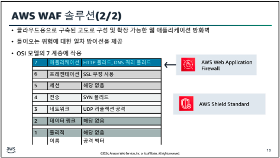

# Advanced Architecting on AWS

## 아키텍팅 개념 검토

인터넷 경로가 없는 프라이빗 서브넷에서 애플리케이션을 실행하면 공격 노출 영역을 내부 트래픽으로만 제한해 데이터 보안을 제공한다. 그 때 S3같은 서비스의 데이터에 액세스하려고 한다면 VPC Endpoint등을 통해 AWS서비스에 VPC를 비공개로 연결할 수 있는데 이는 IGT, NAT, VPN, AWS Direct Connect 연결 없이도 가능하다.

## 단일 및 다중 계정
계정이 2개 이상일 때 관리를 어떻게 할 것인가

### 교차 계정 권한
교차 계정 권한이 없는 경우 계정별로 하나씩의 IAM이 생성되어야 한다.

교차 계정 권한이 있는 경우 한 계정의 리소스를 다른 계정의 사용자와 공유하므로 개별 IAM 사용자를 생성할 필요가 없다.

### IAM Identity Center

IAM Identity Center의 주요 기능

- AWS 계정 및 클라우드 애플리케이션에 대한 SSO 액세스
- IAM Identity Center에서 사용자 및 그룹을 생성하고 관리하는 기능
- 기존의 회사 아이덴티티를 사용하는 기능
- 일반적으로 사용하는 클라우드 애플리케이션과의 호환성
- 간소화된 설정 및 사용 모니터링
- 기존 IAM 사용자, 역할 및 정책과 공존
- 추가비용 없이 자격증명관리

향후 Identity Center가 IAM을 대체하게 될 것 같다.

### Organizations

상위 계정에서 설정한 SCP 정책은 하위 계정으로 상속된다.

Identity Center와 Organizations를 엮어서 사용하면 효과적이다.

scp는 공통적으로 포함되는 권한만 허용한다. 만약 한 가지 리소스에 대해 상/하위 중 하나라도 거절한다면 해당 리소스에 대한 접근이 거절된다.

Active Directory를 AWS IAM Identity Center로 조작할 수 있어 Okta같은 외부 서비스에 연계할 수 있다.

### Control Tower

그럼 계정을 어떻게 묶고 해당 계정에서 어떤 서비스를 사용할 것인지, 서비스 사용 여부는 어떻게 관리할 것인지 이런 일련의 관리(거버넌스)는 어떻게 할 것인가

위에 했던 일련의 관리 과정들을 모두 녹여서 Control tower에서 관리 가능하다.

Control Tower

organizations -> organizations
Users and access -> Identity Center

이런 식으로 Control Tower 콘솔 내에서 위에서 이야기한 리소스들을 관리할 수 있다.

큰 규모의 회사에서는 Identity Center, Organizations을 직접 하나씩 설정하는 것은 쉬운 일이 아니다.
그래서 보통 표준 셋업을 만드는데 그게 landing zone이다. Control Tower는 그 landing zone을 템플릿화해서 제공한다.

## 하이브리드 연결

모든 리소스는 http 연결을 통해 endpoint를 접근, 이를 통해 리소스를 제어한다.

다시말해 http -> endpoint -> resource 이런 방식이다.

만약 제한된 공간에서 AWS 서비스를 이용하고 싶다면 VPC를 이용한다. VPC는 사설 네트워크를 만들기 위한 기능

해당 VPC를 온프레미스 환경과 연결하기 위한 솔루션은 무엇이 있을까?

### Client VPN 솔루션
VPC용 VPN으로 VPC 서브넷에 VPN 클라이언트를 연결해 사용한다

Site-to-Site VPN과 달리 개인 사용자와 VPC의 연결을 위한 기능이다.

엔드포인트를 만들면 내부적으로 가상 네트워크 카드가 만들어지고 해당 네트워크 카드의 보안정책을 설정하면 접속 가능해진다.

인증은 인증서, SAML, Active Directory 인증을 지원한다.

과거 VPC의 목적이 EC2 IP 발급을 위한 것이었다면 요즘엔 VPC를 만드는 목적이 데이터의 격리를 위한 것이다.

### Site-to-Site VPN
온프레미스와 VPC의 연결을 위한 서비스

- VGW(virtual gateway)
- EC2
- TGW

Site-to-Site VPN은 엣지 로케이션을 이용해 VPN 연결이 가능해 글로벌 라우팅을 최적화할 수 있다.

#### VGW

2개의 채널을 연결하고 Active Standby 구조, 최대 1.25Gbps로 데이터 통신 가능

VPN 시간당 비용 + 데이터 전송비용

#### EC2
VGW 방식은 VPC에 VGW를 무조건 AWS 서비스를 이용해야 하는데 만약 Cisco같은 서드파티를 사용하고 싶다면 EC2 방식을 사용할 수 있다.

VPN 시간당 비용 + 데이터 전송비용 + EC2 비용

#### Transit Gateway

이전 방식들이 직결이라면 TGW는 허브 역할을 한다.

VPN 시간당 비용 + 데이터 전송비용 + 데이터 처리 비용

따라서 여러 VPC를 사용하는 경우에 사용하면 좋다.

ECMP 사용이 가능하다.(최대 50개까지 시험 결과 존재)

### AWS Direct Connect

VRAN을 통해 연결하며, 퍼블릭 가상 인터페이스를 하나 분리해 퍼블릭 엔드포인트에 연결해 AWS 서비스 사용도 가능하다.

Direct Connect 연결에는 여러 연결이 있다.

#### 연결 방법들

만약 여러 멀티리전을 사용하고 싶다면 AWS Direct Connect Gateway를 사용하면 된다.

만약 리전당 VPC가 여러개라면 각각 Transit gateway를 사용할수도 있다.

퍼블릭 VIF를 사용하면 Site-to-Site VPN 연결이 가능해지며, VPN을 통해 암호화도 가능하다.

LACP기술을 이용하는 LAG(Link Aggregation Group, 링크 집계 그룹) 사용도 가능하다.

## Route 53 Resolver
Route53은 글로벌 서비스지만 Route53 Resolver는 리전단위 서비스다.

프라이빗 호스팅 영역

만약 VPC 내에서 단독으로 url을 사용하고 싶다면 VPC 범위 내에서의 질의 결과는 같게 Route 53 Resolver를 이용할 수 있다.

하지만 하이브리드 구성에서 온프레미스 서버가 AWS 내에서 사용하는 단독 url에 접속할 때 온프레미스 DNS서버에서 질의가 될 것이기 때문에 원하는 결과가 나오기 힘들 것이다. 이를 위해 생긴 것이 Route53 Resolver다.

온프레미스 -> AWS 서비스로의 질의는 인바운드
AWS서비스 -> 온프레미스로의 질의는 아웃바운드

## 전문 인프라

### AWS Storage Gateway
NFS, EBS, S3 등의 서비스들이 있는데 회사 내에서 사용중이고 AWS에서 똑같이 대체 가능한 서비스들을 연결해 이용 가능한 서비스다.

하지만 속도 면에서 물리적 한계가 존재하기 때문에 완전관리형 캐싱 서비스를 제공한다.

### VMWare
계약문제로 제공 안됨

### Outposts

### AWS Local Zones
지연시간에 민감한 서비스를 위해 기존 데이터센터보다 작은 개념의 데이터 센터

### Wavelength
CSP 5G 네트워크를 통한 AWS 리소스 엑세스

CSP에 직접 Outposts같은 장비를 통해 지연시간을 크게 낮출 수 있다.

## 네트워크 연결
Transit Gateway는 여러 VPC를 잇는 허브이자 라우터 역할로 사용할 수 있다.

VPC peering은 리전과 상관없이 가능하지만 Transit Gateway는 다른 리전과 연결할 수 없다.  
이건 Transit Gateway간의 Peering을 통해 연결 가능하다.

할당량
- 계정 및 리전당 5개
- 게이트웨이당 20개의 라우팅 테이블
- 게이트웨이당 5000개의 연결

비용 구성 요소
- 연결당
- 처리된 데이터 GB당

비용이 중요하다면 처리량에 대한 비용이 없는 전송 VPC를 사용하는 것이 조금 나을 수 있다.

추가적인 툴
- Transit Gateway Network Manager라는 시각화 툴도 존재하며  
- VPC Reachability Analyzer를 통해 연결성 검증도 가능하다

### AWS Resource Access Manager
하나의 VPC에 있는 자원을 Transit Gateway를 사용하지 않고도 다른 VPC에 공유하는 기술  
VPC 전체의 리소스가 아니라 RDS등 한두가지의 리소스를 공유해야 한다면 해당 기술이 더 효율적이다.
다른 계정에 공유해야 할 때도 Transit Gateway는 다른 계정에 공유하지 못한다.

### AWS PrivateLink
VPC 기반 리소스가 AWS 네트워크를 벗어나지 않고 인터넷 엑세스 없이 AWS 서비스 엔드포인트에 엑세스할 수 있다.

- 인터페이스 엔드포인트: 네트워크 인터페이스를 이용한 연결
- 게이트웨이 엔드포인트: 라우팅을 이용한 연결
  - IP주소를 아낄 수 있다
  - 현재는 S3와 DynamoDB만 가능하다

Peering은 각VPC 라우팅 테이블에서 라우팅 설정이 필요하다.
PrivateLink는 내부에 있는 하나의 IP를 사용하기 때문에 라우팅을 사용하지 않는다.

내부망에서 이용하는 SaaS 서비스를 사용할 때 많이 사용한다.

## 컨테이너
많이 알다시피
- 속도 및 확장성
- stateless
- 이식성
- 변경 불가능한 단일 아티팩트
- 마이크로서비스 아키텍쳐

호스팅을 EC2를 통해 한다면 하나의 EC2 인스턴스당 컨테이너의 갯수가 정해져있어서 컨테이너 하나만 떠 있는 인스턴스가 존재할 수 있다. 이를 해결하기 위해 컨테이너 시작 순간 컴퓨팅 환경을 만드는 Fargate가 생겼다.

다만 완전관리형이다보니 Fargare 안에 프로그램 설치가 불가능하다. EC2는 컨테이너 관제를 위한 프로그램 설치가 가능하다.
또한, 컨테이너를 시작하면서 Fargate가 만들어지기 때문에 일시적인 지연시간이 존재할 수 있다.

### ECS

태스크: 태스크에 대한 블루프린트로 다운시 자동 스타트가 지원되지는 않는다.  
서비스: 지정된 수의 태스크를 실행/유지한다.

태스크는 pod에 가깝고 서비스는 쿠버네티스에서도 서비스랑 비슷한 개념이다.

오토스케일링, 서비스 등을 태스크 인프라를 결정한다.

### EKS
관리형 쿠버네티스 도구

오픈소스화된 EKS도 제공한다.

## 지속적 통합/지속적 전달(CI/CD)
한쪽 끝에서 개발자가 새 코드를 제출하고 일련의 스테이지에서 테스트한 후 프로덕션용 코드로 게시하는 일련의 파이프라인

AWS에서는 CI/CD를 위한 일련의 서비스를 제공한다.

### 배포 모델

배포 방법에는 여러 전략이 존재한다.  

#### 블루/그린 배포용 도구

### CloudFormation StackSets

Teraform은 멀티 클라우드 전략, CloudFormation은 AWS 특화 기능을 사용할 때 좋다.

StackSets는 한 번의 작업으로 여러 계정과 리전에 걸쳐 스택을 생성, 업데이트 또는 삭제할 수 있게 함으로써 스택 기능을 확장한다. 관리자 계정을 사용해 CloudFormation 템플릿을 정의 및 관리하고 지정된 여러 리전에서 선택한 대상 계정에 스택을 프로비저닝 하기 위한 기반으로 템플릿을 사용한다.

관리자 계정은 스택 세트를 생성한 AWS 계정이다.  
대상 계정은 스택 세트에서 하나 이상의 스택을 생성, 업데이트 또는 삭제하는 계정이다.

Teraform, CloudFormation은 EC2 내부의 OS 작업 등은 힘들다. 이 때 AWS System Manager를 이용하면 특정 작업들을 스크립트화해서 시행이 가능해진다.

## 고가용성 및 DDoS
- WAF
- Shield Advanced
- Firewall Manager
- 네트워크 방화벽

3, 4계층의 인프라 공격은 공격이 뚜렷하지만 Application layer에 대한 계층은 공격이 뚜렷하지 않은 편이다. 
ex) SQL Injection

AWS WAF 솔루션 등을 통해 상위 계층을 방어할 수 있다.

ACL에 기본적으로 10개 정도가 기본적으로 있고 사용자가 세팅을 통해 조절할 수 있다.

WAF는 해당 서비스들에만 적용할 수 있으며 WAF 템플릿이 존재해 쉽게 만들 수 있다.

GuardDuty는 AI를 이용해 위협을 탐지하는 기능을 하는데 WAF와 통합해 사용이 가능하다.

### Shield Advanced

3, 4는 shield, 7은 WAF를 통해 가능하다. standard는 무료이며 Advanced는 월 5000로 WAF + shield + 알람 + 대응팀 서포트를 받을 수 있다.

### Firewall Manager

#### Network Firewall
ACL은 단순 방어만 가능한데 Network Firewall은 다양한 룰을 적용 가능하다.

## 데이터 보안

### KMS(Key Management System)

### CloudHSM
KMS는 기본적으로 멀티 테넌시이기 때문에(한 하이퍼바이저 위에서 여러 컨테이너가 존재하고 그 사용자가 모두 다르기 때문에) 국가기관 등에서 요구하는 보안 레벨에 준수하기 위해 만들어진 하드웨어 기반의 격리 처리가 된 KMS

### Secrets Manager
데이터베이스에서 많이 쓰이며 password 저장소

만약 한 달에 한번 password를 변경해야 한다면 lambda를 통해 프로그래밍 하거나 Secret manager를 사용하면 된다.

## 대규모 데이터 저장

### S3

Intelligent-Tiering은 분석 비용도 있기 때문에 용량이 크지 않다면 그냥 Standard를 사용하는 것이 나을 수도 있다.

#### S3 Batch Operations 솔루션
단일 요청으로 수십억 개의 객체를 관리하여 운영 및 개발 시간 절감

#### S3 인벤토리 솔루션

#### Access Points 솔루션
우리 회사의 경우 ktds.s3.amazonaws.com이라는 링크가 붙겠지만 이러면 공격을 당하기 쉽다. 따라서 url을 변경하는 Access Points 솔루션이 존재한다.

단일 S3 버킷정책 JSON 문서는 20KB로 제한되는데 여러 부서의 접근정책을 컨트롤하려면 조금 부족하다.  
access point를 사용하면 이 정책 분할이 가능하다.

### 데이터 레이크

데이터 다운로드보다는 아마존 내에서 스캐닝 하는 요금이 싸기 때문에 AWS 내에서 데이터를 분석하는게 더 저렴할수도 있다.

Glue를 통해 S3데이터를 데이터베이스화 해서 분석할 수 있다.

하지만 만약 Athena 사용권한이 있어서 게정의 모든 S3 데이터를 이용할 수 있으면(ex. 인사데이터) 거버넌스 차원에서 문제가 될 수 있다. 이를 해결하기 위해 Lake Formation을 사용한다.

### 레이크 포메이션

## 워크로드 마이그레이션

### 마이그레이션 도구

#### AWS Application Discovery service
- 온프레미스에 에이전트를 설치
- 서버 종속성, 성능 등을 측정해 CSV로 내보낸다.

#### AWS Control Tower 솔루션
- Control Tower를 이용해 다수의 AWS 계정과 팀을 통제할 수 있다.

#### Application Migration Service
서비스 종료 후 모든 디렉토리를 카피해서 클라우드에 띄우는게 가장 손쉬운 마이그레이션이지만 대부분의 서비스는 그렇게 하지 못하기 때문에 해당 서비스가 존재한다.

- AWS Replication Agent를 설치해 클라우드 서버로 데이터를 전송하면 이전 서버 중단 없이 스테이징 서버에 데이터를 전송할 수 있다.

#### Migration Hub
마이그레이션 허브를 통해 현재 진행 상황을 추적할 수 있다.

#### VMware Cloud on AWS
이제 VMware 라이센스의 만료로 해당 서비스는 이용하기 힘들어서 대안으로 VM import 툴을 통해 사용할 수 있다.

#### AWS DataSync
NAS등의 서버 데이터를 이동하기 위한 데이터 이동 도구

#### AWS DMS
EC2 기반의 Database Migration Service  
source와 target을 설정해 데이터베이스를 복제한다.

CDC기능을 지원해 변경분을 지속적으로 카피할 수 있다.

athena에서 s3 데이터를 가져오려면 시간이 오래걸리는데 DMS를 이용해 data warehouse로 데이터를 정형화하고 분석하면 훨씬 빠른 속도를 가져갈 수 있다.

Oracle의 GoldenGate를 사용해서 DB를 올기는 방법들도 있다.

#### AWS SCT 솔루션
스토리지 엔진이 다르다면 SCT 툴을 다운로드해 변환할 수 있다.

## 엣지 아키텍팅

### Lambda@Edge
Lambda의 확장버전으로 최종사용자와 더 가까운 위치에서 Python, Node코드를 실행한다.

### CloudFront Functions
DNS 상에서 코드를 실행하기 위한 서비스로 매우매우빠르다.

### AWS Global Accelerator
엣지에 로드밸런서를 설치해 리전간의 로드밸런싱이 가능하게 한다.

