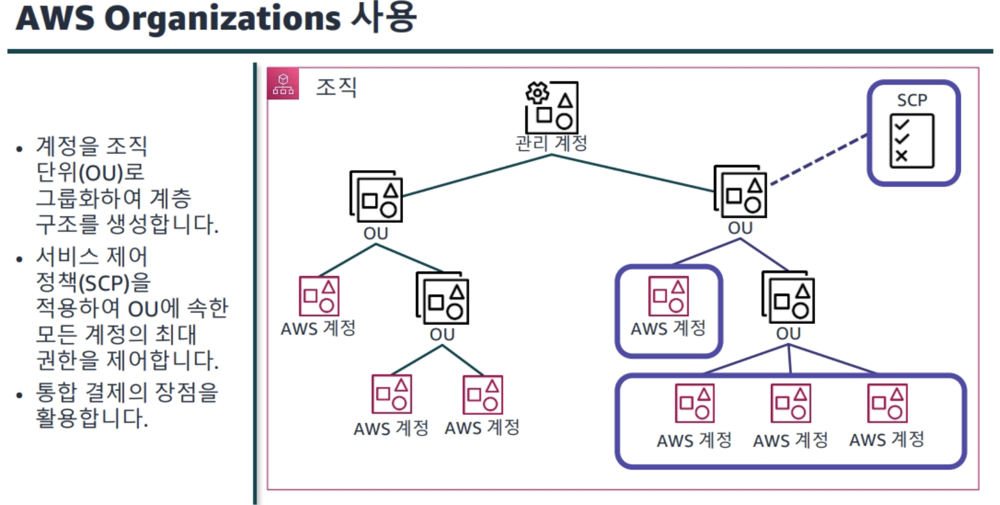

- [아키텍팅 기본 사항](#아키텍팅-기본-사항)
  - [가용영역](#가용영역)
  - [리전 선택에 영향을 미치는 요인](#리전-선택에-영향을-미치는-요인)
  - [Local Zones](#local-zones)
  - [Edge location](#edge-location)
  - [Local zones와 Edge location의 차이](#local-zones와-edge-location의-차이)
  - [아키텍트의 업무](#아키텍트의-업무)
  - [AWS Well-Architected Tool](#aws-well-architected-tool)
- [보안](#보안)
  - [역할](#역할)
  - [IAM 정책 평가 방법](#iam-정책-평가-방법)
  - [자격 증명 기반 정책](#자격-증명-기반-정책)
  - [리소스 기반 정책](#리소스-기반-정책)
  - [IAM 권한경계](#iam-권한경계)
  - [AWS Organizations (OU:organization unit)](#aws-organizations-ouorganization-unit)
- [네트워크](#네트워크)
  - [퍼블릭 서브넷](#퍼블릭-서브넷)
  - [인터넷 게이트웨이](#인터넷-게이트웨이)
    - [목적](#목적)
  - [라우팅 테이블](#라우팅-테이블)
  - [탄력적 IP](#탄력적-ip)
  - [탄력적 네트워크 인터페이스](#탄력적-네트워크-인터페이스)
  - [네트워크 액세스 제어 목록(ACL)](#네트워크-액세스-제어-목록acl)
  - [보안그룹](#보안그룹)
  - [보안 그룹과 ACL의 비교](#보안-그룹과-acl의-비교)
- [컴퓨팅](#컴퓨팅)
  - [배치 그룹 및 사용 사례](#배치-그룹-및-사용-사례)
  - [EBS(Amazon EBS)](#ebsamazon-ebs)
  - [인스턴스 스토어](#인스턴스-스토어)
  - [EC2 구매 옵션](#ec2-구매-옵션)
  - [실습과제 하기](#실습과제-하기)
- [스토리지](#스토리지)
    - [블록 스토리지](#블록-스토리지)
    - [파일 스토리지](#파일-스토리지)
    - [객체 스토리지](#객체-스토리지)
  - [S3](#s3)
    - [S3 액세스 포인트](#s3-액세스-포인트)
    - [서버 측 암호화 키 유형](#서버-측-암호화-키-유형)
    - [멀티파트 업로드](#멀티파트-업로드)
    - [S3 이벤트 알림](#s3-이벤트-알림)
  - [EFS](#efs)
  - [AWS Storage Gateway](#aws-storage-gateway)
- [데이터베이스](#데이터베이스)
  - [RDS](#rds)
    - [Aurora DB 클러스터](#aurora-db-클러스터)
    - [DynamoDB](#dynamodb)
  - [캐싱](#캐싱)
    - [캐싱 전략](#캐싱-전략)
- [모니터링 및 크기 조정](#모니터링-및-크기-조정)
  - [CloudWatch](#cloudwatch)
  - [CloudTrail](#cloudtrail)
  - [VPC 흐름 로그](#vpc-흐름-로그)
  - [Cloudwatch 경보](#cloudwatch-경보)
  - [EventBridge](#eventbridge)
  - [ELB 유형](#elb-유형)
- [자동화](#자동화)
  - [IaC](#iac)
    - [CloudFormation](#cloudformation)
  - [CodeWhispherer](#codewhispherer)
- [네트워크2](#네트워크2)
  - [VPC Endpoint](#vpc-endpoint)
    - [게이트웨이 엔드포인트](#게이트웨이-엔드포인트)
    - [인터페이스 엔드포인트](#인터페이스-엔드포인트)
  - [VPC Peering](#vpc-peering)
  - [Transit Gateway](#transit-gateway)
    - [구성요소](#구성요소)
  - [AWS Site-to-Site VPN](#aws-site-to-site-vpn)
    - [구성요소](#구성요소-1)
  - [AWS Direct Connect](#aws-direct-connect)
- [서버리스](#서버리스)
  - [API Gateway](#api-gateway)
  - [AWS SQS를 통한 느슨한 결합](#aws-sqs를-통한-느슨한-결합)
  - [Amazon Simple Notification Service(Amazon SNS)](#amazon-simple-notification-serviceamazon-sns)
  - [Amazon Kinesis](#amazon-kinesis)
    - [Kinesis Data Streams](#kinesis-data-streams)
    - [kinesis\_data\_firehose](#kinesis_data_firehose)
  - [Amazon Step Functions](#amazon-step-functions)
- [엣지 서비스](#엣지-서비스)
  - [Route 53](#route-53)
  - [Amazon CloudFront](#amazon-cloudfront)
  - [DDoS 보호](#ddos-보호)
    - [AWS Shield](#aws-shield)
    - [AWS Outposts](#aws-outposts)
- [백업 및 복구](#백업-및-복구)
  - [복구전략](#복구전략)
    - [백업 및 복원](#백업-및-복원)
    - [파일럿 라이트](#파일럿-라이트)
    - [웜 스탠바이](#웜-스탠바이)
    - [다중 사이트 액티브-액티브](#다중-사이트-액티브-액티브)

# 아키텍팅 기본 사항

## 가용영역
리전 내의 데이터센터

## 리전 선택에 영향을 미치는 요인
- 거버넌스
- 지연시간
- 서비스 가용성
- 비용

## Local Zones
짧은 지연 시간을 위해 최종 사용자 및 워크로드에 더 가까운 AWS 인프라에서 애플리케이션 실행

## Edge location
CDN같은 캐싱 기능을 이용하기 위한 서비스로 POP 위치의 글로벌 네트워크를 통해 고객의 콘텐츠를 전송하는 것으로
리전과는 다른 시설물로 전세계 300여개 이상 분포되어 있다.

## Local zones와 Edge location의 차이
엣지 로케이션은 데이터를 저장해서 사용자의 접근 속도를 높이는 관점이라면
Local Zones은 서버 관점에서의 지연시간 등을 줄이는 관점이다.

## 아키텍트의 업무
- 보안
- 성능 효율성
- 비용 최적화
- 운영 우수성
- 신뢰성
- 지속 가능성

## AWS Well-Architected Tool
체크리스트를 통해 현재 아키텍쳐의 설계 기준을 가져갈 수 있다.

# 보안
콘솔: 기존처럼 클릭으로 접근
화면: Access Key ID, Secret Access Key가 제공

기본적으로 Account 아래에 User가 있어서 권한별로 제어할 수 있다.
그리고 사용자 그룹이 있어서 각각의 권한 셋을 그룹화해서 관리한다.

Active directory: 그룹에 대한 중첩 가능
IAM Group: 중첩 불가능

## 역할
권한을 특정 사용자 또는 서비스에 위임해서 권한을 수임한 역할로 작업을 수행하는 동안에만 유효하다.

역할이 모자.

역할을 사용하는 방법의 예는 다음과 같다.

- 교차 계정 엑세스: 개발자가 Prod 계정의 S3 버킷에 엑세스 해야 할 때(타 계정의 엑세스 해야 한다면 신뢰관계를 통해 임시로 부여한다)
- 임시 계정 엑세스: 계약자가 Prod계정의 S3 버킷에 임시로 엑세스 해야 할 때
- 최소 권한
- 감사
- AWS 서비스 엑세스
- Amazon EC2용 IAM 역할
- SAML 페더레이션

## IAM 정책 평가 방법

## 자격 증명 기반 정책

- Version: version 정책 요소는 정책을 처리하는데 사용할 언어 구문 규칙을 지정한다.
- Effect: Allow 또는 Deny를 사용해 정책이 엑세스를 허용하는지 거부하는지 나타낸다.
- Action: 정책이 허용하거나 거부하는 작업 목록을 포함
- Resource: 작업이 적용되는 리소스 목록을 지정
- Condition: 정책이 권한을 부여하는 상황을 지정

## 리소스 기반 정책

Principal 부분이 다른다.

## IAM 권한경계

## AWS Organizations (OU:organization unit)

# 네트워크

서브넷을 VPC 내의 IP 주소범위로 172.31.0.0/16에서 총 65,536개의 IP주소를 사용할 . 수있다.

- 10.0.0.0: 네트워크 주소
- 10.0.0.1: AWS에서 VPC 라우터용으로 예약
- 10.0.0.2: DNS서버의 IP 주소는 항상 VPC 네트워크 범위의 기본 IP 주소에 2를 더한 값
- 10.0.0.3: 차후 사용을 위해 AWS에서 예약
- 10.0.0.225: 브로드캐스트 주소로 VPC에선 브로드캐스트가 지원되지 않아 예약만 되어있다.

## 퍼블릭 서브넷
인바운드 및 아웃바운드 인터넷 트래픽을 사용하는 리소스가 포함된다. 퍼블릭 서브넷에서는 양방향으로 트래픽 흐름을 허용한다.

퍼블릭을 만들기 위해서는 아래 세 가지가 필요하다.

- 라우팅 테이블(어디로 갈지 안내하는 표지판)
- 인터넷 게이트웨이(정문 역할)
- 퍼블릭 IP 주소

## 인터넷 게이트웨이
수평적으로 확장되고 중복적인 고가용성 VPC 구성요소로 VPC내 인스턴스와 인터넷 간 통신을 허용한다. 네트워크 트래픽에 가용성 위험이나 대역폭 제약이 발생하지 않는다.

### 목적
1. 인터넷 라우팅 가능 트래픽용으로 라우팅 테이블에서 대상을 제공
2. NAT를 수행해 네트워크의 IP주소를 보호

## 라우팅 테이블
VPC가 네트워크 트래픽이 전달되는 위치를 결정하는데 사용되는 규칙 세트를 포함

## 탄력적 IP

## 탄력적 네트워크 인터페이스
VPC 내의 논리적 네트워킹 구성요소 EC2에서는 네트워크 인터페이스를 생성해 인스턴스에 연결할 수 있으며 해당 인터페이스를 분리후 다른 네트워크에 연결할 수 있다. 그럼 네트워크 인터페이스의 퍼블릭 및 탄력적IP주소, 프라이빗 IP 및 탄력적IP 주소, MAC 주소가 유지된다.

## 네트워크 액세스 제어 목록(ACL)
네트워크 ACL은 서브넷 경계에서 방화벽 역할을 한다.
기본은 모든 인/아웃 모두 열려있지만 규칙 번호별로(번호가 낮은 규칙부터) 평가를 시행해 규칙과 일치하지 않는 패킷을 거부한다.

## 보안그룹
인스턴스에 대한 인바운드 및 아웃바운드 트래픽을 제어하는 가상 방화벽 역할, 서브넷이 아닌 인스턴스 수준에서 작동하며 허용 규칙만 지원한다.

## 보안 그룹과 ACL의 비교

# 컴퓨팅

## 배치 그룹 및 사용 사례

배치그룹은 워크로드 요구에 충족하도록 상호 종속된 인스턴스 집합의 배치 방식을 결정할 수 있다.

- 클러스터 배치그룹: 낮은 네트워크 지연 시간, 높은 네트워크 처리량 두 가지 요건이 모두 충족되면 좋은 애플리케이션에 권장되는 대신 장애상황에 취약해진다.(HPC 상황에 필요)
- 분산 배치 그룹: 최대 가동 시간이 필요한 서비스에 사용하면 내결함성을 높일 . 수있따.
- 파티션 배치 그룹: 대규모 분산 및 복제된 워크로드를 배포(대규모 분산 및 복제 워크로드)

## EBS(Amazon EBS)
AZ에 종속되는 스토리지로 데이터의 특정 시점 복사본으로 Amazon EBS 스냅삿을 생성할 수 있다.

- SSD
- 프로비저닝된 IOPS SSD
  - 높은 IOPS 성능이 유지되어야 하거나 I/O 집약점 데이터베이스 워크로드
  - 대기시간 1밀리초 미만
  - IOPS가 64,000개를 초과하거나 처리량이 1,000MiB/s보다 높아야 하는 경우
- HHD
- 콜드 HHD
  - 자주 액세스하지 않는 데이터를 처리량 중심으로 저장

## 인스턴스 스토어
인스턴스 블록 수준의 임시 스토리지를 제공한다. 하드웨어에 종속된(HV) 스토리지라고 생각하면 된다. 만약 Auto-scaling을 통해 인스턴스가 변경된다면(클러스터 혹은 HW기준으로 변경) 삭제된다.

인스턴스 스토어의 특성은 다음과 같다.
- 직접 연결된 블록 수준 스토리지
- 짧은 대기 시간
- 높은 IOPS 및 처리량
- 인스턴스가 중지되거나 종료되면 회수됨

인스턴스 스토어의 사용 사례는 다음과 같다.
- 버퍼
- 캐시
- 임시데이터

## EC2 구매 옵션
- 온디맨드
- EC2 Instance Savings Plans
- Compute Savings Plans
- 스팟 인스턴스

## 실습과제 하기

# 스토리지
- File
- Block
- Object

 세 가지 종류가 존재

 ### 블록 스토리지

 원시 스토리지 데이터가 관련없는 블록의 어레이로 구성
 - 하드
 - 스토리지 영역
 - 네트워크(SAN)
 - 스토리지 어레이
 - EBS

### 파일 스토리지
파일 시스템이 관련 없는 데이터 블록을 관리  
네이티브 파일 시스템이 디스크에 데이터를 배치

- 네트워크 연결 스토리지(NAS)
- 어플라이언스
- Windows파일 서버
- EFS
- FSx

### 객체 스토리지
데이터, 데이터 속성, 메타데이터, 객체ID를 캡슐화하는 가상 컨테이너
파일 형식, 메타데이터 영역에 대한 구애를 받지 않는다.

- Ceph
- OpenStack Swift
- S3

## S3
정적 파일용 스토리지 솔루션

### S3 액세스 포인트
각 액세스 포인트에 적용되는 항목
- 고유한 DNS 이름과 ARN
- 고유한 권한 및 네트워크 제어 설정

### 서버 측 암호화 키 유형
- 고객 제공 키(SSE-C)
- 이중 계층 서버 측 암호화(DSSE-KMS)
- AWS KMS 키(SSE-KMS)
- Amazon S3 관리형 키(SSE-S3)

### 멀티파트 업로드
- 개선된 처리량: 파트를 병렬로 업로드해 처리량을 개선할 수 있다.
- 네트워크 문제로부터 빠른 복구: 네트워크 오류로 실패한 업로드의 재시작시 영향을 최소화
- 객체 업로드 일시 중지 및 재개: 장시간에 걸쳐 업로드할 수 있다.
- 최종 객체 크기를 알기 전에 업로드 시작: 객체를 생성하는동안 업로드
- 대용량 객체를 업로드: 최대 5TB의 대용량 객체를 업로드

### S3 이벤트 알림
S3 버킷에서 이벤트가 발생하면 전송되는 알림을 수신할 수 있다.

S3 비용에서 고려해야 하는 사항
- 스토리지
- 요청 및 검색
- 데이터 전송 비용
- 관리 및 분석

## EFS
기본적으로는 EFS, FSx만 알고 있으면 된다.

## AWS Storage Gateway
온프레미스 환경과 AWS 스토리지 간에 애플리케이션을 원활하고 안전하게 통합하는 데 사용할 수 있는 서비스

- Amazon S3 File Gateway: 데이터 레이크용 백업, 아카이브 및 수집을 위한 S3의 파일 액세스 기능 기본 제공
- Amazon FSx File Gateway: 온프레미스 그룹 파일 공유 및 홈 디렉터리 사용을 위한 Amazon FSx for Windows File Server 액세스 기능 기본 제공
- Tape Gateway: Amazon S3 아카이브 티어를 사용하는 장기 보존용 가상 테이프 라이브러리
- Volume Gateway: Amazon EBS 스냅샷, AWS Backup 통합, 클라우드 복구 기능을 사용해 블록 수준에서 볼룸 백업

- AWS DataSync: 온프레미스 스토리지와 EFS, FSx, S3간에 대량의 데이터를 쉽게 이동할 수 있다.

# 데이터베이스

## RDS
- Aurora
- PostgreSQL
- MySQL
- MariaDB
- Oracle
- SQL Server

KMS를 사용해 저장 데이터를 암호화한다.(AES-256)

### Aurora DB 클러스터
하나 이상의 DB 인스턴스와 해당 DB 인스턴스에 대한 데이터를 관리하는 클러스터 볼륨으로 구성된다.

제공되는 인스턴스 유형
- 프라이머리 인스턴스: 읽기 및 쓰기 작업을 지원하며 클러스터 볼륨의 모든 데이터 변경을 실행한다. 각 Aurora DB 클러스터마다 프라이머리 인스턴스가 하나씩 있다.
- Aurora 복제본: 읽기 작업만 지원하며 최대 15개의 복제본을 가질 수 있다.

### DynamoDB
데이터를 테이블에 저장하는데 테이블을 생성할 때 테이블 이름과 파티션 키를 지정해야 한다.

기본 키를 이용해 테이블의 각 항목을 고유하게 식별하고 보조 인덱스를 이용해 보다 유연하게 쿼리를 작성할 수 있게 도와준다.
- 단순 기본 키: 파티션 키라는 속성 하나만으로 구성된 단순한 기본 키
- 복합 기본 키: 파티션 키와 정렬 키로 구성되며 여러 항목의 파티션 키 값은 같을수있으나 정렬 키 값은 달라야 한다.

## 캐싱
- 속도와 비용
- 데이터 엑세스 패턴
- 캐시 유효성

세 가지를 고려해서 캐싱을 사용해야 한다.

### 캐싱 전략
- 지연 로딩

- 라이트 스루

# 모니터링 및 크기 조정
로그 방식 및 종류

## CloudWatch
실시간에 가까운 시스템 이벤트 스트림을 제공하는 AWS 서비스로 알림을 보내거나 정의한 규칙을 기준으로 모니터링하는 리소스를 자동으로 변경한다. 기본적으로 시스템의 메모리 로그를 저장하지는 않는다.

ex) EC2 인스턴스, EBS볼륨, RDS 인스턴스

- 네임스페이스: Cloudwatch 지표의 컨테이너로 서로 다른 네임스페이스의 지표는 격리되어 있다. AWS/service라는 명명 규칙을 사용한다.
- 지표: Cloudwatch에 게시된 시간 순서별 데이터 요소 세트를 나타낸다. 각 지표 데이터는 타임스탬프와 연결되어야 한다.
- metric: 지표를 고유하게 식별하는데 도움되는 이름/값 페어

## CloudTrail
사용자 활동 및 API 사용량을 추적해 누가 무엇을 언제 했는가에 대한 인사이트를 제공한다.

## VPC 흐름 로그

## Cloudwatch 경보

## EventBridge
Cloudwatch Events의 기본 서비스에 추가적 기능들이 제공된다.

## ELB 유형

# 자동화

## IaC
- 복제, 재배포, 용도 변경이 가능
- 인프라와 애플리케이션의 버전관리를 제어할 수 있다.
- 드리프트를 탐지할 수 있다.
- 서비스를 마지막 정상 상태로 롤백할 수 있다.

### CloudFormation
API 래퍼로 JSON, Yaml등의 형태로 리소스를 정의할 수 있다.

보통 R&R에 따라 계층형으로 용도별로 스택을 구성한다.

물론 원하는 자유도 정도에 따라 서비스를 선택할 수도 있다.

## CodeWhispherer
무료 AWS copilot

# 네트워크2

## VPC Endpoint
VPC 내에 구멍을 뚫고 내부간의 길을 만든다.

### 게이트웨이 엔드포인트
라우팅 테이블에 지정된 대상
S3와 DynamoDB만 지원한다, 사용료 없다.

### 인터페이스 엔드포인트
프라이빗 IP 주소를 사용하는 탄력적 네트워크 인터페이스
게이트웨이 엔드포인트보다 많은 서비스 지원
AWS PrivateLink 기반

## VPC Peering
두 VPC간의 일대일 관계로 두 VPC 간에는 하나의 피어링 리소스만 가질 수 있다.

하지만 피어링 두 개가 연결된다고 해서 전이적 피어링 관계는 성립되지 않는다.

Peering의 이점
- 인터넷 게이트웨이 또는 가상 프라이빗 게이트웨이 우회
- 단일 장애 지점이 없이 고가용성 연결 제공
- 대역폭 병목 현상 방지
- 프라이빗 IP 주소를 사용해 VPC간에 트래픽 전송

## Transit Gateway

### 구성요소
- 연결
- 라우팅 테이블

다음 리소스 중 하나 이상이 Transit Gateway와 동일한 리전에 있을 경우 연결할 수 있다.
- VPC
- VPN 연결
- Direct Connect 게이트웨이
- Transit Gateway Connect
- Transit Gateway Peering

ECMP(equal-cost multipath): 같은 목적지를 갖는 패킷들을 다수의 최적 경로들을 통해 전송해 대역폭을 늘려 전송 속도를 늘리는 일종의 로드밸런싱이다.

## AWS Site-to-Site VPN

- 1.25Gbps가 한계
- IPSEC 프로토콜만 지원한다.

### 구성요소
- 가상 프라이빗 게이트웨이는 AWS Site-to-Site VPN 연결의 AWS측에 있는 VPN 집선기
- 한 VPN연결의 VPN 터널이 서로 다른 가용 영역에서 종료된다.
- 고객 게이트웨이는 AWS에서 고객이 생성하는 리소스로 온프레미스 네트워크의 고객 게이트웨이 디바이스를 나타낸다.

## AWS Direct Connect
1Gbps미만 ~ 100Gbps링크에 사용 가능

특수 계약을 체결해 데이터센터에 물리적 케이블을 연결해야 한다.

# 서버리스

포트폴리오

## API Gateway
API 생성, 게시, 유지관리, 모니터링 및 보호 기능을 할 수 있다.

- 여러 마이크로서비스를 위한 통합 API 프론트엔드를 생성
- 백엔드에 DDoS 보호 및 제한 기능을 제공
- 백엔드에 대한 요청을 인증 및 권한 부여
- 서드 파티 개발자에 의해 API 사용을 조절, 측정 및 수익화

## AWS SQS를 통한 느슨한 결합
- 완전관리형 메시지 대기열 서비스
- 처리 및 삭제될 때까지 메시지를 저장
- 발신자와 수신자 간 버퍼 연결을 담당

SQS 대기열 사용 시 이점
- 느슨한 결합
- 내결함성
- 급증하는 트래픽 처리

사용 사례

- 가시성 제한 시간: 소비자가 수신한 메시지는 삭제할 때까지 대기열에 유지되며, 해당 메시지가 일정 기간동안 다른 소비자에게 표시되지 않도록 가시성 제한 시간을 설정할 수 있다.
- 폴링 유형
  - 짧은 폴링
    - 요청을 수신하는 즉시 소비자에게 응답을 전송하므로 응답이 더 빠르다.
    - 응답 수가 늘어나므로 비용도 증가한다.
  - 긴 폴링
    - 메시지가 하나 이상 도착하거나 폴링 시간이 초과될 때까지는 응답을 반환하지 않는다.
    - 응답 빈도는 낮아지지만 비용도 감소한다.

## Amazon Simple Notification Service(Amazon SNS)
클라우드에서 손쉽게 알림을 설정, 운영 및 전송할 수 있는 웹 서비스로 게시-구독 메시징 패러다임을 따르며 푸시 메커니즘을 사용해 클라이언트에 알림을 전달한다.

## Amazon Kinesis

### Kinesis Data Streams

### kinesis_data_firehose

두 가지의 차이는 완전 실시간 여부

## Amazon Step Functions
다단계 워크플로우를 쉽게 오케스트레이션 하는 방법

# 엣지 서비스

## Route 53
기능으로 
- DNS
- 라우팅 정책
  - 단순 라우팅: 기존의 라우팅과 같은 방법
  - 장애 조치 라우팅: 모니터링을 통해 라우팅
    - 지정한 리소스(웹 서버)의 상태
    - 다른 상태 확인의 상태
    - CloudWatch 경보의 상태
  - 지리적 위치 라우팅: 사용자의 위치에 따라 트래픽을 지원할 리소스를 선택
  - 지리 근접 라우팅: 지리적 위치에 따라 트래픽을 리소스로 라우팅
  - 지연 시간 기반 라우팅: 사용자들의 요청을 지연 시간이 가장 낮은 AWS 리전에서 처리해 최종 사용자를 위해 성능을 향상
  - 다중값 응답 라우팅: DNS 쿼리에 응답해 웹 서버의 IP 주소와 같은 여러 값을 반환하도록 구성, 각 리소스의 상태도 확인 가능
  - 가중치 기반 라우팅: 리소스 레코드 세트에 가중치를 할당해 각 응답이 처리되는 빈도를 지정(블루/그린 배포)

## Amazon CloudFront

- Contents Delivery Network(CDN)

## DDoS 보호

### AWS Shield

### AWS Outposts
AWS의 서버 렉을 데이터센트로 전달해주는 서비스

# 백업 및 복구

## 복구전략

### 백업 및 복원
다운시 백업을 기반으로 복원하는 방법으로 가동 중단 발생 시 시스템 복원에 많은 시간이 걸린다.

### 파일럿 라이트
환경 간에 데이터를 복제하고 핵심 워크로드 인프라의 복사본을 프로비저닝한다.

### 웜 스탠바이
정상 작동하는 축소된 프로덕션 환경 사본을 복구 환경에 생성하고 비즈니스 크리티컬한 시스템을 복제하고 상시 접속되도록 한다.

리소스의 시작까지 기다리지 않아도 되므로 복구 시간이 단축된다.

### 다중 사이트 액티브-액티브

