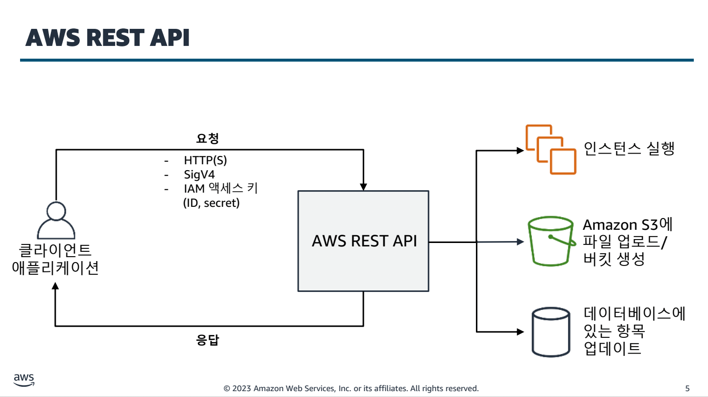

- [AWS에 웹 애플리케이션 구축](#aws에-웹-애플리케이션-구축)
  - [애플리케이션 구축](#애플리케이션-구축)
- [AWS에서 개발 시작하기](#aws에서-개발-시작하기)
- [7. 데이터베이스 시작하기](#7-데이터베이스-시작하기)
  - [DynamoDB 주요 개념](#dynamodb-주요-개념)
    - [읽기 및 쓰기 처리량](#읽기-및-쓰기-처리량)
    - [보조 인덱스](#보조-인덱스)
    - [파티션 키 디자인](#파티션-키-디자인)
    - [인덱스 설계](#인덱스-설계)
    - [초기 처리량 선택](#초기-처리량-선택)
    - [쿼리 또는 스캔 선택](#쿼리-또는-스캔-선택)
    - [캐싱 옵션](#캐싱-옵션)
- [9. 애플리케이션 로직 처리](#9-애플리케이션-로직-처리)
  - [Lambda](#lambda)
    - [핸들러](#핸들러)
    - [컨텍스트](#컨텍스트)
    - [레이어](#레이어)
    - [패키징](#패키징)
- [API gateway](#api-gateway)

# AWS에 웹 애플리케이션 구축

## 애플리케이션 구축

IAM 서비스는 최대 5000명까지밖에 등록하지 못한다. 하지만 DynamoDB같은 서버리스 서비스는 사용자의 기기에서 직접 AP 접근도 가능한 서비스라 모바일 환경의 사용자 관리를 위해서는 Amazon Cognito를 이용해 사용할 수 있다.

X-Ray를 이용해 API 호출 과정을 추적할 수 있다.

# AWS에서 개발 시작하기

AWS는 서비스별로, 리전별로 요청할 수 있고, 전 세계에 걸쳐 분산되어있는 REST기반의 API 서비스다.

직접 HTTP를 빌드해서 전송하는게 아닌 AWS SDK를 이용해 간단하게 요청할 수 있다.

SDK는 
- HTTP 요청 서명을 자동으로 하고 
- 재시도/오류/시간 제한 로직이 기본으로 탑재
- 페이지네이션 지원

등의 이점이 있다.

AWS는 하위, 상위 수준의 API를 제공한다.

IAM 작동의 기본 흐름은 다음과 같다.

기본적으로 설정과 환경변수는 .aws/config 파일에서 가능하며 보안 인증정보를 사용할 때 우선순위는 다음과 같다.

또한, user profile을 통해 여러 사용자의 권한을 사용할 수도 있다.

고정키를 사용하는 것 보단 role을 통한 임시키를 발급받는 방법이 더 안전하다.

# 7. 데이터베이스 시작하기
- DynamoDB의 주요 구성 요소 설명
- DynamoDB에 연결하는 여러 방법 탐색
- 코드와 SDK 종속성 및 설정 정의
- 요청 및 응답 객체 사용

내부적으로 3개의 가용영역에 분산되어 저장되고, 서버를 관리하지 않아도 된다.

| 관점 | 관계형 | NoSQL(비관계형) |
| ----- | ----- | ----- |
| 데이터 스토리지 | 행 및 열 | 키 값, 문서, 와이드 컬럼, 그래프 |
| 스키마 | 고정 | 동적 |
| 쿼리 | SQL 사용 | 문서 수집에 집중 |
| 확장성 | 수직적 | 수평적 |
| 트랜잭션 | 지원 | 지원 여부가 유종적 |
| 일관성 | 강력 | 최종 및 강력 |

## DynamoDB 주요 개념

DynamoDB 기본 사항

파티션 키를 잘 설정하는게 중요하다. 파티션 키가 중복돼도 정렬키가 다르면 된다.

파티션 키만 가지고 데이터를 검색할건지(물리적 위치)  
정렬 키도 같이 해서 가지고 올 건지 선택한다.

### 읽기 및 쓰기 처리량

- RCU(읽기 용량 단위): 최대 4KB크기의 항목에 대한 초당 강력한 읽기 일관성의 수 
  - **최종 읽기 일관성에서는 프로비저닝된 읽기 용량의 절반을 사용한다**
  - 예약 시스템 등에서는 강력한 읽기 일관성이 필요할 것이다.
- WCU(쓰기 용량 단위): 초당 1KB 쓰기의 수

on-demand: 사용한 양에 대한 과금
provisioned: 미리 용량을 확보

급격한 트래픽이 예상된다면 provision 기능을 이용해 미리 용량을 확보해 놓는 것이 필요하다.

### 보조 인덱스
기본이 아닌 키 속성을 기반으로 데이터를 쿼리할 수 있다.

- 글로벌 보조 인덱스
  - 테이블 생성 후에도 만들 수 있다.
- 로컬 보조 인덱스
  - 테이블을 생성할 때만 추가적으로 만들 수 있다.

### 파티션 키 디자인
- 일반적인 액세스 패턴
- 높은 카디널리티
- 응용 프로그램에 대표적인 값

### 인덱스 설계
- 보조 인덱스를 사용: 기본 테이블이 지원할 수 있는 것보다 다양한 쿼리가 가능해진다.
- 관련 데이터를 함께 유지: 쿼리에 대한 시기적절한 응답을 보장하는데 가장 중요한 요소
- 정렬 순서를 사용: 핵심 설계가 함께 정렬할 것을 요구하는 경우 관련 항목을 그룹으로 묶어 효율적으로 쿼리
- 쿼리를 분산: 많은 볼륨의 쿼리를 DB 특정 부분에 몰리지 않도록 트래픽을 가능한 여러 파티션으로 분산

### 초기 처리량 선택

### 쿼리 또는 스캔 선택
- 쿼리: 기본 키 기반으로 항목을 찾는다
- 스캔: 테이블 또는 보조 인덱스의 모든 항목을 읽는다.

### 캐싱 옵션
- DynamoDB
- ElastiCache

# 9. 애플리케이션 로직 처리

## Lambda
Lambda의 트리거
- 이벤트
- HTTP 요청: Amazon API Gateway
- API 호출: SDK

람다의 컴퓨팅 성능은 메모리 할당량에 따라 달라지기 때문에 이를 최적화하는 것이 중요하다.

콜드스타트 시간을 줄이는 것이 중요하다. 따라서 콜드 스타트를 줄이기 위한 여러 방법이 있다.

예전에는 콜드스타트를 줄이기 위해 EventBridge를 이용했지만 요즘엔 프로비저닝도 지원하며 SnapStart라는 자바 등의 JVM이 필요한 어플리케이션을 더 빠르게 이용할 수 있다.

### 핸들러

### 컨텍스트

이 외에도 람다는 버저닝도 가능하다.

### 레이어

레이어를 사용해 공통 라이브러리를 관리도 가능하다.

### 패키징

패키징은 zip, 컨테이너 이미지 두 가지 종류로 가능하다.

# API gateway
세 단위에서 생성 가능하다.
- VPC
- Region
- Global

