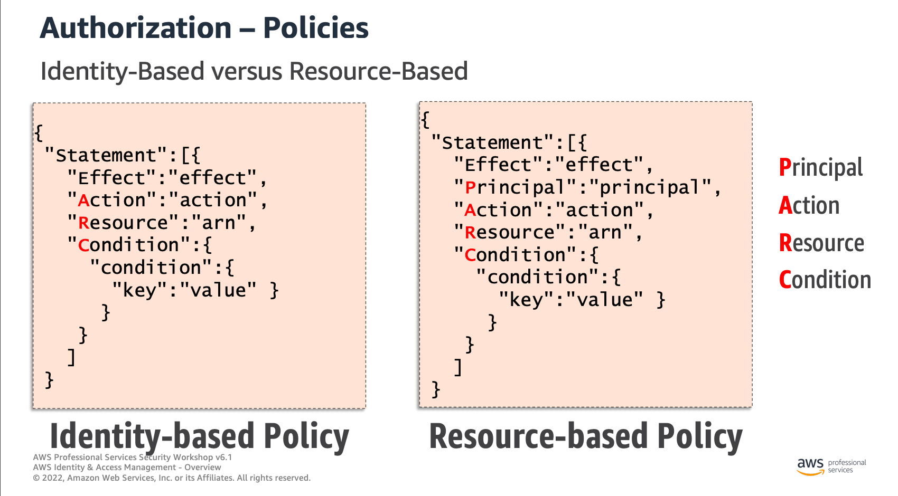

# ECSA

PISAP: Proserve Infrastructure & Security Advanced Partner

ECSA: Enhanced Cloud Security Assessment

교육 내용: Control Tower 기반의 Landing Zone 구축 및 AWS Native 보안서비스 심화 교육

교육 목표: AWS Multi-Account 전략에 따른 보안 거버넌스 이해, 랜딩존 구축 프로젝트를 직접 수행하 수 있는 능력 확보

**기존 문제점이 Route53을 사용하지 않기 때문에 DNS가 KT쪽에 있어 AWS 서비스간의 통신할 때 문제가 있다.**

## VPC

RFC1918에 명시된 private IP zone을 사용하지만 추가적으로 RFC6598에 정의된 blocks도 사용 가능하다(100.64.0.0/10, 198.19.0.0/16)

private IP에 구분이 필요할 때는 IPAM 등 AWS서비스를 사용해 사내 하나의 IP 관리 팀을 가져가야 한다.

IGW의 유무에 의해 Public, Private subnet이 나뉜다. Private은 NAT를 통해 외부와 통신

IGW는 AWS에서 고가용성을 챙기기 때문에 VPC당 하나만 연결되지만, NAT는 AZ당 배치 가능하기 때문에 고가용성을 위해 2개의 public zone에 하나씩 둘 수 있다. 이 때 고려해야 할 사항은 하나의 AZ에만 배치했을 때 AZ간의 통신 비용이 데이터 전송량당 과금되는 NAT의 비용보다 비쌀 수 있기 때문에 꼭 하나만 두는 것이 저렴하진 않다.

**그럼 NAT로 돌아온 패킷은 어떻게 목적지를 찾아갈까. 히스토리? 맵?**

IP가 중복됐을 때도 NAT를 통해 오버랩되지 않는 IP로 변경해서 통신하도록 설정 가능하다.

VPC에서 AWS 서비스와 통신할때도 기본적으로 IGW를 통해서 나가게 된다.


## IP Address Management

국내에선 많이 사용하진 않는 IP관리용 AWS 서비스

**그럼 보통 어떤 툴을 이용해서 IP 풀을 관리하지?**

## VPC Connectivity Option

### VPC Peering


vpc peering만으로는 172.31.0.0 -> 192.168.0.0/16으로 통신이 불가능

단 peering은 같은 AZ 안에서는 통신 비용이 무료다

VPC간 통신이 구분됐으면 할 때도 TGW보다 Peering이 좋은 선택일 수 있다.

**Peering 사이에도 GWLB가 가능하겠지?**

### TGW

## VPC Endpoint

엔드포인트를 사용해 인터넷망을 이용하지 않고 AWS 서비스를 호출할 수 있게 해주는 서비스

NAT, IGW 없이 AWS 서비스를 Private VPC에서 이용할 수 있어 금융권 등의 컴플라이언스가 중요한 환경에서 유용하게 쓰일 수 있다.

Gateway Endpoint는 on premise나 다른 Region에서 접근이 불가능하다. Interface Endpoint는 VPC Peering 등의 연결을 통해서도 접근 가능하다.

다만, Centralized된 VPC에서 통신한다면 Transit Gateway를 통한 통신 비용이 추가되기 때문에 데이터 집중화 어플리케이션이라면 해당 VPC에 Endpoint를 두는 것이 저렴할 수 있다.

### Gateway Endpoint

S3, DynamoDB에서 지원되며 Interface Interface와 구현 방식이 다르다.


수 많은 AWS S3 Public IP List가 명시되어 있는 pl-63a5400a(prefix list)를 참조한다.

### Interface Endpoint

S3, API Gateway, AppStream, Athena 등등

## SSM의 작동 조건

1. SSM Agent
2. SSM Instance Core IAM Role
3. outbound 443

세 가지가 필요

세 가지 조건을 만족할 수 없다면 Endpoint가 필요하다.

------------------
Day2

## IAM

AWS Signature Version 4

AWS requests에 인증 정보를 더해주기 위한 프로세스

More information can be found here:
[Signature Version 4](http://docs.aws.amazon.com/general/latest/gr/signature-version-4.html)

ARN을 통해서도 Region에 국한된 서비스인지 알 수 있네

```bash
<!– Amazon EC2 instance -->
arn:aws:ec2:us-east-1:123456789012:instance/i-1a2b3c4d

<!-- Amazon RDS tag -->
arn:aws:rds:eu-west-1:123456789012:db:mysql-db

<!-- Amazon S3 all objects in a bucket -->
arn:aws:s3:::my_corporate_bucket/*
```

권한을 제한하는 정책 (Guardrail)

1. 조직 SCP 정책 (Organization SCPs)
2. 권한 경계 정책 (Permissions boundaries)
3. 세션 정책 (Session policies)

권한을 부여하는 정책 (Grant)

1. 자격증명 기반 정책 (Identity-based policies)
   1. AWS 관리형 정책 (AWS Managed policies): AWS에서 제공하는 글로벌 적용 가능 정책
   2. 고객 관리형 정책 (Customer Managed policies): 고객이 직접 생성하여 고객 계정에서만 사용 가능한 정책
   3. 인라인 정책 (In-line policies): 단일 사용자 그룹 역할에 직접 추가하는 정책 (재활용 불가)

2. 리소스 기반 정책 (Resource-based policies)
   1. 액세스 제어 리스트 (Access Control Lists, ACLs)

## Authorization in AWS IAM




오른쪽엔 명시적 Deny가 존재한다.  
만약 왼쪽에 IAM Allow가 들어간다면 IAM에 대한 권한이 주어지게 된다.


기본적인 로직의 순서는 다음과 같다.

1. 명시적 Deny가 있는지
2. Resource-based에서 Allow가 있는지

[특정 IP만 Console, CLI 접근을 허용하는 방법](https://whchoi98.notion.site/IP-AWS-Console-AWS-CLI-16c04ef7e60e80b6ae72d78ab90ba8f2)

------------------

## Network ACL vs Security Group

- NACL
  - Stateless
    - Inbound, Outbound 둘 다 확인
    - Any 허용이 기반인 Black List 기반으로 막고자 하는 번호를 앞번호를 줘야 함
- SG
  - Stateful
    - Inbound, Outbound 둘 중 하나만 허용되면 나머지는 안봄
    - Any Deny인 White List 기반


## AWS Network Firewall

- Network 및 Application 레이어에서의 트래픽 필터링
- IDS, IPS(차단까지 하면 IPS) 기능 제공
- 복호화 기능

Shield Advanced - WAF 무료
AWS Network Firewall - NAT Gateway가 무료


## AWS WAF(Web Application Firewall)

Stand Alone이 불가능 ALB, CloudFront, API Gateway 기생

외부로부터 유입되는 OWASP Top 10 기반 웹해킹 공격에 대한 탐지 및 차단

### 장점

- 적용이 쉽고 서비스 영향성이 적다
- 트래픽 처리가 적어 가격이 저렴하다

### 단점

- 탐지율이 낮고 오탐율이 높아 룰 커스터마이징이 필수
- WAF가 왜 막았는지 안알려주는데 SQL Injection, Cross Site 두 개만 알려줘서 고객이 알아서 찾아야 한다.
- 8K 이상의 request Payload는 보지 못해서 공격으로 간주한다.
- body에 대해서 탐지는 하지만 보지 못한다. log에 헤더만 포함되어 기록된다.

### 구성


- 규칙 그룹을 설정한 Web ACL을 생성하고 보호 대상 리소스에 연결
  - AWS 관리규칙
  - 커스텀 규칙
  - 3rd Party 규칙
- WCU는 합계가 5000을 초과하지 않는 범위에서 규칙 등록 가능

### 도입

- 개발/품질 환경에서 Count 모드 설정해 운영(4~6주)
- 오탐되는 것들이 있기 때문에 탐지 예외 처리할 요청들을 분류해놔야 한다.

------------------

## VPC Sharing

비용, 자원, 보안 세 가지 기준으로 VPC를 쪼갠다.

AWS Resource Access Manager를 통해 가능하다.

같은 AZ를 쓴다고 해서 AZ ID가 같지 않을 수 있다.

### VPC Peering

### Transit Gateway

### Site to site VPN

### Direct Connect

## 설계 원칙

East-West 통신: 내부 통신을 어떻게 통제할 것인가
North-South 통신: 내외부 통신을 어떻게 통제할 것인가

## Route53

.2 Resolver를 굳이 사용 안하고 OnPrem의 DNS 서버를 바라볼 수 있게 설정할 수도 있음

### Hybrid DNS on AWS

타 IDC에서 AWS의 일부 도메인 쿼리에 대한 응답을 AWS PHZ로 포워딩(Inbound)
AWS 환경에서 일부 도메인 쿼리에 대한 응답을 Internal DNS로 포워딩(Outbound)

Conditional Forwarding Rules for PHZ 기능을 통해 Inbound를 통해 Route53으로 질의하거나
Resolver rules for example.co.kr을 통해 Outbound를 통해 질의


