# Kubernetes 기본 개념

## 컨테이너의 이점
- 이동 가능성
- 클라우드 배포 가능
  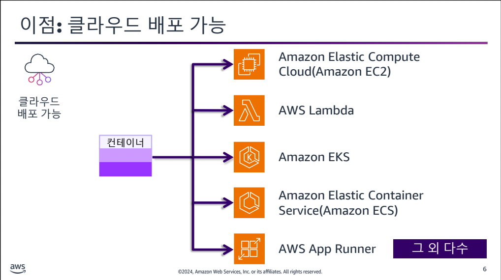
- 확장성
  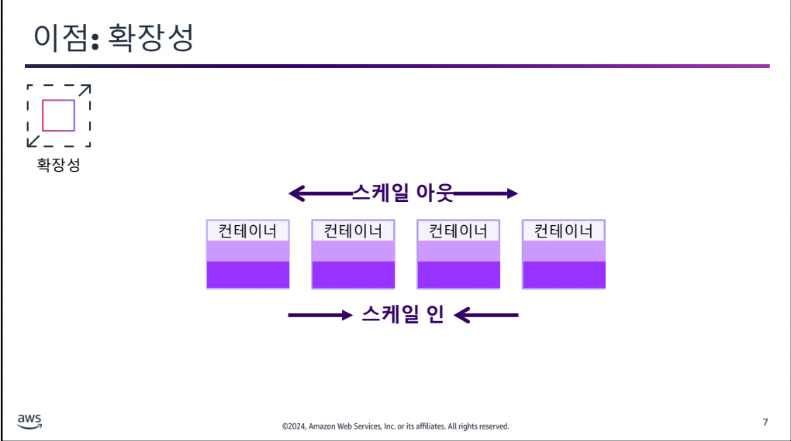
  가용성: 서비스를 사용할 수 있는 수준
- 지속적 배포
  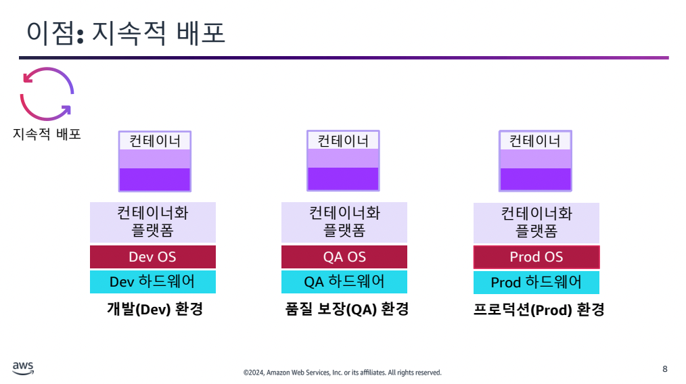
- 선언형 형식
- 마이크로 서비스에 적합

## 컨테이너 오케스트레이션
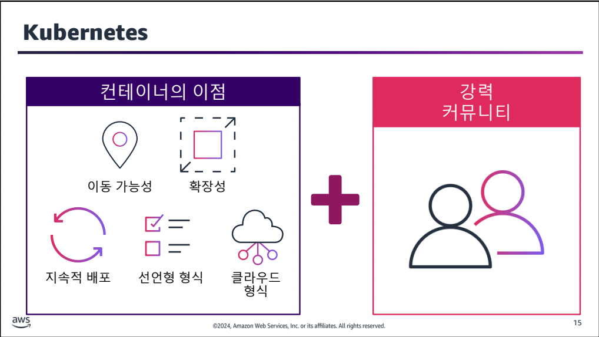

pod: 컨테이너로 구성된 쿠버네티스의 최소 단위

## Kubernetes 내부
kubectl 명령어를 날리면 API Server가 요청을 캐치

# EKS 기본 사항
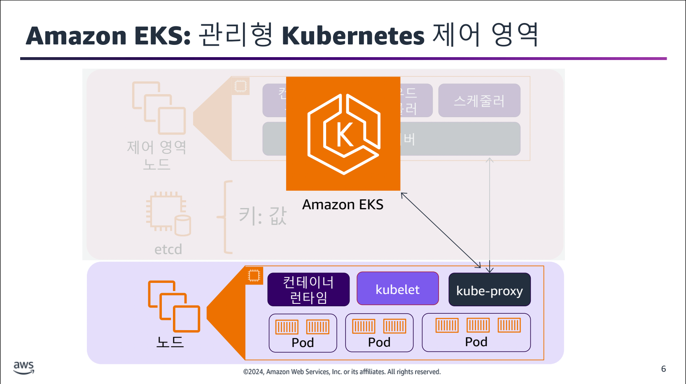

API서버는 이중화, etcd는 삼중화되어 가용성을 제공한다.

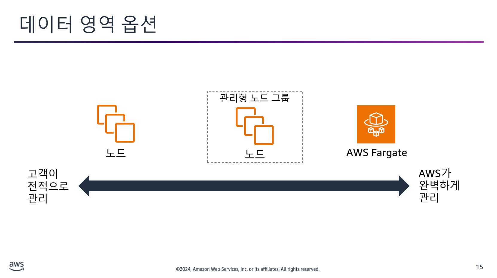

EKS를 사용해서는 세 가지 유형의 노드를 관리할 수 있다.

- 셀프 매니지드 노드
- EKS가 부분적으로 관리하고 사용자가 리소스에 대한 제어를 할 수 있는 관리형 노드 그룹
  - 프로비저닝, 관리, 업데이트, 크기 조정 기능을 제어하며 eksctl과 함께 작동한다.
- EKS에서 전적으로 관리하는 Fargate노드
  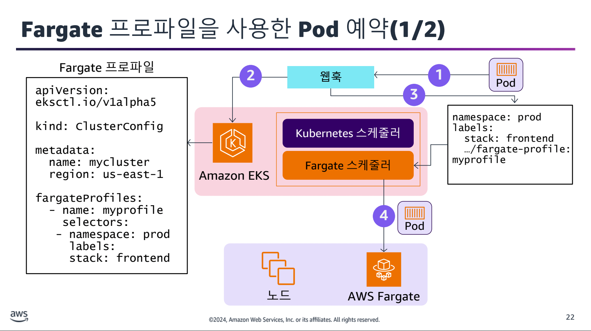
  1. pod가 Fargate 프로파일과 일치하는 경우 웹훅이 요청을 받아 EKS 클러스터로 전송
  2. EKS는 Pod에 대한 Fargate 프로파일에 일치하는 항목이 있는지 확인
  3. Pod가 Fargate 프로파일과 일치하므로 Fargate 스케줄러를 이용
  4. Fargate에서 Pod를 스케줄링
  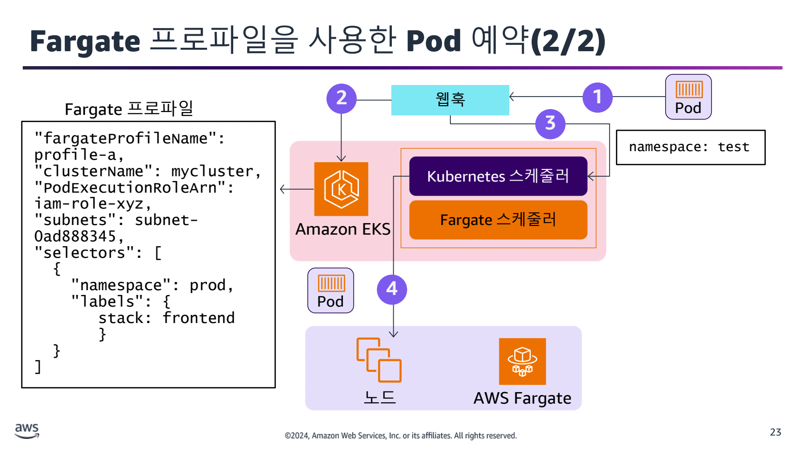

# EKS 클러스터 구축 및 유지 관리

## 2 개의 API Kubernetes 및 Amazon EKS
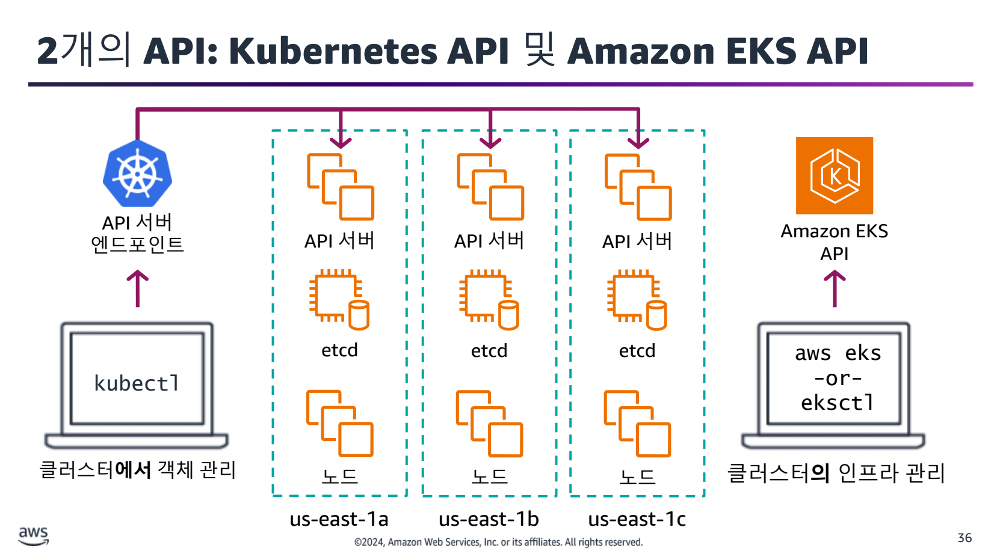

## 노드 배포
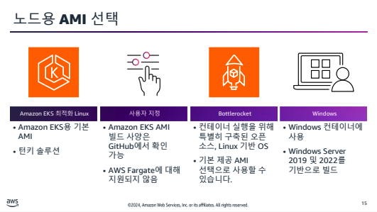

## Kubernetes 버전 업그레이드
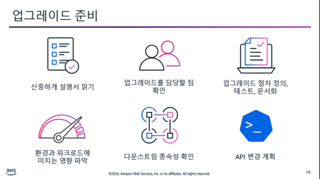

kubernetes 버전 업그레이드에서 마이너 버전은 고객이 제어한다.

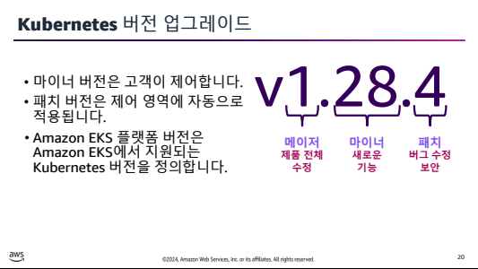

# EKS 클러스터에 애플리케이션 배포

## 애플리케이션 배포 방법
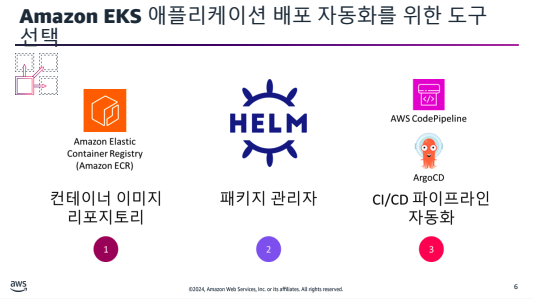

## Amazon ECR 사용
ECR은 퍼블릭, 프라이빗 모두 존재한다.

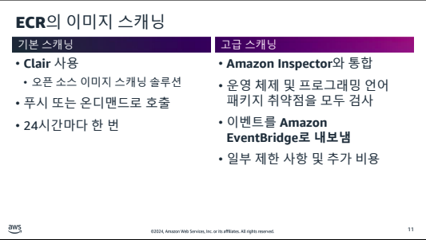

## Helm을 사용해 애플리케이션 배포
패키지 관리자로
- 표준화되고 재사용 가능한 템플릿 생성
- 배포 오류 제거
- 애플리케이션 버전 관리
- 현재 위치 업그레이드 수행

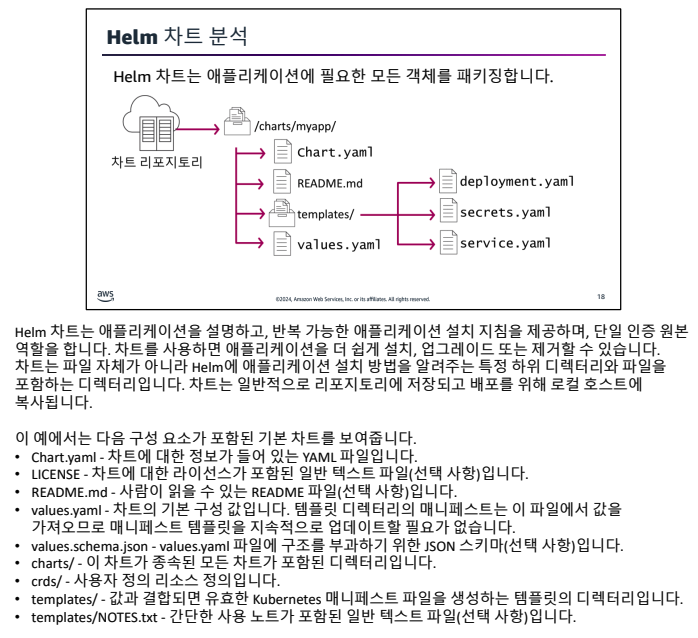

# EKS를 사용해 대규모 애플리케이션 관리

# EKS에서의 네트워킹 관리

# EKS에서 관찰 기능 구성

# EKS에서 스토리지 관리

# EKS에서 보안 관리