# Kubernetes 기본 개념

## 컨테이너의 이점
- 이동 가능성
- 클라우드 배포 가능
  
- 확장성
  
  가용성: 서비스를 사용할 수 있는 수준
- 지속적 배포
  
- 선언형 형식
- 마이크로 서비스에 적합

## 컨테이너 오케스트레이션

pod: 컨테이너로 구성된 쿠버네티스의 최소 단위

## Kubernetes 내부
kubectl 명령어를 날리면 API Server가 요청을 캐치

# EKS 기본 사항

API서버는 이중화, etcd는 삼중화되어 가용성을 제공한다.

EKS를 사용해서는 세 가지 유형의 노드를 관리할 수 있다.

- 셀프 매니지드 노드
- EKS가 부분적으로 관리하고 사용자가 리소스에 대한 제어를 할 수 있는 관리형 노드 그룹
  - 프로비저닝, 관리, 업데이트, 크기 조정 기능을 제어하며 eksctl과 함께 작동한다.
- EKS에서 전적으로 관리하는 Fargate노드
  
  1. pod가 Fargate 프로파일과 일치하는 경우 웹훅이 요청을 받아 EKS 클러스터로 전송
  2. EKS는 Pod에 대한 Fargate 프로파일에 일치하는 항목이 있는지 확인
  3. Pod가 Fargate 프로파일과 일치하므로 Fargate 스케줄러를 이용
  4. Fargate에서 Pod를 스케줄링
  

# EKS 클러스터 구축 및 유지 관리

## 2 개의 API Kubernetes 및 Amazon EKS

## 노드 배포

## Kubernetes 버전 업그레이드

kubernetes 버전 업그레이드에서 마이너 버전은 고객이 제어한다.

# EKS 클러스터에 애플리케이션 배포

## 애플리케이션 배포 방법

## Amazon ECR 사용
ECR은 퍼블릭, 프라이빗 모두 존재한다.

## Helm을 사용해 애플리케이션 배포
패키지 관리자로
- 표준화되고 재사용 가능한 템플릿 생성
- 배포 오류 제거
- 애플리케이션 버전 관리
- 현재 위치 업그레이드 수행

# EKS를 사용해 대규모 애플리케이션 관리

## EKS에서 수요에 맞게 크기 조정
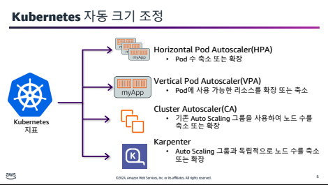
- HPA(Horizontal Pod Autoscaler): Pod 수 축소 또는 확장
  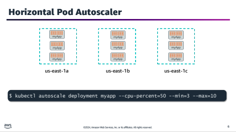
- VPA(Vertical Pod Autoscaler): Pod에 사용 가능한 리소스를 확장 또는 축소
  - Recommender: 현재 및 과거 리소스 소비를 모니터링하고 컨테이너의 CPU 및 메모리 요청에 권장 값을 제공
  - Updater: 올바른 리소스 세트가 있는 관리형 Pod를 요청
  - Admission Plugin: 방금 생성되거나 Updater 활동으로 컨트롤러에 의해 다시 생성된 새 Pod에 올바른 리소스 요청을 설정
- Cluster Autoscaler: 기존 Autoscaling 그룹을 확장해 노드 수를 축소 또는 확장
- Kapenter: Auto Scaling 그룹과 독립적으로 노드 수를 축소 또는 확장

## EKS에 지속적 배포
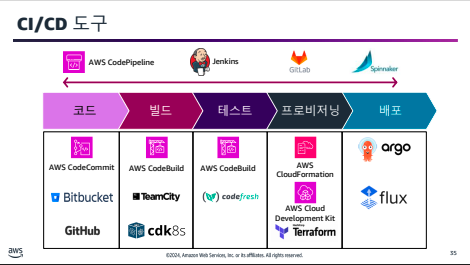

## GitOps 및 EKS

GitOps 원칙
- 모든 것이 소스 제어에 있음
- 명령적이기보다 선언적
- 승인된 변경 사항을 자동으로 적용
- 일관된 상태를 보장하기 위한 소프트웨어 에이전트

# EKS에서의 네트워킹 관리
## EKS의 통신 유형

### Pod 내 통신
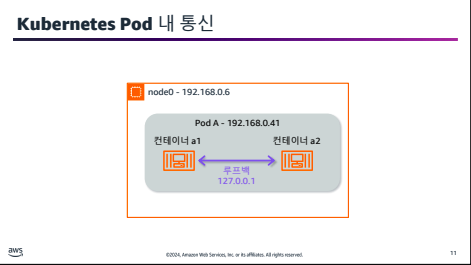

Pod의 컨테이너는 네트워크 네임스페이스를 공유하며 localhost를 사용해 서로 통신할 수 있다.

### VPC CNI
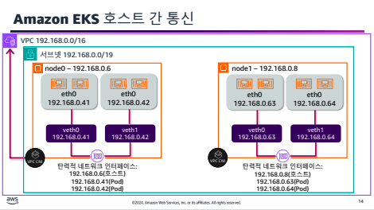
노드 간 통신을 단순화하기 위해 EKS는 VPC CNI를 사용한다. 모든 Pod에는 VPC에서 할당된 라우팅 가능한 실제 IP 주소가 있으며, 다른 Pod, 노드 또는 AWS의 서비스와 통신할 수 있다.

### Pod 네트워크 통신 보안
기본적으로 kubernetes는 모든 Pod가 제한 없이 서로 통신할 수 있또록 허용한다.

VPC CNI 플러그인은 kube-system 네임스페이스에서 DaemonSet으로 실행된다.

프런트엔드 nginx Pod에서 트래픽을 수신하기 위해 webapp 백엔드 Pod를 여는 네트워크 정책을 다음과 같이 적을 수 있다.

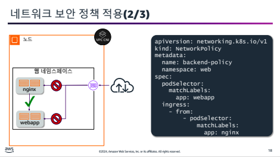

### Pod용 보안 그룹
컨테이너식 애플리케이션은 RDS, ElasticCache같은 외부 AWS서비스에 액세스해야 하는 경우가 자주 있는데 AWS에서는 네트워크 수준 제어가 보안그룹을 통해 수행된다. CNI를 사용하면 Pod용 보안 그룹을 통해 단순화할 수 있다.

# EKS에서 관찰 기능 구성
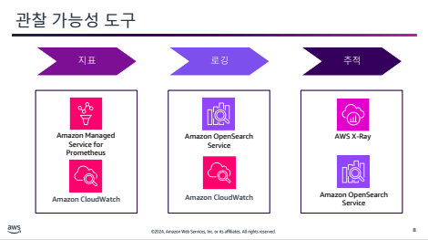

Prometheus라는 오픈 소스 도구도 있지만 그 전에 Prometheus지표가 존재한다.  
해당 지표를 Prometheus 혹은 CloudWatch같은 도구를 통해 수집할 수 있다.

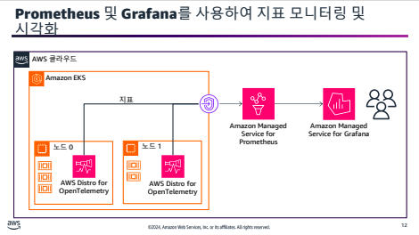

도구는 Datadog, 와탭, Container Insights 등등이 있다.

로그에서 인사이트를 얻으려며 3 가지 워크플로우가 필요하다.

- 로그 수집 및 전달
- 로그 집계 및 저장
- 데이터 시각화

# EKS에서 스토리지 관리
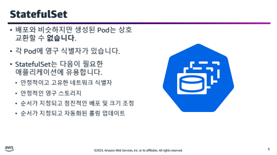
DB등의 데이터 보존이 필요한 서비스를 위해 사용하는 솔루션

# EKS에서 보안 관리

# Kubernetes RBAC 구성 요소

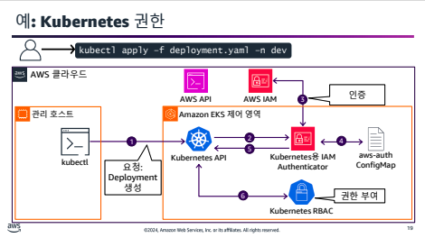
EKS 안에 Kubernetes용 IAM Authenticator가 따로 존재한다.

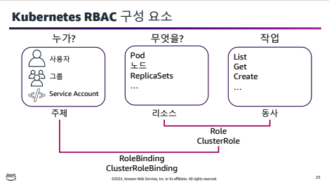

Role: 네임스페이스와 관계 없이 전체
ClusterRole: 특정 네임스페이스

