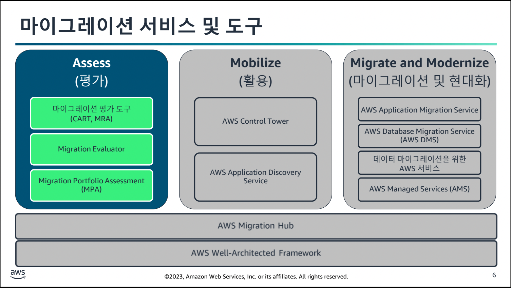
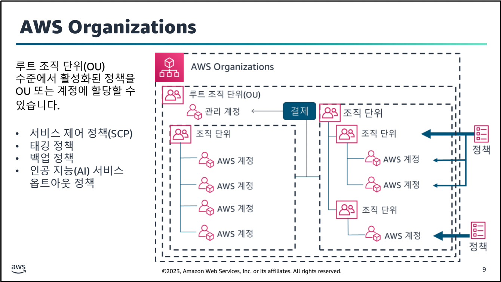
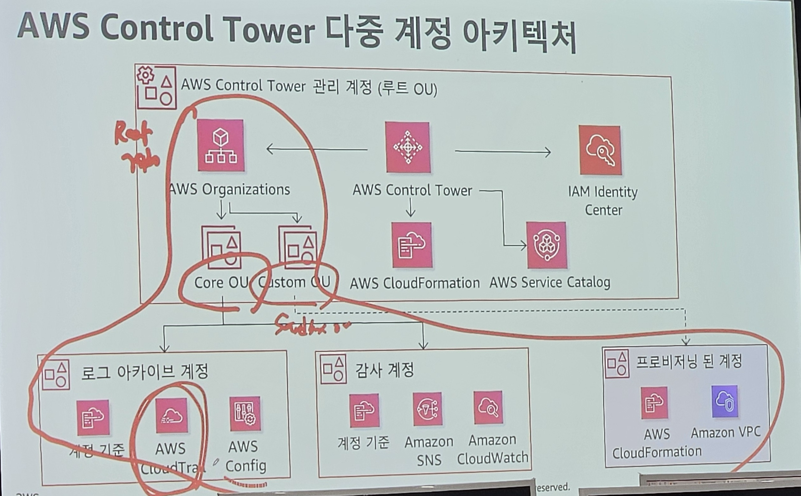
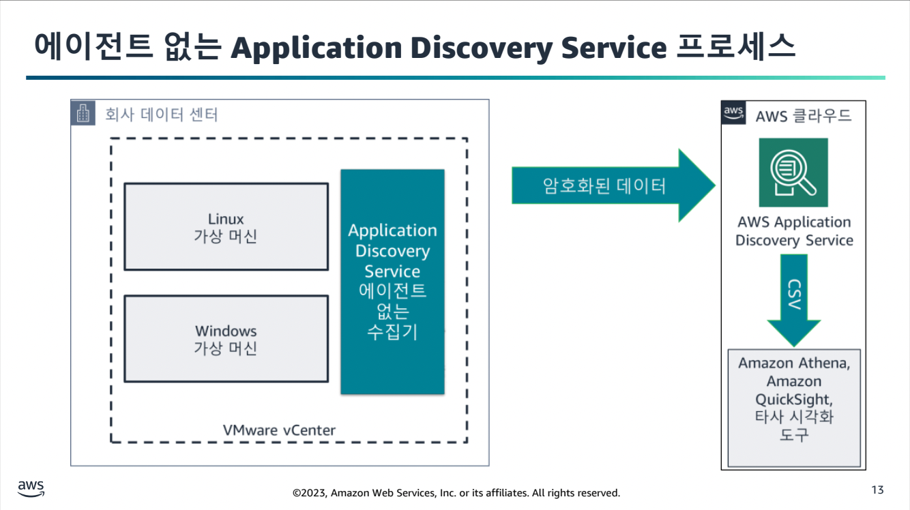
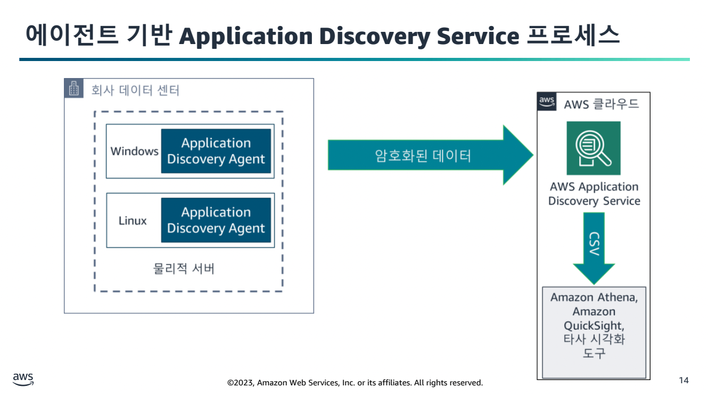
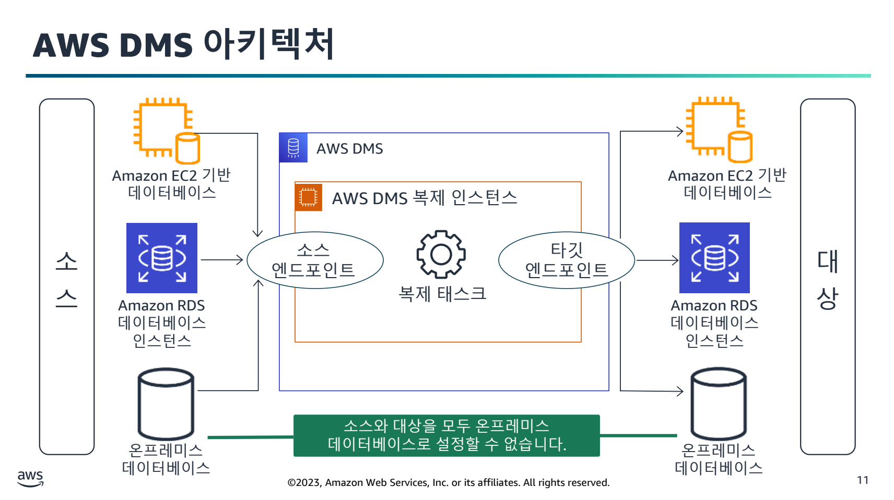
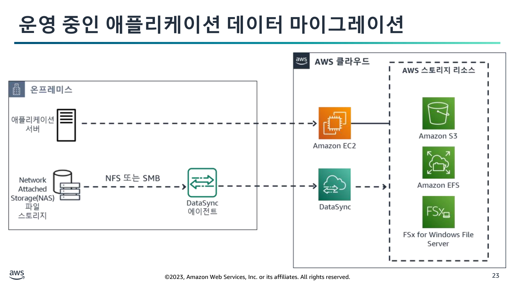
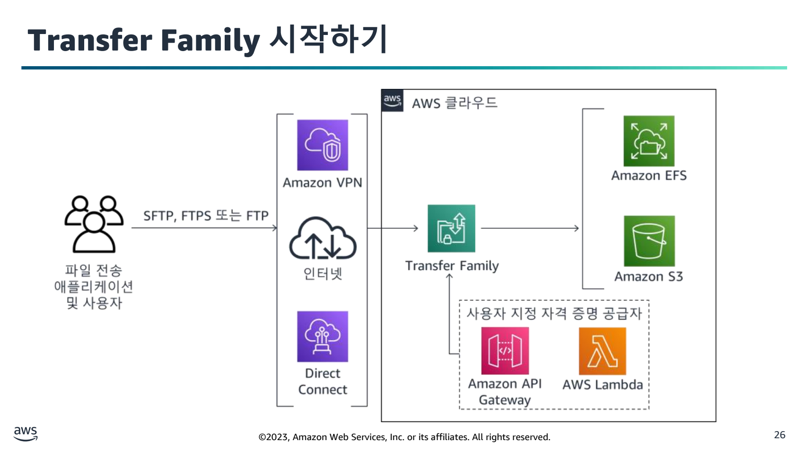
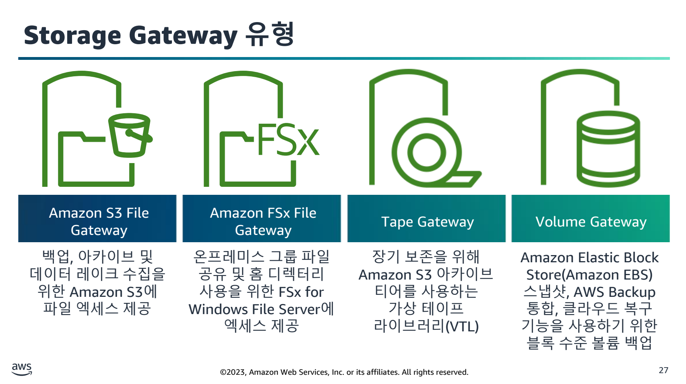
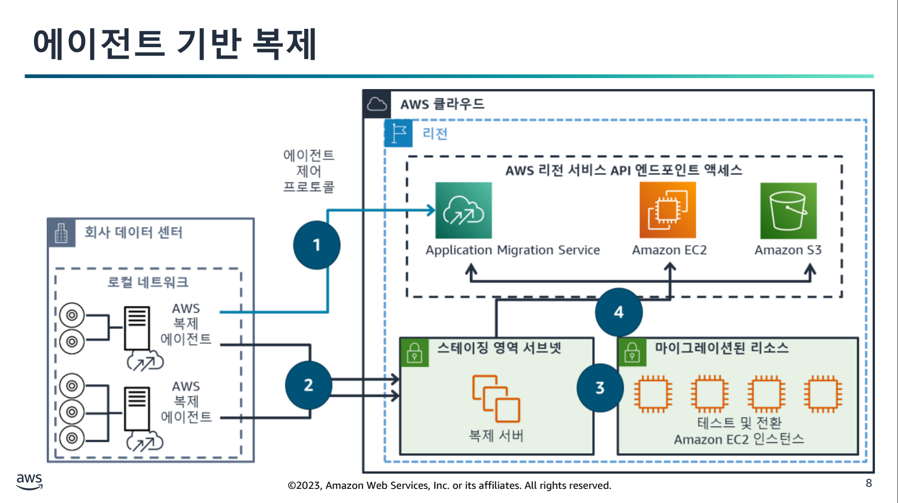

# Migration Essentials

## 학습 목표
- AWS에서 제공하는 평가 도구 및 서비스를 사용해 클라우드 준비 상태 및 마이그레이션 전략을 결정
- 마이그레이션 계획 및 활용과 관련된 주요 작업을 이해
- 데이터 및 데이터베이스 마이그레이션에 필요한 AWS 서비스, 리소스 및 도구를 개략적으로 설명
- 애플리케이션 마이그레이션에 필요한 AWS서비스, 리소스 및 도구를 개략적으로 설명

## Access(평가)
비즈니스, 거버넌스, 조직구조, 기술, 보안, 운영, 플랫폼 등의 항목등을 통해 조직 관점에서 클라우드를 도입할 준비가 됐는지 평가.

### CART
- 셀프서비스 평가(https://cloudreadiness.amazonaws.com/#/), (https://docs.google.com/document/d/1d6LPMm-JThAItn-MzwP_Q8M637lSXfT3/edit)
- 클라우드 도입 계획
- 관찰되는 강점과 약점
- AWS Cloud Adoption Framework(AWS CAF) 모범 사례

### MRA(Migration Readness Accessment)

### Migration Evaluator

### MPA

## Mobilize(활용)

### 랜딩존
- 다중 계정 환경
- 정책 및 역할에 맞게 조정된 계정
- 네트워크 구조
- 자격증명관리 또는 SSO
- 중앙집중식 로깅

랜딩존은 AWS Organizations를 사용해 수동으로 자격증명 및 액세스 관리, 거버넌스, 데이터 보안, 네트워크 설계, 로깅을 설정하는 방법과

Control Tower라는 랜딩존을 자동으로 설정하는데 사용할 수 있는 관리형 서비스가 있다. 모범 사례 블루프린트를 기반으로 사전 구성된 컨트롤을 제공해 거버넌스를 가능하게 한다.

기본으로 로그아카이브, 감사, Core OU, Custom OU가 기본으로 생성된다.

### Application Discovery Service
고객이 데이터센터에서 실행 중인 애플리케이션을 자동으로 식별해 애플리케이션 마이그레이션 프로젝트를 계획할 수 있도록 지원한다.

#### 에이전트 없는 검색

#### 에이전트 기반 검색

#### 클라우드 마이그레이션 전략
- 재배치: 마이그레이션 가속화를 위한 최신 R로 VMware 및 컨테이너 기술을 기반으로 하는 애플리케이션을 최소한의 노력과 복잡성으로 AWS로 이전 가능하다.
- 리호스팅: 리프트 앤 시프트 방식으로 프로세스를 자동화하는 도구를 사용해 마이그레이션 할 수 있다.
- 리플랫포밍: 일부 애플리케이션의 특정 문제를 해결하거나 라이선스 비용 절감같은 주요 이점을 제공
- 재구매: SaaS 구매
- 리팩터링: 아키텍쳐 재구성, 신기술 도입
- 유지: AWS로 이전 불가

# Migration Hub
기존 서버를 검색하고, 마이그레이션을 계획하고, 마이그레이션 상태를 추적할 수 있는 단일 위치를 제공한다.

## Migrate and Modernize: 데이터베이스 및 데이터 마이그레이션

### DMS
데이터베이스 마이그레이션 도구

#### 리플랫포밍
리플랫포밍 도구로 
- 동종 마이그레이션, 이기종 마이그레이션 모두 지원한다.
- 이기종 마이그레이션을 위한 스키마 변환 지원
- 무중단 데이터베이스 마이그레이션

- 복제 인스턴스: DMS의 핵심으로 VPC에서 실행된다.
  - 마이그레이션 태스크 실행
  - 다중 태스크 지원
  - T3, C5및 R5 인스턴스 클래스 지원
- 태스크: 복제 인스턴스에서 실행된다.
  - 복제 인스턴스에서 실행
  - 두 개의 엔드포인트 포함
  - 마이그레이션 방법 제공
  - 규칙 및 필터 적용
- 소스 엔드포인트: DB
- 대상 엔드포인트: DB

### 데이터 마이그레이션
온라인 데이터 전송
- AWS DataSync: 온프레미스 스토리지와 AWS 서비스 간 데이터 이송을 간소화, 자동화, 가속화하는 온라인 전송 서비스
 
  - NFS, SMB, 자체 관리형 객체 스토리지, S3, EFS, FSx, Hadoop
  
- AWS Transfer Family: 여러 프로토콜을 사용해 S3 및 EFS와 직접 송수신을 지원한다.
  

- AWS Storage Gateway
  

오프라인 데이터 전송
- AWS Snowcone: 작은 규모의 마이그레이션을 위한 미니PC
- AWS Snowball Edge

## Migrate and Modernize: AWS Application Migration

### Application Migration Service
AWS로의 애플리케이션 Lift and Shift Migration에 권장되는 기본 마이그레이션 서비스

ㅌ₩ㅌ