- [Kubernetes Architecture](#kubernetes-architecture)
- [Docker\_vs\_ContainerD](#docker_vs_containerd)
- [ETCD](#etcd)
- [ETCD in Kubernetes](#etcd-in-kubernetes)
  - [Scratch](#scratch)
  - [kubeadm](#kubeadm)
- [ETCDCTL](#etcdctl)
- [Kube-API Server](#kube-api-server)
- [Kube Controller Manager](#kube-controller-manager)
  - [Node-Controller](#node-controller)
  - [Replication-Controller](#replication-controller)
- [kube-scheduler](#kube-scheduler)
- [Kubelet](#kubelet)
- [Kube Proxy](#kube-proxy)
- [Pods](#pods)
- [문제풀이1](#문제풀이1)
- [Replication Controller](#replication-controller-1)
- [문제풀이2](#문제풀이2)
- [Deployments](#deployments)

# Kubernetes Architecture


Master Node

- ETCD Cluster: 클러스터의 변경사항 등 정보를 저장하는 데이터베이스
- Kube Controller: 노드의 응용프로그램이나 컨테이너의 스케줄을 짠다
- Kube API Server: 쿠버네티스 내의 모든 작업을 오케스트레이션

Worker Node
- Kubelet: Kube API 서버의 명령을 받아 컨테이너와 kube proxy를 관리해 클러스터 내부의 서비스 간 통신을 가능하게 한다.

# Docker_vs_ContainerD

Container Runtime Interface(CRI): k8s에서 Docker 외의 OCI표준을 준수하는 컨테이너 런타임과 작업하기 위해 만들어진 인터페이스

DockerShim을 통한 Docker에 대한 지원은 1.24v부터 제거됐다.

- ctr: 로컬에서 Docker 설치 없이 ContainerD만을 이용해서 컨테이너를 조작할 수 있는 명령어

- nerdctl: 일반적으로 사용되며 ctr이 Docker의 여러 명령어를 모두 지원하지 않는데 반해 해당 명령어는 그 이상을 지원한다.

- crictl: rkt를 위한 cli 툴로 kubelet 디버깅용으로 사용될 수 있다.

# ETCD
분산되어있으며 신뢰성있는 key-value 저장소로
- Nodes
- PODs
- Configs
- Secret
- Accounts
- Roles
- Bindings
- Others

등등을 저장한다.

```bash
# ETCD run
./etcd

# 데이터 입력
./etcdctl set key value

# 데이터 삭제
./etcdctl get key
```

# ETCD in Kubernetes
ETCD는 클러스터에 필요한 정보를 모두 저장하며 변화를 줄 때마다 추가적으로 ETCD 서버에 업데이트 된다.

쿠버네티스는 데이터를 특정 디렉토리 구조를 통해 저장한다.

- root
  - minions
  - pods
  - replicasets
  - deployments
  - roles
  - secrets

고가용성을 가지는 서버에서는 여러 master node를 가지게 되고 ectd가 여러개의 노드에 퍼져서 배포된다
  
클러스터 셋업은 scratch와 kubeadm 두 가지 방법으로 가능하다.

## Scratch
scratch를 이용하면 etcd바이너리를 직접 다운받아서 마스터노드에 하나의 서비스로 설정해야 한다

## kubeadm
kubeadm을 이용해 배포하면 kuce-system의 pod중 하나에 배포되며 pod 안의 etcd control utility를 통해 접근할 수 있다.


# ETCDCTL
etcdctl은 ETCD와 상호작용하는 CLI 툴이다

version2에서는

```bash
etcdctl backup
etcdctl cluster-health
etcdctl mk
etcdctl mkdir
etcdctl set
```

version3에서는
```bash
etcdctl snapshot save 
etcdctl endpoint health
etcdctl get
etcdctl put
```

이런 커맨드 사용이 가능하다. API version을 명시하지 않으면 기본이 version2로 셋팅되고 

```bash
export ETCDCTL_API=3
```

해당 명령어를 통해 API version 수정이 가능하다.

ETCDCTL은 ETCD API Server에 특정 파일 루트를 통해 인증할 수 있으며  
인증 파일은 etcd-master에서 아래 path에서 접근 가능하다.

```bash
--cacert /etc/kubernetes/pki/etcd/ca.crt     
--cert /etc/kubernetes/pki/etcd/server.crt     
--key /etc/kubernetes/pki/etcd/server.key
```

# Kube-API Server
Kubernetes는 최우선의 관리 컴포넌트다

kubectl command를 입력하면 kube-api서버에 가장 먼저 도착한다.

작동 과정은 다음과 같다.

1. kube-api 서버는 요청을 인증하고 etcd cluster에서 데이터를 응답받는다
2. 요청된 정보를 기반으로 ETCD Cluster와 통신해 응답을 받는다
3. ETCD에 변경사항을 업데이트한다
4. scheduler가 새로운 파드가 있다는것을 인지하고 적절한 노드를 찾는다
5. kube-api 서버가 적절한 위치의 kubelet과 통신해 pod를 생성한다
6. ETCD에 정보를 업로드한다

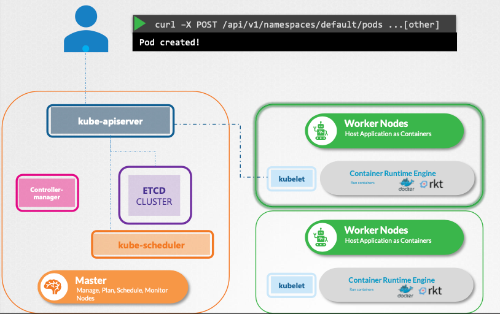

kube-api는 ETCD 클러스터와 소통하는 유일한 컴포넌트다.

kube-api server는 수많은 파라미터를 통해 실행된다. kubeadmin tool을 이용해 클러스터를 시작한다면 해당 내용을 알 필요가 없지만 이 내용들을 알아둔다면 scratch등을 이용해 클러스터를 구성할때 도움이 된다.

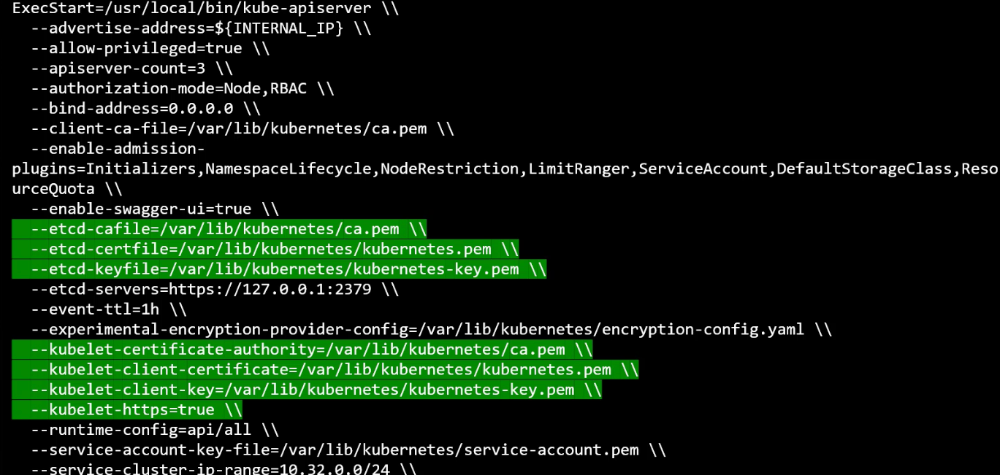

만약 kubeadmin tool을 이용해서 kube-apiserver를 배포한다면 kubeadmin이 kube-apiserver를 master node에 배포하고 옵션들은   **etc/kubernetes/manifest/kube-apiserver.yaml** 파일을 통해 확인할 수 있고

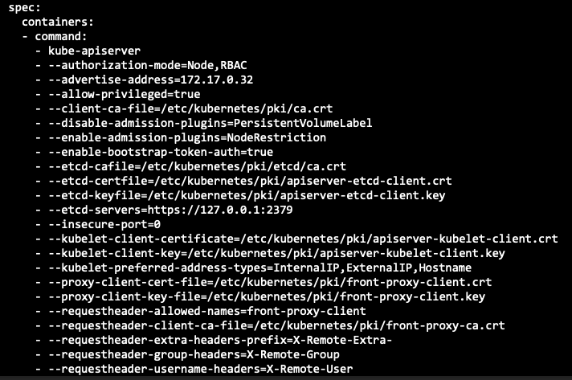

non-kubeadmin setup에서는 
**/etc/systemd/system/kube-apiserver.service**
에서 확인 가능하다

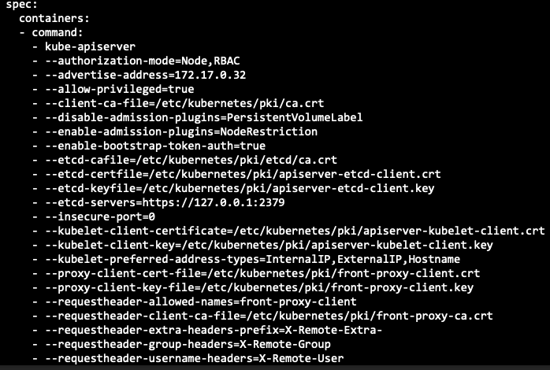

# Kube Controller Manager
kube controller manager는 kubernetes의 다양한 컨트롤러를 관리한다

## Node-Controller
그 중 Node-Controller는 5초마다 node의 헬스체크 40초의 접근불가를 대기하며 그 후에도 불가할 시 5분의 백업 타임을 준다. 그 후에도 정상 응답하지 않는다면 node를 제거한다

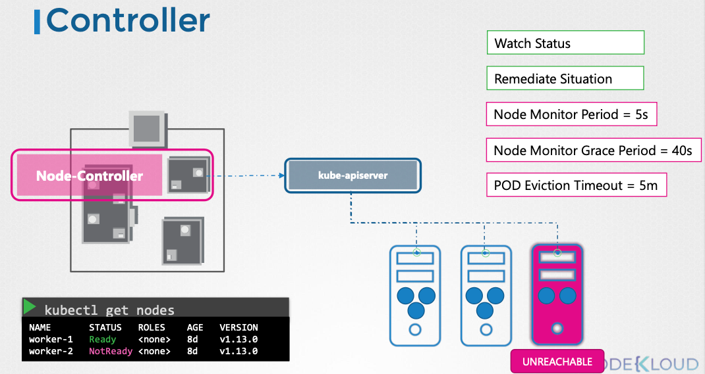

## Replication-Controller
레플리카셋의 갯수가 셋팅된 갯수가 맞는지 확인하는 컨트롤러로 pod가 set 안에서 셋팅된 갯수가 맞는지 확인하고 pod가 죽으면 새로운 것을 만든다

이것들 외에도 다양한 컨트롤러가 존재한다.

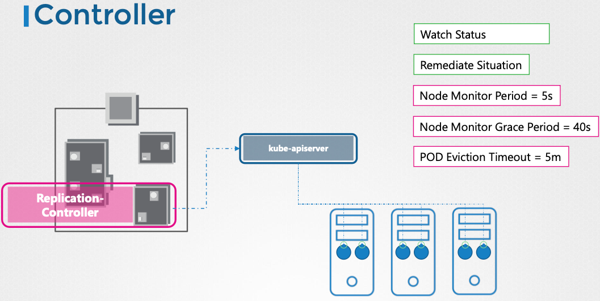

이것 외에도 다양한 컨트롤러가 존재하는데

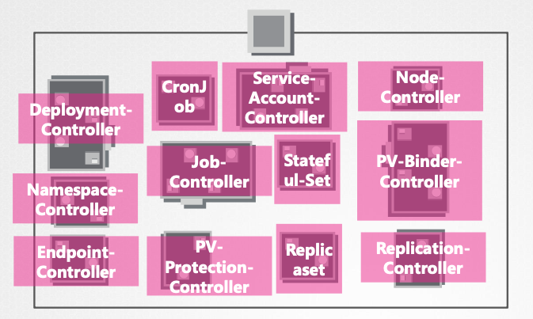

이 컨트롤러들은 Kubernetes Controller Manager라는 Single Process 안에 패키징되어있다.

kube-control-manager 파일 안에서 위에서 이야기한 node_controller의 헬스체크 등의 시간을 수정할 수 있다.

kubeadmin에서는 **/etc/kubernetes/manifests/kube-controller-manager.yaml**, non-kubeadmin에서는 **etc/systemd/system/kube-controller-manager.service**에서 확인 가능하다.

# kube-scheduler
어떤 pod를 어떤 node에 위치할지 결정하는 컴포넌트다 pod를 node에 배치하는건 kubelet이 하는 일이다.

파드의 요구사항에 따라 수용할 수 없는 노드가 있을 수 있기 때문에 pod를 배치할 적절한 위치를 고르는 역할을 한다.

이를 위해서

Resource Requirements, Limits, Taints, Tolerations, Node Selectors/Affinity 등  
다양한 설정들이 존재하며 **/etc/kubernetes/manifest/folder**에서 확인 가능하다

# Kubelet
kubelet은 각각의 배에서 선장과 같은 역할을 한다

kubelet은 kubernetes worker node에서 노드에 파드나 컨테이너를 로드하고 컨테이너 런타임 엔진에 이미지 pull을 요청, 실행하는 역할 등을 한다. 또한, pod와 container를 모니터링하고 kube API 서버에 보고한다.

kubeadm은 kubelet을 자동으로 배포하지 않는 다른 컴포넌트와 다른 점이 존재한다.

# Kube Proxy
kubernetes 상에서 모든 파드들은 서로 통신이 가능하며, pod network는 가상 네트워크로 다양한 솔루션들이 존재한다.

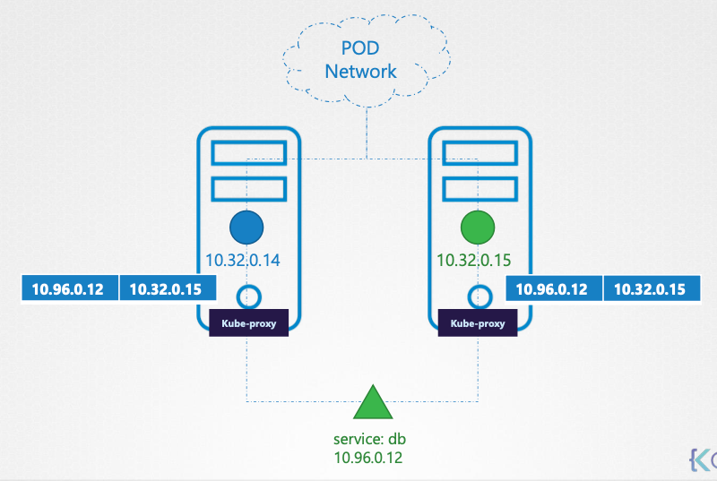

pod의 ip가 불변하지 않기 때문에 서비스라는 더 나은 방법으로 특정 어플리케이션을 다른 어플리케이션에 노출시킨다.

서비스는 유형의 존재가 아니기 때문에 pod network에 들어갈 수 없으며 kubernetes memory에 존재하는 가상 컴포넌트다

kube-proxy는 kubernetes cluster의 각 노드 안에 존재하는 프로세스로 새로운 서비스가 생성되면 각각의 노드에 적절한 룰을 생성해 pod에 대한 요청을 포워딩 해준다.

그 중 한 가지가 iptables rule을 사용하는 것으로 사진상의 10.96.0.12를 10.32.0.15로 포워딩하는 것을 알 수 있다.

kubeadm은 kube-proxy를 각각의 노드에 파드로 배치하는데 이는 DaemonSet으로 배포된다.

# Pods

pod는 Kubernetes에서 가장 작은 객체 단위로 스케일 업을 할 때는 pod 안의 container를 추가하는 것이 아니라 pod가 추가로 배포된다. 하지만 헬퍼 컨테이너 등이 필요할 때는 같은 파드 안에 여러 컨테이너를 실행할 수 있다.

```bash
kubectl run nginx --image nginx

kubectl get pods
```

위의 명령어로 nginx 이미지를 다운받아 파드 실행이 가능하고 아래 명령어로 파드 상태 확인이 가능하다.

pods, service, replicasets 들은 yaml파일로 정의될 수 있다.  

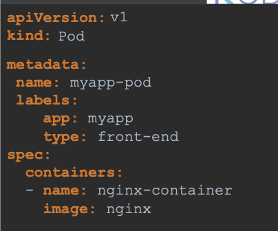

apiVersion, kind, metadata, spec의 root level 요소들이 있으며

apiVersion은 쿠버네티스 api 버전, kind는 pod, replicasets 등의 오브젝트 타입을 의미한다. metadata는 오브젝트의 이름, 라벨 등을 정의하며 dictionary 형태를 가진다.  
spec은 여기서는 pod 안의 container를 정의하며 여러 컨테이너가 있을 경우 리스트 형식으로 적는다. -가 있으면 첫 번째 요소임을 의미한다.

# 문제풀이1
1. default namespace의 pods 갯수: 0개
   ```bash
   kubectl get pods --namespace-default
   No resources found in default namespace.
   ```
2. Create a new pod with the nginx image
   ```bash
   kubectl run nginx --image nginx
   pod/nginx created
   ```
3. 현재 파드의 갯수
   ```bash
   kubectl get pods --namespace=default
   NAME            READY   STATUS    RESTARTS   AGE
   nginx           1/1     Running   0          24s
   newpods-tsf46   1/1     Running   0          8s
   newpods-zpmf8   1/1     Running   0          8s
   newpods-vdcrt   1/1     Running   0          8s
   ```
4. 새로운 pod를 만들기 위해 사용된 이미지: nginx
5. 최근 시작된 pod에 사용된 이미지: busybox
   ```bash
   kubectl describe pod newpods-tsf46
   ```
6. pods가 place된 node이름: controlplane
   ```bash
   kubectl get nodes -o wide
   ```
7. webapp pod에 등록된 컨테이너 갯수: 2개
   ```bash
   kubectl describe pod webapp
   ```
   해당 명령어를 입력하면 컨테이너 갯수, 종류등을 알 수 있다.
8. webapp pod에 등록된 컨테이너 이름: nginx & agentx
9. agentx와 webapp의 상태: Error & Waiting
10. agentx 상태의 이유: dockerhub에서 image를 pull하지 못했다.
11. kubectl get pods command의 Ready column의 의미: Running Containers in POD/Total Containers in POD
12. webapp pod를 삭제해라
    ```bash
    kubectl delete pod webapp
    ```
13. redis123 image로 redis라는 이름의 pod를 실행시켜라
    ```bash
    kubectl run redis --image redis123
    kubectl run redis --image=redis123 --dry-run=client -o yaml > redis.yaml
    ```
    아래 방법으로 실행시키면 yaml 파일을 생성하며 실행할 수 있다.
14. 이미지 이름을 redis로 변경하라
    위에서 생성한 redis.yaml파일의 spec:containers:image: redis123을 redis로 변경한 후
    ```bash
    kubectl apply -f redis.yaml
    ```
    을 실행하면 된다.


# Replication Controller

Replication Controller는 Replica Set에 의해 대체된 오래된 기술로 

파드의 복제본을 유지하고 관리하는데 사용된다.

특정 수의 파드 복제본이 항상 실행중인지 확인한다.
실행 중인 파드의 수와 지정된 수와 비교해 실행중인 파드 갯수를 조절한다.

rc-definition.yml을 보면

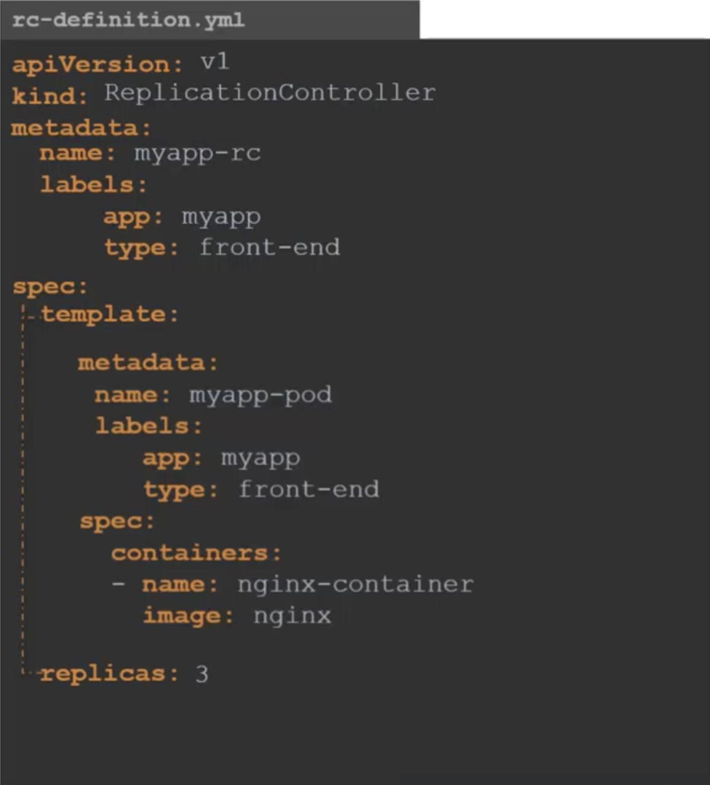
metadata가 두 개 존재하게 된다.
- Replication Controller를 위한 metadata
- pod를 위한 metadata

마지막으로 spec:replicas로 몇 개의 replica를 만들지 지정한다.

```bash
kubectl create -f re-definition.yaml

kubectl get replicationcontroller
```
를 통해 확인 가능하다.

replicaset은 apiVersion부터 다르다 중간은 비슷하고 마지막 selector도 다르다

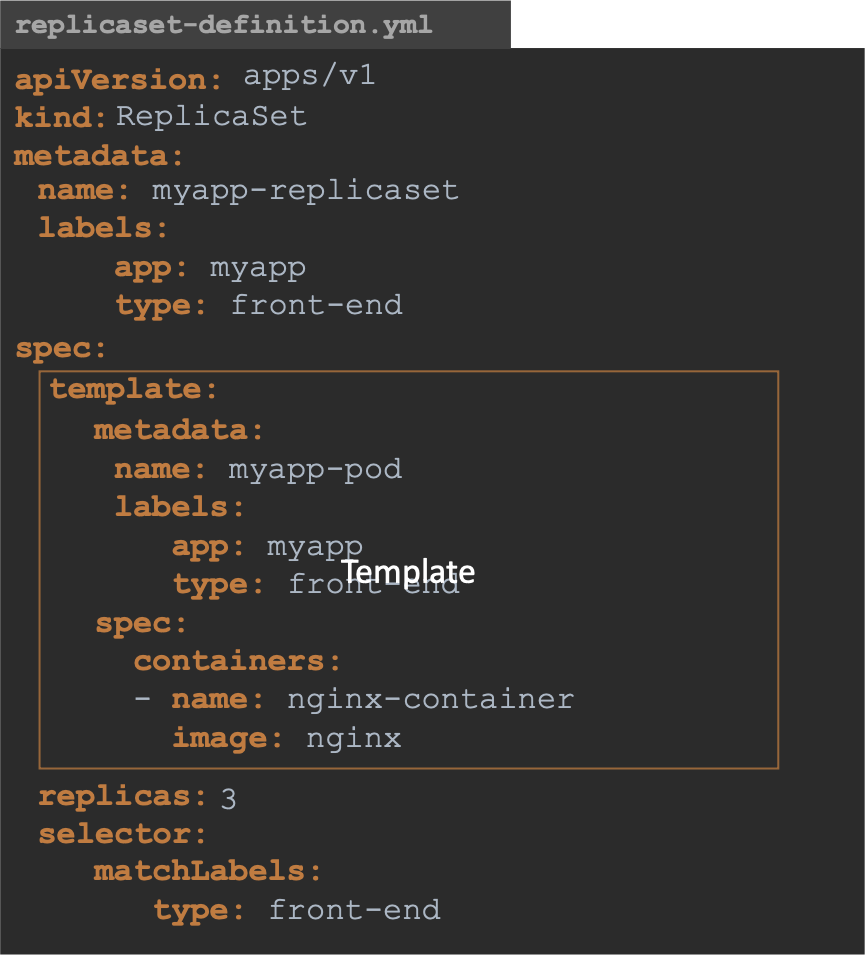

selector는 이미 pods가 존재했을 때 pods를 replicaset 안에 넣을 때 필요하다.

라벨링을 통해 레플리카셋이 어떤 파드를 모니터링할지 특정할 수 있다.

갯수를 늘리기 위한 방법은 세 가지로 정의할 수 있다.

replicas: 6로 증가시키기 위해

```bash
kubectl replace -f replicaset-definition.yaml
# replicaset-definition.yaml 파일 내에서 replicas 수를 조정

kubectl scale --replicas=6 -f replicaset-definition.yaml
# 같은 파일을 이용해 replicas만 6으로 늘리는 설정으로 추후 관리가 힘들다

kubectl scale --replicas=6 replicaset myapp-replicaset 
# 파일을 이용하지 않고 replicas 수만 조정해 이것 역시 추후 관리가 힘들다.
```


# 문제풀이2
1. system의 pod 갯수: 0
   ```bash
   kubectl get pods --namespace=default
   ```
2. system의 ReplicaSets 갯수: 0
   ```bash
   kubectl get replicaset
   ```
3. 현재 ReplicaSets 갯수: 1
4. new-replica-set의 desired pod 갯수
   ```bash
   controlplane ~ ➜  kubectl get replicaset
   NAME              DESIRED   CURRENT   READY   AGE
   new-replica-set   4         4         0       11s
   ```
5. new-replica-set에 사용된 이미지: busybox777
   ```bash
   kubectl describe replicaset new-replica-set
   
   Pod Template:
   Labels:  name=busybox-pod
   Containers:
   busybox-container:
     Image:      busybox777
     Port:       <none>
     Host Port:  <none>
   ```
6. READY 상태의 new-replica-set pod 갯수: 4
   ```bash
   kubectl get replicaset
   NAME              DESIRED   CURRENT   READY   AGE
   new-replica-set   4         4         0       3m38s
   ```
7. ready 상태의 pod가 없는 이유: busybox777 이미지 풀링을 실패했다.
   ```bash
   kubectl describe pods
   ```
8. 하나의 파드를 삭제해라.
   ```bash
   kubectl get pods
   NAME                    READY   STATUS             RESTARTS   AGE
   new-replica-set-dnmkf   0/1     ImagePullBackOff   0          7m49s
   new-replica-set-d5t2j   0/1     ImagePullBackOff   0          7m49s
   new-replica-set-mg7nv   0/1     ImagePullBackOff   0          7m49s
   new-replica-set-mgb7k   0/1     ImagePullBackOff   0          7m49s

   kubectl delete pod new-replica-set-dnmkf
   ```
9. 삭제 후 현재 남은 파드의 갯수: 4
10. 삭제했음에도 남아있는 이유: ReplicaSet이 설정된 pod 갯수를 유지시켰다.
11. replication-definition-1.yaml 파일을 실행시켜라
    ```bash
    apiVersion: apps/v1
    # 으로 업데이트 한 후

    kubectl create -f replicaset-definition-1.yaml
    ```
12. replicaset-definition-2.yaml을 실행
    ```bash
    apiVersion: apps/v1
    kind: ReplicaSet
    metadata:
      name: replicaset-2
    spec:
      replicas: 2
      selector:
        matchLabels:
          tier: frontend
      template:
        metadata:
          labels:
            tier: nginx
        spec:
          containers:
          - name: nginx
            image: nginx
    # selector의 matchLabels와 template의 labels가 다르다. frontend를 nginx로 변경 후 실행
    kubectl create -f replicaset-definition-2.yaml
    ```
13. replicaset-1, 2를 지워라
    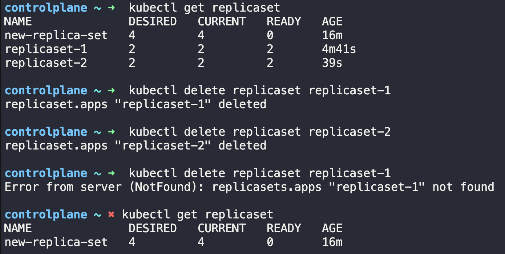
14. new-replica-set에서 올바른 busybox 이미지를 사용하도록 고쳐라
    ```bash
    kubectl edit replicaset
    ```
    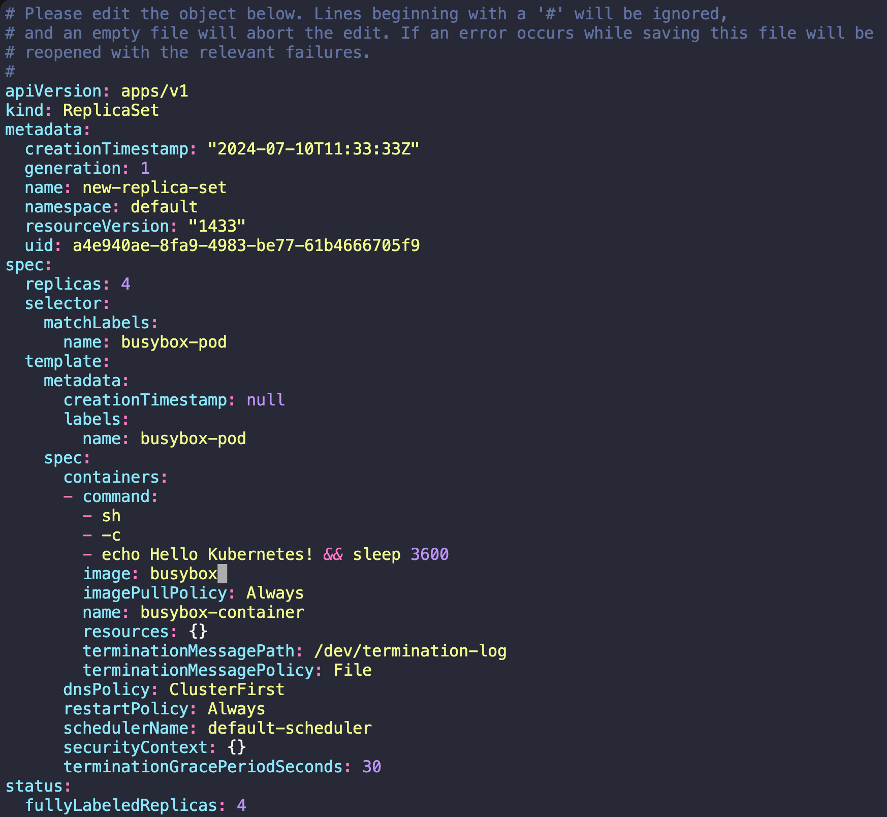
    
    replicaset 수정 후 pod 전체 삭제

    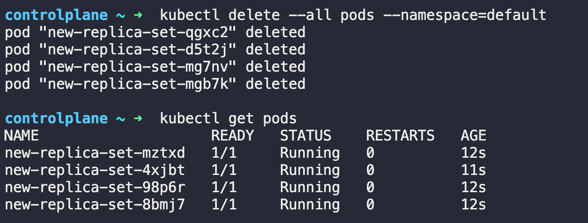

    replicaset에 의해 pod 재시작
15. replicaset을 5개로 증가시키기
    ```bash
    kubectl edit replicaset
    ```
    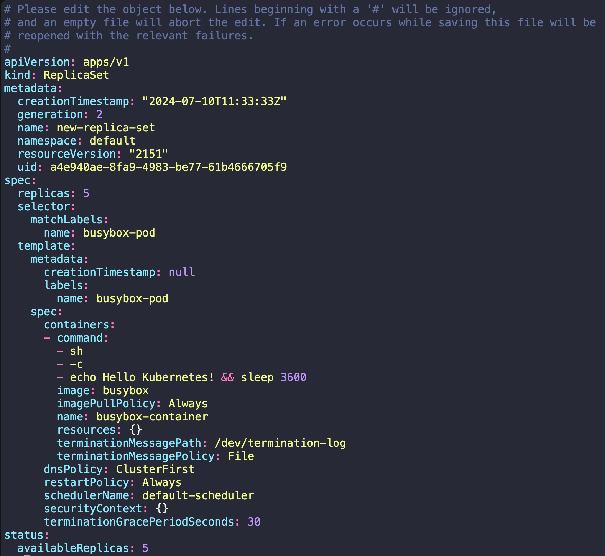
    수정 후 pod 갯수 -> 5
    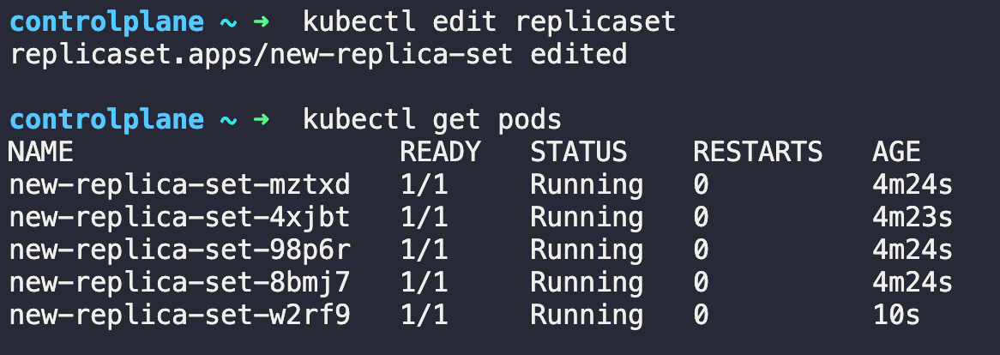
16. replicaset을 2개로 감소시키기
    replicaset edit 또는 파일을 사용해도 되지만 
    ```bash
    kubectl scale --replicas=2 replicaset new-replica-set
    replicaset.apps/new-replica-set scaled
    ```
    명령어를 통해 조절
    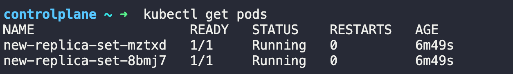

# Deployments
여러 어플리케이션이 동작중이고 다른 버전의 이미지를 배포하고자 할 때

보통 한 번에 업그레이드 하는 것이 아닌 롤링 업데이트 등의 다른 업데이트 방법을 사용한다.

Deployment는 Replicaset 그 상위의 개념으로 Deployment를 create하면 하위의 Replicaset가 배포되며 그 하위의 pod까지 배포된다.

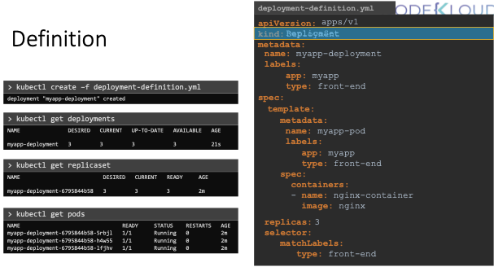