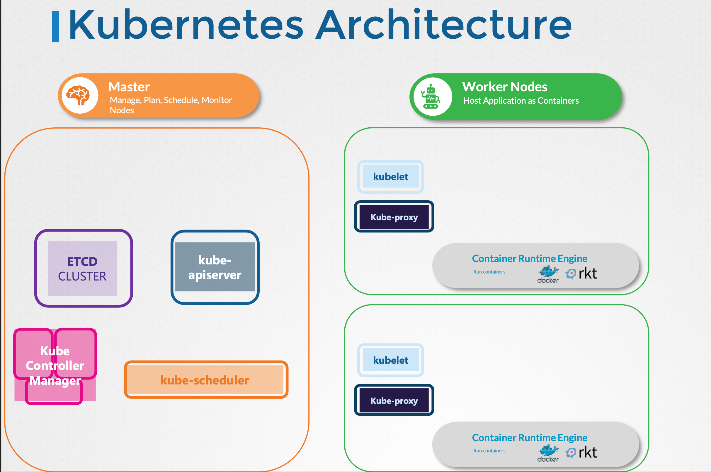

- [Kubernetes Architecture](#kubernetes-architecture)
- [Docker\_vs\_ContainerD](#docker_vs_containerd)
- [ETCD](#etcd)

# Kubernetes Architecture



Master Node

- ETCD Cluster: 클러스터의 변경사항 등 정보를 저장하는 데이터베이스
- Kube Controller: 노드의 응용프로그램이나 컨테이너의 스케줄을 짠다
- Kube API Server: 쿠버네티스 내의 모든 작업을 오케스트레이션

Worker Node
- Kubelet: Kube API 서버의 명령을 받아 컨테이너와 kube proxy를 관리해 클러스터 내부의 서비스 간 통신을 가능하게 한다.

# Docker_vs_ContainerD

Container Runtime Interface(CRI): k8s에서 Docker 외의 OCI표준을 준수하는 컨테이너 런타임과 작업하기 위해 만들어진 인터페이스

DockerShim을 통한 Docker에 대한 지원은 1.24v부터 제거됐다.

- ctr: 로컬에서 Docker 설치 없이 ContainerD만을 이용해서 컨테이너를 조작할 수 있는 명령어

- nerdctl: 일반적으로 사용되며 ctr이 Docker의 여러 명령어를 모두 지원하지 않는데 반해 해당 명령어는 그 이상을 지원한다.

- crictl: rkt를 위한 cli 툴로 kubelet 디버깅용으로 사용될 수 있다.

# ETCD
분산되어있으며 신뢰성있는 key-value 저장소로
- Nodes
- PODs
- Configs
- Secret
- Accounts
- Roles
- Bindings
- Others

등등을 저장한다.

```bash
# ETCD run
./etcd

# 데이터 입력
./etcdctl set key value

# 데이터 삭제
./etcdctl get key
```


