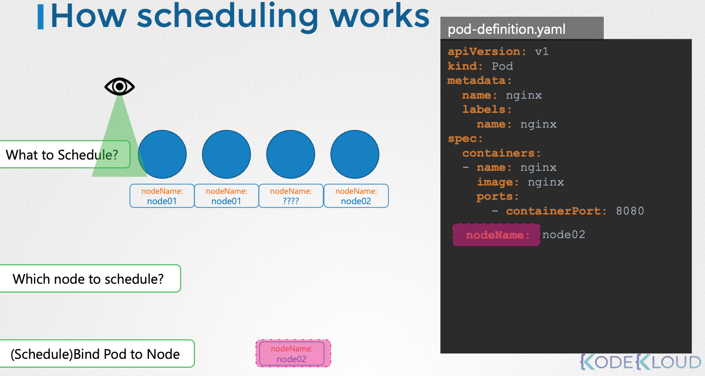
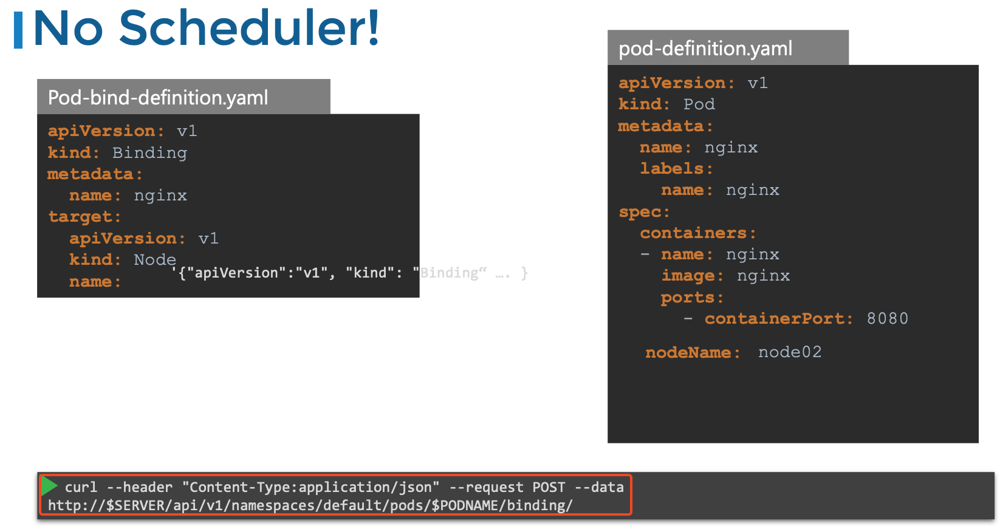

# Section3

- [Section3](#section3)
  - [Manual Scheduling](#manual-scheduling)
    - [문제풀이1](#문제풀이1)
  - [Labels and Selectors](#labels-and-selectors)
    - [Annotation](#annotation)
    - [문제풀이2](#문제풀이2)
  - [Taints and Tolerations](#taints-and-tolerations)
    - [문제풀이3](#문제풀이3)
  - [Node Selectors \& Node Affinity](#node-selectors--node-affinity)
    - [Node Selectors](#node-selectors)
    - [Node Affinity](#node-affinity)
    - [문제풀이4](#문제풀이4)

## Manual Scheduling

모든 파드에는 기본적으로 nodeName이라는 항목이 있는데 매니페스트 파일을 만들 때 이 필드를 지정하지 않으면 쿠버네티스가 자동으로 추가한다.



스케줄링 기본 프로세스는

1. 스케줄러가 모든 파드를 확인해 nodeName 속성이 설정되지 않은 파드를 찾는다.
2. 스케줄링 알고리즘을 실행해 해당 파드에 적합한 노드를 식별한다.
3. 식별되면 바인딩 객체를 생성해 노드 이름 속성을 해당 노드의 이름을 설정해 파드를 노드에 스케줄링한다.

수동 스케줄링 프로세스는

1. 파드 생성시 nodeName 필드를 설정해 파드를 특정 노드에 할당한다.
2. 이미 생성된 파드는 바인딩 객체를 생성하고 이를 JSON 형식으로 변환해 바인딩 API에 POST 요청을 보낸다.



### 문제풀이1

1. nginx.yaml 파일을 이용해 pod를 만들어봐라: kubectl create -f nginx.yaml
2. POD의 상태가 어떤가: Pending
3. 왜 POD가 Pending 상태인가:

   ```bash
   kubectl get pods --namespace kube-system
    NAME                                   READY   STATUS    RESTARTS   AGE
    coredns-768b85b76f-wk8fq               1/1     Running   0          25m
    coredns-768b85b76f-zbxfm               1/1     Running   0          25m
    etcd-controlplane                      1/1     Running   0          25m
    kube-apiserver-controlplane            1/1     Running   0          25m
    kube-controller-manager-controlplane   1/1     Running   0          25m
    kube-proxy-9s855                       1/1     Running   0          24m
    kube-proxy-tszdh                       1/1     Running   0          25m
   ```

   scheduler가 없어서 pending 상태다.
4. pod를 node01에 스케줄링해라

    ```bash
    kubectl delete pod nginx

    kubectl get nodes
    NAME           STATUS   ROLES           AGE   VERSION
    controlplane   Ready    control-plane   28m   v1.30.0
    node01         Ready    <none>          27m   v1.30.0

    cat nginx.yaml 
    ---
    apiVersion: v1
    kind: Pod
    metadata:
    name: nginx
    spec:
    nodeName: node01
    containers:
    -  image: nginx
        name: nginx


    kubectl get pods -o wide
    NAME    READY   STATUS    RESTARTS   AGE   IP           NODE     NOMINATED NODE   READINESS GATES
    nginx   1/1     Running   0          15s   10.244.1.2   node01   <none>           <none>
    ```

    혹은

    ```bash
    kubectl replace --force -f nginx.yaml
    ```

## Labels and Selectors

레이블: 각 객체에 부착된 속성으로 키-값 형태로 정의되며 객체를 그룹화하고 분류할 수 있다.  
셀렉터: 특정 조건을 만족하는 레이블을 가진 객체들을 필터링하는 방법으로 특정 속성을 가진 객체들을 쉽게 찾을 수 있다.

대부분의 객체(파드, 서비스, 레플리카셋, 디플로이먼트)에 적용된다.

ReplicaSet에서 Selector를, Pod 정의 파일에서 Labels를 추가하면 사용 가능하며
ReplicaSet 정의 파일에서 template 내 label에는 pod의 라벨을, ReplicaSet의 최상위 label에는 ReplicaSet의 라벨을 넣어주면 된다.

### Annotation

Label은 객체를 그룹화하는데 사용, Annotation은 부가 정보를 기록하는 용도

ex) 빌드 정보 연락처 등등

### 문제풀이2

1. label이 dev인 pod의 갯수는: 7개
   - kubectl get pods --selector selector=dev
2. bu가 finance 비즈니스 유닛의 pod의 갯수: 6
   - kubectl get pods --selector bu=finance --no-headers | wc -l
3. env가 prod인 모든 object의 갯수: 7
   - kubectl get all --selector env=prod --no-headers | wc -l
4. env가 prod, bu=finance, tier=frontend
   - kubectl get all --selector env=prod,bu=finance,tier=frontend
5. replicaset-definition-1.yaml파일을 수정해서 실행해봐라

   ```bash
   kubectl apply -f replicaset-definition-1

   apiVersion: apps/v1
   kind: ReplicaSet
   metadata:
   name: replicaset-1
   spec:
   replicas: 2
   selector:
       matchLabels:
           tier: front-end
   template:
       metadata:
       labels:
           tier: nginx -> front-end
       spec:
       containers:
       - name: nginx
           image: nginx
   ```

## Taints and Tolerations

Taint는 일종의 벌레기피제로 생각하고 Tolerations는 특정 향기를 좋아하는 벌레라고 생각하면 편하며, 보안이나 클러스터 침입과는 관련이 없다.  
노드에 어떤 파드를 배치할지 제한하는데 사용된다.

예시

1. 클러스터 설정: 3개의 워커 노드와 4개의 파드가 있다고 가정했을때 기본적으로 스케줄러는 제한 없이 파드를 균등하게 배치한다.
2. 특정 노드 전용 리소스 생성: 노드 1에 특정 애플리케이션 전용 리소스를 할당하고, 다른 파드가 배치되지 않도록 taint를 추가한다.
3. taint 적용: 노드 1에 blue라는 taint를 추가하고, 기본적으로 모든 파드는 toleration이 없으므로 이 taint 피해간다.
4. 특정 pod에 toleration 추가: 파드 D에 blue taint를 견딜 수 있는 toleration을 추가해 노드1이 배치될 수 있도록 한다.

taints의 효과

1. NoSchedule: 파드가 노드에 스케줄링되지 않음
2. PreferNoSchedule: 가능하면 파드를 피하지만, 보장은 없음
3. NoExecute: 새로운 파드는 스케줄링되지 않고, 기존 파드는 퇴출됨

node에 taint 추가

```bash
kubectl taint nodes node1 app=blue:NoSchedule
```

pod에 toleration 추가

```bash
spec:
  tolerations:
  - key: "app"
    operator: "Equal"
    value: "blue"
    effect: "NoSchedule"
```

taint와 toleration은 pod를 특정 node에서 실행하도록 강제하는 것이 아니라 pod의 배포 위치를 특정하고 싶다면 Affinity를 설정해야 한다.

실제로 kubernetes의 master node는 taint를 통해 pod들의 배치를 막으며,  

```bash
kubectl describe node kubemaster | grep Taint
```

해당 명령어를 통해 확인할 수 있다.

### 문제풀이3

1. node가 몇개 있는지: 2개
   - kubectl get nodes
2. node1 node에 taint 설정이 있는지: node
   - kubectl describe node node01 | grep -i taints
3. node01에 spray=mortein이라는 taint를 NoSchedule로 추가하기
   - kubectl taint node node01 spray=mortein:NoSchedule
4. Create a new pod with the nginx image and pod name as mosquito.
   - kubectl create -f nginx-pod.yaml
5. pod가 pending 상태에 있는 이유: pod가 배치될 수 있는 node가 존재하지 않아서

   ```bash
   Events:
   Type     Reason            Age   From               Message
   ----     ------            ----  ----               -------
   Warning  FailedScheduling  88s   default-scheduler  0/2 nodes are available: 1 node(s) had untolerated taint {node-role.kubernetes.io/control-plane: }, 1 node(s) had untolerated taint {spray: mortein}. preemption: 0/2 nodes are available: 2 Preemption is not helpful for scheduling.
   ```

6. Create another pod named bee with the nginx image, which has a toleration set to the taint mortein: operator: Equal은 key, value가 모두 일치해야 하고, Exists는 key만 체크함

  ```bash
   apiVersion: v1
   kind: Pod
   metadata:
   creationTimestamp: null
   labels:
      run: bee
   name: bee
   spec:
   containers:
   - image: nginx
      name: bee
      resources: {}
   tolerations:
   - key: spray
      value: mortein
      effect: NoSchedule
   dnsPolicy: ClusterFirst
   restartPolicy: Always
   status: {}
  ```

7. Contolplane에서 Remove the taint on controlplane, which currently has the taint effect of NoSchedule.

   ```bash
   kubectl taint nodes controlplane node-role.kubernetes.io/control-plane:NoSchedule-
   ```

## Node Selectors & Node Affinity

만약 데이터 처리같이 높은 성능을 필요로 하는 pod가 존재하고, 그에 맞춰 node를 큰거 하나랑 작은거 두 개를 준비했다면 특정 node에서만 pod가 실행되도록 설정해야 한다.  
그 때 사용할 수 있는 것

### Node Selectors

Node Selectors
노드에 이미 지정된 라벨을 기반으로 pod가 찾아간다.

```bash
## node에 label 추가
kubectl label nodes node-1 size=Large

## pod에 nodeSelector 추가
apiVersion:
kind: Pod
metadata:
   name: myapp-pod
spec:
   containers:
   - name: data
```

   하지만 단순한 키-값 매칭만 가능하며 복잡한 조건(large or medium 등)이 불가능해 주로 Node Affinity를 쓴다

### Node Affinity

or이나 not 표현을 사용할 수 없는 Node Selectors의 한계를 극복하기 위해 등장했다.

```bash
spec:
  affinity:
    nodeAffinity:
      requiredDuringSchedulingIgnoredDuringExecution:
        nodeSelectorTerms:
          - matchExpressions:
              - key: size
                operator: In
                values:
                  - large
```

size=large 라벨이 있는 노드에서만 pod가 실행되며 NotIn이나 values에 값을 추가해 하나라도 매칭되면 배치되게 할 수도 있다.

Exists: 해당 키가 존재하면 선택(값 비교 X)

Node Affinity 타입에는

|타입|동작 방식|
|--|----|
|requiredDuringSchedulingIgnoredDuringExecution | 필수 조건: 매칭되는 노드가 없으면 Pod는 스케줄링되지 않음. 실행 중에는 영향을 받지 않음.|
|preferredDuringSchedulingIgnoredDuringExecution | 우선 조건: 매칭되는 노드가 있으면 배치, 없으면 다른 노드에도 배치 가능.|
|requiredDuringSchedulingRequiredDuringExecution | (예정) 필수 조건 + 실행 중에도 적용: 실행 중에도 라벨 변경 시 Pod를 퇴출(evict).|

실행중에는 기존 타입들은 변경된 라벨을 반영하지 않음

### 문제풀이4

1. How many Labels exist on node node01

   ```bash
   controlplane ~ ➜  kubectl describe node node01 | grep -i labels -A 10
   Labels:             beta.kubernetes.io/arch=amd64
                     beta.kubernetes.io/os=linux
                     kubernetes.io/arch=amd64
                     kubernetes.io/hostname=node01
                     kubernetes.io/os=linux
   ```

2. What is the value set to the label key beta.kubernetes.io/arch on node01?  
   amd64
3. Apply a label color=blue to node node01

   ```bash
   kubectl label nodes node01 color=blue
   ```

4. Create a new deployment named blue with the nginx image and 3 replicas.

   ```bash
   controlplane ~ ➜  kubectl create deployment blue --image=nginx --replicas=3 --dry-run=client -o yaml > blue-nginx.yaml

   controlplane ~ ➜  ls
   blue-nginx.yaml  sample.yaml

   controlplane ~ ➜  cat blue-nginx.yaml 
   apiVersion: apps/v1
   kind: Deployment
   metadata:
   creationTimestamp: null
   labels:
      app: blue
   name: blue
   spec:
   replicas: 3
   selector:
      matchLabels:
         app: blue
   strategy: {}
   template:
      metadata:
         creationTimestamp: null
         labels:
         app: blue
      spec:
         containers:
         - image: nginx
         name: nginx
         resources: {}
   status: {}

   controlplane ~ ➜  kubectl apply -f blue-nginx.yaml 
   deployment.apps/blue created
   ```
5. blue pod는 어느 node에 배치될 수 있는가?
6. Set Node Affinity to the deployment to place the pods on node01 only.

   ```bash
   cat blue-nginx.yaml 
   apiVersion: apps/v1
   kind: Deployment
   metadata:
   creationTimestamp: null
   labels:
      app: blue
   name: blue
   spec:
   replicas: 3
   selector:
      matchLabels:
         app: blue
   strategy: {}
   template:
      metadata:
         creationTimestamp: null
         labels:
         app: blue
      spec:
         containers:
         - image: nginx
         name: nginx
         resources: {}
         affinity:
         nodeAffinity:
            requiredDuringSchedulingIgnoredDuringExecution:
               nodeSelectorTerms:
               - matchExpressions:
                  - key: size
                     operator: In
                     values:
                     - large
   ```

7. Which nodes are the pods placed on now?

   ```bash
   kubectl get pods -o wide
   NAME                    READY   STATUS    RESTARTS   AGE   IP           NODE     NOMINATED NODE   READINESS GATES
   blue-5659879b55-2mrvs   1/1     Running   0          75s   172.17.1.5   node01   <none>           <none>
   blue-5659879b55-7w6kl   1/1     Running   0          73s   172.17.1.6   node01   <none>           <none>
   blue-5659879b55-8hx99   1/1     Running   0          77s   172.17.1.4   node01   <none>           <none>
   ```

8. Create a new deployment named red with the nginx image and 2 replicas, and ensure it gets placed on the controlplane node only.

   ```bash
   cat red-nginx.yaml 
   apiVersion: apps/v1
   kind: Deployment
   metadata:
   creationTimestamp: null
   labels:
      app: red
   name: red
   spec:
   replicas: 2
   selector:
      matchLabels:
         app: red
   strategy: {}
   template:
      metadata:
         creationTimestamp: null
         labels:
         app: red
      spec:
         containers:
         - image: nginx
         name: nginx
         resources: {}
         affinity:
         nodeAffinity:
            requiredDuringSchedulingIgnoredDuringExecution:
               nodeSelectorTerms:
               - matchExpressions:
                  - key: node-role.kubernetes.io/control-plane
                     operator: Exists
   ```

taint toleration 설정을 하면 각각의 pod가 node에 배치되도록 설정한다. 벌레기피제와 특정 향기를 좋아하는 벌레 비유와 같이  
taint를 node에 뿌리면 해당 설정을 좋아하는 pod가 붙게된다. 하지만 해당 상황에서는 내가 배치하고자 하는 pod가 taint가 없는 node에 붙을 수 있다.

이 때 Node Affinity를 이용해 pod를 node에 특정할 수 있다. 하지만 해당 상황에서는 또 내가 배치하고자 하는 pod가 아닌 pod가 오면 안되는 node에 붙을 수 있다.

이럴 떄 taint, toleration과 Node Affinity를 섞어서 이용하면 특정 node에 pod가 배치되도록 강제할 수 있다.