- [세 가지 네트워크 장치 구조](#세-가지-네트워크-장치-구조)
  - [Inline 구조](#inline-구조)
  - [Out of path 구조](#out-of-path-구조)
  - [Proxy](#proxy)
    - [우회](#우회)
    - [보호와 감시](#보호와-감시)
    - [Reverse Proxy](#reverse-proxy)
    - [Fiddler(Application단 프록시)](#fiddlerapplication단-프록시)
- [인터넷 공유기 작동 원리](#인터넷-공유기-작동-원리)
  - [공유기 구조에 따른 분류](#공유기-구조에-따른-분류)
    - [Symmetric NAT 방식](#symmetric-nat-방식)
    - [Full Cone NAT 방식](#full-cone-nat-방식)
    - [(IP)Restricted Con NAT](#iprestricted-con-nat)

# 세 가지 네트워크 장치 구조
네트워크 장비를 처음 접할 때 보통 세 가지 중 하나기 때문에 해당 항목을 확인해보면 된다.
- Inline(Router 등 차단과 허용 목적)
  - Packet + Drop/Bypass + Filtering
- Out of path(차단기능 없이 확인만 할 때)
  - Packet + Read only, Senser
- Proxy
  - Socket stream + Filtering
  - HTTP관련됐다면 대부분 Proxy쪽이다. 
  - OSI 7 Layer로 생각해보면 TCP 계층과 Application 계층을 이어주는 Socket Stream을 통해서 데이터가 조합돼야 분석에 용이해지기 때문에

## Inline 구조
Inline은 차단과 허용 목적이기 때문에 별도의 기록 없이 Filtering만 한다.

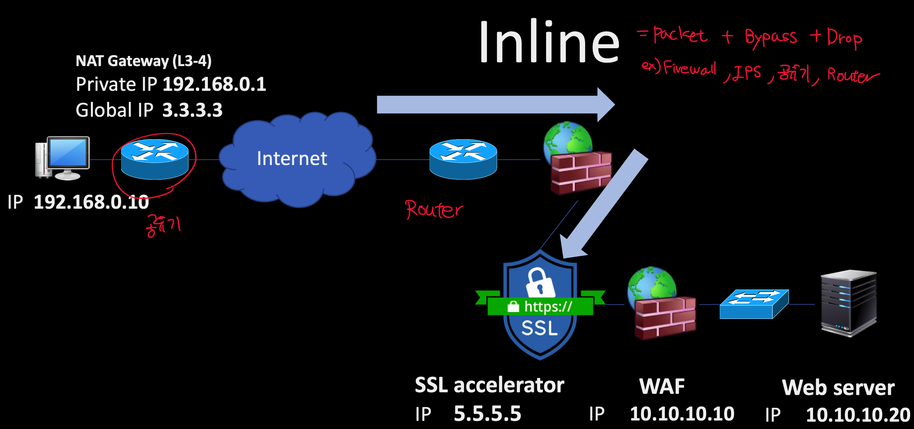

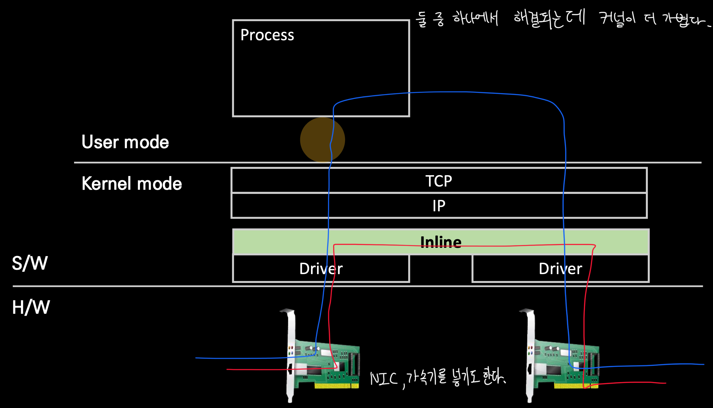

## Out of path 구조
Out of path는 들어온 패킷을 로깅한다.

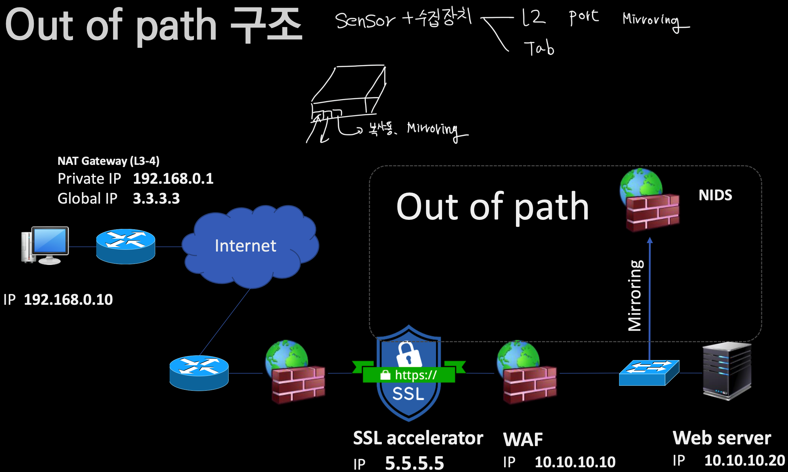

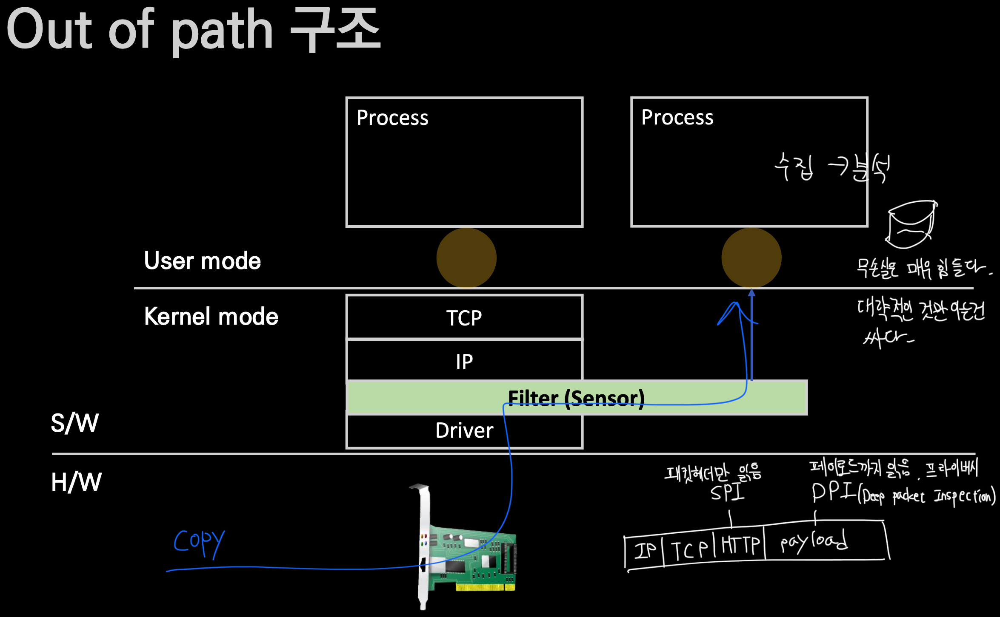
## Proxy
프록시는 다양하게 쓰인다. 여기서는 우회, 보호와 감시, Reverse proxy, Fiddler 등에 대해 얘기한다.

### 우회

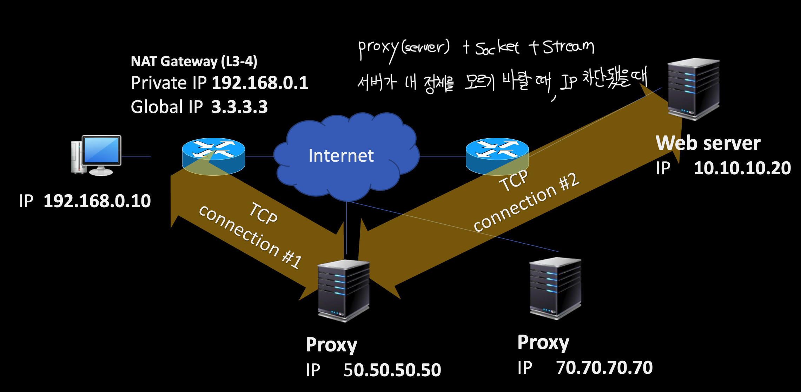

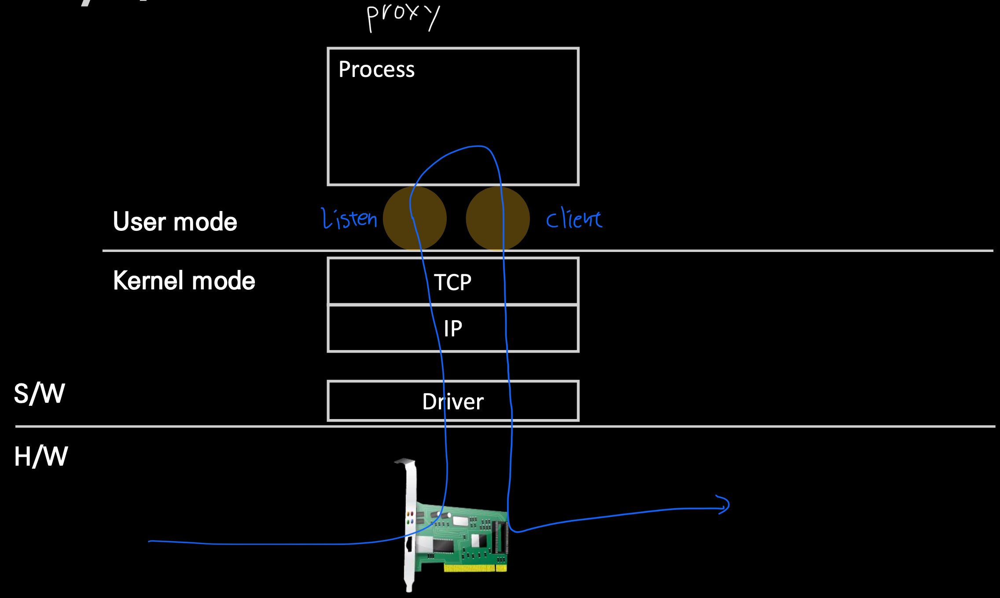

### 보호와 감시
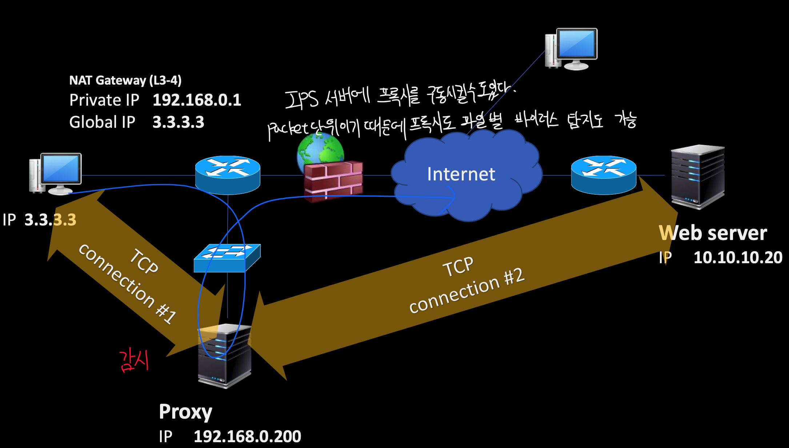

### Reverse Proxy
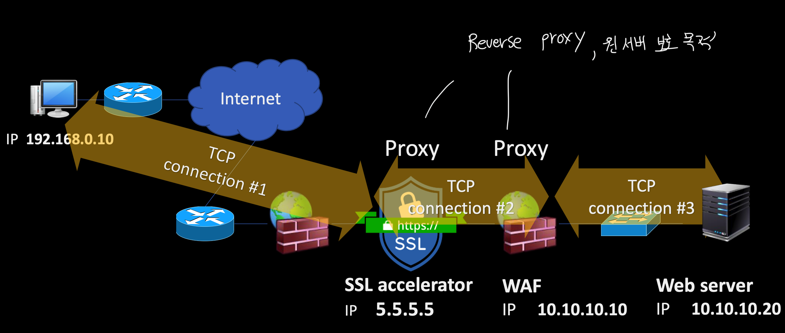

### Fiddler(Application단 프록시)
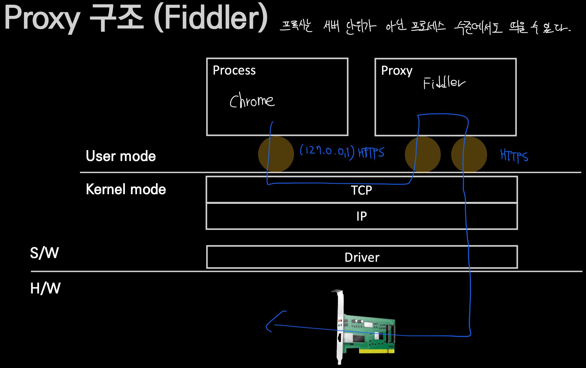

# 인터넷 공유기 작동 원리
- 일반적 인터넷 공유기는 NAT(Network Address Translation) 기술이 적용된 장치다
- 주소와 포트 번호를 모두 제어한다
- IP주소 부족 문제를 해결해준다
- 패킷 필터링 방화벽과 비슷한 보안성을 제공한다

## 공유기 구조에 따른 분류
- Cone NAT
  - Host 단위로 외부포트 지정
  - Full Cone
  - Restricted Cone
    - IP Address Restricted
    - Port Restricted
- Symmetric NAT
  - TCP 세션마다 외부 포트 지정

### Symmetric NAT 방식
공유기의 안쪽은 private network, 외부는 global network로 공유기를 통해 IP주소를 아낄 수 있다.

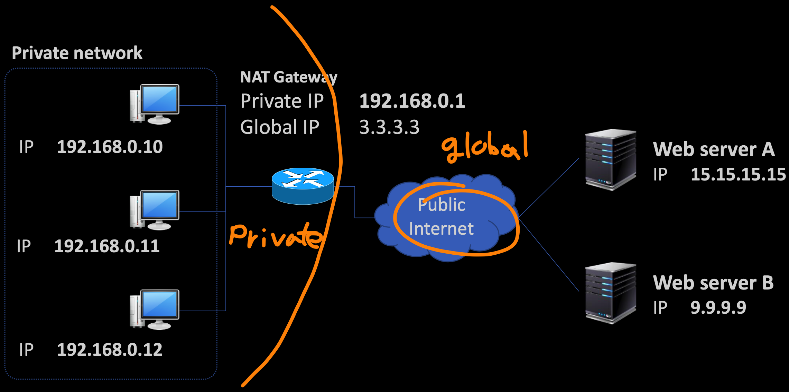

공유기는 출발지 TCP/IP헤더의 IP주소와 포트번호, checksum을 재계산, L2 프레임 헤더 수정, 전송하는 일을 한다.

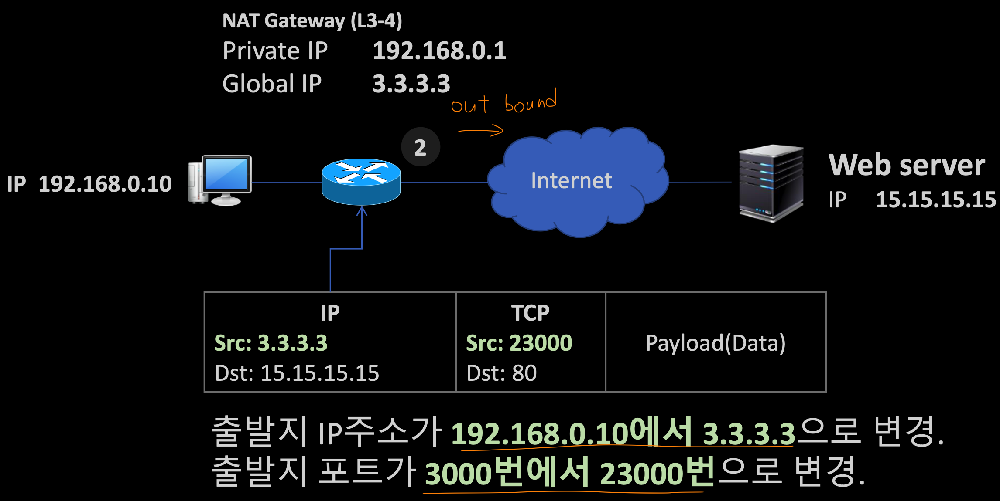

NAT table에 기록되는 것은 outbound 상황시에만 된다. inbound는 불가.
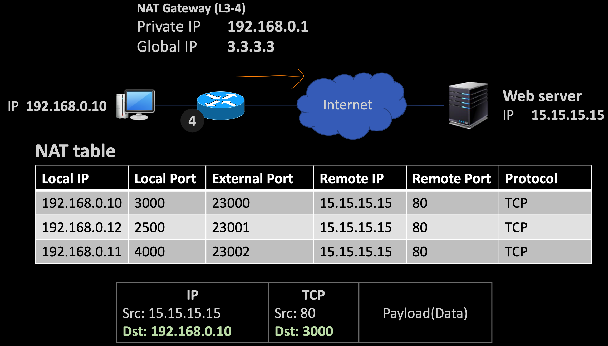

한 공유기에서 다른 디바이스로 각각 접속하면 서버는 같은 IP주소에서 요청이 두 번 온 것으로 인식한다.

### Full Cone NAT 방식
Symmetric 방식은 outbound가 존재하지 않았다면 NAT 내부에 존재하는 서버에 대한 inbound요청은 받을 수가 없다. 이를 극복하기 위한 방식이 Full Cone 방식이다. 게임 등에서 많이 쓰인다.

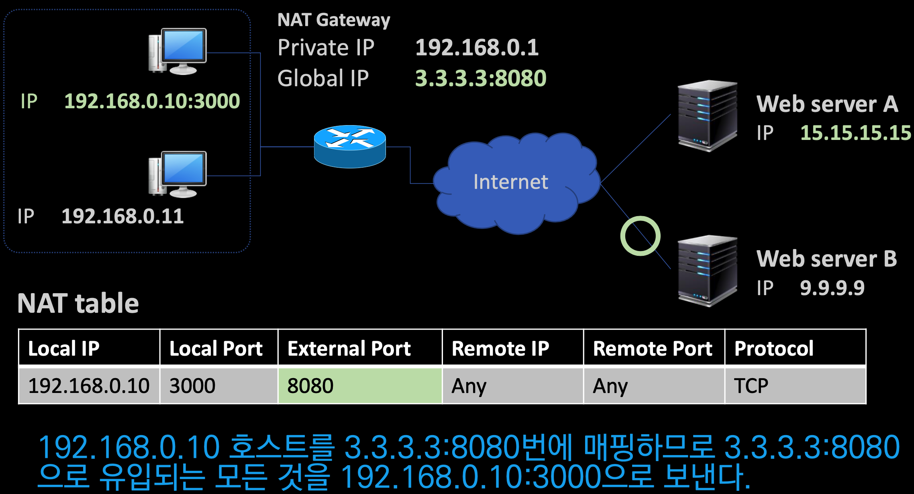

하지만 해당 IP와 PORT만 알면 누구나 접속 가능하기 때문에 보안성이 매우 떨어진다.

### (IP)Restricted Con NAT
연결해본 IP만 허용한다.

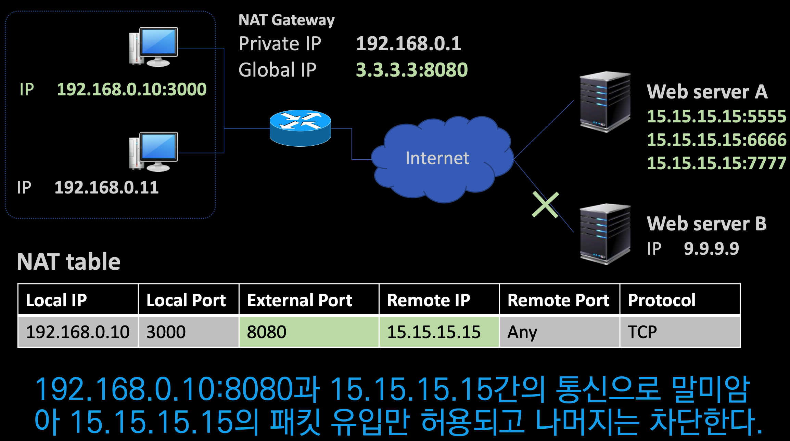

Symmetric과 Full Cone 방식은 NAT 테이블을 재사용하는지 여부에 차이가 있다.
P2P 방식에만 영향을 주는게 아니라 WebRTC 환경 등 트래픽이 폭발적으로 증가하는 방식에서도 방해가 된다.

