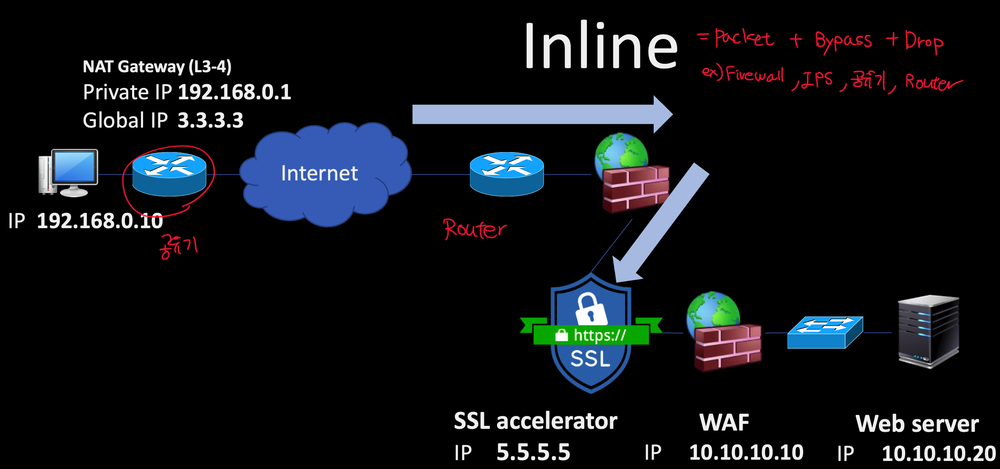
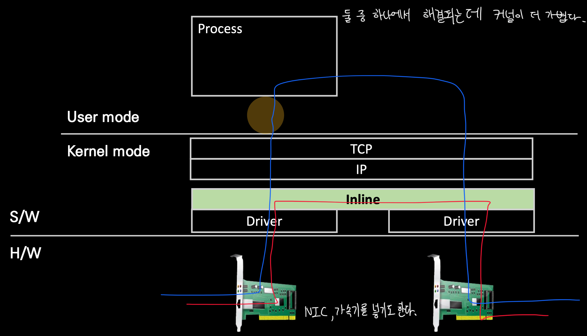
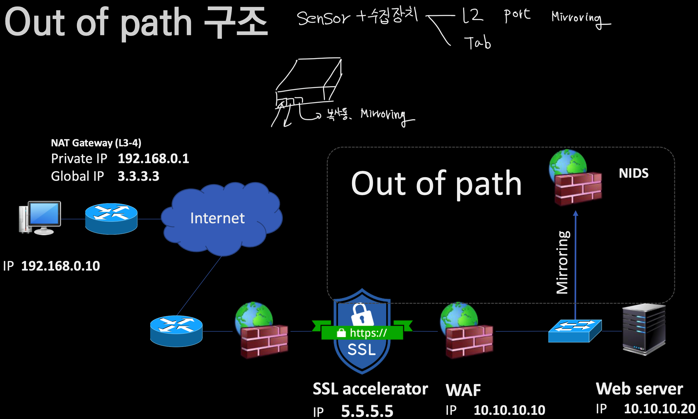
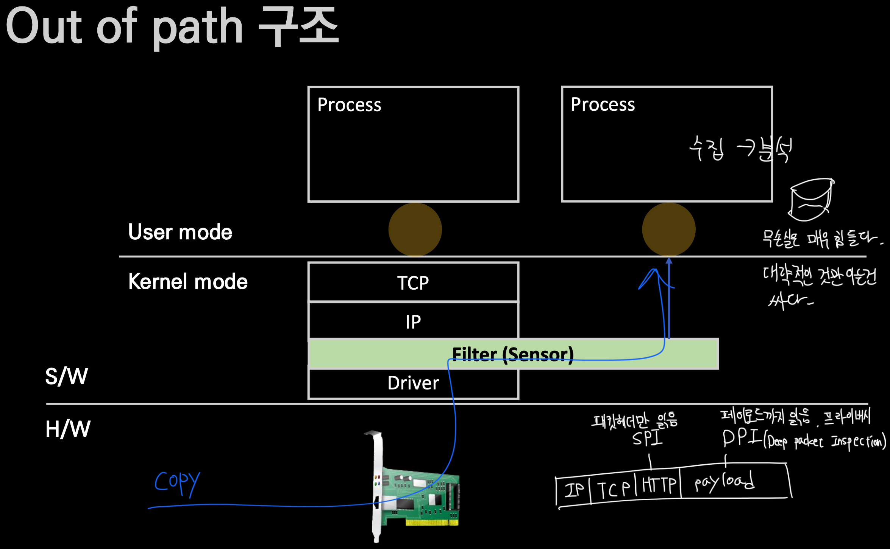
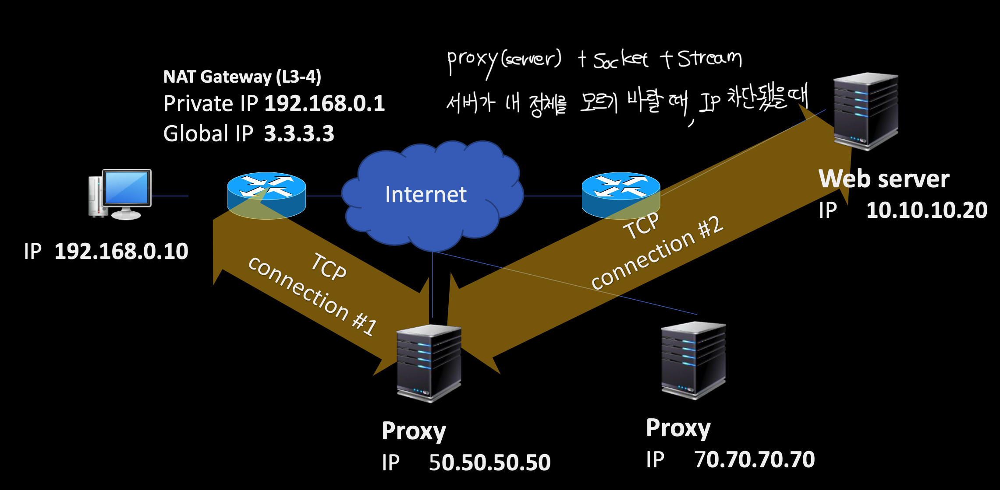
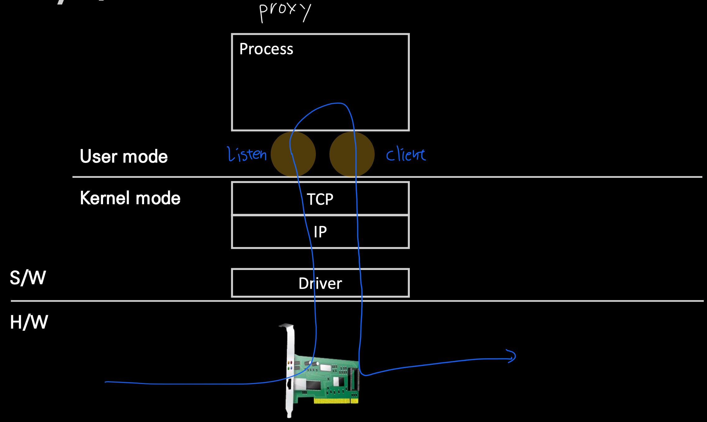
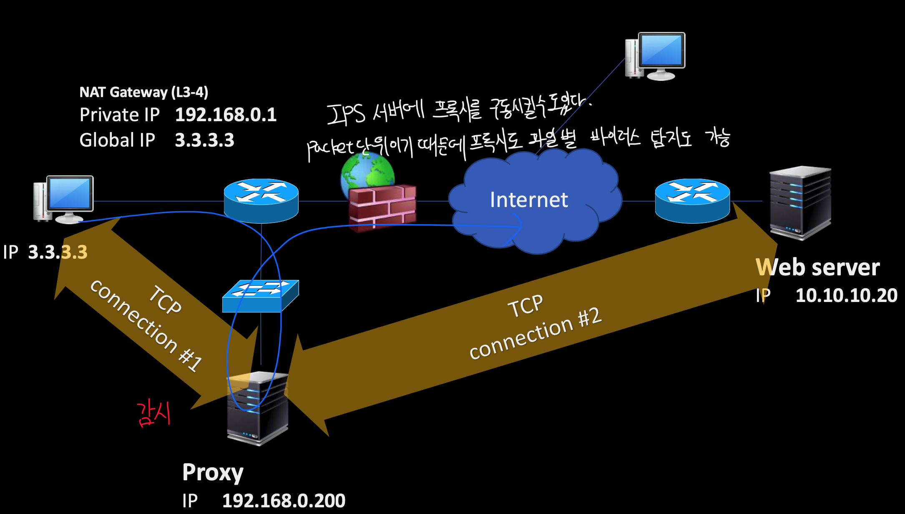
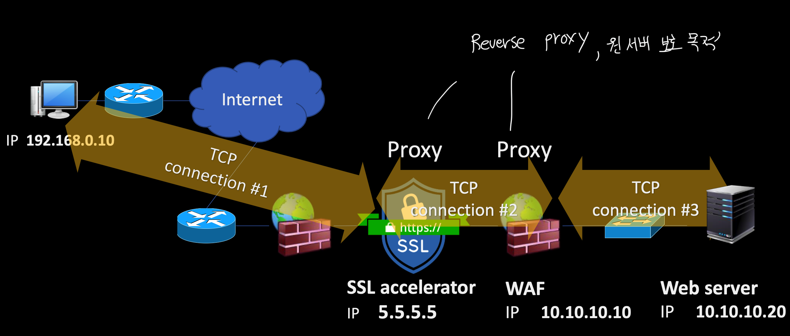
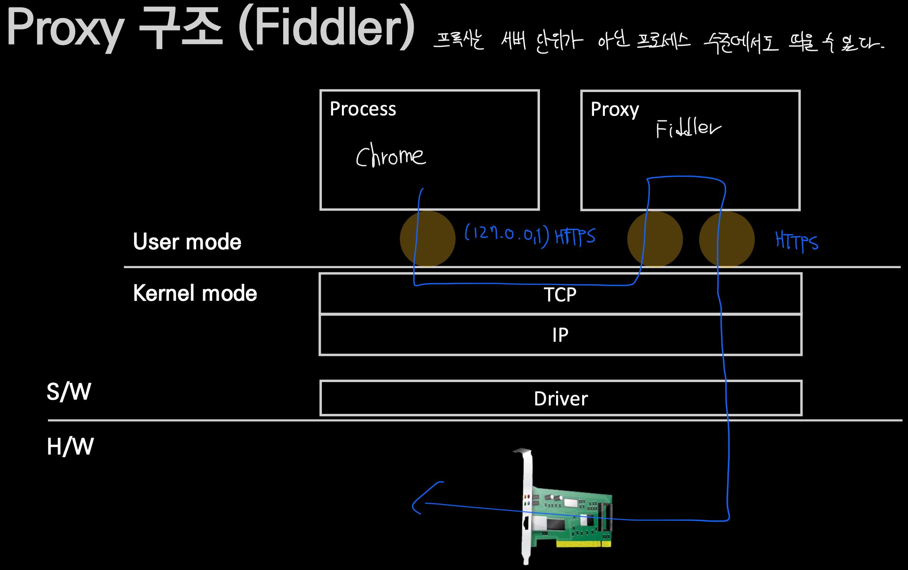

- [세 가지 네트워크 장치 구조](#세-가지-네트워크-장치-구조)
  - [Inline 구조](#inline-구조)
  - [Out of path 구조](#out-of-path-구조)
  - [Proxy](#proxy)
    - [우회](#우회)
    - [보호와 감시](#보호와-감시)
    - [Reverse Proxy](#reverse-proxy)
    - [Fiddler(Application단 프록시)](#fiddlerapplication단-프록시)

# 세 가지 네트워크 장치 구조
네트워크 장비를 처음 접할 때 보통 세 가지 중 하나기 때문에 해당 항목을 확인해보면 된다.
- Inline(Router 등 차단과 허용 목적)
  - Packet + Drop/Bypass + Filtering
- Out of path(차단기능 없이 확인만 할 때)
  - Packet + Read only, Senser
- Proxy
  - Socket stream + Filtering
  - HTTP관련됐다면 대부분 Proxy쪽이다. 
  - OSI 7 Layer로 생각해보면 TCP 계층과 Application 계층을 이어주는 Socket Stream을 통해서 데이터가 조합돼야 분석에 용이해지기 때문에

## Inline 구조

## Out of path 구조

## Proxy

### 우회

### 보호와 감시

### Reverse Proxy

### Fiddler(Application단 프록시)

