- [user mode와 kernel mode](#user-mode와-kernel-mode)
- [식별자](#식별자)
- [Host](#host)
- [switching](#switching)
- [L2](#l2)
  - [NIC](#nic)
  - [L2 Access switch](#l2-access-switch)
  - [L2 Distribution switch](#l2-distribution-switch)
  - [LAN과 WAN의 경계 그리고 Broadcast](#lan과-wan의-경계-그리고-broadcast)
- [L3](#l3)
  - [IPv4 주소의 구조](#ipv4-주소의-구조)
  - [L3 Packet](#l3-packet)
  - [Encapsulation, Decapsulation](#encapsulation-decapsulation)
  - [패킷의 생성과 전달](#패킷의-생성과-전달)
  - [계층별 데이터 단위](#계층별-데이터-단위)
  - [IP 헤더 형식](#ip-헤더-형식)
  - [subnet mask와 CIDR](#subnet-mask와-cidr)
  - [CIDR(classless Inter-Domain Routing)](#cidrclassless-inter-domain-routing)
  - [Private Network(사설망)](#private-network사설망)
  - [Broadcast IP 주소](#broadcast-ip-주소)
  - [Host 자신을 가리키는 IP주소](#host-자신을-가리키는-ip주소)
  - [인터넷은 라우터의 집합체라고 할 수 있는 논리 네트워크이다.](#인터넷은-라우터의-집합체라고-할-수-있는-논리-네트워크이다)
  - [TTL과 단편화](#ttl과-단편화)
  - [인터넷 사용 전 해야 할 설정](#인터넷-사용-전-해야-할-설정)
  - [DHCP(Dynamic Host Configuration Protocol)](#dhcpdynamic-host-configuration-protocol)
  - [ARP(Address Resolution Protocol)](#arpaddress-resolution-protocol)
  - [Ping과 RTT](#ping과-rtt)
- [L4](#l4)
  - [TCP와 UDP](#tcp와-udp)
  - [TCP 연결 과정(3-way handshake)](#tcp-연결-과정3-way-handshake)
  - [TCP 연결 종료 과정(4way handshake)](#tcp-연결-종료-과정4way-handshake)
  - [TCP, UDP Header 형식](#tcp-udp-header-형식)
  - [TCP가 연결이라는 착각](#tcp가-연결이라는-착각)
  - [대표적 TCP 장애 유형](#대표적-tcp-장애-유형)
- [DNS](#dns)

Network: 관계  
Networking: 상호작용

# user mode와 kernel mode
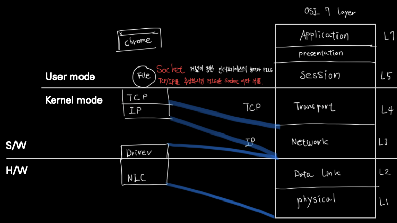

# 식별자

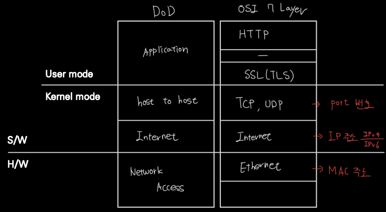

- L2 -> MAC 주소
  - NIC(Network Interface Card)를 식별하는 식별자
  - 48bit이며 보통 16진수로 표기

- L3 -> IP 주소
  - Internet을 사용하는 host의 식별자  
  - IPv4에서는 32bit이며 10진수(8bit)씩 끊어 점으로 구분해 표기

- L4 -> PORT 번호
  - process  
  - 16bit 양의 정수

# Host

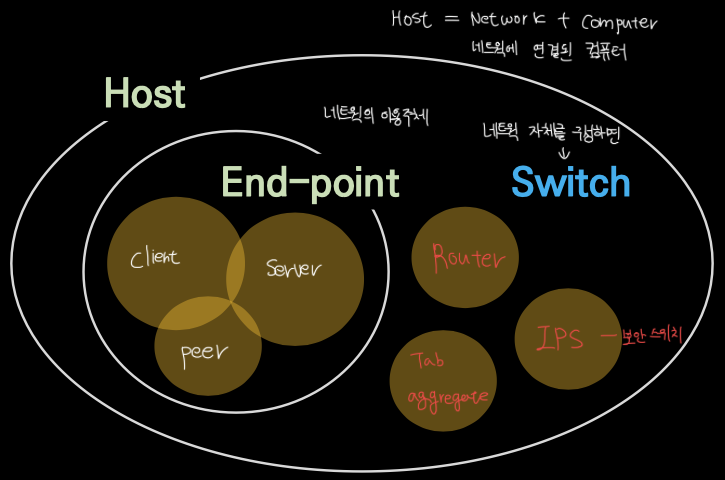

- End-point
  - client, Server, Peer -> 이용주체

- Switch
  - Router, IPS, Tab -> 네트워크 자체를 이루는 요소

# switching

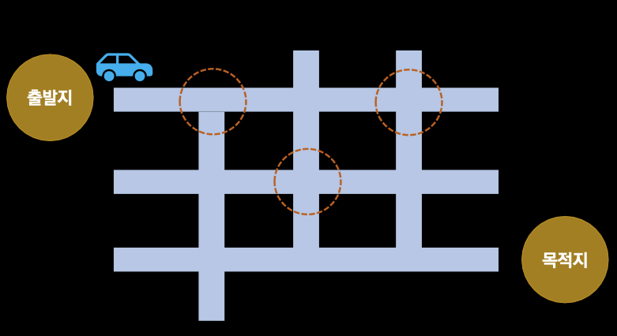

Switch가 하는 일  
- Network - 도로망  
- Switch - 이정표  

- **Matric** 
  - IP 주소를 근거로 스위칭 -> L3 스위칭
  - L3 스위치는 인터넷에서 라우터라고 부르고 라우터는 라우팅 테이블이라는 이정표를 가지고 있다.
  - 실제로 route PRINT 명령을 쓰면 해당 컴퓨터 라우터의 매트릭, 각 루트별 비용 값을 볼 수 있다.  

# L2
## NIC

NIC(Network Interface Card)
- LAN(Local Area Network) card라고 부르기도 하는데 NIC라고 부르는게 좀 더 정확하다.
- 각 NIC 카드는 MAC 주소를 갖는다
- WAN -> MAN -> LAN 순으로 규모가 작아진다.

Packet은 L3 수준에서의 단위  
Frame은 L2 수준에서의 단위  

## L2 Access switch

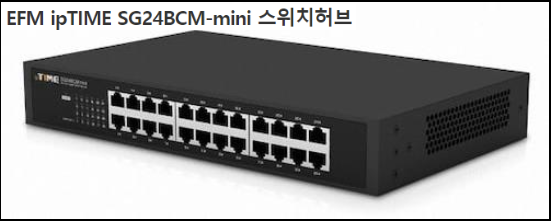

- End-point와 직접 연결되는 스위치로 MAC 주소를 근거로 스위칭

- PC와 L2 Access와의 연결에서 연결이 올바르면 Link-up, 올바르지 않으면 Link-down이라 표현  
switch와 router가 연결되어 있는 선은 uplink라고 부름

## L2 Distribution switch
- L2 Access 스위치를 위한 스위치로 VLAN(Virtual LAN) 기능을 제공하는 것이 일반적이다.
- L2 Access 스위치가 각 방에 존재한다면 L2 Distribution switch는 한 층을 담당한다.

## LAN과 WAN의 경계 그리고 Broadcast

- Broadcast <=> Unicast

- Broadcast는 효율과는 상관 없다. 다만 속도를 위해서는 Broadcast의 범위를 최소화해야한다.

NIC는 MAC address를 갖는데 이는 48비트 주소로  
FF-FF-FF-FF-FF-FF의 16진수 주소다.

위의 예는 1111-1111-1111-1111-1111-1111의 2진수 주소로 변환될 수 있는데 송신자가 수신자를 다음과 같이 설정하면 모두가 메시지를 받으라는 뜻이고 Broadcast라고 불린다.

# L3
## IPv4 주소의 구조

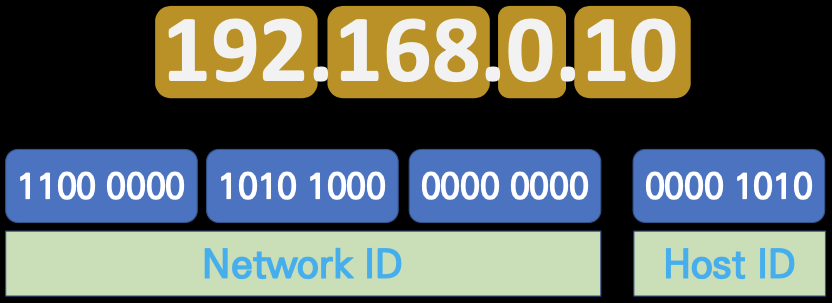

- IPv4는 32bit 주소체계를 사용 8bit * 4
- 192.168.0.10이라고 치면 앞의 세 개는 NetworkID, 뒤의 하나는 HostID로 구성되어 있다.

## L3 Packet

- Packt이라는 말은 L3 IP Packet 
- Header와 Payload로 나눠진다
- 최대 크기는 MTU다(Maximum Transmition Unit) default는 1500 byte. 

## Encapsulation, Decapsulation

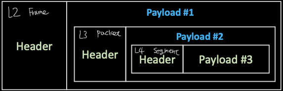

- packet은 encapsulation과 decapsulation을 통해 처리된다

## 패킷의 생성과 전달

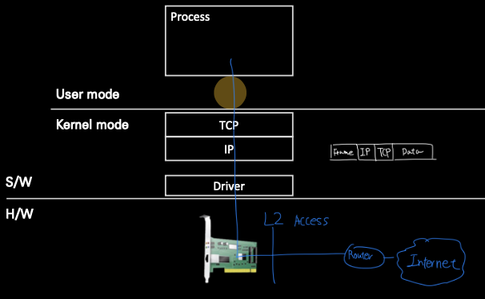

패킷의 생성과 전달 순서
1. Data를 File에 write 한다. 이 파일의 일종인 socket에 send한다는 표현을 쓴다.
2. TCP 헤더가 붙으면 data가 segment가 된다.
3. IP 헤더가 붙으면 segment가 packet이 된다.
4. Ethernet 계층을 거치며 packet이 Frame이 된다.
5. L2 Access Switch를 거친다
6. routing gateway를 거쳐 인터넷 세계로 전달된다.

## 계층별 데이터 단위

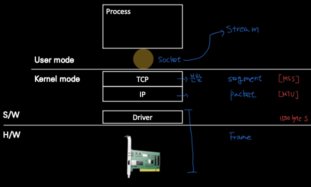

stream은 데이터의 크기가 정해져있지 않은 데이터의 연속이지만 인터넷 상에서 대용량 데이터를 한번에 전송할 수는 없기 때문에 segment의 이름과 같이 데이터를 댕강댕강 자르게 되는데 그 최대 길이가 위에서 말했던 MTU(1500byte)가 된다.

## IP 헤더 형식
IPv4 헤더 형식은 다음과 같다.
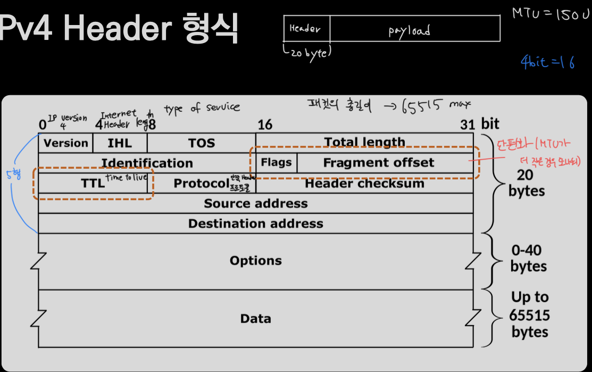

## subnet mask와 CIDR
subnet mask를 기준으로 NetworkID와 HostID를 잘라낸다.

mask 연산: 주소에서 subnet mask를 기준으로 bit별로 AND 연산을 한다. 만약 AND 연산이 나의 IP와 같으면 유입 패킷으로 식별한다.  

과거에는 IP 주소별로 A, B, C클래스로 나눠 구분했기 때문에 이런 방법을 썼었다. 지금은 쓰지 않는다.

이제는 CIDR 방식을 쓴다.

## CIDR(classless Inter-Domain Routing)
CIDR은 IP 주소에서 어느 비트까지를 IP 주소라고 간주할지 선택하는 방법으로

**192.168.0.10/24**
다음과 같은 주소가 존재한다면 24비트까지를 IP주소로 본다.

## Private Network(사설망)
- 하나의 pubilc IP를 여러 기기가 공유할 수 있는 방법
- 하나의 망에는 private IP를 부여받은 기기들과 gateway로 구성
  - 각 기기는 인터넷과 통신시 gateway를 통해 통신
- private IP는 지정된 대역의 IP만 사용 가능

segment

## Broadcast IP 주소
MAC 주소에서 만약 수신자가 FF-FF-FF-FF-FF-FF라면 모든 수신자가 받으라는 Broadcast였다.

IP주소에서도 똑같다.
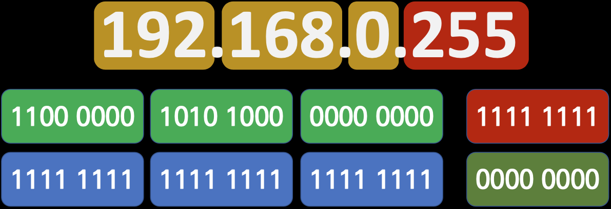  
만약 Host명이 1111-1111라면 해당 IP주소를 쓰는 네트워크에서 쓰이는 방송주소가 된다.

Broadcast는 자주 쓰이면 효율이 떨어지기 때문에 최소화해야한다.

따라서 네트워크에서 쓰일 수 없는 호스트는 다음과 같다.
1. 0: 서브넷 마스크 결과와 동일해지기 때문에 쓸 수 없다.
2. 1: gateway
3. 255: 브로드캐스트이기 때문에 쓸 수 없다.
따라서 253개의 호스트 주소만 쓸 수 있는데 추가적으로 스위치에 부여하게 되면 더 줄어들 여지가 있다.

## Host 자신을 가리키는 IP주소

하나의 컴퓨터에서 프로세스간 통신이 필요할 때 사용하는 IP 주소로

127.0.0.1: Loopback address라고 한다. IPC(inter process communication) 프로세스 간 통신할 때 쓰이는 IP 주소다.

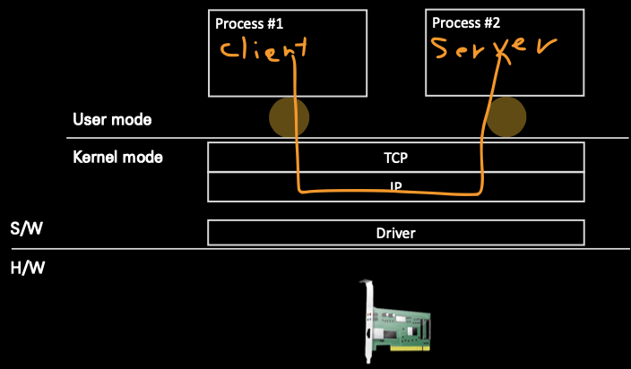

다음과 같이 통신하려고 할 때는 127.0.0.1을 쓰면 된다.

## 인터넷은 라우터의 집합체라고 할 수 있는 논리 네트워크이다.

기본적으로 물리적 스위치로 이뤄지지만 논리적인 형태로 구성되는 네트워크다.

**Internet = Router + DNS**

## TTL과 단편화
- TTL(Time to Live)는 세포의 텔로미어 같은 역할을 한다.
  - 좀비 패킷을 막기 위한 장치다.
  - 라우터와 라우터 사이를 지날때(Hop이라고 한다) 하나씩 줄어든다.
- 단편화는 MTU 크기 차이로 발생한다.
  - 보편 값은 1500Byte지만 만약 크기가 작은 라우터가 존재한다면 수신을 하지 못하고 패킷이 유실된다.
  - 보내기 전 라우터에서 하나의 패킷을 두 개로 나누고 서버측에서 재조립하게된다.
  - VPN이 적용됐을 때 단편화가 발생할 확률이 높아진다.
- 보통 단편의 조립은 수신측 Host에서 이루어진다.

## 인터넷 사용 전 해야 할 설정

- IP 주소
  - 보통 ISP(Internet Service Provider)에서 돈을 내면 할당해준다.
- Subnet mask
- Gateway IP 주소
- DNS 주소

보통 자동 설정을 이용하게 된다. -> DHCP 설정을 이용하게 된다.

## DHCP(Dynamic Host Configuration Protocol)
- 주소를 할당하는 서버와 할당 받으려는 클라이언트로 구성된다.
- 복잡한 인터넷 설정을 자동으로 해준다고 볼 수 있는데 내가 사용할 IP주소를 서버가 알려준다.

1. 만약 한 컴퓨터가 켜지면 Broadcast 트래픽을 송신한다.
2. DHCP 서버가 해당 요청에 응답한다.
3. 보통 사용하던 주소를 재할당한다.
4. DHCP서버는 Broadcast 도메인을 넘어 구성될 수는 없다.

 
## ARP(Address Resolution Protocol)
- IP 주소로 MAC 주소를 알아내려고 할 때 활용된다.
- 로컬에서 컴퓨터를 사용할 때 인터넷을 사용하기 위해서는 Gateway MAC address가 필수적으로 필요하다.
- 이런 Gateway의 MAC 주소를 찾아내기 위해 사용한다.
- MAC 주소는 L2구간에서만 중요하다.

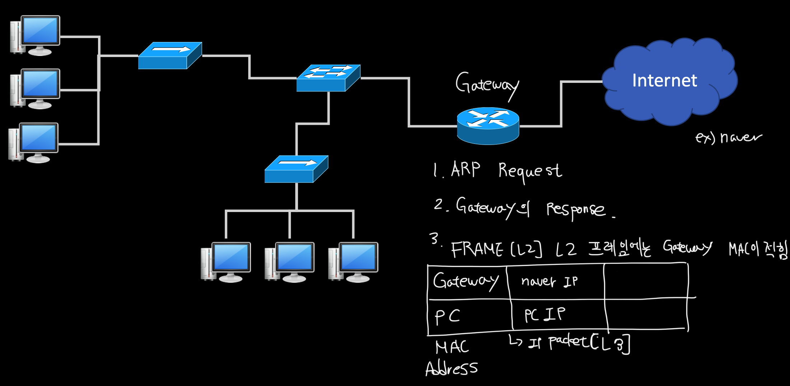

## Ping과 RTT
- Ping 유틸리티(프로그램)은 특정 Host에 대한 RTT(Round Trip Time)을 측정할 목적으로 사용된다.
- ICMP프로토콜(L3 프로토콜 중 하나)을 이용한다.
- Dos(Denial of Service) 공격용으로 악용되기도 한다.

# L4

## TCP와 UDP
- TCP는 연결(Connection, Session) 개념이 있지만 Virtual Connection(논리적 연결)이라고 생각하면 된다.
- 연결은 순서번호로 구현된다. ex) 패킷 1이 400 byte라면 패킷2는 401로 시작해서 연결된다.
- 연결은 상태(전이) 개념을 동반한다.
- TCP는 배려, UDP는 나쁜놈

## TCP 연결 과정(3-way handshake)

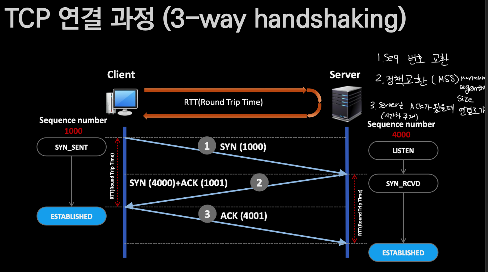

## TCP 연결 종료 과정(4way handshake)

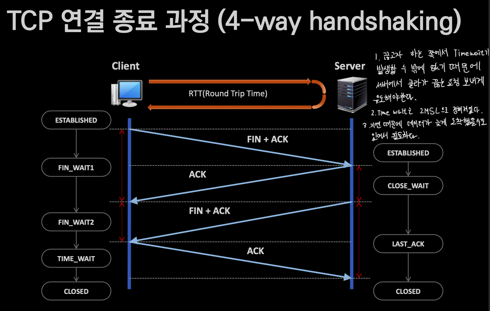

## TCP, UDP Header 형식
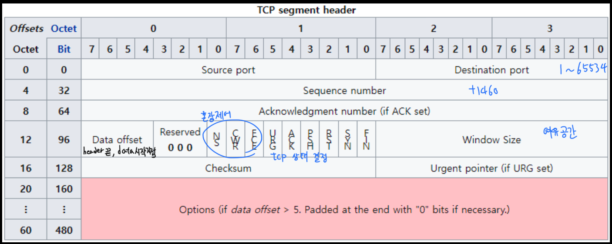

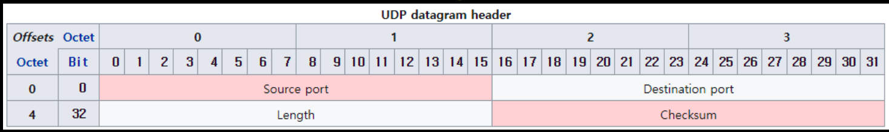

## TCP가 연결이라는 착각
- 재전송 타이머의 기본 근사 값은 대략 3초, 대부분 운영체제는 1초 미만
- 재전송 타이머 만료 후에도 확인을 받지 못한 경우 RTO(Retransmission Time-Out)값을 두 배로 증가한다.
- 1 > 2 > 4 > 8 > 16
- 보통 5회 재전송을 시도하고 모두 실패 시 전송 오류가 발생한다.
- 연결은 사실 End-point의 주관적 판단에 불과하다.

## 대표적 TCP 장애 유형
- Packet Loss
  - 패킷이 유실된 경우
- TCP Out of order
  - 패킷의 순서가 뒤바뀐 경우
- Retransmission과 Dup ACK
- Zero-window
  - 수신측 버퍼에 여유 공간이 하나도 없는 경우

# DNS
- 분산 구조형 데이터베이스

- 트리(tree) 구조의 도메인 네임(Domain Name) 체계

출처: [외워서 끝내는 네트워크 핵심이론 - 기초](https://www.inflearn.com/course/%EB%84%A4%ED%8A%B8%EC%9B%8C%ED%81%AC-%EDs%95%B5%EC%8B%AC%EC%9D%B4%EB%A1%A0-%EA%B8%B0%EC%B4%88/dashboard)