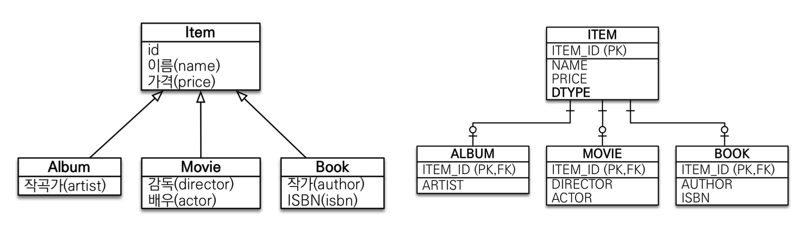
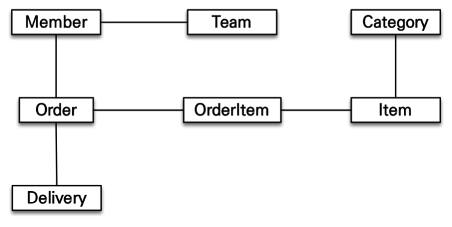
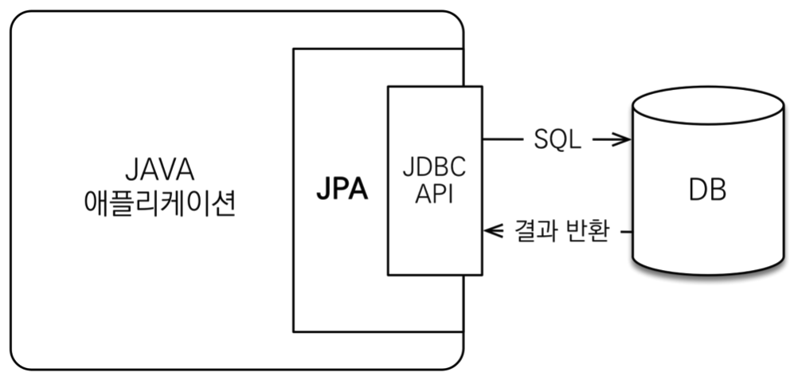

- [ORM(Object-Relational Mapping)](#ormobject-relational-mapping)
  - [패러다임의 불일치](#패러다임의-불일치)
    - [상속](#상속)
    - [연관관계](#연관관계)
    - [객체 그래프 탐색](#객체-그래프-탐색)
    - [비교](#비교)
- [JPA(Jakarta Persistence API)](#jpajakarta-persistence-api)
- [Jakarta EE](#jakarta-ee)
- [Entity](#entity)

# ORM(Object-Relational Mapping)

## 패러다임의 불일치
객체와 관계형 데이터베이스를 매핑한다는 뜻으로 객체와 테이블을 매핑해서 패러다임의 불일치 문제를 개발자 대신 해결해주는 기술이다. 이 덕분에 개발자는 데이터 중심인 관계형 데이터베이스를 사용해도 객체지향 애플리케이션 개발에 집중할 수 있다.

객체지향 프로그래밍은 추상화, 캡슐화, 정보은닉, 상속, 다형성 등 시스템의 복잡성을 제어할 수 있는 다양한 장치들을 제공한다. 따라서 현대 애플리케이션은 대부분 객체지향 언어로 개발된다.

하지만, 관계형 데이터베이스는 데이터 중심으로 구조화 되어있고 집합적인 사고를 요구한다. 그리고 추상화, 상속, 다형성의 개념이 없다.

패러다임의 불일치에 대해 알아보자.
### 상속


Item을 상속하는 Album, Movie, Book이 있는데 만약 Album을 INSERT하려고 할 때 데이터베이스에서 슈퍼타입과 서브타입으로 이를 해결하려면 쿼리를 두번 보내야 한다. 거기에 Album을 조회하려면 ITEM과 ALBUM테이블을 조인해 조회한 다음 그 결과를 Album 객체로 생성해야 하는데 비용이 이만저만이 아니다.

JPA는 상속과 관련된 패러다임의 불일치를 해결해주는데 개발자는 자바 컬렉션 객체를 사용하 듯 JPA에게 객체를 저장하면 된다. 그럼 JPA가 알아서 쿼리를 작성해준다.

### 연관관계
객체는 참조를 사용해서 다른 객체와 연관관계를 가지고 참조에 접근해 연관된 객체를 조회한다. 반면 테이블을 외래키를 사용해 다른 테이블과 조인해 조회한다.

객체는 참조가 있는 방향으로만 조회할 수 있지만 테이블은 외래 키 하나로 둘 다 조인이 가능하다.

객체를 테이블에 맞춰 모델링 하는 방법이 있을 수 있지만 객체지향적이지 못한다.

```java
class Member {
    String id;
    Long teamId;
    String username;
}

class Team {
    Long id;
    String name;
}
```

객체는 참조를 통해서 관계를 맺는다. 따라서 다음과 같이 모델링해야한다.

```java
class Member {
    String id;
    Team team;
    String username;
}

class Team {
    Long id;
    String name;
}
```
위의 모델링은 외래 키 값을 보관하는 것이 아니라 연관된 Team의 참조를 보관한다
물론 이렇게 해주면 개발자가 객체지향과 DB 사이의 변환 역할을 해 줘야 하기 때문에 할 일이 많아진다. 

JPA는 연관관계와 관련된 패러다임의 불일치를 해결해준다.

### 객체 그래프 탐색

다음과 같이 객체 그래프가 존재하고 객체에서 회원이 소속된 팀을 조회하려면
```java
Team team = member.getTeam();
```
이렇게 탐색을 할 수 있다. SQL을 직접 다루면 처음 실행하는 SQL에 따라서 객체 그래프를 어디까지 탐색할 수 있는지 정해지는데 그렇다고 member와 연관된 모든 객체 그래프를 데이터베이스에서 조회해서 메모리에 올려두는 것은 현실성이 없다

JPA를 사용하면 객체 그래프를 마음껏 탐색할 수 있는데 JPA는 연관된 객체를 사용하는 시점에 적절한 SELECT SQL을 실행해준다. 이 기능을 `지연로딩` 이라고 한다.

### 비교
데이터베이스에서 select문을 두번 날리고 받은 값들을 == 비교하면 false가 뜬다. 각각 다른 객체에 실린 같은 데이터이기 때문이다. 하지만 JPA는 같은 트랜잭션일 때 같은 객체가 조회되는 것을 보장한다.

# JPA(Jakarta Persistence API)
JPA는 자바 진영의 ORM 기술 표준으로 애플리케이션과 JDBC 사이에서 동작한다.



JPA는 자바 ORM 기술에 대한 API 표준 명세로 여러 인터페이스를 모아 놓은 것이고 그 구현체로는 Hibernate, EclipseLink, DataNucleus 등이 있다. 가장 많이 쓰이는 구현체가 Hibernate다.

# Jakarta EE
분산 컴퓨팅 및 엔터프라이즈 웹 서비스를 위한 것으로 현재는 Spring 등의 자바 기반 오픈소스 어플리케이션에 밀려서 많이 사용되지 않는다.

# Entity


출처:  
[자바 ORM 표준 JPA 프로그래밍](http://www.yes24.com/Product/Goods/19040233)