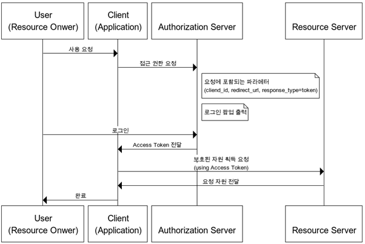

- [Identifier](#identifier)
- [**PostgreSQL (MySQL, MariaDB와 두드러지는 차별점)**](#postgresql-mysql-mariadb와-두드러지는-차별점)
- [OAuth 2.0](#oauth-20)
  - [역할](#역할)
  - [동작방법](#동작방법)
  - [권한 획득 방식](#권한-획득-방식)
- [Bearer Token 옵션](#bearer-token-옵션)
- [SecurityFilterChain](#securityfilterchain)
- [`@Configuration`](#configuration)
- [`@EnableWebSecurity`](#enablewebsecurity)
- [Filter vs OncePerRequestFilter](#filter-vs-onceperrequestfilter)
- [FilterChain](#filterchain)
- [SecurityContext](#securitycontext)


# Identifier
우리나라에선 ID와 password라고 부르는 경우가 많아서 회원가입 로직을 짤 때 ID와 password로 필드명을 잡는 경우가 많은데 username과 password라고 짓는 것이 몸도 마음도 편안하니 참고하자.

# **[PostgreSQL](https://www.postgresql.org/) (MySQL, MariaDB와 두드러지는 차별점)**

- PostgreSQL은 테이블 상속, 함수 오버로딩 등의 기능을 갖춘 객체 관계형 데이터베이스(ORDBMS)인 반면 MySQL은 순수 관계형 데이터베이스(RDBMS)다

| 요소 | PostgreSQL| MySQL  |
| ----- | ---------- | ----------------------- |
| 아키텍쳐 | 객체 관계형, 멀티 프로세스 | 관계형, 단일, 멀티 스레드 |
| 지원 데이터 타입 | 숫자 (Numeric)<br>날짜/시간 (Date/time)<br>문자열 (Character)<br>JSON<br>부울 (Boolean)<br>열거형 (Enumerated)<br>XML<br>기하 (Geometric)<br>배열 (Arrays)<br>범위 (Ranges)<br>네트워크 주소 (Network address)<br>HSTOREComposite | 숫자 (Numeric)<br>날짜/시간 (Date/time)<br>문자열 (Character)<br>JSON<br>공간 (Spatial) |
| 지원 인덱스 | B-tree<br>Hash<br>GiST<br>SP-GiST<br>GIN<br>BRIN | B-tree<br>Hash<br>R-tree<br>역 인덱스 (Inverted indexes) |
| 특장점 | 대용량의 읽기 및 쓰기 | 대용량 읽기 |

MySQL은 다양한 스토리지 엔진을 지원하며 고도의 동시 읽기 기능이 특히 두드러진다. 하지만 복잡한 쿼리의 읽기-쓰기를 대량으로 실행해야 한다면 PostgreSQL이 더 나은 선택이다.

# OAuth 2.0
OAuth2.0은 인가 규약으로 인증 규약이 아니다. 이는 원격 API나 user data등의 데이터에 대한 권한을 부여하는 수단으로 디자인 됐다.

OAuth2.0은 Access Token을 사용하는데 엑세스 토큰은 엔드유저를 대신해 자원에 대한 권한 여부를 나타낸다. OAuth2.0은 Access Token에 대한 특정한 포멧을 정의하지 않지만 JWT 포멧이 자주 사용된다. JWT는 토큰 발행자에게 토큰에 데이터를 포함할 수 있게 해주고 보안의 이유로 엑세스 토큰은 만료일자가 존재한다.

구글로그인 등이 OAuth2.0 방식이다.

## 역할
OAuth2.0의 역할들은 다음과 같다
- Resource Owner: 보호된 자원을 소유하고 있는 유저나 시스템으로 그것들에 대한 접근권한을 부여할 수 있다.
- Client: 보호된 자원에 대한 접근을 필요로하는 시스템으로 자원에 접근하기 위해서는 적절한 엑세스 토큰을 보유하고 있어야 한다.
- Authorization Server: 해당 서버는 엑세스 토큰에 대한 클라이언트의 요청을 받아서 성공적 인증과 자원 보유자의 동의를 받아 엑세스 토큰을 발급한다. 해당 인가 서버는 두 엔드포인트를 노출하는데 1. Authorization endpoint: 사용자의 상호작용에 의한 인증과 동의를 조절 2. Token endpoint: machine과 machine과의 상호작용을 포함
- Resource Server: 클라이언트의 요청에 대한 사용자의 정보를 보호하는 서버로 클라이언트로부터 엑세스 토큰을 받아 요청을 받고 유효성을 체크해 적절한 리소스를 반환한다.

## 동작방법
일단 기본적으로 OAuth 2.0의 사용 전에 클라이언트는 자신의 id와 비밀번호를 인가서버로부터 발급받아야 한다. 그 후의 OAuth2.0을 이용한 요청은 클라이언트에 의해 시작된다.

1. 클라이언트가 인가 서버에 id와 비밀번호를 식별자로 인가를 요청한다. 이는 스코프와 redirect URI를 보함한다.
2. 인가 서버는 클라이언트를 식별하고 요청 스코프를 허가한다.
3. 자원 소유자가 인가 서버와 상호작용해 접근권한을 부여한다.
4. 인가서버가 클라이언트에게 인가 코드나 엑세스 토큰, 권한 타입, 리프레시 토큰등을 포함해서 반환한다.
5. 클라이언트는 엑세스 토큰으로 자원 서버에 접근 가능해진다.

## 권한 획득 방식
기본적으로 OAuth 공급자에게 client_id, redirect_url 등을 등록했다는 가정 하에 시작한다.

1. Authorization Code Grant  
  
- 가장 많이 사용되는 방식으로 클라이언트가 사용자를 대신해 특정 자원에 접근을 요청할 때 사용되는 방식이다.
- refresh token이 사용 가능하다
- 권한 부여 승인 요청시 response_type을 code로 지정해 요청, 인가 서버가 redirect_url로 Authorization Code를 전달
- 클라이언트가 해당 Authorization Code로 Access Token으로 교환해 사용한다.

2. Implicit Grant  
  
- 자격증명을 안전하게 저장하기 힘든 클라이언트에게 최적화된 방식
- 권한 부여 과정이 없기 때문에 빠르지만 AccessToken을 바로 전달하므로 외부에 노출될 수 있다.
- Refresh Token 사용이 불가능하다.

3. Resource Owner Password Credentials Grant  
  
- username, password로 Access Token을 받는 방식으로 자신의 서비스에서 제공하는 어플리케이션일 경우에 사용되는 인증 방식이다.
- 권한, 리소스, 클라이언트가 모두 같은 시스템에 속해야 한다.

4. Client Credentials Grant  
  
- 클라이언트의 자격증명만으로 Access oken을 획득하는 방식
- OAuth2의 권방 부여 방식중 가장 간단
- 클라이언트 자신이 관리하는 리소스 혹은 권한 서버에 해당 클라이언트를 위한 제한된 리소스 접근 권한이 설정되어 있는 경우에 사용
- 안전한 자격증명 보관소가 있는 클라이언트에서만 사용해야 하며, Refresh Token은 사용할 수 없다.

# Bearer Token 옵션
각 요청에 대한  암호화 서명이 필요하지 않기 때문에 API 요청을 간단하게 할 수 있는 방법이지만 누구나 사용할 수 있는 일반 텍스트 토큰이 포함되어 있기 때문에 모든 API 요청이 HTTPS 연결을 통해 이루어져야 한다는 단점이 있다.

Bearer Authentication(무기명 인증)
Bearer Authentication은 무기명 토큰이라고 하는 보안 토큰을 포함하는 HTTP 인증 체계로 토큰을 소유하는 것만으로 액세스 권한을 부여하는 것이다. 

- Bearer Token의 장점
요청을 하는데 다른 라이브러리가 필요하지 않으며 클라이언트와 서버 모두 구현하기가 간편하다.

- Bearer Token의 단점
다른 앱이 Bearer Token에 접근 가능하다면 이를 사용할 수 있다. 

# SecurityFilterChain
SecurityFilterChain은 HTTP 요청에 대해 여러 Filter를 먼저 실행할 수 있게 만들어져 있는데 Filter는 3개의 메서드를 구현해야 하는 interface고, 이를 더 간단히 쓸 수 있도록 Spring Web은  
OncePerRequestFilter라는 추상 클래스를 제공한다. 이렇게 하면 doFilterInternal 메서드 하나만 구현하면 된다.

# `@Configuration`
해당 클래스가 하나 이상의 @Bean 메서드를 보유하면서 스프링 컨테이너가 빈 정의와 런타임에서의 서비스 요청을 처리하게 하는 어노테이션

해당 @Configuration 세팅은 셀프로도 가능한데 여러가지 방법이 존재한다.

1. AnnotationConfigApplicationContext
```java
 AnnotationConfigApplicationContext ctx = new AnnotationConfigApplicationContext();
 ctx.register(AppConfig.class);
 ctx.refresh();
 MyBean myBean = ctx.getBean(MyBean.class);
 // use myBean ...
```
2. XML
```java
 <beans>
    <context:annotation-config/>
    <bean class="com.acme.AppConfig"/>
 </beans>
```
3. ComponentScanning
```java
 @Configuration
 public class AppConfig {

     private final SomeBean someBean;

     public AppConfig(SomeBean someBean) {
         this.someBean = someBean;
     }

     // @Bean definition using "SomeBean"

 }

```


# `@EnableWebSecurity`
WebSecurityconfigurer나 다른 SecurityFilterChain 등을 @Configuration이 적용되어있는 class에 적용시키고 싶을 때 사용하는 어노테이션이다.

```java
@Configuration
 @EnableWebSecurity
 public class MyWebSecurityConfiguration {

        @Bean
        public WebSecurityCustomizer webSecurityCustomizer() {
                return (web) -> web.ignoring()
                // Spring Security should completely ignore URLs starting with /resources/
                                .requestMatchers("/resources/**");
        }

        @Bean
        public SecurityFilterChain securityFilterChain(HttpSecurity http) throws Exception {
                http.authorizeHttpRequests().requestMatchers("/public/**").permitAll().anyRequest()
                                .hasRole("USER").and()
                                // Possibly more configuration ...
                                .formLogin() // enable form based log in
                                // set permitAll for all URLs associated with Form Login
                                .permitAll();
                return http.build();
        }

        @Bean
        public UserDetailsService userDetailsService() {
                UserDetails user = User.withDefaultPasswordEncoder()
                        .username("user")
                        .password("password")
                        .roles("USER")
                        .build();
                UserDetails admin = User.withDefaultPasswordEncoder()
                        .username("admin")
                        .password("password")
                        .roles("ADMIN", "USER")
                        .build();
                return new InMemoryUserDetailsManager(user, admin);
        }

        // Possibly more bean methods ...
 }
```

# Filter vs OncePerRequestFilter
Filter는 DispatcherServlet 접근 이전 시점에 실행된다.
```java
@Override
public void doFilter(ServletRequest request, ServletResponse response, FilterChain chain) throws IOException, ServletException {
        System.out.println("before");
        chain.doFilter(request, response);
        System.out.println("after");
    }
```
만약 다음과 같은 코드가 있다면 before라는 문자열이 출력되고 서블릿이 실행된 이후 after가 실행될 것이다.

해당 필터는 매 서블릿마다 호출이 된다.

서블릿은 사용자의 요청을 받으면 서블릿을 생성해 메모리에 저장하고 생성해둔 서블릿 객체를 재활용하는데

만약 해당 서블릿이 Spring Security 등의 인증과 접근 제어 기능이 Filter로 구현되어 있는 부분을 통과하게 된다면 서블릿이 RequestDispatcher 클래스에 의해 다른 서블릿으로 dispatch되게 되고 결론적으로 Filter가 두 번 실행되는 현상이 발생할 수 있다.

이를 해결하기 위함이 OncePerRequestFilter이고 모든 서블릿에 일관된 요청을 처리하기 위해 만들어진 필터다.


# FilterChain

# SecurityContext

[postgre](https://d2.naver.com/helloworld/227936)  
[OAuth2.0](https://auth0.com/intro-to-iam/what-is-oauth-2)
[OAuth2.0](https://blog.naver.com/mds_datasecurity/222182943542)
[@Configuration](https://docs.spring.io/spring-framework/docs/current/javadoc-api/org/springframework/context/annotation/Configuration.html)
[Filter vs OncePerRequestFilter](https://minkukjo.github.io/framework/2020/12/18/Spring-142/)