## 신규 로드밸런서 리스너 생성 가이드  
고객사에서 NLB IP, PORT를 통해 요청을 전송하고 있기 때문에 NLB에 리스너를 추가하는 것으로 Application으로 요청을 전송할 수 있어야 하지만, SIEM 시스템에서 보안그룹과 NFW를 통해 통신을 제어하고 있기 때문에 새로운 inbound 설정을 추가하려고 할 때 고려해야 할 것은 총 세 가지 입니다.

- 리스너 및 타겟그룹 생성
- 보안그룹 인바운드 규칙 추가
- 네트워크 방화벽(Network Firewall) 규칙 그룹 추가

## 1. 리스너 및 타겟그룹 생성

해당 과정은 로드밸런서에 리스너를 추가해 NLB로 들어오는 트래픽을 EC2로 연결시키는 부분입니다.

1. 새로운 리스너를 생성하고자 하는 로드밸런서에 접속합니다.
   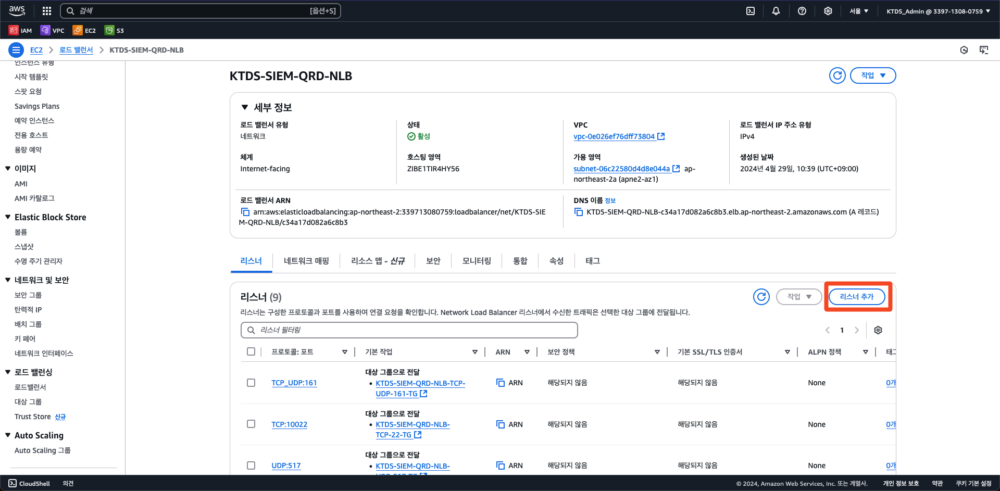
2. 리스너 추가를 클릭한 뒤 대상 그룹 생성을 클릭합니다.
   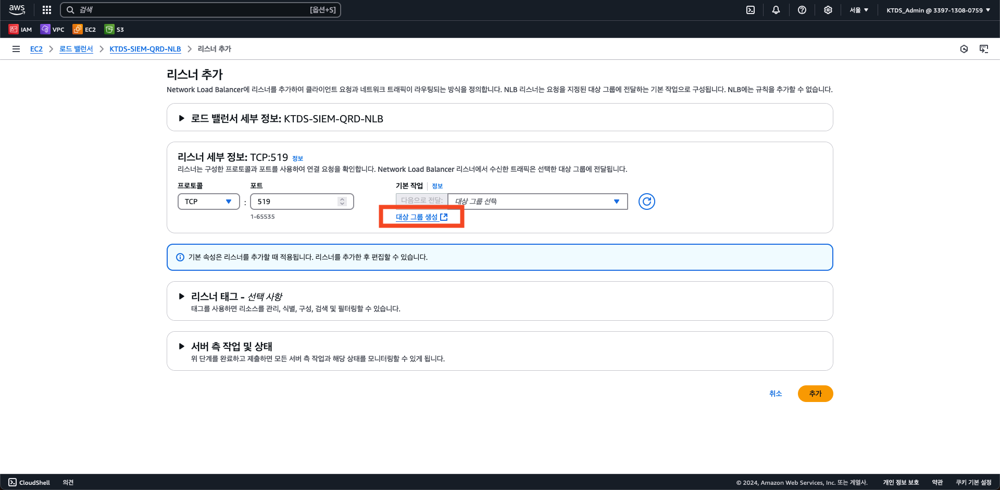
3. IP 주소를 선택한 후 대상 그룹 이름을 적어줍니다.  

   `KTDS-프로젝트-서비스-대상그룹소스-프로토콜-포트-리소스명(TG)`  

   프로토콜과 포트를 정확하게 입력해줍니다.
   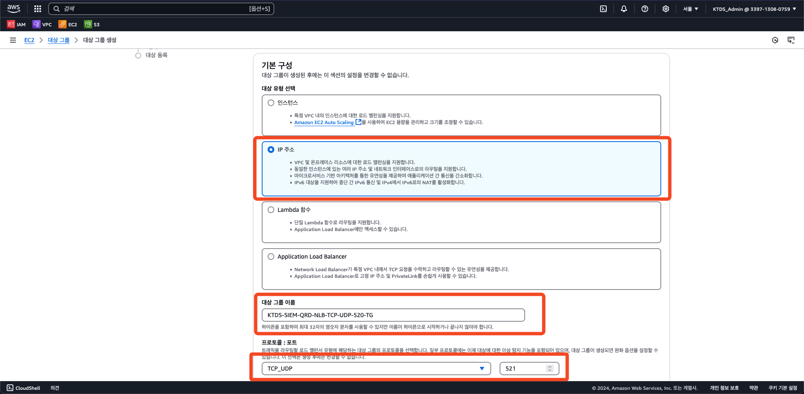
4. VPC를 선택해주고 다음 버튼을 클릭합니다.
   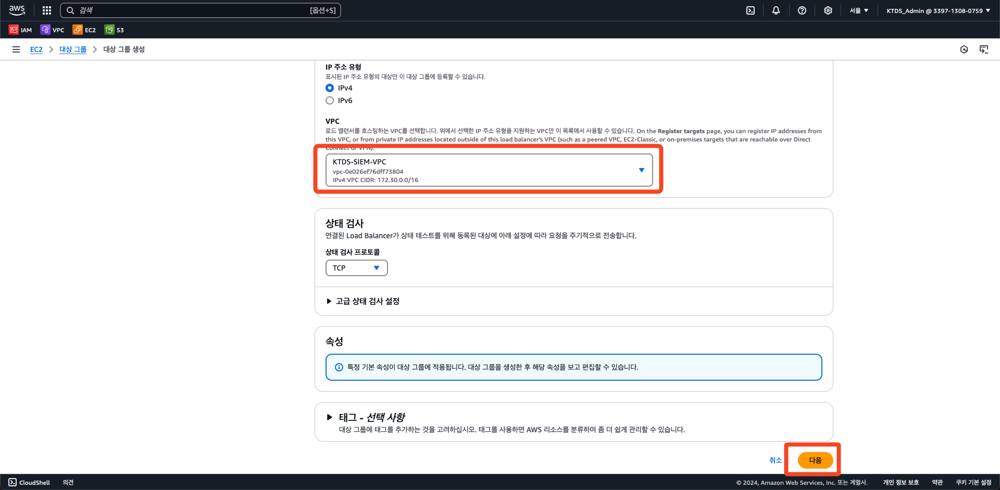
5. 트래픽을 전송하고자 하는 대상 EC2의 private IP 주소를 적어준 후 대상그룹을 생성합니다.
   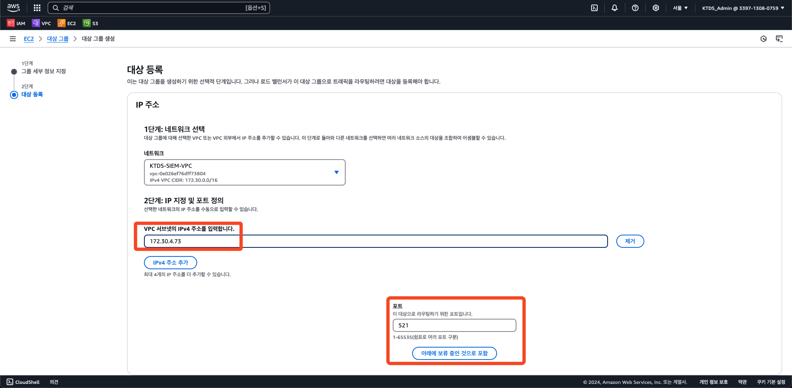
   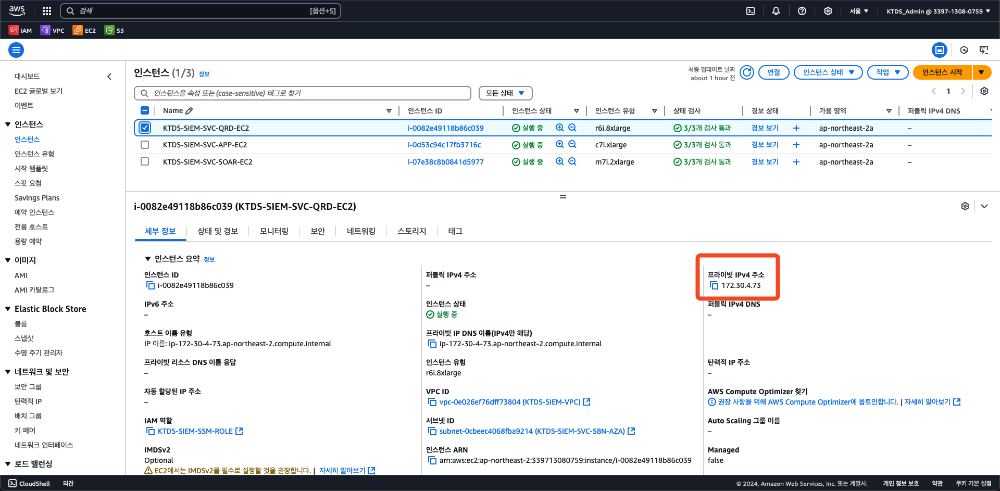
   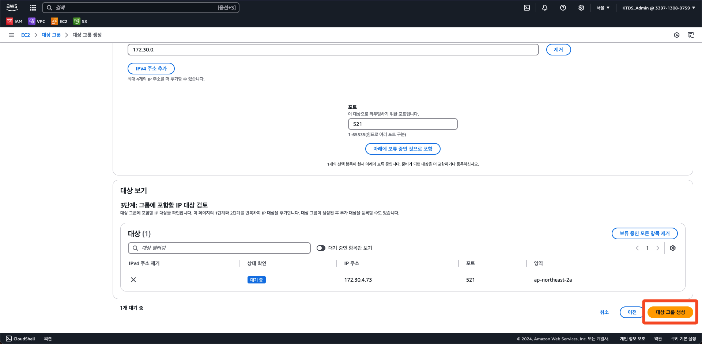
6. 프로토콜, 포트를 지정해준 뒤 방금 생성한 대상 그룹을 추가해주고 리스너를 추가합니다.
   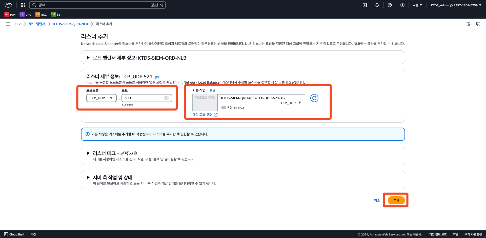

## 2. 보안그룹 인바운드 규칙 추가

해당 과정은 VPC 보안그룹에(보안그룹은 고객사별로 구분되어 있습니다) 새로운 프로토콜과 포트를 추가하는 부분입니다. 이 부분에서는 Skylife 기준으로 설명합니다.

1. 수정하고자 하는 고객사의 보안 그룹에 들어갑니다.
   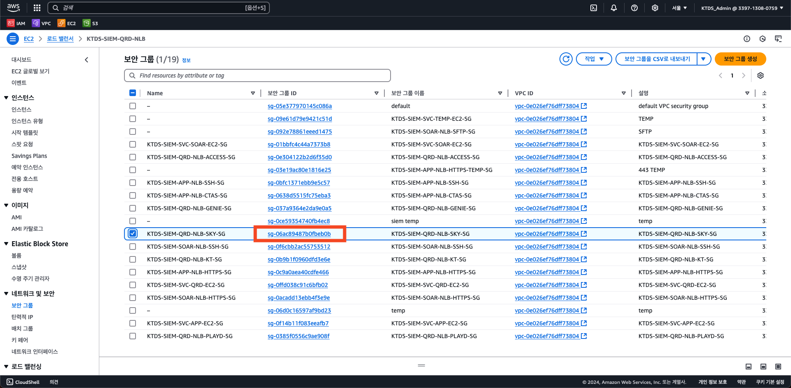
2. 인바운드 규칙 편집을 클릭합니다.
   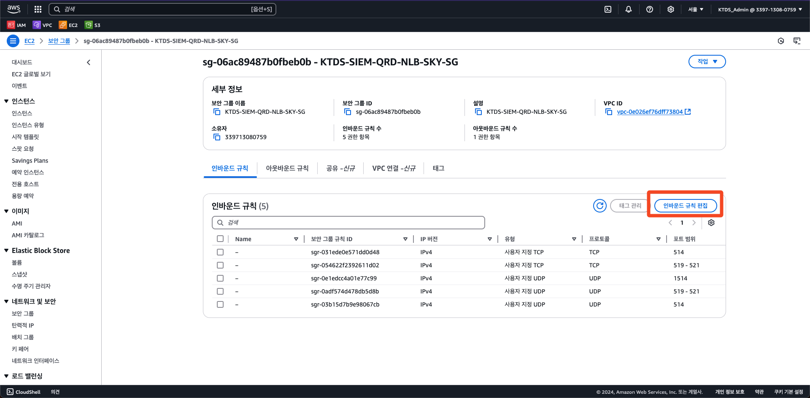
3. 규칙 추가 후 원하는 프로토콜, 포트범위, 소스(고객사IP 지정을 위해서는 사용자지정 IP를 선택 후 IP 입력) 설명을 적어준 후 규칙 저장을 클릭합니다.
   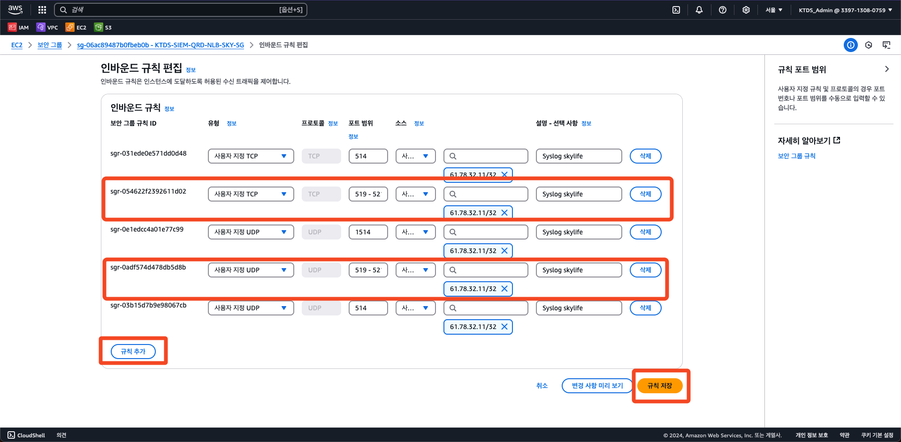

## 3. 네트워크 방화벽(Network Firewall) 규칙 그룹 추가

1. Network Firewall 규칙 그룹에 들어간 후 원하는 규칙(IP, Domain)을 선택합니다. 고객사 IP에 대한 추가는 대부분 아래 IP-ACL을 선택하시면 됩니다.
   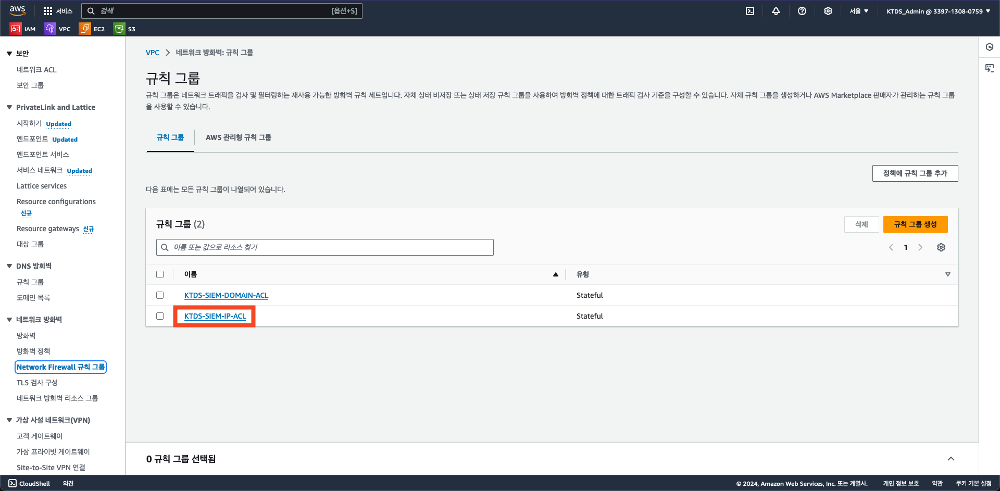
2. 화면을 아래로 내려 규칙의 편집 버튼을 클릭합니다.
   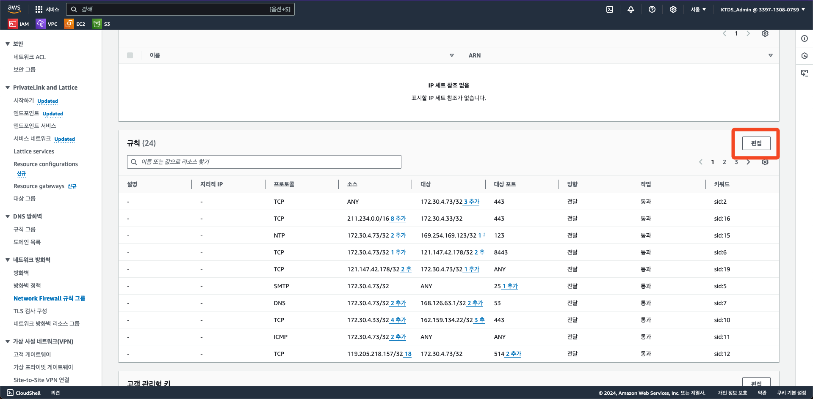
3. 화면을 아래로 내려 규칙의 검색에서 원하는 고객사의 IP를 입력한 후 `소스IP, 원하는 프로토콜, 대상IP`와 일치하는 소스를 선택한 후 편집을 클릭합니다.
   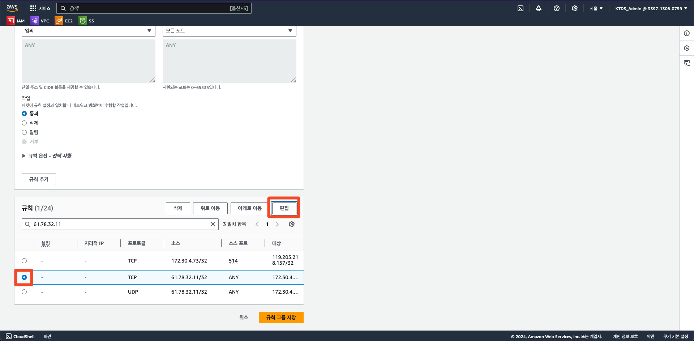
4. 원하는 포트를 입력해준 뒤 저장을 클릭합니다.
   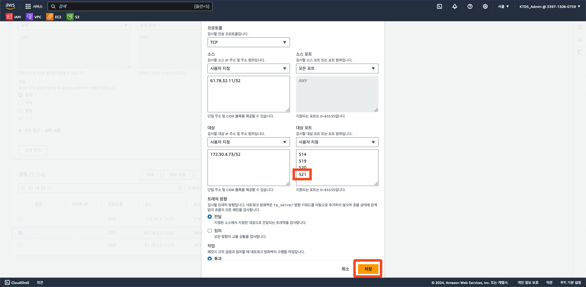
5. 규칙 그룹 저장을 클릭합니다.
   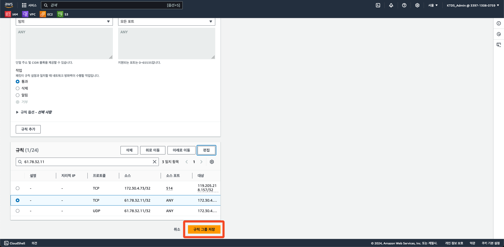

