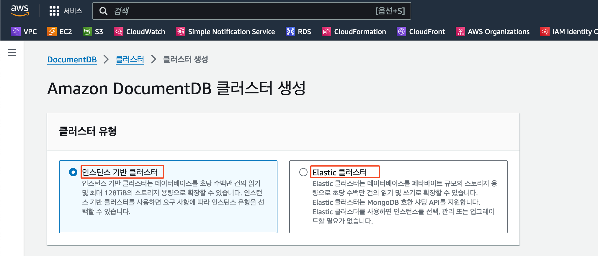
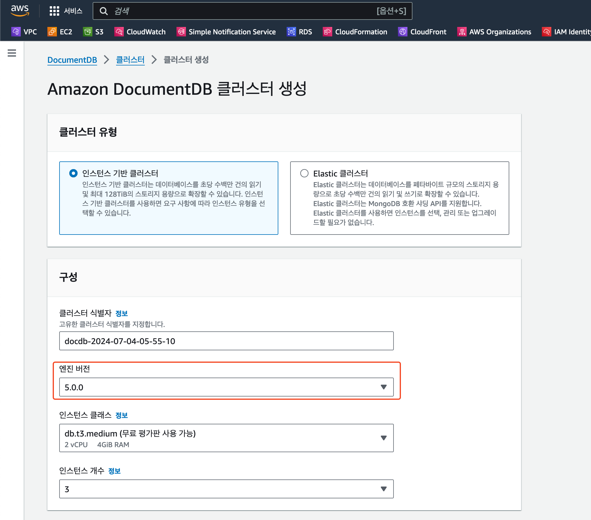
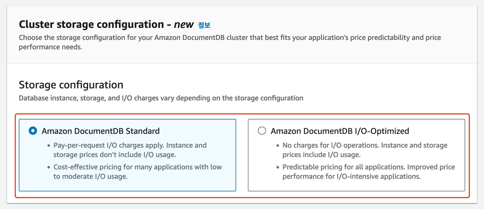
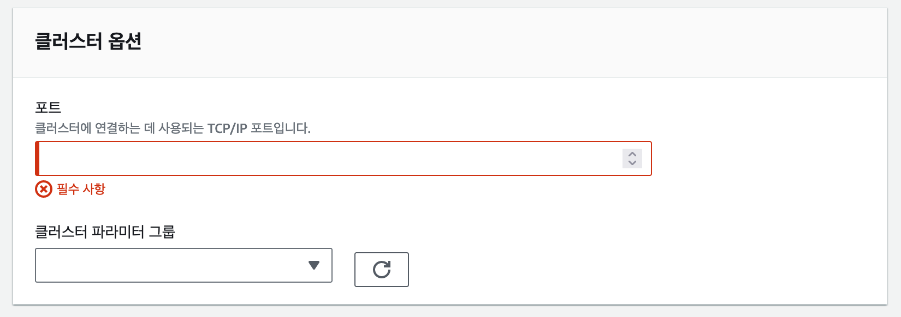

# DocumentDB 구성 가이드

## instance, Elastic 기반 클러스터

탄력적 클러스터: 인프라를 자동으로 관리해 워크로드 처리량을 초당 수백만개의 쓰기/읽기 작업까지 확장하고  
스토리지를 PB단위까지 쓰기 및 읽기 처리가 가능한 DocumentDB 클러스터로 기본적으로 3개의 가용 영역에 복제되어 가용성이 높다.

## instance 기반 클러스터 선택 시

### Engine Version

DocumentDB는 MongoDB와 호환되는 DB로 MongoDB 엔진 버전을 선택한다.

### Standard와 I/O-Optimized 옵션의 차이

5.0 버전 이후 나온 feature로

- Standard: I/O cost가 전체 DocumentDB의 25% 이하로 나올 경우 비용상 유리하다.
- I/O-Optimized: I/O cost가 전체 DocumentDB 비용의 25% 이상일 경우 비용상 유리하다.

### 인증

DB의 user/password 설정

### 클러스터 옵션

