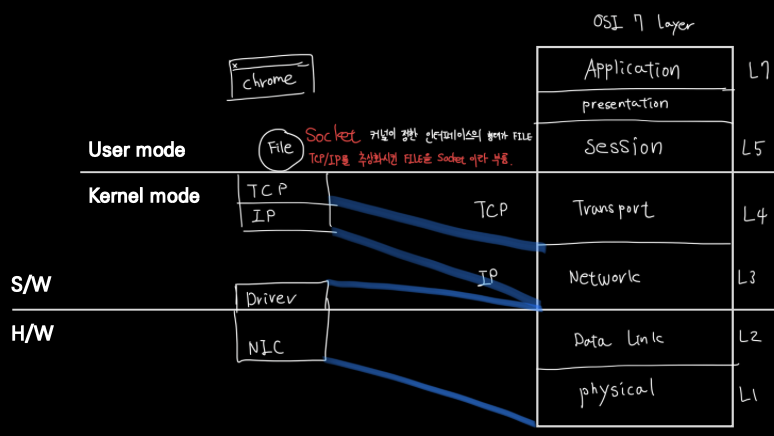
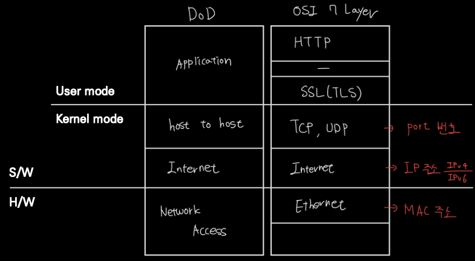
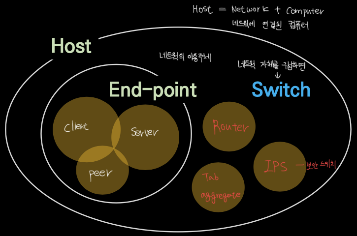
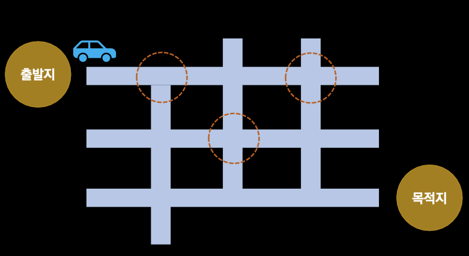
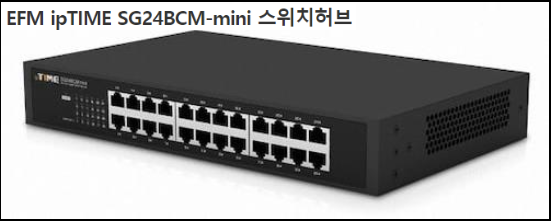
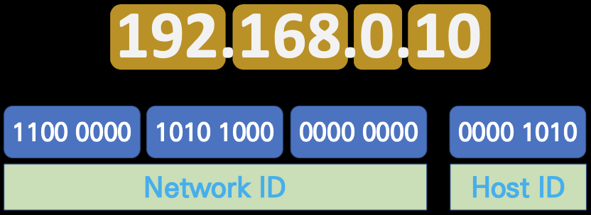
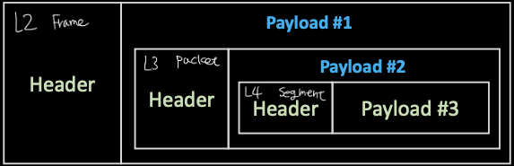
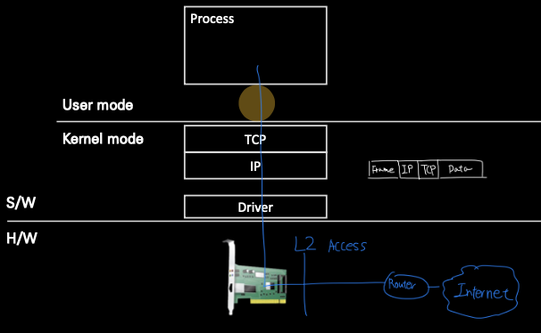
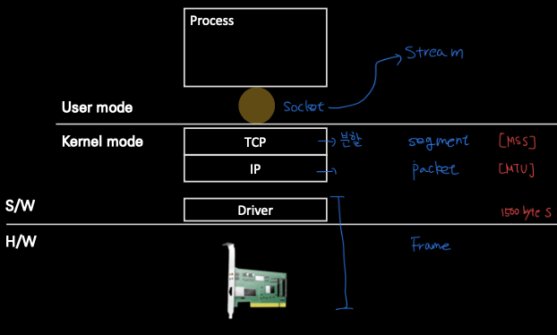

- [user mode와 kernel mode](#user-mode와-kernel-mode)
- [식별자](#식별자)
- [Host](#host)
- [switching](#switching)
  - [NIC](#nic)
  - [L2 Access switch](#l2-access-switch)
  - [L2 Distribution switch](#l2-distribution-switch)
- [LAN과 WAN의 경계 그리고 Broadcast](#lan과-wan의-경계-그리고-broadcast)
- [IPv4 주소의 구조](#ipv4-주소의-구조)
- [L3 Packet](#l3-packet)
- [Encapsulation, Decapsulation](#encapsulation-decapsulation)
- [패킷의 생성과 전달](#패킷의-생성과-전달)
  - [계층별 데이터 단위](#계층별-데이터-단위)
- [IP 헤더 형식](#ip-헤더-형식)
- [subnet mask와 CIDR](#subnet-mask와-cidr)
  - [CIDR(classless Inter-Domain Routing)](#cidrclassless-inter-domain-routing)
  - [Private Network(사설망)](#private-network사설망)

Network: 관계  
Networking: 상호작용

# user mode와 kernel mode

# 식별자

- L2 -> MAC 주소
  - NIC(Network Interface Card)를 식별하는 식별자
  - 48bit이며 보통 16진수로 표기

- L3 -> IP 주소
  - Internet을 사용하는 host의 식별자  
  - IPv4에서는 32bit이며 10진수(8bit)씩 끊어 점으로 구분해 표기

- L4 -> PORT 번호
  - process  
  - 16bit 양의 정수

# Host

- End-point
  - client, Server, Peer -> 이용주체

- Switch
  - Router, IPS, Tab -> 네트워크 자체를 이루는 요소

# switching

Switch가 하는 일  
- Network - 도로망  
- Switch - 이정표  

- **Matric** 
  - IP 주소를 근거로 스위칭 -> L3 스위칭
  - L3 스위치는 인터넷에서 라우터라고 부르고 라우터는 라우팅 테이블이라는 이정표를 가지고 있다.
  - 실제로 route PRINT 명령을 쓰면 해당 컴퓨터 라우터의 매트릭, 각 루트별 비용 값을 볼 수 있다.  

## NIC

NIC(Network Interface Card)
- LAN(Local Area Network) card라고 부르기도 하는데 NIC라고 부르는게 좀 더 정확하다.
- 각 NIC 카드는 MAC 주소를 갖는다
- WAN -> MAN -> LAN 순으로 규모가 작아진다.

Packet은 L3 수준에서의 단위  
Frame은 L2 수준에서의 단위  

## L2 Access switch

- End-point와 직접 연결되는 스위치로 MAC 주소를 근거로 스위칭

- PC와 L2 Access와의 연결에서 연결이 올바르면 Link-up, 올바르지 않으면 Link-down이라 표현  
switch와 router가 연결되어 있는 선은 uplink라고 부름

## L2 Distribution switch
- L2 Access 스위치를 위한 스위치로 VLAN(Virtual LAN) 기능을 제공하는 것이 일반적이다.
- L2 Access 스위치가 각 방에 존재한다면 L2 Distribution switch는 한 층을 담당한다.

# LAN과 WAN의 경계 그리고 Broadcast

- Broadcast <=> Unicast

- Braodcast는 효율과는 상관 없다. 다만 속도를 위해서는 Broadcast의 범위를 최소화해야한다.

NIC는 MAC address를 갖는데 이는 48비트 주소로  
FF-FF-FF-FF-FF-FF의 16진수 주소다.

위의 예는 1111-1111-1111-1111-1111-1111의 2진수 주소로 변환될 수 있는데 송신자가 수신자를 다음과 같이 설정하면 모두가 메시지를 받으라는 뜻이고 Braodcast라고 불린다.

# IPv4 주소의 구조

- IPv4는 32bit 주소체계를 사용 8bit * 4
- 192.168.0.10이라고 치면 앞의 세 개는 NetworkID, 뒤의 하나는 HostID로 구성되어 있다.

# L3 Packet

- Packt이라는 말은 L3 IP Packet 
- Header와 Payload로 나눠진다
- 최대 크기는 MTU다(Maximum Transmition Unit) default는 1500 byte. 

# Encapsulation, Decapsulation

- packet은 encapsulation과 decapsulation을 통해 처리된다

# 패킷의 생성과 전달

패킷의 생성과 전달 순서
1. Data를 File에 write 한다. 이 파일의 일종인 socket에 send한다는 표현을 쓴다.
2. TCP 헤더가 붙으면 data가 segment가 된다.
3. IP 헤더가 붙으면 segment가 packet이 된다.
4. Ethernet 계층을 거치며 packet이 Frame이 된다.
5. L2 Access Switch를 거친다
6. routing gateway를 거쳐 인터넷 세계로 전달된다.

## 계층별 데이터 단위

stream은 데이터의 크기가 정해져있지 않은 데이터의 연속이지만 인터넷 상에서 대용량 데이터를 한번에 전송할 수는 없기 때문에 segment의 이름과 같이 데이터를 댕강댕강 자르게 되는데 그 최대 길이가 위에서 말했던 MTU(1500byte)가 된다.

# IP 헤더 형식
IPv4 헤더 형식은 다음과 같다.

# subnet mask와 CIDR
subnet mask를 기준으로 NetworkID와 HostID를 잘라낸다.

mask 연산: 주소에서 subnet mask를 기준으로 bit별로 AND 연산을 한다. 만약 AND 연산이 나의 IP와 같으면 유입 패킷으로 식별한다.  

과거에는 IP 주소별로 A, B, C클래스로 나눠 구분했기 때문에 이런 방법을 썼었다. 지금은 쓰지 않는다.

이제는 CIDR 방식을 쓴다.

## CIDR(classless Inter-Domain Routing)
CIDR은 IP 주소에서 어느 비트까지를 IP 주소라고 간주할지 선택하는 방법으로

**192.168.0.10/24**
다음과 같은 주소가 존재한다면 24비트까지를 IP주소로 본다.

## Private Network(사설망)
- 하나의 pubilc IP를 여러 기기가 공유할 수 있는 방법
- 하나의 망에는 private IP를 부여받은 기기들과 gateway로 구성
  - 각 기기는 인터넷과 통신시 gateway를 통해 통신
- private IP는 지정된 대역의 IP만 사용 가능

segment

출처: [외워서 끝내는 네트워크 핵심이론 - 기초](https://www.inflearn.com/course/%EB%84%A4%ED%8A%B8%EC%9B%8C%ED%81%AC-%EDs%95%B5%EC%8B%AC%EC%9D%B4%EB%A1%A0-%EA%B8%B0%EC%B4%88/dashboard)