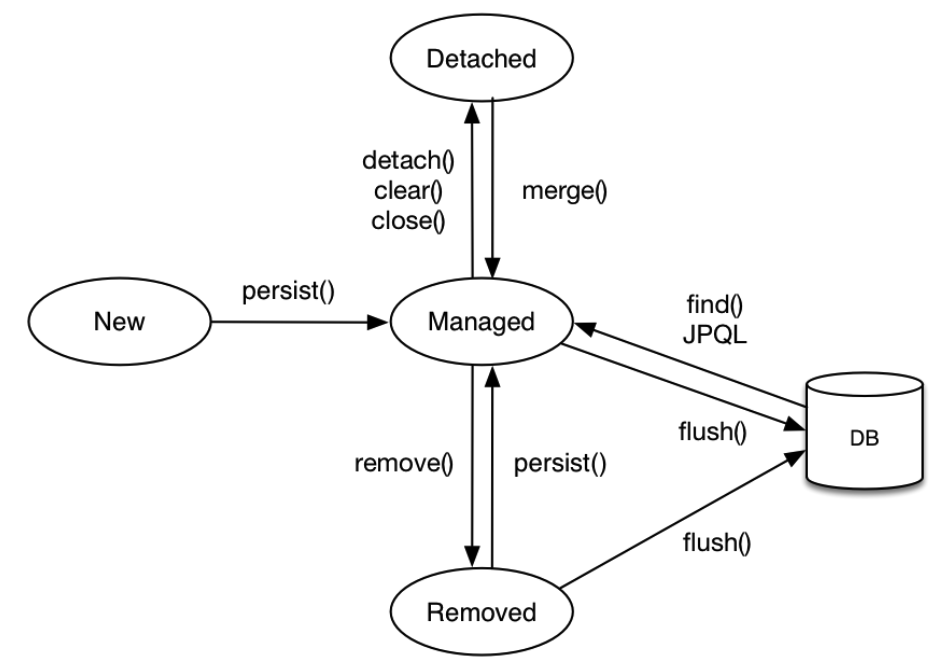
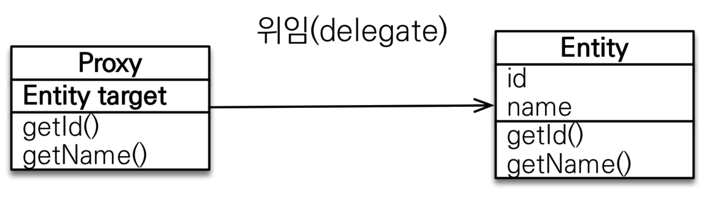

- [Hibernate](#hibernate)
- [데이터 모델/객체 모델](#데이터-모델객체-모델)
- [entityManager](#entitymanager)
- [영속성 컨텍스트(persistence context)](#영속성-컨텍스트persistence-context)
  - [엔티티의 생명주기](#엔티티의-생명주기)
  - [영속성 컨텍스트의 특징](#영속성-컨텍스트의-특징)
    - [1. 엔티티 조회와 1차 캐시](#1-엔티티-조회와-1차-캐시)
    - [2. 엔티티 등록과 트랜잭션 쓰기지연](#2-엔티티-등록과-트랜잭션-쓰기지연)
    - [3. 엔티티 수정과 변경 감지, 지연로딩](#3-엔티티-수정과-변경-감지-지연로딩)
    - [4. 엔티티 삭제와 지연 로딩](#4-엔티티-삭제와-지연-로딩)
  - [플러시](#플러시)
  - [준영속](#준영속)
- [프록시](#프록시)
- [트랜잭션](#트랜잭션)
  - [JPA에서의 트랜잭션](#jpa에서의-트랜잭션)
  - [준영속 상태와 지연로딩](#준영속-상태와-지연로딩)
    - [글로벌 페치 전략 수정](#글로벌-페치-전략-수정)
- [N + 1 problem](#n--1-problem)
- [JPQL](#jpql)

# Hibernate

# 데이터 모델/객체 모델

# entityManager
JPA가 제공하는 기능은 크게 엔티티와 테이블을 매핑하는 설계 부분과 매핑한 엔티티를 실제 사용하는 부분으로 나눌 수 있다. entityManager는 매핑한 엔티티를 사용하는 부분으로 엔티티를 저장하고, 수정하고, 삭제하고 조회하는 등 엔티티와 관련된 모든 일을 처리한다.

EntityManagerFactory는 만드는데 비용이 많이 들어 여러 스레드에서 공유해 사용할 수 있게 만들어 졌다. EntityManager는 EntityManagerFactory에 의해 만들어질 수 있으며 여러 스레드가 동시에 접근하면 동시성 문제가 발생하므로 스레드 간에 공유하면 안된다.

모든 JPA 구현체는 EntityManagerFactory를 생성할 때 커넥션 풀도 함께 만든다.

# 영속성 컨텍스트(persistence context)
영속성 컨텍스트(persistence context)는 엔티티를 영구 저장하는 환경이라는 뜻으로 엔티티 매니저로 엔티티를 저장하거나 조회하면 엔티티 매니저는 영속성 컨텍스트에 엔티티를 보관하고 관리한다.

영속성 컨텍스트는 엔티티 매니저를 생성할 때 하나 만들어지며 엔티티 매니저를 통해 영속성 컨텍스트에 접근하고 관리할 수 있다. 물론 엔티티 매니저가 같은 영속성 컨텍스트에 접근할 수도 있다.

----

## 엔티티의 생명주기

엔티티에는 4가지 상태가 존재한다.
1. 비영속(new/transient): 영속성 컨테스트와 전혀 관계가 없는 상태
2. 영속(managed): 영속성 컨텍스트에 저장된 상태
3. 준영속(detached): 영속성 컨텍스트에 저장되었다가 분리된 상태
4. 삭제(removed): 삭제된 상태



1. 비영속
엔티티 객체를 생성하고 순수한 객체 상태이며 저장되지 않은 상태를 비영속이라고 한다.
```java
Member member = new Member();
member.setId("member1");
member.setUsername("회원1");
```

2. 영속
엔티티 매니저를 통해서 엔티티를 영속성 컨텍스트에 저장하고 영속성 컨텍스트가 관리하는 엔티티를 영속 상태라고 한다. em.find()나 JPQL을 사용해서 조회한 엔티티도 영속성 컨텍스트가 관리하는 영속 상태다.

3. 준영속
영속성 컨텍스트가 관리하던 영속 상태의 엔티티를 영속성 컨텍스트가 관리하지 않으면 준영속 상태가 된다. 특정 엔티티를 준영속 상태로 만드려면 em.detach()를 호출거나 em.close()를 호출해 닫거나 em.clear()를 호출해 영속성 컨텍스트를 초기화해도 엔티티는 준영속 상태가 도니다.

4. 삭제
엔티티를 영속성 컨텍스트와 데이터베이스에서 삭제한다.
```java
em.remove(member)
```

----

## 영속성 컨텍스트의 특징
- 영속성 컨텍스트와 식별자 값  
영속성 컨텍스트는 엔티티를 식별자 값으로 구분하며 (@Id 등을 이용) 식별자가 없으면 예외가 발생한다.

- 영속성 컨텍스트와 데이터베이스 저장
영속성 컨텍스트에 엔티티를 저장하면 flush하는 타이밍에 DB에 저장한다.

- 영속성 컨텍스트가 엔티티를 관리하므로써 얻는 장점
  - 1차캐시
  - 동일성 보장
  - 트랜잭션을 지원하는 쓰기 지연
  - 변경 감지
  - 지연 로딩
<br><br><br><br>

### 1. 엔티티 조회와 1차 캐시
영속성 컨텍스트는 내부에 캐시를 가지고 있으며 이를 1차 캐시라고 한다.

```java
Member member = new Member();
member.setId("member1")l
member.setUsername("외원 1")

// 엔티티를 영속
em.persist()

// 조회
Member findMember = em.find(Member.class, "member1");
```
위 코드를 실행하면 1차 캐시에 회원 엔티티를 저장한다. 아직 DB에 저장되지는 않았다.
여기서 엔티티를 조회해보면 1차 캐시에서 엔티티를 찾고 만약 찾는 엔티티가 1차 캐시에 없으면 데이터베이스에서 조회한다. 만약 캐시에 없다면 DB에서 가져온 데이터를 캐시에 넣는다. 캐싱을 통해 성능상 이점을 누릴 수 있다.

```java
Member a = em.find(Member.class, "member1");
Member b = em.find(Member.class, "member1");

System.out.println(a == b);
```
여기서 한 트랙잭션 안에서는 같은 Id를 갖는 엔티티에 대해 동일한 값을 반환하므로 엔티티의 동일성도 보장한다.

동일성(identity): 실제 인스턴스가 같아 == 비교로 값이 같다.
동등성(equality): 실제 인스턴스는 다를 수 있지만 인스턴스가 가지고 있는 값이 같다. equals() 메서드로 비교한다.
<br><br><br>

### 2. 엔티티 등록과 트랜잭션 쓰기지연
엔티티 매니저를 이용해 엔티티를 영속성 컨텍스트에 등록하면
```java
EntityTransaction transaction = em.getTransaction();

transaction.begin();

em.persist(memberA);
em.persist(memberB);
// 여기까지는 SQL을 보내지 않는다.

// 커밋하는 순간 INSERT SQL을 보낸다
transaction.commit();
```
위와 같이 트랜잭션을 커밋하는 타이밍에 엔티티 매니저는 영속성 컨텍스트를 플러시한다. 
다시말해 변경 내용을 데이터베이스에 동기화한 후에 실제 데이터베이스 트랜잭션을 커밋한다.
<br><br><br>

### 3. 엔티티 수정과 변경 감지, 지연로딩
SQL을 사용하면 수정 쿼리를 직접 작성해야 하는데 요구사항이 늘어나면서 수정 쿼리도 점점 추가된다.
이런 개발 방식은 수정 쿼리가 많아지는 것은 물론이고 비즈니스 로직을 분석하기 위해 SQL을 계속 확인해야 한다. 즉 로직이 SQL에 의존적이게 된다.

JPA는 엔티티를 수정할 때 단순히 엔티티를 조회해서 데이터를 변경하면 된다.

```java
EntityTransaction transaction = em.getTransaction();

transaction.begin();

// 영속 엔티티 조회
Member memberA = em.find(Member.class, "memberA");

// 영속 엔티티 데이터 수정
memberA.setUsername("hi");
memberA.setAge(10);

transaction.commit();
```

진행 순서는 다음과 같다.
1. 트랜잭션을 커밋하면 엔티티 매니저 내부에서 먼저 플러시가 호출된다.
2. 엔티티와 스냅삿을 비교해서 변경된 엔티티를 찾는다.
3. 변경된 엔티티가 있으면 수정 쿼리를 생성해서 쓰기 지연 SQL 저장소에 보낸다.
4. 쓰기 지연 저장소의 SQL을 데이터베이스에 보낸다.
5. 데이터베이스 트랜잭션을 커밋한다.

변경 감지는 영속 상태의 엔티티에만 적용되며 예상하기로는 변경된 필드만 update하는 쿼리를 날릴 것 같지만 모든 필드를 업데이트하는 쿼리를 날린다.

```sql
UPDATE MEMBER
SET
    NAME=?,
    AGE=?
WHERE
    ID=?
```
이런 놈이 아니라
```sql
UPDATE MEMBER
SET
    NAME=?
    AGE=?
    GRADE=?
    ...
WHERE
    ID=?
```
요런놈으로 모든 필드를 변경하면 데이터 전송량이 늘어나지만
- 모든 필드를 수정 쿼리가 항상 같기 때문에 애플리케이션 로딩 시점에 수정 쿼리를 미리 생성해두고 재사용할 수 있다.
- 데이터베이스에 동일한 쿼리를 보내면 데이터베이스도 이전에 한번 파싱된 쿼리를 재사용할 수 있다.
- 필드가 30개 이상이 되면 @DynamicUpdate나 데이터가 존재하는 필드만으로 INSERT SQL을 동적으로 생성하는 @DynamicInsert도 있다. 하지만 한 테이블 컬럼이 30개 이상이라면 책임 분리가 적절하지 않을 수 있다.

### 4. 엔티티 삭제와 지연 로딩
엔티티를 삭제하려면 먼저 삭제 대상 엔티티를 조회해야 한다.

```java
Member memberA = em.find(Member.class, "memberA");
em.remove(memberA)
```

em.remove()에 삭제 대상 엔티티를 넘겨주면 엔티티를 삭제한다. 물론 트랜잭션 커밋을 호출해 플러시를 호출하면 삭제 쿼리를 전달한다. 이렇게 삭제된 엔티티는 재사용하지 않고 자연스럽게 GC의 대상이 되도록 두는게 좋다.

----

## 플러시
flush()는 연속성 컨텍스트의 변경 내용을 DB에 반영한다. flush()를 실행하면 다음과 같은 일이 일어난다.
1. 변경 감지가 작동해 영속성 컨텍스트에 있는 모든 엔티티를 스냅샷과 비교, 수정된 엔티티를 찾는다. 수정된 엔티티는 수정 쿼리를 쓰리 지연 SQL 저장소에 등록한다.
2. 쓰지 기연 SQL 저장소의 쿼리를 DB에 전송한다.

플러시 방법은 3 가지가 있는데
1. em.flush()를 직접 호출. 
   - 테스트나 다른 프레임워크와 JPA를 함께 사용할 때를 제외하고 거의 사용하지 않는다.
2. 트랜잭션 커밋 시 플러시 자동 호출
   - 데이터베이스 변경 내용을 SQL로 전달하지 않고 트랜잭션만 커밋하면 수정이 반영되지 않기 때문에 JPA에서 이런 문제 예방을 위해 트랜잭션을 커밋할 때 플러시를 자동 호출한다.
3. JPQL 쿼리 실행 시 플러시 자동 호출
   - JPQL이나 Criteria같은 객체지향 쿼리를 호출할 때 실행된다.
   - 만약 객체를 수정해 영속 상태에 객체들이 존재할 때 JPQL을 실행하면 JPQL은 SQL로 변환되어 데이터베이스에서 엔티티를 조회한다. 이 때 영속 상태의 객체가 flush되지 않는다면 데이터베이스의 정합이 깨지기 때문에 실행돼야 한다.

---

## 준영속
영속성 컨텍스트가 관리하는 영속 상태의 엔티티가 영속성 컨텍스트에서 분리(detached)된 것을 준영속 상태라 한다. 준영속 상태의 엔티티는 영속성 컨텍스트가 제공하는 기능을 사용할 수 없다.

영속상태의 엔티티를 준영속 상태로 만드는 방법은 크게 3가지다.
1. em.detach(entity): 특정 엔티티만 준영속 상태로 전환한다. 메서드를 호출하는 순간 1차캐시부터 쓰기 지연 SQL 저장소까지 해당 엔티티를 관리하는 모든 정보가 제거된다.
2. em.clear(): 엔티티가 아닌 영속성 컨텍스트를 초기화해서 해당 영속성 컨텍스트의 모든 엔티티를 준영속 상태로 만든다.
3. em.close(): 영속성 컨텍스트 종료로 엔티티는 주로 영속성 컨텍스트가 종료되면서 준영속이 되지 개발자가 직접 하는 경우는 드물다.

# 프록시
프록시는 객체 그래프로 연관된 객체들을 탐색하는 과정에서 지연로딩으로 생기는 문제를 해결하려고 프록시를 사용한다. 프록시는 실제 사용하는 시점에 데이터베이스를 조회한다. 하이버네이트는 지연 로딩을 지원하기 위해 프록시를 사용하는 방법과 바이트코드를 수정하는 방법 두 가지를 제공한다.

JPA에서 식별자로 엔티티 하나를 조회할 때는 em.find()를 사용한다. 만약 엔티티를 실제 사용하는 시점까지 DB조회를 미루고 싶다면 em.getReference()를 사용하면 되는데 이게 프록시다.
```java
Member member = em.find(Member.class, "member1");

Member member = em.getReference(Member.class, "member1");
```

프록시 클래스는 실제 클래스를 상속받아서 만들어지므로 실제 클래스와 겉 모양이 같다. 사용자는 진위여부를 판단하지 않고 사용하면 된다.


프록시 객체는 실제 객체에 대한 참조를 보관하며 메서드 호출시 실제 객체의 메서드를 호출한다.

- 프록시 객체는 처음 사용할 때 한번만 초기화된다.
- 프록시 객체를 초기화해도 프록시 객체가 실제 엔티티로 바뀌지는 않고 건너간다.
- 프록시 객체는 원본 엔티티를 상속받았기 때문에 == 비교가 아니라 instanceOf로 타입을 체크해야 한다.
- 영속성 컨텍스트에 이미 찾는 엔티티가 있으면 em.getReference()를 호출해도 실제 엔티티를 반환한다.
- 초기화는 영속성 컨텍스트의 도움을 받아야 하며 준영속 상태일때 접근시 org.hibernate.LazyInitializationException을 반환한다.
- 프록시 객체는 식별자 값을 보관하며(@Id) 식별자 값을 조회하는 getId를 호출해도 프록시를 호출하지 않는다. 다만 엔티티 접근 방식을 설정해서 변경 가능하다(@Access(AccessType.FIELD))

# 트랜잭션

트랜잭션은 ACID를 보장해야 한다.
- Atomicity(원자성): 트랜잭션 내에서 실행한 작업들은 하나의 작업처럼 모두 성공 or 모두실패
- Consistency(일관성): 모든 트랜잭션은 일관성 있는 데이터베이스 상태를 유지해야 한다. 예를 들어 데이터베이스에서 정한 무결성 제약 조건을 항상 만족해야 한다.
- Isolation(격리성): 동시에 실행되는 트랜잭션들이 서로에게 영향을 미치지 않도록 격리한다. 격리성은 성능 이슈로 인해 격리 수준을 선택할 수 있다.
- Durability(지속성): 트랜잭션을 성공적으로 끝내면 그 결과가 항상 기록되어야 한다. 시스템 문제 시에도 로그 등을 사용해 성공한 트랜잭션 내용을 복구해야 한다.

ANCI 표준에 의한 트랜잭션 격리 수준 4단계는 다음과 같다.
- read uncommitted
  커밋하지 않은 데이터를 읽을 수 있기 때문에 트랜잭션 1이 데이터를 수정중에 커밋이 되지 않았어도 트랜잭션 2가 수정중인 데이터를 조회할 수 있다. 이걸 dirty read라고 하며 트랜잭션 1이 롤백되면 정합성에 문제가 생긴다
- read committed
  커밋한 데이터만 읽을 수 있다. dirty read는 발생하지 않지만 non-repeatable read는 발생할 수 있다. non-repeatable read는 한 트랜잭션이 같은 데이터를 반복 조회할 때 다른 트랜잭션에 의해 수정된 데이터가 생겨 반복조회의 결과가 다르게 나오는 것을 의미한다.
- repeatable read
  한 번 조회한 데이터를 반복해서 조회해도 같은 데이터가 조회된다. 하지만 반복 조회시 결과 집합이 달라지는 PHANTOM READ는 발생할 수 있다.
- SERIALIZABLE
  가장 엄격한 트랜잭션 격리로 PHANTOM READ조차 발생하지 않는다.

대부분의 DB 설정은 read committed 수준을 기분으로 사용한다. 일부 중요한 비즈니스 로직에만 락을 사용하면 된다.

## JPA에서의 트랜잭션
스프링에서 JPA를 사용하면 스프링 컨테이너가 제공하는 전략을 따라가야 한다.  
스프링은 트랜잭션으르 시작할 때 영속성 컨텍스트를 생성하고 트랜잭션이 끝날 때 영속성 컨텍스트를 종료한다. 그리고 같은 트랜잭션 안에서는 항상 같은 영속성 컨텍스트에 접근한다.

스프링 프레임워크를 사용하면 보통 비즈니스 로직을 시작하는 서비스 계층에 @Transactionl 어노테이션을 선언해서 트랜잭션을 시작하는데 해당 어노테이션이 존재하면 메서드 실행 전에 스프링의 트랜잭션 AOP가 먼저 동작한다. 트랜잭션 AOP는 메서드의 종료와 함께 트랜잭션을 커밋하며 종료한다. 이와 동시에 JPA는 영속성 컨텍스트를 플러시하는데 만일 예외가 발생하면 스프링 트랜잭션 AOP가 트랜잭션을 롤백하고 종료할 때 플러시를 호출하지 않는다.

같은 트랜잭션 안에 있다면 다른 엔티티 매니저를 사용해도 같은 영속성 컨텍스트를 부여받는다. 스프링 컨테이너는 스레드마다 다른 트랜잭션을 할당하는데 다른 스레드에서 같은 엔티티 매니저를 호출해도 접근하는 영속성 컨텍스트는 다르기 때문에 멀티스레드 상황에서 안전하다.

## 준영속 상태와 지연로딩
트랜잭션은 보통 서비스 계층에서 시작하며 서비스 계층이 끝나는 시점에 트랜잭션이 종료되면서 영속석 컨텍스트도 함께 종료된다. 따라서 조회한 엔티티가 서비스와 리포지토리 계층에서는 영속성 컨텍스트에 관리되며 영속 상태를 유지하지만 컨트롤러나 뷰 같은 presentation 계층에서는 준영속 상태가 된다.

```java
@Entity
public class Order {
    @Id @GeneratedValue
    private Long id;

    @ManyToOne(fetch = FetchType.LAZY)
    private Member member;
}
```

만약 다음과 같은 엔티티가 있고 presentation 계층에서 member.getName()을 통해 지연로딩을 시도한다고 하면 컨트롤러 로직이기 때문에 예외가 발생한다. 엔티티가 준영속 상태이기 때문이다. 이를 해결하는 방법은 두 가지가 있다.

- 뷰가 필요한 엔티티를 미리 로딩해두는 방법
  - 글로벌 페치 전략 수정
  - JPQL 페치 조인(fetch join)
  - 강제로 초기화
- OSIV를 사용해 엔티티를 항상 영속 상태로 유지하는 방법

보다시피 뷰가 필요한 엔티티를 미리 로딩두는 방법은 3가지 방법이 존재한다.

### 글로벌 페치 전략 수정
가장 간단하다. 글로벌 페치 전략을 지연로딩에서 즉시 로딩으로 변경하면 된다.

```java
@Entity
public class Order {
    @Id @GeneratedValue
    private Long id;

    @ManyToOne(fetch = FetchType.EAGER)
    private Member member;
}
```
이렇게 설정하고 member.getName()을 실행하면 이미 로딩된 엔티티이기 때문에 에러가 발생하지 않는다. 하지만 두 가지 문제가 있다.

- 사용하지 않는 엔티티를 로딩한다
- [N + 1](#n--1-problem) 문제가 발생한다

두 번째 문제는 JPQL 페치 조인으로 해결할 수 있다.


# N + 1 problem


# JPQL
JPA를 사용하면 애플리케이션 개발자는 엔티티 객체를 중심으로 개발하고 데이터베이스에 대한 처리는 JPA에 맡겨야 하는데 문제는 검색 쿼리다. 모든 데이터를 애플리케이션 컬렉션으로 불러와 검색은 불가능하기 때문에 검색 조건이 포함된 SQL을 사용해야 한다. JPA는 JPQL이라는 쿼리 언어로 이런 문제를 해결한다. SQL과의 가장 큰 차이는

- JPQL은 엔티티 객체의 클래스와 필드를 대상으로 쿼리한다.
- SQL은 데이터베이스 테이블을 대상으로 쿼리한다

출처:  
[자바 ORM 표준 JPA 프로그래밍](http://www.yes24.com/Product/Goods/19040233)