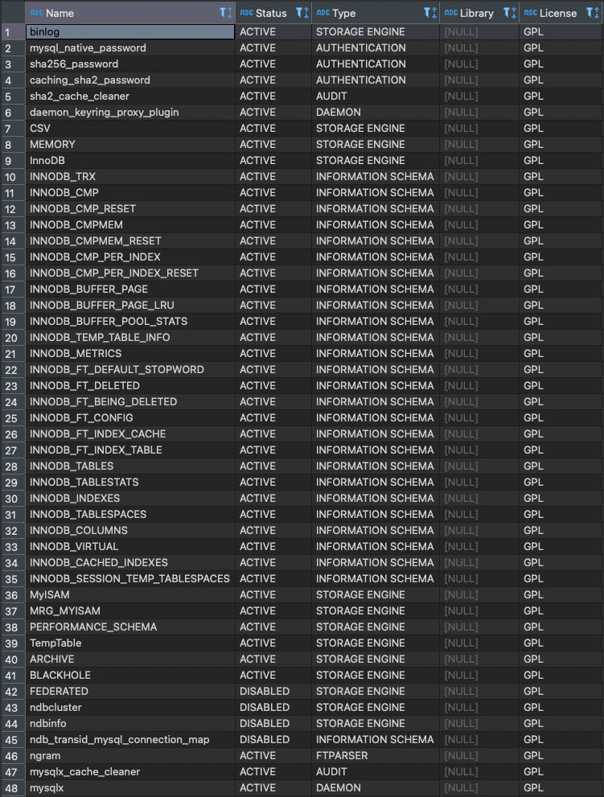
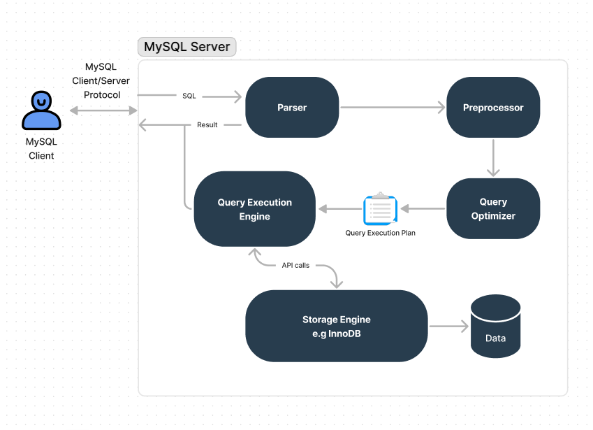
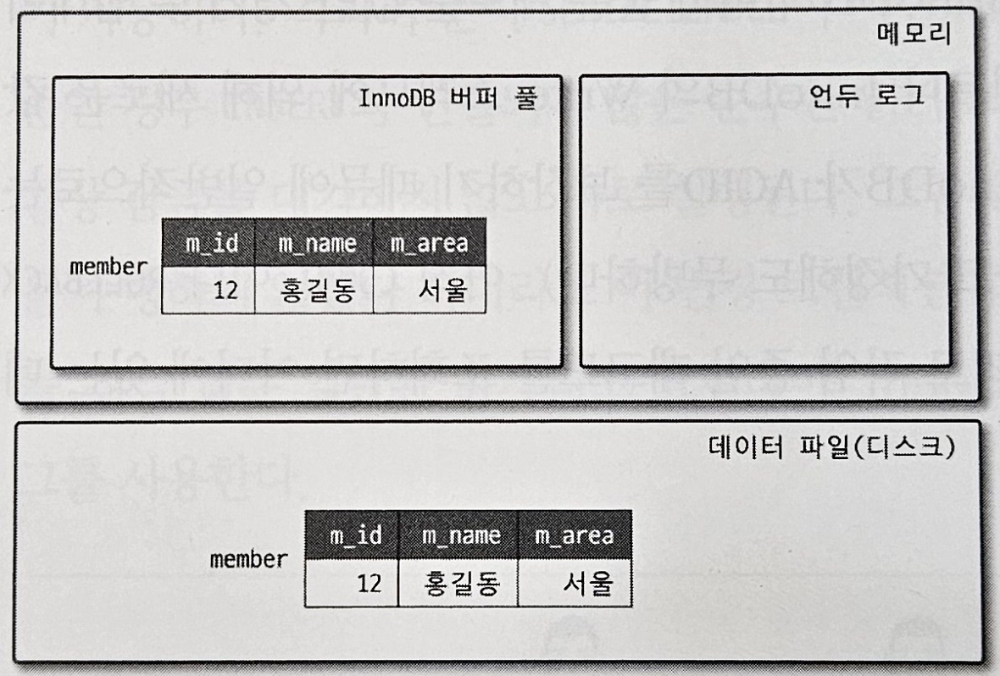
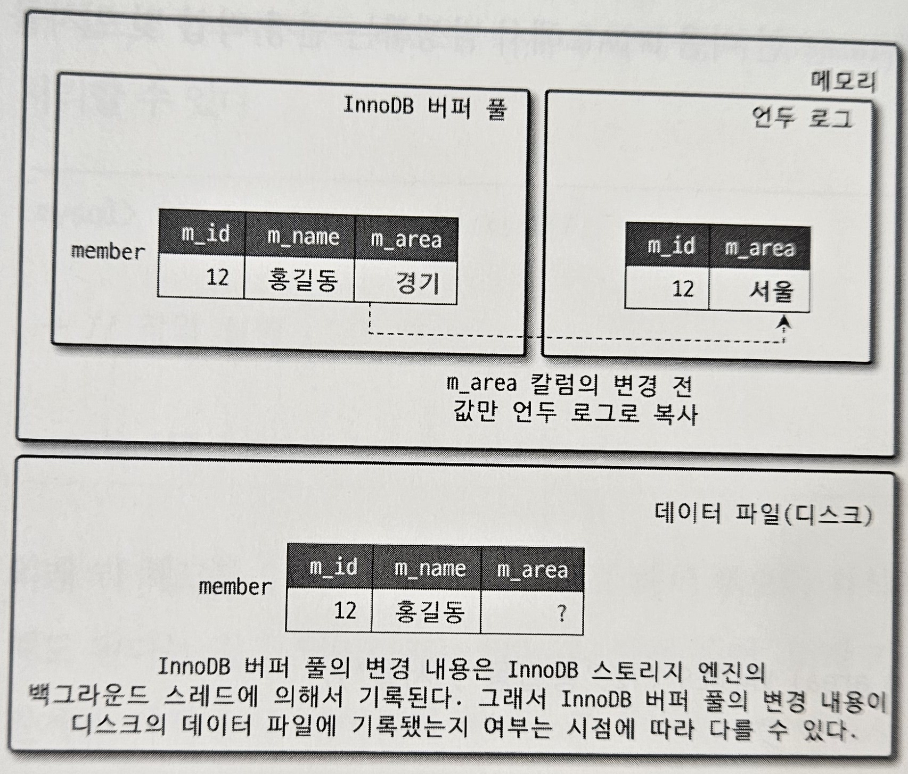

- [4.1 MySQL 엔진 아키텍쳐](#41-mysql-엔진-아키텍쳐)
  - [1. MySQL 엔진 구조](#1-mysql-엔진-구조)
    - [MySQL 엔진](#mysql-엔진)
    - [스토리지 엔진](#스토리지-엔진)
    - [핸들러 API](#핸들러-api)
  - [2. MySQL 스레딩 구조](#2-mysql-스레딩-구조)
    - [포그라운드 스레드(클라이언트 스레드)](#포그라운드-스레드클라이언트-스레드)
    - [백그라운드 스레드](#백그라운드-스레드)
  - [3. 메모리 할당 및 사용 구조](#3-메모리-할당-및-사용-구조)
    - [글로벌 메모리 영역](#글로벌-메모리-영역)
    - [로컬 메모리 영역](#로컬-메모리-영역)
  - [4. 플러그인 스토리지 엔진 모델](#4-플러그인-스토리지-엔진-모델)
  - [5. 컴포넌트](#5-컴포넌트)
  - [6. 쿼리 실행 구조](#6-쿼리-실행-구조)
  - [7. 복제](#7-복제)
  - [8. 쿼리 캐시](#8-쿼리-캐시)
  - [9. 스레드 풀](#9-스레드-풀)
  - [10. 트랜잭션 지원 메타데이터](#10-트랜잭션-지원-메타데이터)
- [4.2 InnoDB 스토리지 엔진 아키텍쳐](#42-innodb-스토리지-엔진-아키텍쳐)
  - [1. 프라이머리 키에 의한 클러스터링](#1-프라이머리-키에-의한-클러스터링)
  - [2. 외래 키 지원](#2-외래-키-지원)
  - [3. MVCC(Multi Version Concurrency Control)](#3-mvccmulti-version-concurrency-control)
  - [4. 잠금 없는 일관된 읽기(Non-Locking Consistent Read)](#4-잠금-없는-일관된-읽기non-locking-consistent-read)
  - [5. 자동 데드락 감지](#5-자동-데드락-감지)
  - [6. 자동화된 장애 복구](#6-자동화된-장애-복구)


# 4.1 MySQL 엔진 아키텍쳐

## 1. MySQL 엔진 구조


- MySQL은 (C API, JDBC, .NET 표준 드라이버등을 이용해) 대부분의 프로그래밍 언어로부터 접근 방법을 모두 지원한다.
- MySQL 서버는 MySQL 엔진(쿼리파서, 옵티마이저 등의 기능)과 스토리지 엔진으로 구분할 수 있다.


### MySQL 엔진
MySQL 엔진은 
- 커넥션 핸들러: 클라이언트로부터 접속 및 쿼리 요청을 처리
- SQL 파서 및 전처리기
- 옵티마이저: 쿼리의 최적화된 실행을 위한 처리
등으로 구성된다.

### 스토리지 엔진

MySQL 엔진이 두뇌의 해당하는 처리를 수행하고 실제 데이터를 디스크 스토리지에 저장하거나  
디스크 스토리지로부터 데이터를 읽어오는 부분은 스토리지 엔진이 담당한다. 스토리지 엔진은 여러 개를 동시에 사용할 수 있다.

### 핸들러 API
MySQL 엔진은 각 스토리지 엔진에 쓰기나 읽기를 요청하는데 이런 요청을 핸들러 요청이라고 하고 이 때 사용되는 API를 핸들러 API라고 한다. 이 API를 통해 데이터 작업의 횟수도 확인할 수 있다.

```sql
SHOW GLOBAL STATUS LIKE 'Handler%';
```
<br><hr><br>

## 2. MySQL 스레딩 구조
MySQL은 프로세스 기반이 아닌 스레드 기반으로 동작하며 포그라운드와 백그라운드 스레드로 구분할 수 있다.

```sql
SELECT thread_id, name, type, processlist_user, processlist_host
  FROM performance_schema.threads ORDER BY type, thread_id;
```

위의 명령어를 입력해보면

  

40개의 스레드 중 백그라운드는 35개, 나머지 5개가 포그라운드 스레드고 이 중에서  
thread/sql/one_connection 들만 실제 사용자의 요청을 처리하는 포그라운드 스레드다.  
동일한 이름의 스레드는 여러 스레드가 동일 작업을 병렬로 처리하는 경우다.

### 포그라운드 스레드(클라이언트 스레드)
포그라운드 스레드는 MySQL 서버에 접속된 클라이언트의 수만큼 존재하며 각 클라이언트의 쿼리를 처리한다.  
클라이언트가 커넥션을 종료하면 해당 스레드는 스레드 캐시(Thread cache)로 되돌아가며 일정 개수 이상의 스레드가 캐시에 존재한다면  
스레드를 종료시켜 최대 스레드 캐시 갯수를 조절한다.
thread_cache_size 시스템 변수로 설정 가능하다.

### 백그라운드 스레드
MySQL에서 대중적으로 쓰이는 스토리지 엔진은 InnoDB, MyISAM이 있다.  
MyISAM은 사용자 스레드가 읽기와 쓰기를 모두 처리하도록 설계되어 있지만  
InnoDB를 비롯한 일반적인 상용 DBMS는 대부분 쓰기 작업을 버퍼링해서 일괄 처리하는 기능이 탑재돼 있다.  

InnoDB에서는 다음 작업이 백그라운드로 처리된다.
- 인서트 버퍼(insert Buffer)를 병합하는 스레드
- 로그를 디스크로 기록하는 스레드
- InnoDB 버퍼 풀의 데이터를 디스크에 기록하는 스레드
- 데이터를 버퍼로 읽어 오는 스레드
- 잡금이나 데드락을 모니터링하는 스레드

MySQL 5.5버전부터 쓰기 스레드와 읽기 스레드의 개수를 2개 이상 지정할 수 있으며 해당 변수명은  
**innodb_write_io_threads, innodb_read_io_threads**  
쓰기 스레드 갯수를 조절해 디스크를 최적화해 사용할 수 있다.

<br><hr><br>

## 3. 메모리 할당 및 사용 구조
MySQL의 메모리 공간은 글로벌 메모리 영역과 로컬 메모리 영역으로 구분되며  
글로벌 메모리 영역은 MySQL 서버가 시작되면서 운영체제로부터 할당된다.  
글로벌 메모리 영역과 로컬 메모리 영역의 구분은 서버 내의 많은 스레드가 공유해서 사용하는 공간인지 여부에 따라 구분된다.

### 글로벌 메모리 영역
클라이언트 스레드의 수와 상관없이 하나의 메모리 공간만 할당된다.  
생성된 글로벌 영역이 N개라 하더라도 모든 스레드에 의해 공유된다.

대표적 글로벌 메모리 영역은 다음과 같다.
- 테이블 캐시
- InnoDB 버퍼 풀
- InnoDB 어댑티브 해시 인덱스
- InnoDB 리두 로그 버퍼


### 로컬 메모리 영역
세션, 클라이언트 메모리 영역이라고도 하며 클라이언트 스레드가 쿼리를 처리하는데 사용하는 메모리 영역이다.
로컬 메모리는 각 클라이언트 스레드 별로 독립적으로 할당되며 절대 공유되지 않는다.  
커넥션 버퍼나 결과 버퍼 등은 로컬 메모리 공간에서 커넥션이 열려 있는 동안 계속 할당되어 있지만, 쿼리를 실행하는 순간에만 할당했다가 해제하는 소트 버퍼나 조인 버퍼 등도 있다.

- 정렬 버퍼(Sort Buffer)
- 조인 버퍼
- 바이너리 로그 캐시
- 네트워크 버퍼

<br><hr><br>

## 4. 플러그인 스토리지 엔진 모델
플러그인 모델은 MySQL의 독특한 구조 중 하나로 플러그인 할 수 있는 것은 스토리지 엔진 뿐만 아니라  
사용자 인증 로직 등의 로직과 그 외의 다양한 작업을 플러그인 형태로 커스텀해서 개발할 수 있다.

보통 MySQL에서 쿼리가 실행되는 과정 중에서 스토리지 엔진이 개입하는 부분은 마지막 데이터 읽기/쓰기 작업인데  
해당 부분은 플러그인 형태로 동작해 MySQL 엔진에서 핸들러를 통해 스토리지 엔진에게 읽기/쓰기 작업을 명령한다.

```sql
SHOW ENGINES;
```
다음 명령어를 실행하면 MySQL 서버에서 지원되는 스토리지 엔진이 어떤 것이 있는지 볼 수 있다.

  

support 컬럼의 표시들은 다음의 의미를 가진다.
- YES: MySQL 서버에 해당 스토리지 엔진이 포함돼 있고 사용 가능으로 활성화된 상태
- DEFAULT: YES와 동일하지만 필수 스토리지 엔진임을 나타냄
- NO: 현재 MySQL 서버에 포함되지 않았음을 의미함
- DISABLED: 현재 MySQL 서버에는 포함됐지만 파라미터에 의해 비활성화 상태

  

스토리지 엔진뿐만 아닌 다양한 기능이 플러그인 형태로 지원됨을 알 수 있다.

<br><hr><br>

## 5. 컴포넌트
MySQL 8.0부터 기존의 플러그인 아키텍쳐를 대체하기 위해 지원된 컴포넌트 아키텍쳐가 존재한다.  
플러그인의 단점은 다음과 같았다.

- 플러그인은 오직 MySQL 서버와 인터페이스할 수 있고 플러그인사이의 통신은 불가
- 플러그인은 MySQL 서버의 변수나 함수를 직접 호출하기 때문에 안전하지 않음
- 플러그인은 상호 의존 관계를 설정할 수 없어서 초기화가 어려움

  

<br><hr><br>

## 6. 쿼리 실행 구조

  
[출처](https://coderpad.io/blog/development/optimize-query-performance-mysql/)  

쿼리 실행 구조는 기능별로 나눠 볼 수 있다.

1. 쿼리 파서
쿼리 파서는 사용자 요청으로 들어온 쿼리 문장을 토큰으로 분리해 트리 형태의 구조로 만들어내는 작업이다.  
문법 오류는 이 과정에서 발견되고 사용자에게 오류 메시지를 날린다.

2. 전처리기
파서 트리를 기반으로 쿼리 문장에 구조적 문제점이 있는지 확인한다. 토큰을 테이블 이름이나 칼럼 이름, 내장 함수 등과 매핑해 객체의 존재 여부와 권한을 확인한다.

3. 옵티마이저
사용자의 요청으로 들어온 쿼리 문장을 가장 저렴하게 처리하는 방법을 결정하는 역할을 담당한다.  
DBMS의 두뇌로 옵티마이저가 더 나은 선택을 유도하는 방법을 배우는 것이 중요하다.

4. 실행 엔진
옵티마이저는 두뇌의 역할을 담당하고 실행 엔진과 핸들러는 손과 발에 해당한다.  
실행 엔진은 중간 관리자, 핸들러는 실무자로 옵티마이저의 실행 결과를 실행 엔진이 핸들러와 상호작용 하며 각 핸들러를 연결하는 역할을 수행한다.

5. 핸들러(스토리지 엔진)
MySQL 서버의 최하단에서 MySQL 실행 엔진의 요청에 따라 데이터를 읽고 쓰는 역할을 한다.

<br><hr><br>

## 7. 복제
16장에서 다룬다.

<br><hr><br>

## 8. 쿼리 캐시
8.0에서 완전히 제거된 기능으로 쿼리의 결과를 캐싱해서 동일한 쿼리가 실행되면 캐싱된 결과를 반환하는 기능이었지만  
테이블의 데이터가 변경되면 변경된 테이블과 관련된 것들을 삭제하는 과정이 필요해 동시 처리 성능 저하와 버그를 가져다 줬다.

<br><hr><br>

## 9. 스레드 풀
엔터프라이즈 에디션에서 제공하는 기능으로 커뮤니티 에디션은 스레드 풀 기능을 지원하지 않는다.  
Percona Server에서 제공하는 스레드 풀 기능을 살펴보면 엔터프라이즈 에디션은 MySQL 서버에 내장된 스레드 풀이지만  
Percona Server의 스레드 풀은 플러그인 형태로 작동하게 구현되어 있다.

- 스레드 풀은 내부적으로 사용자의 요청을 처리하는 스레드 개수를 줄여서 MySQL 서버의 CPU가 제한된 개수의 스레드 처리에만 집중할 수 있게 해 서버의 자원 소모를 줄이기 위함이다.
- 스케줄링 과정에서 CPU 시간을 제대로 확보하지 못하면 오히려 더 느려질 수도 있다.
- 스레드 그룹의 개수는 **thread_pool_size** 시스템 변수를 통해 조정 가능하지만 일반적으로 기본 셋팅인 CPU 코어의 개수와 맞추는 것이 CPU 프로세서 친화도를 높이는데 좋다.
- 만약 스레드 풀이 처리중인 작업이 있는 경우 **thread_poll_oversubscribe** 시스템 변수에 설정된 개수만큼 추가로 더 받아들일 수 있다.
- **thread_pool_stall_limit**을 통해 해당 밀리초만큼 작업 스레드가 처리중인 작업을 끝내지 못하면 새로운 스레드를 생성한다
- 하지만 그 개수는 **thread_pool_limit**을 넘기지 못한다.

Percona Server의 스레드 풀 플러그인은 선순위 큐와 후순위 큐를 이용해 특정 트랜잭션이나 쿼리를 우선 처리하는 기능도 제공하는데 이 기능을 통해 트랜잭션 락을 빨리 해제시켜 성능을 향상시킬 수 있다.

<br><hr><br>

## 10. 트랜잭션 지원 메타데이터
메타데이터: 데이터베이스 서버에서 테이블의 구조 정보와 스토어드 프로그램 등의 정보를 데이터 딕셔너리 또는 메타데이터라고 한다.

5.7버전까지는 테이블 구조를 FRM 파일, 스토어드 프로그램을 TRN, TRG, PAR 등의 파일 기반으로 관리했지만 파일은 트랜잭션을 지원하지 않아 테이블 생성 또는 변경 도중 비정상적 종료가 일어나면 일관되지 않은 상태로 남았다.

8.0부터는 테이블의 구조나 스토어드 프로그램의 코드를 모두 InnoDB 테이블에 저장하도록 개선됐다. 이를 시스템 테이블이라고 하고 사용자의 인증 등의 테이블들이 있다. 해당 정보는 mysql.ibd라는 이름의 테이블 스페이스에 저장된다.

InnoDB 스토리지 엔진을 사용하는 테이블은 메타 정보가 InnoDB 테이블 기반의 딕셔너리에 저장되지만 MyISAM이나 CSV등과 같은 스토리지 엔진은 SDI(Serialized Dictionary Information) 파일을 사용한다. 이는 FRM 파일과 동일한 역할을 하며 *.sdi 파일로 저장된다.

# 4.2 InnoDB 스토리지 엔진 아키텍쳐

  
[출처](https://dev.mysql.com/doc/refman/8.0/en/innodb-architecture.html)  

InnoDB는 MySQL 스토리지 엔진 중 거의 유일하게 레코드(튜플, 행, 레코드) 기반의 잠금을 제공하며 InnoDB 스토리지 엔진은 레코드 자체가 아니라 인덱스의 레코드를 잠근다.  
그 때문에 높은 동시성 처리가 가능하고 안정적이며 성능이 뛰어나다.

## 1. 프라이머리 키에 의한 클러스터링
InnoDB의 모든 테이블은 기본적으로 PK를 기준으로 클러스터링되어 저장된다. 모든 세컨더리 인덱스는 레코드의 주소 대신 PK의 값을 논리 주소로 사용한다. 따라서, PK를 이용한 레인지스캔이 빨리 처리된다. 따라서, 실행 계획에서 PK가 다른 인덱스보다 높은 비중을 가진다.

MyISAM 엔진은 클러스터링 키를 지원하지 않아 PK와 세컨더리 키가 구조적으로 차이가 없다.
MyISAM 테이블의 PK를 포함한 모든 인덱스는 물리적인 레코드의 주소 값(ROWID)를 가진다.

<br><hr><br>

## 2. 외래 키 지원
- FK에 대한 지원은 InnoDB 스토리지 엔진 레벨에서 지원하는 기능으로 MyISAM, MEMORY에서는 지원하지 않는다.
- InnoDB의 외래 키는 부모 테이블과 자식 테이블 모두 해당 칼럼에 인덱스 생성이 필요하다.
- 변경시에는 각 테이블을 체크하기 때문에 잠금이 여러 테이블로 전파되기 쉽다.

수동 데이터 적재나 스키마 변경 시 외래 키가 얽혀있어 풀기 힘들다면 **foreign_key_checks** 시스템 변수를 OFF로 설정하면 외래 키 관계에 대한 체크 작업을 일시적으로 멈출 수 있다. 다만, 테이블간의 관계를 복원해 일관성을 맞춰준 후에 ON으로 활성화해야 한다. 

foreign_key_checks가 비활성화되면 update와 delete에 대한 cascade 옵션도 무시된다.

```sql
SET foreign_key_checks=OFF;
=
SET SESSION foreign_key_checks=OFF;
```
해당 시스템 변수는 GLOBAL과 SESSION 두 가지의 적용 범위를 가져갈 수 있고, 기본이 SESSION 모드다

<br><hr><br>

## 3. MVCC(Multi Version Concurrency Control)
잠금을 사용하지 않는 일관된 읽기를 제공하는 목적으로 InnoDB는 언두로그를 이용해 이 기능을 구현한다.
MVCC(Multi Version Concurrency Control)는 하나의 레코드에 대해 여러 개의 버전이 동시에 관리된다는 의미다.

READ_COMMITTED의 격리 수준을 가지는 MySQL 서버를 예로 들면

```sql
INSERT INTO member (m_id, m_name, m_area) VALUES (12, '홍길동', '서울');
COMMIT;
```
INSERT문을 실행하면 아래의 사진상태로 바뀐다.



여기에 UPDATE쿼리를 넣어주면

```sql
UPDATE member SET m_area='경기' WHERE m_id=12;
```



커밋 실행 여부와 상관없이 InnoDB의 버퍼 풀은 '경기'로 업데이트된다.
아직 커밋이 실행되지 않았을 때 다른 사용자가 해당 레코드를 조회하면 격리 수준에 따라 다른 결과를 뱉는다.

1. READ_UNCOMMITTED인 경우 InnoDB 버퍼 풀이 가지고 있는 변경된 데이터를 읽어서 반환한다.
2. READ_COMMITTED or more(REPEATABLE_READ, SERIALIZABLE)인 경우는 언두 영역의 데이터를 반환한다.

이런 일련의 과정을 MVCC라고 표현한다. 하나의 레코드에 대해 2개의 버전이 유지되고 필요에 따라 보여지는 데이터가 다르다.

언두로그는 커밋한다고 바로 사라지는 것이 아니라 해당 언두 영역을 더 이상 필요로하는 트랜잭션이 없을 때 사라진다.

언두로그: UPDATE나 DELETE로 데이터를 변경했을 때 변경되기 전의 데이터를 보관하는 곳으로 롤백에 대비하고 트랜잭션의 격리 수준을 유지하면서 높은 동시성을 제공하기 위해 존재한다.

<br><hr><br>

## 4. 잠금 없는 일관된 읽기(Non-Locking Consistent Read)
InnoDB 스토리지 엔진은 MVCC를 이용해 잠금을 걸지 않고 읽기 작업을 수행하는데, SERIALIZABLE이 아닌 READ_UNCOMMITTED, READ_COMMITTED, REPEATABLE_READ 수준인 경우 INSERT와 연결되지 않은 순수한 읽기 작업은 다른 트랜잭션과 관계없이 바로 실행된다.

트랜잭션이 길어질수록 일관된 읽기를 위해 언두영역이 커지기 때문에 트랜잭션을 최대한 빨리 끝내는 게 좋다.

<br><hr><br>

## 5. 자동 데드락 감지
InnoDB 스토리지 엔진은 내부적으로 락이 교착 상태에 빠지지 않았는지 체크하기 위해 잠금 대기 목록을 그래프 형태로 관리한다. InnoDB 스토리지 엔진은 데드락 감지 스레드를 가지고 있어서 주기적으로 잠금 대기 목록을 검사해 교착에 빠진 트랜잭션 중 하나를 강제종료한다. 보통 언두 로그를 적게 가진 트랜잭션을 롤백한다.

InnoDB 엔진은 MySQL 엔진의 내부는 볼 수 없어 데드락 감지가 불확실할 수 있어 **innodb_table_locks** 환경변수를 활성화하면 테이블 레벨의 잠금도 감지할 수 있다.

동시 처리 스레드가 많아지거나 트랜잭션의 잠금 개수가 많아지만 데드락 감지 스레드가 느려진다. 이 상황에서 서비스 쿼리 처리 스레드가 느려질 수 있기 때문에 해당 문제가 있을 경우 **innodb_deadlock_detect** 시스템 변수를 OFF로 설정하면 데드락 감지 스레드는 더 작동하지 않는다. 이 때 무한대기를 방지하기 위해 **innodb_lock_wait_timeout**을 50초 이하로 설정해서 사용하면 그 대안이 된다.

세컨더리 인덱스를 기반으로 높은 동시성 처리를 요구하는 서비스가 있다면 해당 기능을 활용해 비교해보자.


<br><hr><br>

## 6. 자동화된 장애 복구
InnoDB에는 손실이나 장애로부터 데이터를 보호하기 위한 메커니즘이 있다.

InnoDB는 MySQL 서버가 시작될 때 항상 자동 복구를 수행하는데 이 단계에서 자동으로 복구될 수 없는 손상이 존재한다면 SQL서버를 중단시킨다. 이 때는 MySQL 서버의 설정파일에 **innodb_force_recovery** 시스템 변수를 설정해 MySQL을 시작해야 하고 MySQL 서버가 시작될 때 InnoDB 스토리지 엔진이 데이터 파일이나 로그 파일의 손상 여부 검사 과정을 선별적으로 진행할 수 있게 한다.

해당 시스템 변수는 1~6까지 존재하며 숫자가 커질수록 심각한 상황이며 데이터 손실 가능성이 커진다. MySQL 서버가 기동된 단계에 따라 복구 방법이 다르다.

각 숫자 값으로 복구되는 상황과 해결 방법은 다음과 같으며 복구모드에서 SELECT 이외의 쿼리는 실행 불가능하다.

- 1(SRV_FORCE_IGNORE_CORRUPT)  
  - InnoDB의 테이블 스페이스의 데이터나 인덱스 페이지에서 손상된 부분이 발생해도 무시하고 서버를 시작한다.
  - mysqldump 프로그램이나 SELECT INTO OUTFILE 명령을 이용해 덤프해서 데이터베이스를 다시 구축해야 한다.

- 2(SRV_FORCE_NO_BACKGROUD)
  - InnoDB는 쿼리 처리를 위해 여러 백그라운드르 스레드를 동시에 사용하는데 해당 옵션은 메인 스레드를 시작하지 않고 서버를 시작한다.
  - InnoDB 메인 스레드가 언두 데이터를 삭제하는 과정에서 장애가 발생한다면 이 모드로 복구하면 된다.

- 3(SRV_FORCE_NO_TRX_UNDO)
  - MySQL 서버는 다시 시작하면서 언두 영역의 데이터를 데이터 파일에 적용하고 리두 로그의 내용을 다시 덮어써서 장애 시점의 데이터를 만든다.
  - 그리고 정상적인 MySQL 서버의 시작에서는 최종 커밋되지 않은 트랜잭션에 대한 롤백을 실행하지만 해당 모드는 롤백하지 않고 그대로 놔둔다.
  - mysqldump를 이용해 데이터를 백업해서 다시 데이터베이스를 구축하는 것이 좋다.

- 4(SRV_FORCE_NO_IBUF_MERGE)
  - INSERT, UPDATE, DELETE등의 데이터 조작으로 인한 인덱스 변경 작업을 인서트 버퍼에 저장해두고 데이터 파일에 병합되지 않은 상태에서 종료됐을 때 일어날 수 있는 문제로
  - 스토리지 엔진이 인서트 버퍼의 내용을 무시하고 강제로 시작되게 한다.
  - 데이터와 관련된 부분이 아니라 테이블을 덤프한 후 다시 데이터베이스를 구축하면 데이터의 손실 없이 복구 가능하다.

- 5(SRV_FORCE_NO_UNDO_LOG_SCAN)
  - MySQL 서버가 종료되는 시점에 진행중인 트랜잭션이 있었다면 해당 커넥션을 강제로 끊어버리고 정리 없이 종료한다.
  - MySQL 서버 시작 시 언두 레코드를 이용해 복구, 리두로그를 적용해 종료 시점이나 장애 발생 시점을 재현하고, 마지막 커밋되지 않은 트랜잭션은 모두 롤백한다.
  - 하지만 언두로그를 사용할 수 없다면 서버가 시작되지 않는다.
  - 해당 옵션은 InnoDB 엔진이 언두 로그를 모두 무시하고 MySQL을 시작할 수 있지만 종료되던 시점의 커밋되지 않은 데이터가 자동 커밋되기 때문에 데이터가 잘못됐다고 할 수 있다.
  - mysqldump를 이용해 데이터를 백업하고 데이터베이스를 다시 구축해야 한다.

- 6(SRV_FORCE_NO_LOG_REDO)
  - 리두 로그가 손상된 상태로 이 복구 모두를 사용하면 리두 로그를 모두 무시한 채로 서버가 시작되고, 커밋됐다 하더라도 리두 로그에만 기록되고 데이터 파일에 기록되지 않은 데이터는 모두 무시된다.
  - 기존 InnoDB의 리두 로그는 모두 삭제하고 MySQL 서버를 시작하는 것이 좋다.
  - mysqldump를 이용해 데이터를 모두 백업해서 MySQL 서버를 새로 구축하는 것이 좋다.


리두로그: Buffer pool이 메모리 공간이기 때문에 장애 발생시 해당 내용은 사라진다. 따라서 Buffer pool의 데이터 유실을 방지하기 위해 DML 문장이 수행되면 변경할 내용을 기록하는 곳이 Redo Log Buffer다. 해당 영역은 메모리로 제한적이기 때문에 checkpoint 발생 시점에 Redo Log Buffer의 데이터를 Redo Log File로 Disk에 저장한다.
<br><hr><br>
